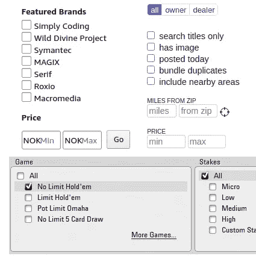
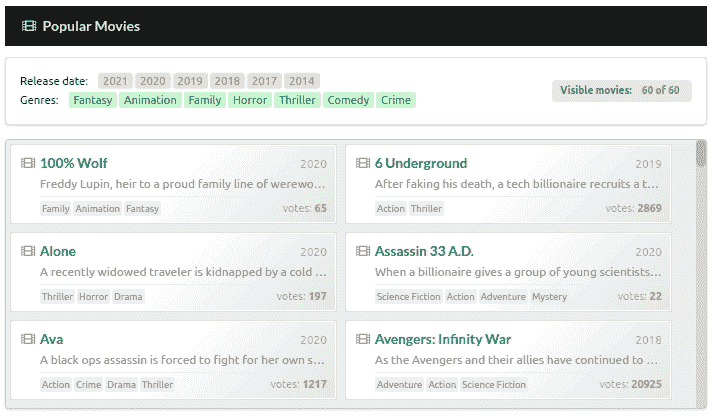

# React 中的高级数据过滤

> 原文：<https://betterprogramming.pub/advanced-data-filtering-in-react-5ea2fa3befca>

## 为渲染的数据集创建动态过滤器


我们今天将创造什么！作者照片。

正如我最近写的，我们正在处理越来越多的数据。当这些数据进入我们的应用程序时，我们必须让用户能够使用它们。今天，我们来看看如何创建动态过滤器:你启用或禁用某个过滤器，数据会立即在你的屏幕上更新。



亚马逊、克雷格列表和扑克之星上的过滤器。

不要被我们演示应用程序的简单性所迷惑。我们将建立一个健壮的架构，可以用于大量数据和过滤器的组合。我们的代码将是灵活的、动态的和可维护的。

我会试着指导你每一步，解释所有的来龙去脉。

让我们直入主题吧！

# 我们的数据

我们将使用一个 JSON 文件，该文件包含根据电影数据库[提供的关于 60 部最受欢迎的电影的信息。这是我们存储在](https://www.themoviedb.org/)`[movies.json](https://gitlab.com/gvanderput/gerard-movie-filtering/-/blob/master/data/movies.json)`文件中的来自他们 API 的定制响应:

实际文件包含 60 部电影。

和往常一样，我们使用平面数据结构。我们有一个额外的文件，`[genres.json](https://gitlab.com/gvanderput/gerard-movie-filtering/-/blob/master/data/genres.json)`，它包含了关于相关流派的信息(一个`ID`和一个`name`)，具有相似的结构。

当我们用包含一点样式的专用组件渲染电影时，它们看起来会像这样:


电影元素在他们所有的荣耀中。

大家可以看到，我们渲染了一个`title`、`description`的一部分、上映日期的`year`(右上角)、电影已经获得的票数`genres`(本文不会用到后者)。

在我们创建实际的过滤逻辑(代码)之前，请允许我说几句关于过滤数据和布尔表达式的话。

# 过滤数据


顶部的过滤器。

当我们呈现我们的`Movies`列表时，我们将呈现电影的数据作为组件中的一个属性。这是一个包含每部电影的数据对象的数组。因此，当我们谈论过滤我们的数据时，我们基本上是在谈论在使用这个数组来呈现`Movie`组件之前操纵它。

您可以在我们的演示应用程序的屏幕截图中看到，我们有两组过滤器(理论上可以有更多):

*   年份过滤器
*   流派过滤器

您可能会尝试(这种情况经常发生)将与过滤器相关的数据存储在您的状态中，如下所示:

请不要这样做！让我解释一下。每当你在代码中看到重复的模式时(在这种情况下，`yearsSelected`和`genreIdsSelected`的`useState`用法几乎相同)，你应该警惕。在几乎所有这样的情况下，都有一个更好、更通用的解决方案。

为什么上面的设置可能不是最好的主意的一个例子是:它不包含任何关于我们应该如何过滤实际数据的信息。我们的`Movie`对象的哪些属性是相关的？我们如何处理来自`yearsSelected`的数值(年)？我们在哪里创建真正过滤数据的函数呢？我们拥有的两个功能组(年份、类型)是如何相互关联并协同工作的？

上面的伪解决方案缺乏结构，没有为未来做好准备。如果我们需要更多的过滤器组呢？如果我们需要 15 个呢？我们要打 15 个`useState`电话吗？你不会是第一个这样做的人，但这是一种反模式。长此以往会带来麻烦。

我们将深入了解下面的一个解决方案。然而，如前所述，快速了解一下布尔表达式。在我看来，您需要对这一点有一个非常扎实的理解，然后才能制定在自己的应用程序中过滤数据的计划。



动画:我们运行中的演示应用程序。

# 布尔表达式

布尔表达式或逻辑表达式使用运算符，如`OR`、`AND`和`NOT`。您可能知道，它们的 JavaScript 对等词是`||`、`&&`和`!`(感叹号)。

回到我们的两个过滤器组:年份和流派。想象我们激活一些过滤器，像这样:


我们选择了两年和两种风格。这是什么意思？这个问题的答案并不像你想象的那样简单。我可以想出几个。

选择符合以下条件的电影:

1.  (均为 2018 年上映`OR` 2017) `AND`(属于流派动画`OR`家族)。
2.  (均为 2018 年上映`OR` 2017) `OR`(属于流派动画`OR`家族)。
3.  (均为 2018 年上映`OR` 2017) `AND`(属于流派动画`AND`家族)。

注意布尔运算符的细微差别。他们让一切变得不同。作为开发人员，您必须做出这些选择。过滤器是如何工作的？你决定吧。您可能希望与客户或产品负责人讨论这一点，并且您需要确保您的最终用户在使用过滤器时了解这一点。

最后但同样重要的是，您和您的同事需要了解您自己的代码在完成后是如何工作的。这很容易让人迷失，这也是创建一个能够处理多个过滤器组的通用解决方案的更大原因。

让我们做出选择:如果电影是在任何一个选定的年份发行的，并且它们属于所有选定的流派，我们就退回这些电影。

上文备选方案 3。

是时候写些代码了。

# 状态中的过滤器

状态管理是一个独立的主题。总是有多种解决方案。在这种情况下，我们选择单个`useState`调用来跟踪所选的过滤器:

它包含一个类型为`Filter`的对象数组。每个过滤器有三个数据点(属性):一个`name`、一个`group`和一个`function`。

我们用这些(缩减器)函数来操纵我们的状态:

当我们点击界面中的一个“过滤器标签”(因为缺少更好的术语)时，我们调用`toggleFilter`函数。我们可以看一个例子—过滤器组“years”的标签相关代码如下所示:

看看我们如何不仅向`toggleFilter`传递名称和组标识符，还传递一个函数，该函数可用于确定是否应该为该特定过滤器选择一部电影。

我们对流派标签做了类似的事情:

现在我们的国家有很多关于我们应该如何过滤我们的电影的知识。我们接下来就这么做吧。

# 应用过滤器

我们不是把代码扔给你，而是一个接一个地看各个部分。这是所有魔法发生的地方，所以让我们试着确定我们理解它的每一小部分。

我们应用过滤器的主要功能是:

该函数接收我们状态下的所有`movies`和`filters`。很简单。然后我们迭代所有的电影，对于每部电影，我们检查:

*   如果是“按年份显示”(第 3 行)。
*   如果是“按流派显示”(第 4 行)。

“等一下！又是同样的代码，不是吗？我们之前说过，我们应该尽量避免编写这样的代码。”如果这是你的第一个想法，那你就对了。然而，为了清楚起见，我们显式地编写了两个不同的函数。

在第 5 行，我们返回特定电影的结果。它是否应该显示在我们的列表中:

```
return showByYear && showByGenre;
```

记住我们之前对这个逻辑表达式的选择:

```
(are released in 2018 **OR** 2017) **AND** (belong to the genre Animation **AND** Family)
```

上面灰色代码片段中的`&&`操作符代表完整表达式中的中间`AND`操作符。

现在，让我们看看助手功能`isShownByYear`和`isShownByGenre`:

为了确定是否应该根据当前选择的年份来放映电影，我们首先只选择我们所在州的相关过滤器(第 2 行)。如果没有找到，这意味着没有选择年份，然后我们做出选择，我们认为电影被选中(第 3 行)。值得一提的是，在这种情况下，我们也可以选择*不选择*电影。

最后一行(第 4 行)也很重要。注意当我们迭代年份过滤器时，我们如何使用数组方法`some` ( [文档](https://developer.mozilla.org/en-US/docs/Web/JavaScript/Reference/Global_Objects/Array/some))。如果任何调用返回 true(例如，如果电影是在当前选择的任何一年发行的)，我们立即返回`true`。这代表了我们完整表达式中的`OR`运算符:

```
(are released in 2018 **OR** 2017) ...
```

如果我们想使用一个`AND`操作符，我们应该使用`every` ( [文档](https://developer.mozilla.org/en-US/docs/Web/JavaScript/Reference/Global_Objects/Array/every))。这正是我们在另一个助手函数`isShownByGenre`中所做的:

看看我们这里怎么用`every`代替`some`。这意味着这部电影需要属于*所有*选定的流派才能获得资格。这正是我们在表达式的第二部分所选择的:

```
... (belong to the genre Animation **AND** Family)
```

# 结论

当涉及到逻辑(布尔)表达式时，有很多选择。确保你事先有一个计划。在编写实际代码之前，与相关人员澄清您想要实现的目标。

本文给出的解决方案可能并不完美，但它展示了我们如何将逻辑和问题规范化为可伸缩和可测试的通用解决方案。

我还没有提到记忆化或其他缓存技术。那是故意的，因为那只会分散注意力。也就是说，您应该考虑进一步优化给出的代码——尤其是如果您的数据集比我们今天看到的数据集大得多。

JavaScript 非常强大。通过正确的技术和优化，它可以处理非常大量的数据和迭代。

感谢您的宝贵时间！

*注:本文使用的所有代码都可以在我的资源库* [*GitLab*](https://gitlab.com/gvanderput/gerard-movie-filtering) *上找到。*