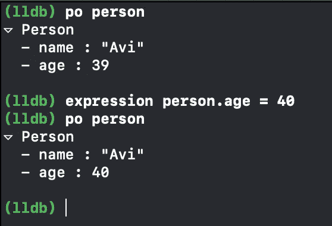

# 高级调试—第 1 部分:LLDB 控制台

> 原文：<https://betterprogramming.pub/advanced-debugging-part-1-lldb-console-5fe8cff13a93>

米哈伊尔·瓦西里耶夫在 [Unsplash](https://unsplash.com/photos/Vf1JrKMUS0Q) 上拍摄的照片

# **注意事项**

开发人员花大量时间修复 bug，或者换句话说，*调试*。事实上，有时我们花在修复 bug 上的时间比实际开发新功能的时间还多。因此，调试技能对于开发人员的成功至关重要，在下面的文章中，我们将通过学习 xCode 提供的工具来尝试利用我们的调试技能。

# **什么是 LLDB？**

低级调试器(LLDB)是 Xcode 中使用的默认调试器，是 LLVM 项目的一部分。LLDB 在 XCode 5 中取代了 GDB，它有几个优点，比如性能和可脚本化。

# **用表达式**评估控制台中的代码

LLDB 中最有用和最强大的命令之一是`expression`。`expression`让您在控制台中评估代码，节省您调试和测试代码的宝贵时间。您不仅可以运行代码，还可以修改现有变量，而无需重新编译项目。

看一下下面的例子:

在上面的例子中，我们有一个名为`person`的结构，有两个名为`name`和`age`的字段。我们用一个断点停止了程序，并将`age`从`39`改为`40`。

现在，当我们再次打印它时，我们看到实际值在运行时被修改了。这在处理应用程序中的某些任务时非常有用，例如动画、颜色或只是查看应用程序行为的值。

# **通过创建别名**，让您在控制台中的生活更加轻松

整天在控制台打字手指会疼吗？您可以轻松定义一个别名，让您的生活更轻松！

假设我们想要创建一个别名，将`person`的年龄属性增加 1:

`(lldb) command alias a1 expression person.age += 1`

因此，创建别名的 lldb 命令格式是:

"命令别名"+ <name of="" alias="">+</name>

# **用 PO 和 P 很好地打印变量**

`PO`是开发人员在 LLDB 中调试时最常用的命令。那么`PO`到底是什么？

嗯，我们已经知道什么是 T0，什么是 T1。所以`PO`是一个很好地打印变量的`alias`，它:

表情-O -l 斯威夫特—<name of="" variable=""></name>

我们所说的“很好”是什么意思？每个对象都可以有一个文本表示，您可以通过实现一个名为`CustomDebugStringConvertible`的协议来覆盖它。

这个协议有一个您需要覆盖的变量叫做`debugDescription`，它的返回值出现在控制台和调试器中。

`PO`命令并不孤单——我们还有`P`命令。`P`用于打印变量——这些变量大多不是带有内部格式化程序的对象。

如果你试图`PO`一个不是真实对象的东西(比如`Int`，你会得到一个不相关的 objective-c 对象的结果。

# **用 V 命令更快地打印变量**

在我们理解`V`命令做什么之前，我们需要理解`PO`和`P`是如何工作的。

当您在 LLDB 中调用一个`PO`命令时，它会生成一小段代码来评估您编写的表达式。之后，它编译代码，执行代码，并将其移动到某个数据格式化程序(在`P`的情况下)或运行`debugDescription`方法(在`PO`的情况下)以在控制台中打印。

`V`命令跳过代码评估，只访问变量存储器，并将在那里找到的数据传递给数据格式化程序，以便在控制台中打印出来。这意味着使用`V`比`PO`和`P`要快得多，因为它在调试期间不需要代码进化。

但是`V`命令有一个缺点——因为`V`不编译代码，它只能访问当前堆栈帧上的变量。此外，它不能打印计算的属性，因为它需要为此编译代码。

`V`命令仅在 XCode 10.2 及更高版本中可用，它是帧表达式的别名。

# 摘要

使用控制台是调试时的一项重要技能，因为它可以通过在断点中注入代码来节省您的宝贵时间，并且它可以通过轻松打印变量值来反映您的应用程序状态。

但是调试并没有到此结束。在接下来的章节中，我将尝试给出更多的技巧和工具来使你的调试过程更加流畅和简短。