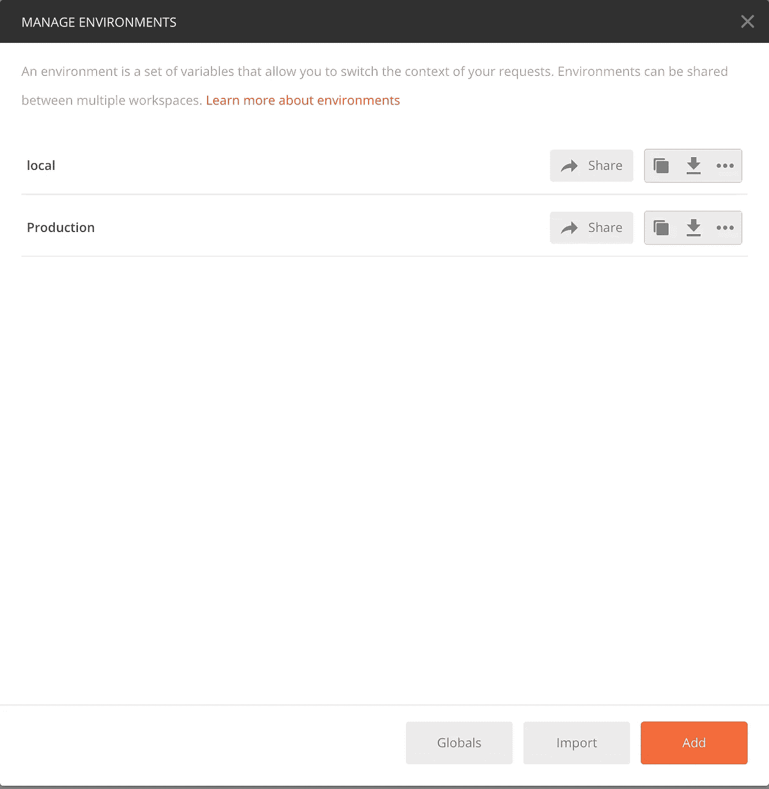
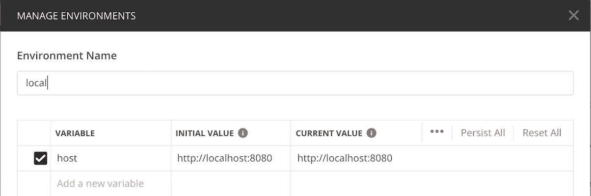
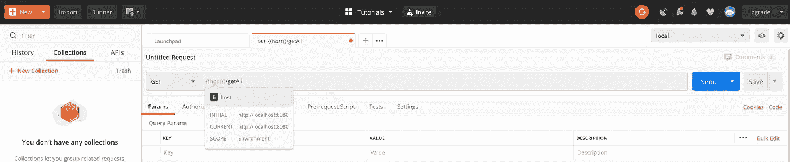
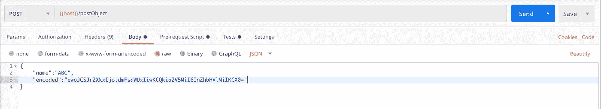
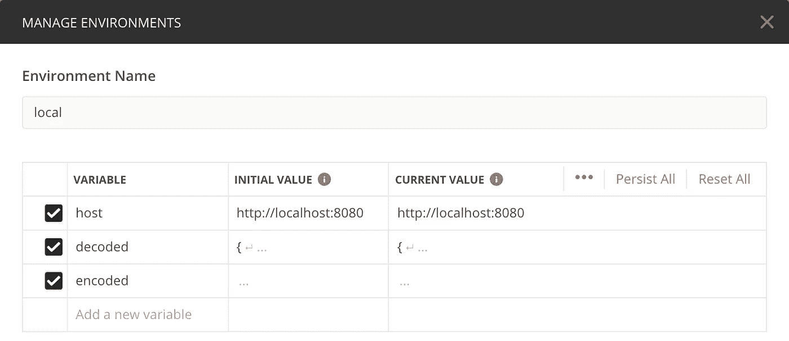
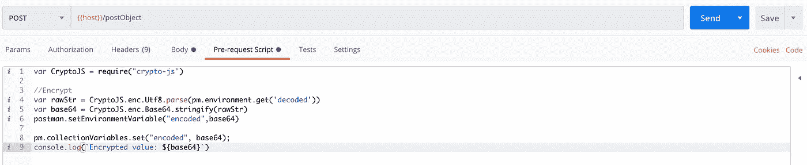
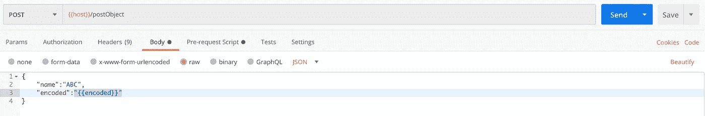
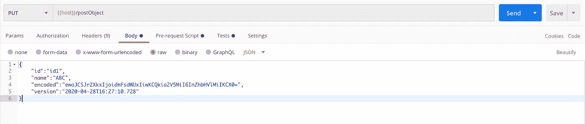
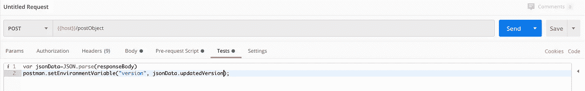
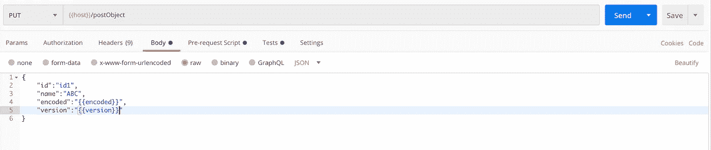

# Postman:每个开发人员都应该知道的快速敏捷开发技能

> 原文：<https://betterprogramming.pub/advanced-features-for-fast-and-agile-development-using-postman-6fd782585067>

## 更彻底地测试你的 API


照片由[海伦娜·洛佩斯](https://unsplash.com/@wildlittlethingsphoto?utm_source=unsplash&utm_medium=referral&utm_content=creditCopyText)在 [Unsplash](https://unsplash.com/collections/3577927/computing-and-it?utm_source=unsplash&utm_medium=referral&utm_content=creditCopyText) 上拍摄

多年来，我们一直使用 Postman 作为我们的 API 客户端来测试 API，从而加快了开发速度。

**对于新手到 Postman:** Postman 是一个流行的 API 客户端，可以让开发者轻松地创建、共享、测试和记录 API。这是通过允许用户创建和保存简单和复杂的 HTTP/s 请求，以及读取它们的响应来实现的。结果是:工作效率更高，不那么乏味。

我们中的许多人都忽略了它可以提供的开箱即用的功能和能力，这些功能和能力最终会带来更快、更敏捷的开发。让我们深入探讨一下每个人都应该使用的一些高级功能，以充分利用 Postman。

# **环境**

Postman 中的环境基本上是一组`key-value`对，它们可以在向服务器发出 HTTP/HTTPS 请求时用作变量。

## **举例理解**

最简单的用例是在不同的开发环境中测试相同的 API 例如，本地/QA/生产环境。

在这种情况下，服务器的 URL 发生了变化，其他一切保持不变。如何处理这种情况？

**正常方法** 在 Postman 中用不同的主机多次保存同一个请求。使用需要的那个。

**与邮差环境** 定义两个环境，比如说`Production`和`Local`。在两个环境中创建一个名为`host`的变量，并将值设置为每个环境的主机。

## **步骤:**

1.  点击邮差 app 右上方的齿轮图标(管理环境)进入以下页面。



2.点击 Add 按钮添加一个环境，添加两个环境`local`和`production`，变量`host`相同，对应值`localhost`和`production url`。



局部环境


生产环境

3.现在使用`host`变量发出与 URL 无关的请求。切换环境以更改其值。

要切换环境，使用环境下拉菜单，该菜单当前显示`local`被选中。

将鼠标悬停在`{{host}}`上—您将看到它的值，当发出实际请求时，它将被替换。



使用环境变量

# **请求前脚本**

这些脚本是用 JavaScript 编写的，在发送请求之前运行。

## **何时使用**

在请求运行之前，您可以在 Postman 中使用预请求脚本来执行 JavaScript。通过在请求、集合或文件夹的“请求前脚本”选项卡中包含代码，您可以执行预处理，如设置变量值、参数、标题和正文数据。您还可以使用预请求脚本来调试代码，例如，通过将输出记录到控制台。

## 通过示例理解

假设您想要测试一个 post API，它需要一个字段进行`base64`编码(否则服务器将抛出一个验证失败错误)。

**正常方法** 使用一个在线工具对请求变量进行编码，然后在每次改变要编码的对象内部的任何值时，将它放入 Postman 的请求中。



**使用预请求脚本的步骤**

1.  创建两个名为`encoded`和`decoded`的环境变量。



当前环境中的“解码”和“编码”变量

2.在预请求脚本中编写以下代码，从`decoded`变量中获取数据，对其进行编码，并将编码值保存到`encodeded` 变量中。



[点击此链接复制代码](https://gist.github.com/anuragsidana/df82faf65816e58cc0071c0039676475)

3.使用`"{{encoded}}"`作为请求体中需要使用编码值的地方的值。



请求中使用的编码值

4.每次您想要更改需要编码的数据时，只需更新`decoded`变量，一切都将迎刃而解。

每次点击 Send 按钮，预请求脚本就会执行，从`decoded`变量获取值，对其进行编码，并将其推送到`encoded` 变量。然后请求 bode 通过名为`encoded`的环境变量获取相同的内容。

# 试验

这些脚本是用 JavaScript 编写的，在每个请求完成后运行。

## **何时使用**

您可以用 JavaScript 为您的 Postman API 请求编写测试脚本。允许您确保您的 API 按预期工作，确定服务之间的集成运行可靠，并验证新的开发没有破坏任何现有的功能。

当 API 项目出现问题时，您还可以使用测试代码来帮助调试过程。

## 通过示例理解

假设有一个更新的依赖于版本的 API，每次更新请求时，版本都会更新。版本是服务器设置的时间戳字段，需要在下一次更新调用中传递。

**响应看起来像这样**

```
{
  "id": "id1",
  "name": "ABC",
  "encoded": "ewoJCSJrZXkxIjoidmFsdWUxIiwKCQkia2V5MiI6InZhbHVlMiIKCX0=",
  "updatedVersion": "2020-04-28T16:27:10.728"
}
```

**正常途径** 每次调用`update` API，服务器都会返回上面的响应。复制`updatedVersion`字段，并在下一次更新调用中使用它。



**带测试脚本**

1.  在当前环境中创建一个名为`version`的环境变量。
2.  编写下面的测试脚本，从响应中获取`updatedVersion`变量，并将其存储在`version`变量中。



[点击此链接复制代码](https://gist.github.com/anuragsidana/08e3750239ad866e1f50fdb320a1633d)

3.使用`"{{version}}"`作为`version`键的值，从环境变量中访问它。



从环境变量中访问值

每次点击发送按钮，我们都会从服务器得到一个响应，表明我们的`Test`脚本已经被执行了。这将从响应体中获取`updatedVersion`，并将其复制到名为`version`的环境变量中。
在发出请求时，它使用`version`环境变量来设置版本字段的值。

# 结论

这些是一些基本的特征，可以使我们的生活更容易，可以帮助我们实现全面更快的发展。以下是我们讨论的内容的摘要:

*   使用 Postman 环境变量在不同的环境中使用相同的`APIS`。
*   使用在请求发送到服务器之前自动运行的请求前脚本。这可以在各个方面帮助您，比如请求处理、在发送请求之前更改变量等等。
*   使用在我们从服务器得到响应后运行的测试脚本。我们可以使用它们来处理响应和调用其他 API，在请求完成后丰富环境变量。

感谢 [Jashan Preet Singh](https://medium.com/u/eca81dc58b9e?source=post_page-----6fd782585067--------------------------------) 对本文的贡献。
感谢阅读。编码快乐！