# 仅使用 HTML 和 CSS 的高级表单验证

> 原文：<https://betterprogramming.pub/advanced-form-validation-with-only-html-and-css-e92fa3dc9b54>

## 让我们构建一个简单的表单，看看我们可以使用的所有 HTML 和 CSS 验证技术，然后提交表单！


照片由[西格蒙德](https://unsplash.com/@sigmund?utm_source=medium&utm_medium=referral)在 [Unsplash](https://unsplash.com?utm_source=medium&utm_medium=referral) 上拍摄

[上周](https://matemarschalko.medium.com/advanced-css-only-input-fields-interactive-animated-validated-d7ecff3cde8c)我们构建了一个交互式的、动画的高级输入框，甚至包括一些自我验证，我们根本没有使用 JavaScript！

焦点主要集中在鼠标和键盘的交互以及依赖于验证状态的样式上。但是我们能做的远不止这些！

这一次，我们添加了验证功能，并提交了一个只有 CSS 和 HTML 的表单:

# 浏览器提供的输入字段

带`type="text"`的普通输入域，顾名思义，允许你输入一些文本。通过要求在输入有效和提交表单之前输入一定数量的字符，我们可以进一步澄清我们期望的文本类型。这可以用`minlength`和`maxlength`属性来定义。我们还可以使用`required` required 属性来指示输入必须有某个值才能有效。

```
<input type="text" minlength="3" maxlength="20" required />
```

简单地限制字符长度可能不足以验证许多其他的表单域类型，但是最重要的是最常见的表单域类型都有自己的专用类型。验证电子邮件绝对不仅仅是检查字符长度，所以我们可以依靠浏览器来完成这项工作，这很好:

```
<input type="email" />
```

在将验证状态从无效更改为有效之前，此输入字段现在只接受电子邮件地址。

类似地，我们也可以让浏览器检查输入是否是有效的 URL:

```
<input type="url" />
```

密码输入类型不会验证输入的密码，但它会通过用符号(通常是*或)替换每个字符来模糊文本。

```
<input type="password" />
```

我们也有搜索类型，但它的功能与大多数浏览器上的简单文本字段相同，但定义不同可能有助于可访问性或样式:

```
<input type="search" />
```

这是一个很好的内置类型列表，然而，它显然是不完整的，我们不能希望有一个所有可能类型的完整列表。为了解决这个问题并给我们更多的灵活性，发明了`pattern`属性。

# 10 分钟正则表达式简介

`pattern`属性接受一个正则表达式，该表达式定义了一个标准，然后用来测试输入值，以决定该值是有效还是无效。

正则表达式很复杂！

有很多关于这个主题的书，这也意味着你可以用它们做很多事情。让我们看几个简单的例子来了解这个想法。我能想到的最简单的正则表达式允许输入一个字符，在本例中是“a ”:

```
a
```

如果希望将这个正则表达式模式分配给输入字段，只需将其添加到模式属性中:

```
<input type="text" pattern="a" />
```

我们非常简单的输入字段现在只接受“a”作为输入值，其他都是无效的。

多次输入“a”也无效。为了允许字符多次出现，我们可以使用+号:

```
a+
```

您也可以通过在花括号之间定义一个数字来允许固定数量的“a”字符:

```
a{5}
```

那么如果我们想允许输入从“a”到“z”的所有字母呢？为此，我们需要做的就是使用破折号来定义范围:

```
[a-z]+
```

记住正则表达式是非常严格的，所有的规则都必须是显式的。例如，按照我们的定义，它只允许小写字母，因此必须明确定义允许大写字母:

```
[a-zA-Z]+
```

按照这个逻辑，向规则集添加数字很简单:

```
[a-zA-Z0-9]+
```

现在让我们用更多的字符来扩展一下:_。+ —并说结尾必须是“@gmail.com”。据此，我们创建了一个非常原始的电子邮件验证器，仅允许 gmail 电子邮件进入:

```
[a-zA-Z0-9_.+-]+@gmail.com
```

到目前为止，我们的正则表达式搜索整个输入值。这意味着我们新的 Gmail 模式将报告一封有效的电子邮件，即使它在一句话的中间。但这不是我们想要的。我们想确保除了邮件之外没有其他东西。为此，我们需要添加一条规则，要求输入文本以定义的电子邮件开始和结束。^符号表示表达式的开始，$符号表示表达式的结束。添加这些解决了我们的问题:

```
^[a-zA-Z0-9_.+-]+@gmail.com$
```

这是一个很好的例子，展示了正则表达式的可能性，但是由于它的简单性，对于生产代码来说可能不够好，因为它没有考虑所有的边缘情况。

让我们再看几个例子，这次用数字。假设我们想要创建一个输入字段来验证一个月中的某个日期，从而允许输入从 1 到 31 的数字。让我们假设`number`类型的输入字段不存在，我们不能简单地用`min`和`max`属性定义允许的范围。相反，让我们用正则表达式重新创建这个逻辑。

我们已经了解了如何定义一系列字符。假设我们允许从 1 到 9 的字符，而不允许使用开始和结束符号:

```
^[1-9]$
```

现在让我们尝试将允许的范围定义在 10 到 29 之间。如果我们开始考虑字符链而不是数字，那么我们会看到 10 到 29 范围内的第一个字符只能是 1 和 2。另一方面，第二个字符可以是 0 到 9。将它转换成正则表达式意味着我们添加两个方括号，每个方括号代表一个允许的字符:

```
^[12][0-9]$
```

记住 12 不是 12，这意味着我们允许 1 和 2 作为第一个字符。定义 30 和 31 的方法非常相似:

```
^[3][01]$
```

所以我们设法分别定义了这些条件，但是现在我们需要找到一种方法将它们组合在一个正则表达式中。我们需要结合的三条规则是:

*   使用`^[1-9]$`允许数字从 1 到 9
*   使用`^[12][0-9]$`允许 10 到 29 的数字
*   允许数字 30 和 31 带有`^[3][01]$`

圆括号和管道符号(`|`)让我们可以组合这些规则。

```
^([1-0]|[12][0-9]|[3][01])$
```

我们可以把 pipe 看作一个“或”组合子，如果任何子规则的结果为真，那么正则表达式的结果为真。现在，我们可以输入从 1 到 31 的数字。

通过添加一点额外的逻辑，我们可以定义 DD/MM/YYYY 日期格式:

```
^((0?[1–9]|[12][0–9]|3[01])[- /.](0?[1–9]|1[012])[- /.] (19|20)?[0–9]{2})*$
```

我承认这比前面的例子稍微复杂一些，但是它应该是可读和可理解的。在一天结束的时候，我们不一定要自己写这些。网上有很多资源可以帮助你。

当你编写和测试新的正则表达式时，我推荐使用 Regexr 网站。在这个网站上还有一个方便的备忘单和一个提供大量帮助的实时编辑器。

我们已经了解了最常用的输入类型和一些正则表达式，但是我们不要忘记我们可以使用的所有其他输入类型！

# 更高级的内置输入类型

例如，您可以编写和验证数字:

```
<input type="number" min="0" max="1000" step="10" />
```

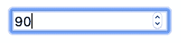

数字输入字段有一个`min`和一个`max`属性来定义有效的数字范围。我们还有`step`，它是点击上下箭头调整数值时使用的步进间隔。`step`也用于验证。在本例中，我们将`step`值设置为`10`，这意味着单击向上或向下箭头将从 0 到 1000 以 10 为单位递增和递减数字。

对于电话号码，我们可以使用`tel`输入类型。这将在移动设备上显示专用的电话号码键盘:

```
<input type="tel" />
```

然后我们还有复选框:

```
<input type="checkbox" />
<input type="checkbox" checked />
```

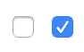

和单选按钮:

```
<input type="radio" />
<input type="radio" checked />
```


它们之间的区别在于，当我们有多个选项可供选择时，单选按钮只允许从所有选项中选择一个，而复选框允许同时选择多个值。

复选框和单选按钮是如此的多才多艺，以至于我有一些专门的帖子来讨论我们可以用它们做的所有技巧。

而且这还不是全部！我们可以把一个输入框变成一个按钮:

```
<input type="button" value="Click me! />
```

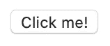

不幸的是，如果没有分配给它一些 JavaScript 功能，它自己不会做太多事情，所以它对我们来说没有多大用处！

另一方面，我们必须提交和重置按钮，以便将表单中经过验证的字段发送到 web 服务器进行处理，或者清除所有字段并重新启动。这些根本不需要任何 JavaScript！

```
<input type="submit" />
<input type="reset" />
```

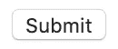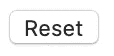

用简单的 HTML 表单而不是 JavaScript 将表单提交到 web 服务器进行处理听起来很令人兴奋，但是在我们研究这个之前，让我们快速浏览一下我们所拥有的一些可用的但稍具实验性的输入类型:

挑选颜色:

```
<input type="color" />
```

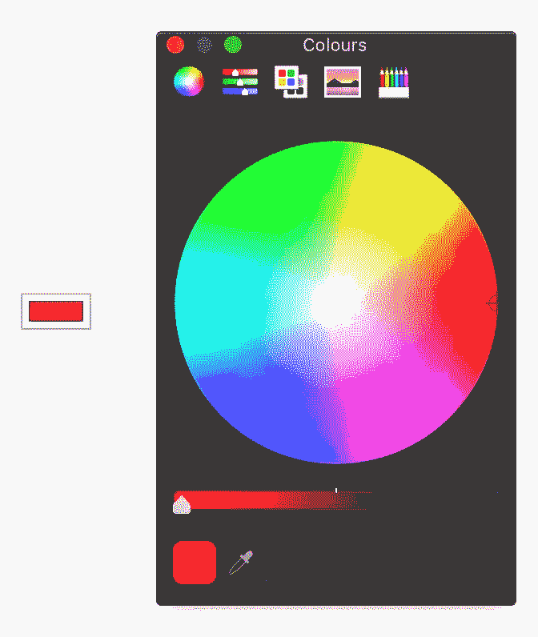

从我们的计算机中选择图像或其他文件，与表单一起提交:

```
<input type="file" />
<input type="image" />
```

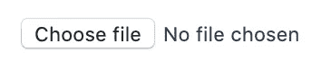

以及提交日期和时间的各种输入:

```
<input type="date" />
```

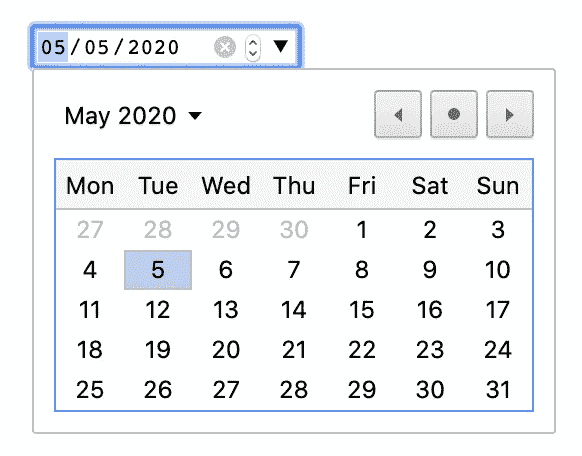

```
<input type="datetime" /><input type="week" /><input type="month" />
```

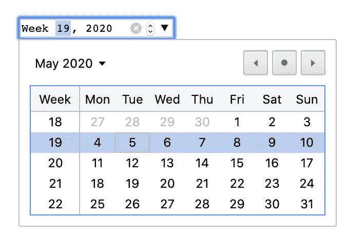

```
<input type="time" />
```

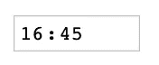

很棒的是，我们可以使用所有这些输入字段，而不必围绕它们编写 JavaScript 功能和验证。您甚至可以使用带有日期和时间字段的`min`和`max`属性来定义允许的日期和时间范围:

```
<input type="date" min="2018-01-01" max="2018-12-31" value="2018-07-22" /><input type="time" min="9:00" max="18:00" value="13:22" />
```

我们不要忘记，我们可以用`:valid`和`:invalid`选择器来选择所有这些输入字段的验证状态。

这样，您就可以显示和隐藏它们的错误和成功验证消息。我们在我之前的[帖子](https://matemarschalko.medium.com/advanced-css-only-input-fields-interactive-animated-validated-d7ecff3cde8c)中讨论过这些。

# 构建我们的高级形式

要查看所有这些，让我们创建一个非常简单的表单来提交一些测试结果。您的分数需要超过 65%才能提交表格，该表格将使用已经讨论过的功能进行验证。该表单将类似于以下内容:

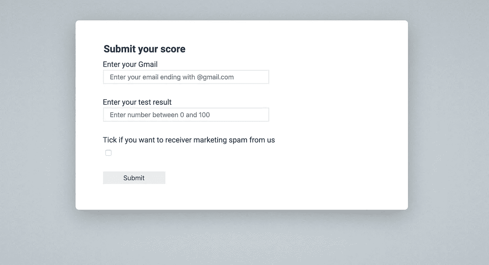

您可以复制并使用此示例的项目模板。您可以从 [GitHub](https://github.com/webondevices/html-css-wizardry) 下载模板和完成示例的源代码。

让我们复制我们的项目模板并准备文档的框架。表单将位于一个`<form>`和`<fieldset>`中:

```
<form>
  <fieldset>
    <legend>Submit your score</legend>
    <!-- Form fields will come here -->
     <button type="submit">Submit</button>
  </fieldset>
</form>
```

元素可以用来将几个控件和一个标题组合在一起。在`<fieldset>`中，我们从一个`<legend>`开始，它将作为表单的标题。之后，我们将添加表单字段(即将到来)，然后我们在最后有提交按钮，当单击时会自动触发表单提交。

# 实现单个字段

表单中的第一个输入字段是电子邮件地址:

```
<label for="email">Enter your Gmail</label>
<input
  id="email"
  placeholder="Enter your email ending with @gmail.com"
  pattern="^[a-zA-Z0-9_.+-]+@gmail.com$"
  name="email"
  type="email"
  required />
<span class="error-message">
  Enter a valid email ending with @gmail.com
</span>
<span class="success-message">
  Email correct
</span>
```

对于这个例子，我们需要输入一个 Gmail 地址，这样我们就可以使用我们之前创建的正则表达式。另外，请注意添加了错误和成功消息。我们将根据字段的验证状态来切换它们的可见性。但是我们希望默认情况下这些是隐藏的:

```
.error-message,
.success-message {
  display: none;
}
```

现在，让我们添加输入字段来输入分数，我们说过分数至少需要达到 65 分才能被接受:

```
<label for="score">Enter your test result</label>
<input id="score" type="number" name="score" min="65" max="100" value="0" required /><span class="error-message">
  You haven't reached the minimum score
</span>
<span class="success-message">
  Congratulations for your excellent score
</span>
```

最后，如果没有营销垃圾邮件的同意复选框并使其成为强制性的，任何表格都是不完整的。

```
<label>Tick if you want to receive marketing spam from us
  <input id="accept" name="marketing" type="checkbox" required />
</label>
```

这样，表单的 HTML 标记就完成了，验证也按预期进行，因为已经添加了正确的属性:

*   email 字段中的 email `pattern`和`reguired`属性，以确保表单中提交了有效的 email
*   分数字段中的最小值(`min`)、最大值(`max`)和`required`属性，以确保用户只提交分数超过 65 的表单
*   营销复选框的`required`必需属性，确保每个人都同意接受营销电子邮件

让我们从一些基本的东西开始设计表单:我们需要移除字段集周围的边框，增加图例的字体大小，将输入字段堆叠在一起，并在它们周围留有一定的间距:

```
main {
  padding: 50px;
}fieldset {
  border: none;
}legend {
  font-size: 24px;
  font-weight: bold;
}input, button, label {
 display: block;
}input {
  width: 400px;
  height: 30px;
  padding: 15px;
  font-size: 16px;
  outline: none;
  border: 2px solid var(--grey);
  margin-bottom: 30px;
}
```

这样，表单域将以灰色边框开始。但是我们还想在编辑输入字段时将这些边框颜色更改为黑色，在有效时更改为绿色，在无效时更改为红色:

```
input:focus {
  border: 2px solid black;
}input:valid {
  border: 2px solid var(--green);
}input:invalid {
  border: 2px solid var(--red);
}
```

在我们的表单中，所有输入文本字段都是强制性的，因为它们具有必需的属性。如果您有一个带有可选字段的表单，那么您可以使用`:optional`伪选择器来设置它们的样式:

```
input:optional {}
```

您可能还想对所有必需的输入字段元素进行样式化，这也有一个伪类:

```
input:required {}
```

对于带有`min`和`max`属性的输入字段，还有一个特殊的选择器。有了这些，您可以使用`:in-range`伪类来选择字段，其中输入的数字介于`min`和`max`属性中的值和`:out-of-range`属性中的值之间，当它超出这个范围时:

```
input:in-range {
  border: 2px solid var(--green);
}input:out-of-range {
  border: 2px solid var(--red);
}
```

这些伪类有助于向用户提供一个可视化的指示，表明字段的当前值在允许的范围内。如果您想要更好地控制您的错误验证，这是很好的，但是在我们的例子中这是不必要的，因为字段仍然会响应`:valid`和`:invalid`伪类。

唯一需要做一些额外工作的是错误和成功消息。我们需要根据字段的验证状态来显示和隐藏这些消息。将错误消息设为红色，成功消息设为绿色也不错。

```
.error-message,
.success-message {
  display: none;
}.error-message {
  color: var(--red);
}.success-message {
  color: var(--green);
}input:invalid + .error-message,
input:valid + .error-message + .success-message {
  display: block;
}
```

我们添加了`display: none`来使消息容器默认隐藏。我们用来显示无效字段的错误消息的选择器是这样的:

```
input:invalid + .error-message {}
```

如果你还记得的话，+是相邻的兄弟选择器。如果我们有 A + B，那么选择器选择紧跟在 HTML 文档中 A 元素之后的 B 元素。我们的新选择器选择文档中任何无效输入元素之后的带有`error-message`类的元素。

这对于错误消息非常有效，但是相同的选择器不能用于成功消息:

```
/* this will not work */
input:valid + .success-message
```

这将不起作用，因为成功消息元素没有紧跟在输入字段之后。错误消息夹在两者之间，阻止相邻的兄弟选择器工作。

还有一般的同胞选择器(~)怎么样？

```
/* this will not work */
input:valid ~ .success-message {}
```

这不仅会选择即将出现的元素，还会选择出现在表单更下方的所有成功消息兄弟元素。

这可以通过将所有输入字段及其标签和消息容器包装在一个额外的元素中来解决，以确保在同一级别上只有一个成功消息，但是在 HTML 中引入额外的元素来支持某种样式并不是一个好的做法。我们可以做得更好，方法是在有效输入字段后的错误消息后选择成功消息:

```
input:valid + .error-message + .success-message {}
```

通过这样做，我们将选择器的范围限制在相关的成功消息容器。在其他情况下，您可能不知道想要跳过的元素的确切类别，所以您可能只想说您想要它后面的第二、第三或第四个元素。对于这些情况，您可以使用通用选择器，它会忽略中间的元素类型:

```
/* second element after the input field */
input:valid + * + .success-message {}/* third element after the input field */
input:valid + * + * + .success-message {}/* fourth element after the input field */
input:valid + * + * + * + .success-message {}
```

有了这个新提出的选择器，当你打开页面时，错误信息会立即显示出来，并且，正如所料，当你开始填写表单时，它们会一个接一个地变绿。但是这对用户来说可能有点烦人，因为我们告诉他们，他们甚至在开始之前就把整个表单弄乱了。

相反，我们可以使用前面的示例项目中的想法[，仅在用户与表单交互并输入一些值(占位符不再显示)以及用户完成编辑(输入字段不再处于焦点)后显示这些消息:](https://matemarschalko.medium.com/advanced-css-only-input-fields-interactive-animated-validated-d7ecff3cde8c)

```
input:not(:placeholder-shown):not(:focus):valid {
  border: 2px solid var(--green);
}input:not(:placeholder-shown):not(:focus):invalid {
  border: 2px solid var(--red);
}input:not(:placeholder-shown):not(:focus):invalid + .error-message,
input:not(:placeholder-shown):not(:focus):valid + .error-message + .success-message {
  display: block;
}
```

在表单的末尾，我们在 HTML 中添加了 submit 按钮:

```
<button type="submit">Submit</button>
```

我们现在需要一些基本的样式来使它看起来更好:

```
[type="submit"] {
  width: 150px;
  height: 30px;
  margin-top: 20px;
  border: none;
  background-color: var(--blue);
  cursor: pointer;
}
```

# 验证整个表单

到目前为止，我们已经看到了如何验证单个字段并使用一些属性定义验证规则，然后根据输入字段的焦点、有效和无效状态以及一些伪类的帮助来设计输入字段的样式。输入字段正在验证，相关的成功和错误消息正在出现，因此我们取得了良好的进展！

我们花了很多时间处理各个输入字段。现在让我们看看可以对表单本身做些什么！

当您构建整个表单时，通常会有多个输入字段，最后有一个提交按钮，您可以用一个字段集和图例将所有内容包装在一个表单元素中:

```
<form>
  <fieldset>
    <legend>Submit your score</legend>
    <!-- Form fields will come here -->
    <button type="submit">Submit</button>
  </fieldset>
</form>
```

我们刚刚构建的表单具有相同的结构，在最后我们有一个提交按钮，将您的输入值发送到服务器。在这个例子中，我们使用了一个带有属性的元素来告诉浏览器我们希望使用这个按钮来提交表单的内容。但是我们也可以只使用带有`type="submit"`属性的`<input>`元素。我们还可以添加带有`type="reset"`属性的按钮和输入:

```
<button type="reset">Reset</button>
<input type="reset" value="Reset" />
```

按下这些按钮将清除表单中的所有字段和值。

`<button>`和`<input>`元素处理提交和重置表单的方式是相同的。它们之间唯一的区别是，输入提交按钮只通过它的 value 属性将文本作为内容，然而，按钮元素内部可以有额外的 HTML 内容，如一个图像或一段文本，这样在需要时会提供更多的灵活性。

如果您尝试点击提交按钮而不填写表单，浏览器将验证您的整个表单，并且不允许您向服务器发送任何内容并中止提交。浏览器甚至会给你一个有意义的错误信息，告诉你可能出了什么问题。所有这些都是通过我们在中添加的验证属性自动发生的:

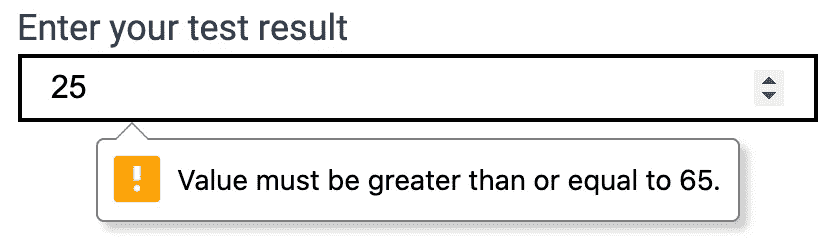

在这一点上，不仅仅是您的输入字段是无效的，而且表单本身也是无效的。这意味着您可以根据表单的验证状态来设计整个表单的样式。让我们在表单周围添加一个红色边框来表示有问题:

```
form:invalid {
  border: 1px solid var(--red);
}
```

用户现在可以立即知道他们没有完成。但是提交按钮本身仍然是活动的，仍然可以被按下。如果表单还没有完成，禁用并变灰按钮怎么样？

通常，这可以很容易地通过向按钮添加`disabled`属性来实现:

```
<input type="submit" value="Submit" disabled />
```

这将禁用按钮并添加适当的样式，但是不能从 CSS 中切换该属性，只能从 JavaScript 中切换。这意味着该按钮被禁用，并且即使在表单有效并准备好提交后也将保持禁用状态。

输入字段还有一个`readonly`属性，顾名思义，它不允许用户修改内容，内容只能被读取。与禁用状态类似，只读状态也可以通过相关的伪类在 CSS 中获得:

```
/* not needed for our example */
input:disabled,
input:read-only {
  border: 2px solid grey;
}
```

正如所料，我们还有一个伪类来选择所有启用的输入字段:

```
input:enabled {}
```

所以我们知道不能用 CSS 切换 disabled 属性，但是，我们可以通过选择无效表单中的 submit 子按钮来模拟一些 CSS 的禁用状态，因为我们知道表单也会获得无效状态:

```
form:invalid [type="submit"] {
  background-color: var(--grey);
  cursor: not-allowed;
}
```

这个挺好看的！当表格未完成时，按钮为灰色，将光标移至其上会将鼠标指针设置为“不允许”:

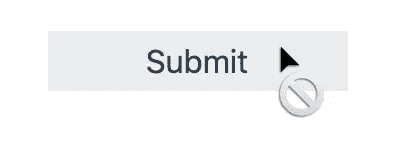

一旦表单全部有效，该规则将不再适用，按钮将变回蓝色，光标指针指向其默认值。

因此，我们设法添加了一些视觉指示，按钮被禁用，但尽管我们所有的努力，按钮仍然是可点击的。用 CSS 完全禁用按钮实际上可能吗？

如果你还记得的话，我们已经做过类似的事情，当我们创建我们的[高度交互和动画输入字段](https://matemarschalko.medium.com/advanced-css-only-input-fields-interactive-animated-validated-d7ecff3cde8c)并想要禁止点击覆盖字段的表单标签时。

诀窍是用`pointer-events` CSS 属性禁用元素上注册的指针事件。让我们将它添加到提交按钮的禁用状态:

```
form:invalid [type="submit"] {
  background-color: var(--grey);
  cursor: cursor: not-allowed;
 **pointer-events: none;**
}
```

通过这种添加，除非表单有效并准备好提交，否则不能再单击按钮，在这种情况下，按钮将变成蓝色:

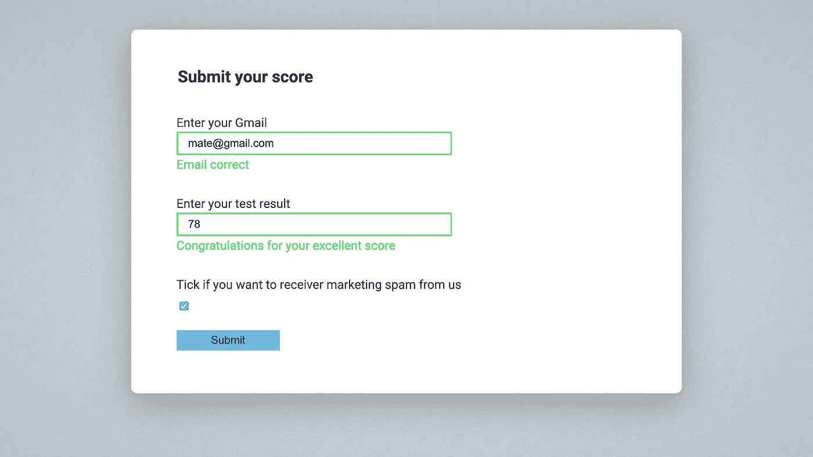

这很好，但是我们引入了一个小的回归。因为指针事件不再被按钮拾取，包括当鼠标指针在它上面时，我们不再看到“不允许”的光标。

为了解决这个问题，我们可以将
`pointer-events`声明移动到`:active`伪类，这样鼠标交互只会在我们实际点击按钮时被阻止，而不会在我们悬停鼠标时被阻止。

```
form:invalid [type="submit"] {
  background-color: var(--grey);
  cursor: cursor: not-allowed;
}form:invalid [type="submit"]:active {
  pointer-events: none;
}
```

我们能做到这一切很好，但请记住，预期的用户体验可能不是这样。您可能仍然希望允许用户单击提交按钮来查看由浏览器或其他各种原因生成的验证错误。

# 提交表单

那么当我们按下提交按钮时会发生什么呢？我们的价值观从何而来？

当一切正常时，表单有效，提交按钮被按下，然后浏览器将初始化一个 GET HTTP 请求，并将您在表单中输入的值作为查询字符串附加到 URL 的末尾。

```
[https://www.yourwebsite.com/?email=mate%40gmail.](https://www.yourwebsite.com/?email=mate%40gmail.) com&score=78&marketing=on
```

这里的命名约定不是随机的:查询字符串中的 email、score 和 marketing 来自输入字段的 name 属性，等号后面的值是用户输入的值。

如果您不更改任何设置，所有这些都将默认发生。但是该表单允许您更改提交表单的 URL，以及提交时浏览器应该使用的 HTTP 方法:

```
<form action="login-api/" method="get">
  <!-- your form -->
</form>
```

将`login-api/`添加到 action 属性将会更新表单提交到的 URL:

```
[https://www.yourwebsite.com/login-api/?email=mate%40gmail.](https://www.yourwebsite.com/login-api/?email=mate%40gmail.) com&score=78&marketing=on
```

这样，您的 web 应用程序的前端就完成了！现在由后端和您的服务器应用程序来处理发送到`/login-api`端点的输入查询字符串数据。

action 属性也可以指向另一个 HTML 文件。然后，这个文档可以让 JavaScript 应用程序读取并处理提交的查询字符串数据。

HTTP 方法默认设置为“get ”,所以我们没有通过显式声明它来改变行为。但是，您可以将此设置更改为“post”方法，这将稍微改变行为。

post 方法发送用户在请求正文中输入的表单数据，表单数据不会附加到 URL。这也意味着不可能直接从 JavaScript 中检索数据，因此数据处理必须在服务器上进行，这使得这种方法成为敏感数据的推荐方法。

我们讨论这些的原因是为了理解这样一个事实，即验证表单值并提交给服务器进行处理根本不需要 JavaScript。我们可以用简单的 HTML 处理所有这些基本任务！