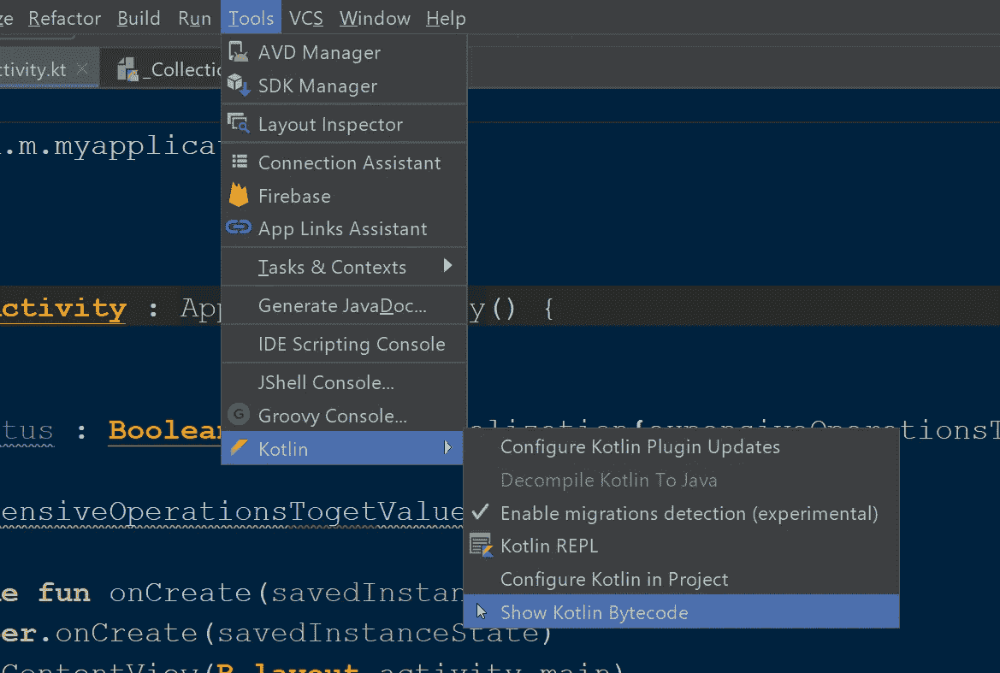

# Kotlin 中的高级编程(第 3 部分)

> 原文：<https://betterprogramming.pub/advanced-programming-in-kotlin-2e01fbc39134>

## kot Lin-您应该使用的独有功能


今天我们将学习 Kotlin 的一些令人兴奋的特性，这些特性你可能还没有见过或使用过，还有一些你在用 Kotlin 编程时应该注意的事情。

我们开门见山吧！

# #1.参数数量可变的函数

在 Kotlin 中，我们可以向函数传递可变数量的参数。这意味着你可以给一个函数传递`n`个参数。这个特性在 Java 里是有的，但是你知道在 Kotlin 里怎么做吗？看一看:

我们可以传递尽可能多的变量，但这并不意味着你可以传递一个`ArrayList`。但是，有一种方法可以传递数组，也可以传递数组和单个字符串的组合。看一看:

内部发生的是，当提到`vararg`时，你传递的参数，无论是`Array`格式还是各自的类型，都被转换成 Kotlin 编译器中的一个数组值，同时生成 Java 文件。

# #2.优化递归函数

调用递归函数在任何平台上都是代价高昂的。当递归函数本身包含昂贵的作业时，它将变得更加复杂。我们应该做些事情来优化功能，而`tailrec` 就是 Kotlin 的做法。看看一个简单的递归函数:

这个看似简单，但是当你过了`30000`而不是`5`，会简单吗？如果函数`Fact`有一些昂贵的操作，比如写入文件或套接字通信，会发生什么？你可以看到递归会使事情变得复杂。

不幸的是，Kotlin 通过 JVM 不会对此做任何优化。但 Kotlin 只要在函数前加上`tailrec` 就能优化。看一看:

# #3.财产委托

假设我有一个属性，而不是必须获取和设置它的方法；当 get 或 set 被调用时，我想调用另一个类。要了解我在说什么，请看下面的代码:

我们可以在许多方面利用这个科特林代表团。我发现一个有用的方法是在`preference`中去掉单独的`get`和`set`函数。看看

下一个有用的使用方法是观察一个变量值——这样当变量值改变时我们会得到通知。这样，如果有任何 UI 需要更新，我们可以做。看看下面的代码，看看如何观察一个变量:

# #4.循环中的“步进”

我们都知道在科特林循环是如何工作的。你给一个初始值，并在每次迭代中递增，直到你提到的条件不满足。看一下下面的代码:

现在，如果您只想打印循环的每三次迭代，该怎么办呢？这就是`step` 派上用场的地方。我们需要提到`step 3`，Kotlin 会处理好事情:

这非常有用，但根据 romainguy 在 KotlinConfig 2019 中的说法，这将大幅增加大小，所以你应该只把它作为最后的救援手段。

# #5.懒惰的

假设您的类中有一个变量，它的值是通过执行一项昂贵的工作获得的，但该变量只有在用户访问屏幕上的特定功能时才有用。处理这个问题的最简单的方法是最初将变量设为 null，并在用户访问该特性时初始化该值。但是我们必须在每次访问变量的时候使用空值检查。

我们可以做得更好，我们可以通过两种方式来实现，一种是将这个变量称为`lateinit var` ，并在需要时进行初始化。另一种方式是懒初始化。

还记得我们上面讨论的财产委托吗？在这里，我们使用 Kotlin 委托来初始化这个变量。为此，我们首先需要创建一个可以在整个项目的任何地方使用的委托，如下所示:

这个委托做什么:如果`valueHolder`为空，并且第一次只有空，那么它将调用构造函数中传递的高阶函数，将结果值赋给`valueHolder`，并返回它。

现在，我们将使用这个委托和函数初始化变量，该函数会产生变量的值。看一看:

# #6 如何在 Java 中查看 Kotlin 代码

我们都知道，在幕后，Kotlin 代码被转换成 Java，然后是字节码，以便 JVM 能够理解和执行。你知道我们可以在 Android studio 中直接看到一个 Kotlin 文件的字节码吗？看一看:



当你点击最后一个选项`Show Kotlin Bytecode`时，活动窗口 Kotlin 文件转换后的字节码显示在一个单独的窗口中。然后，您可以单击弹出窗口左上角的反编译选项来查看 Java 代码。

# #7.内部密封类

状态管理是移动开发中至关重要的事情之一，尤其是在 Android 中，我们必须为不同的状态做不同的事情。例如，当我们发出网络请求时，结果可能是`Success`或`Error`。

这很简单，这个`sealed class`可以做对:

```
**sealed class Result** {
    **class Sucess** : Result()
    **class Error** : Result()
}
```

如果有两种不同的错误，比如未知错误和本地错误，该怎么办？如果操作也不同，比如当服务器出错时，我想显示一个警告对话框。当一个本地错误发生时，我想显示一个`Toast`。这就是内部密封类发挥作用的地方，它提供了一个更简洁明了的结构。看一看:

```
**sealed class Result** {
    **class Sucess** : Result()
    **sealed class ErrorType** : Result() {
        **class remoteError** : ErrorType()
        **class localError** : ErrorType()
    }
}
```

在操控部分，用 mighty `when`来看看还是挺舒服的:

# 更新

要了解更多关于 Kotlin 的内容，请阅读 Kotlin 高级编程系列中的其他文章:

*   [“用 Kotlin 进行高级编程](https://medium.com/better-programming/advanced-android-programming-with-kotlin-5e40b1be22bb)
*   [“用 Kotlin 进行高级编程—第二部分](https://medium.com/android-dev-hacks/advanced-android-programming-with-kotlin-part-2-aae2a15258b0)”
*   [“使用 Kotlin 进行高级编程—第 4 部分”](https://medium.com/better-programming/advanced-android-programing-in-kotlin-part-4-187b88fea048)
*   [“使用 Kotlin 进行高级编程—第 5 部分”](https://medium.com/better-programming/advanced-programming-in-kotlin-part-5-b674ce9e692f)

要进一步了解 Kotlin 协同程序和其他高级特性，请阅读以下文章:

[**科特林协程，从基础到高级**](https://medium.com/better-programming/kotlin-coroutines-from-basics-to-advanced-ad3eb1421006)

[**科特林**](https://medium.com/@sgkantamani/sealed-classes-in-kotlin-e48e072daca8) 中的密封类

[**异步数据加载与新 Kotlin 流**](https://medium.com/better-programming/asynchronous-data-loading-with-new-kotlin-flow-233f85ae1d8b)

看看下面这个来自 Kotlinconf 2019 的演讲。我在这里解释的一些概念，是我从下面的谈话中学到的。

感谢阅读。