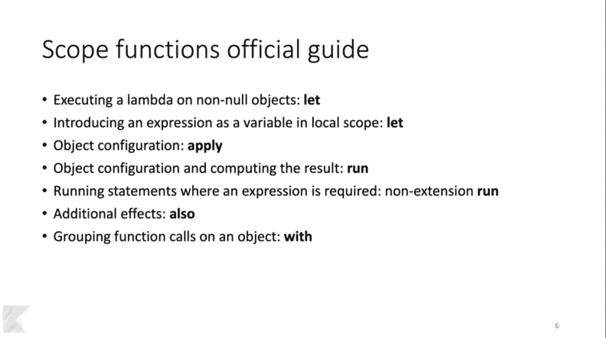

# Kotlin 中的高级编程(第 5 部分)

> 原文：<https://betterprogramming.pub/advanced-programming-in-kotlin-part-5-b674ce9e692f>

## 你应该使用的更多 Kotlin 专属功能

与 Java 不同，在 Java 中我们需要编写所有内容，Kotlin 编译器理解代码并在幕后编写样板代码。除此之外，简单的语法和修改语言用法的能力使开发人员更有效率。

如果你在网上搜索，你会发现 Kotlin 解决 Java 的许多棘手问题的许多方法，以及 Kotlin 的特性如何使开发更有趣。

# 本系列的收获

这个关于 Kotlin 编程的系列始终关注如何有效地使用 Kotlin 的创造性功能，以及如何限制我们过度使用它们，从长远来看，这将导致无法预见的问题。

# 1.检查“lateinit”变量是否已初始化

在 Kotlin 中，我们可以使用`var lateinit`声明变量，在这种情况下，系统不会给它们分配内存，直到它们至少被初始化一次。这种类型的功能提高了应用程序的性能。

另一方面，`lateinit`变量不能使用 Elvis ( `?:`)操作符声明，这意味着这些变量不能为空。所以困扰我的问题是如何检查`lateinit`变量或者对象初始化状态。事实证明这很简单。看一看:

# 2.对大数字使用下划线

在这个现代时代，如此多的开发人员像我一样从事电子商务应用程序的开发，我们每天都要处理大量的数据，如下所示:

价值很难理解吧？开发金融或股票应用程序的开发人员也将面临这种数字的模糊性。实际上，我们用逗号分隔千位，以便快速理解。同样，Kotlin 有一个千位分隔符，但它是一个下划线。看一看:

带分隔符的大数

# 3.**take if’&【take unless】**

当你通过`filter`、`map`等扩展函数处理列表时，Kotlin 提供了丰富的体验。这些都很棒，但是您知道我们可以在调用链中间使用`takeif`和`takeUnless`函数后跟`let`来执行更多的条件吗？看一看:

takeif 函数用法

# 4.用“also”调试

每个开发人员都有自己调试代码的风格。最近我遇到了一些代码片段，它们使用了`also`关键字来调试值。我觉得它很酷，尤其是在我的工作岗位上，我经常处理`sorting`、`filter`和`groupby`功能。看一看:

我们不再需要在执行的每一步都写一个新的块。这将为像我这样更多使用日志而不是断点的开发人员节省大量时间。看一下输出:

# 5.嵌套函数

我们可以在另一个函数中编写一个函数，类似于 Python 中的嵌套函数。嵌套函数的作用域是外部函数，只有外部函数可以包含嵌套函数。内部函数不受函数外部发生的任何事情的影响。看一看:

嵌套函数

# 6.λ表达式

Lambda 是函数的最简单形式，只有一行表达式(大多数情况下)。在 Kotlin 中，lambda 函数用花括号`{}`括起来。Lambda 函数不像普通函数那样有`fun`关键字或任何访问修饰符(public、private 和 protected)。看一看:

Kotlin 中的简单 lambda 函数

Kotlin 中的 lambda 函数没有返回类型，但我们可以传递参数，如下所示:

带参数的 lambda 表达式

# 7.“中缀”函数

`infix`符号允许我们快速调用单参数函数。为了创建一个`infix`函数，需要两个参数。第一个参数是目标对象，而第二个参数是传递给函数的实际参数。

Kotlin 中的中缀函数

创建`infix`函数就像创建`inline`函数一样。语法上唯一的区别是我们使用了`infix`关键字而不是`inline`。现在让我们看看如何调用`infix`函数。

调用中缀函数

当我们在正确的地方使用`infix`函数时，语法将比常规函数更加透明，可读性更强。

# 8.一个*关联'*

Kotlin 有大量与集合相关的有用的扩展函数，其中一些有扩展链接，如`To`、`With`和`By`。`associate`是集合上的扩展函数，有三个变体:`associate`、`associateTo`、`associateBy`、`associateWith`。

> *"返回一个* [*映射*](https://kotlinlang.org/api/latest/jvm/stdlib/kotlin.collections/-map/index.html#kotlin.collections.Map) *，包含由* [*变换*](https://kotlinlang.org/api/latest/jvm/stdlib/kotlin.collections/associate.html#kotlin.collections$associate(kotlin.Array((kotlin.collections.associate.T)),%20kotlin.Function1((kotlin.collections.associate.T,%20kotlin.Pair((kotlin.collections.associate.K,%20kotlin.collections.associate.V)))))/transform) *函数提供的应用于给定数组元素的键值对。"—* [*科特林文档*](https://kotlinlang.org/api/latest/jvm/stdlib/kotlin.collections/associate.html#kotlin.collections$associate(kotlin.Array((kotlin.collections.associate.T)),%20kotlin.Function1((kotlin.collections.associate.T,%20kotlin.Pair((kotlin.collections.associate.K,%20kotlin.collections.associate.V)))))/transform)

您还记得`Pair`吗，在这里我们可以将两个值连接成键-值对。`associate`与此类似，但这里我们操作的是`ArrayList`中的值，而不是随机值。

类似于`associate`功能，`associateTo`、`associateBy`和`associateWith`生成不同类型的地图，如上图所示。他们最终可能会做同样的事情，但是在几个用例中，他们都有自己有用的方式。

# 9.范围职能官方指南

范围和扩展非常复杂，是 Kotlin 中一些最强大的特性。我在本系列过去的文章中已经谈到了它们。但是几天前，我在 droidcon 网站上看到了 Dmitry Sitnikov 关于这些功能的演讲。

在那次演讲中，我看到了关于何时使用哪个作用域函数的详细指南。自从我第一次看到这个列表，它就对我有意义，所以我想在这里与你分享:

德米特里·西特尼科夫在 droidcon 上的讲话截图

如果你读得清楚，这个列表对范围函数的正确使用是有意义的。

默认情况下，如果我们使用`?`操作符，`let`会返回一个非空的 lambda 函数，因此使用它将一个表达式作为一个值引入作用域是有意义的。

与`let`不同，`apply`返回一个作用域，我们可以在这个作用域中为它所应用的对象赋值。因此将其用于对象配置是有意义的。

应用用法

与`apply`类似，`run`也返回一个我们可以配置对象的作用域，除此之外，我们还可以执行对象。

运行用法

最后，`with`作用域函数被设计成在其上执行多个操作。看一看:

随着使用

# 提高可读性

在像 Kotlin 这样的语言中，我们有很多方法来做同样的事情。两个指标决定了结果:性能和可读性。许多开发人员关注性能，而忽略了可读性部分。

随着您的产品的增长，您的团队也在增长，在这种情况下，使您的代码尽可能清晰易读是至关重要的。让我们看一个简单的例子，在这个例子中，我们调用一个类中的函数，该函数返回一个带有两个字段的对象，然后将这些值赋给视图。一种方法如下所示:

上面的代码使用了`with`来完成这项工作。在实现代码的开发者看来，使用`with`并没有错。但是其他队友看到代码的时候，因为不知道`getAvangerTeams`的输出是什么，也不知道`first`和`second`是什么，所以没有意义。

为了更清楚一点，我们可以使用`let`来显式地将输出作为 lambda 中的参数，如下所示:

用 let 简化

使用这种方法，团队的其他成员将清楚地知道将有两个输出，如果我们用适当的名称指定输出，这对他们来说将是有意义的。

这更好，但还不够好。或者，坦率地说:这太 Kotlin-y 了。我认为没有必要使用 lambda 函数。我们可以在第一个语句中检索输出，并在下面的步骤中使用它们。看一看:

据我所知，它看起来更精确，可读性更好，即使对您团队中的新手来说也是如此。Kotlin 拥有最强大的功能来做到这一点，但这并不意味着我们必须使用它们。有时候简单不如深挖。

# 奖金

要了解更多关于 Kotlin 的信息，请阅读 Kotlin 高级编程系列的前几部分:

*   [使用 Kotlin 进行高级编程](https://medium.com/better-programming/advanced-android-programming-with-kotlin-5e40b1be22bb)
*   [使用 Kotlin 进行高级编程(第二部分](https://medium.com/android-dev-hacks/advanced-android-programming-with-kotlin-part-2-aae2a15258b0)
*   [使用 Kotlin 进行高级编程(第三部分](https://medium.com/better-programming/advanced-programming-in-kotlin-2e01fbc39134)
*   [用 Kotlin 高级编程(第四部分](https://medium.com/better-programming/advanced-android-programing-in-kotlin-part-4-187b88fea048)

要了解更多关于 Kotlin 协同例程和 Kotlin 的其他高级特性，请阅读以下文章:

*   [科特林协程，从基础到高级](https://medium.com/better-programming/kotlin-coroutines-from-basics-to-advanced-ad3eb1421006)
*   [如何使用 Kotlin 密封类进行状态管理](https://medium.com/better-programming/how-to-use-kotlin-sealed-classes-for-state-management-c1cfb81abc6a)
*   [新 Kotlin 流的异步数据加载](https://medium.com/better-programming/asynchronous-data-loading-with-new-kotlin-flow-233f85ae1d8b)
*   [探索 Kotlin 中的集合和序列](https://medium.com/better-programming/exploring-collections-and-sequences-in-kotlin-3a324ea08fb9)
*   [为什么以及如何使用 Kotlin 的原生序列化库](https://medium.com/better-programming/why-and-how-to-use-kotlins-native-serialization-library-c88c0f14f93d)
*   [了解如何组合 Kotlin 流](https://medium.com/@sgkantamani/learn-how-to-combine-kotlin-flows-317849a71d3e)

目前就这些。我希望你学到了有用的东西——感谢阅读！