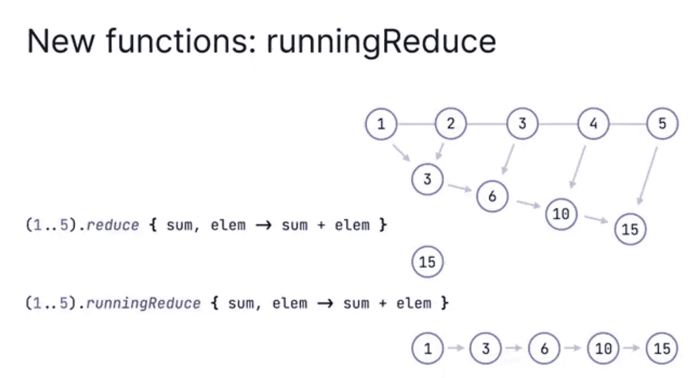

# 用 Kotlin 进行高级编程(第 6 部分)

> 原文：<https://betterprogramming.pub/advanced-programming-with-kotlin-part-6-3f33290d8aad>

## Kotlin 1.4 版本中的语言增强


[Kotlin 1.4](https://kotlinlang.org/docs/reference/whatsnew14.html) 最近发布了许多期待已久的功能和令人兴奋的跨领域增强。这是 Kotlin 作为一个平台发展的一个重要里程碑，它致力于使标准库保持一致并满足开发者的期望。在这篇文章中，我们将探索它们。

我想提到的一件令人兴奋的事情是 10 月 12 日举办的 Kotlin 在线活动。活动录像可从 JetBrains 的官方 [YouTube 频道](https://www.youtube.com/user/JetBrainsTV)或 Kotlin [网站](https://kotlinlang.org/)上获得。

您会发现关于新特性的最新更新的深入技术讨论，如 [kotlinx.dateTime](https://github.com/Kotlin/kotlinx-datetime) 库、协程调试的改进、 [kotlinx.serialization](https://github.com/Kotlin/kotlinx.serialization) ，以及多平台和服务器端开发。

事不宜迟，让我们开始了解 Kotlin 1.4 中引入的新特性。

# **SAM 转换**

单抽象方法(SAM)转换只不过是在需要 SAM 接口时传递 lambda 或可调用引用的能力。在 Kotlin 1.4 之前，我们只能在 Java 接口上应用 SAM 转换。

如果你试图在 Kotlin 接口上这样做，它会抛出一个异常:*请使用函数类型*。从 1.4 版本开始，我们也可以在 Kotlin 接口上使用它；我们需要在 interface 关键字前添加`fun`修饰符来使其工作。看一看:

很多人已经要求这个功能很长时间了。由于大量的修复请求，他们引入了功能接口。引入函数接口背后的原因是意图应该是显式的，这意味着如果你希望一个接口有 SAM 转换，通过添加一个`fun`关键字使它显式。

# 显式 API 模式

Kotlin 是一种非常方便的语言，具有许多便利的特性；我喜欢我们不需要明确提到函数的返回类型。

虽然它很方便，但也没有什么缺点。如果你没有明确提到返回类型，那么编译器会根据返回值自动决定类型。这种方法可能会导致代码中不可预见的错误。为了更好地理解，让我们看一下下面的代码:

在上面的代码中，基于返回值，编译器在没有任何通知的情况下将返回类型从`String`更改为`Any`，这可能导致了代码中其他地方的错误。

因此，从 Kotlin 1.4 开始，编译器会显示一个错误，指出具有不同返回值类型的函数的返回类型，这是推荐的方法。

# 尾随逗号

下一个特性是语言的改进。尾随逗号是提高语言可用性的一个特性。例如，如果在 Kotlin 1.4 之前的函数或构造函数中有一个参数列表，则不能在最后一个参数的末尾添加逗号。

当我们想要交换参数时，这使得情况变得困难；例如，当您将最后一个参数与前一个参数交换时，我们需要手动添加逗号和删除逗号。这个问题可以通过引入*尾随逗号来解决，*我们甚至可以为最后一个参数添加一个逗号。

# 在“when”块中中断并继续

科特林`when`街区是一个革命性的特征。这是我在 Kotlin 体验中使用最多的功能之一。其中一个缺点是，当我们试图在`when`块中使用`break`或`continue`关键字时，它会抛出一个错误:*when 语句中不允许使用 Break 和 continue。*

解决这个问题的方法之一是使用标签，请看:

科特林 1.3

Kotlin 1.4 允许`when`语句中的`break`和`continue`在没有任何标签的循环内。看一看:

科特林 1.4

# 混合命名参数和位置参数

Kotlin 讨论了 Java 的主要难点——其中我最喜欢的一个是命名参数。当一个函数中有三个以上的参数时，我们在传递值时经常会忘记参数的顺序。有了命名实参，我们可以指定形参的名称并传递值，不需要遵循任何顺序。看一看:

```
drawCustomView( **height =** 30, **width =** 30, **color =** Color.GREEN )
```

在大多数情况下，使用名称参数是有帮助的，比如上面代码中的高度和宽度，但是没有必要使用颜色参数名称。Kotlin 1.4 允许您组合命名参数和位置参数，这意味着我们不需要像`color`那样为参数编写参数名，只要它们按顺序放置即可。

```
drawCustomView( **height =** 30, **width =** 30, Color.GREEN )
```

# 命名约定的增强

## “最大”、“最小”功能

从 Kotlin 1.0 开始，尝试在空列表上使用`max`和`min`函数总是会产生`null`结果，这不是命名约定的预期结果。使用`orNull`后缀是合适的。

随着 Kotlin 的不断发展，这种命名惯例与他们的理念不符。所以在Kotlin 1.4 中有所改变:增加了`maxOrNull`和`minOrNull`两个新函数，旧的`max`和`min`函数被弃用。

## “零”函数

标准库包含两组函数，常规函数和带有`orNull`后缀的对应函数。例如，`toInt`是常规函数，而`toIntOrNull`是对应函数。

不同之处在于，常规的组函数返回一个非空值，或者在出错时抛出一个异常，比如当一个字符串不能被转换成整数时。相反，如果出现问题，`OrNull`后缀函数会返回`null`。

在 Kotlin 1.4 中，增加了一个新的`orNull`函数——即`randomOrNull`函数。它的作用是在出错时给你一个随机结果或`null`。当你想从列表中选择一个随机数时，这是很有帮助的。

# “onEach”和“onEachIndexed”

`onEach`和`onEachIndexed`在 Kotlin 1.4 中引入；`forEach`对每个元素执行给定的动作，而`onEach`对每个元素执行给定的动作，然后返回集合本身。

可以在调用链中间使用`onEach`和`onEachIndexed`。

# “减少”和“运行减少”

`runningReduce`是 Kotlin 1.4 中新增的功能。现有的`reduce`计算并分析每个元素，而新的`runningReduce`在整个操作完成之前不会分析任何元素。

一般的`reduce`函数返回最终结果，而`runningReduce`返回所有的中间步骤。这就是`reduce`和`runningReduce`的区别。名为`runningFold`的类似功能已添加到折叠功能中。请看下图，以便有更好的了解:



截图自 2020 年科特林线上活动

# 参考

要了解更多关于 Kotlin 1.4 的信息，请访问以下链接:

[](https://kotlinlang.org/docs/reference/whatsnew14.html) [## Kotlin 1.4 的新特性- Kotlin 编程语言

### 在 Kotlin 1.4.0 中，我们对其所有组件进行了大量改进，重点是质量和性能…

kotlinlang.org](https://kotlinlang.org/docs/reference/whatsnew14.html) 

# 奖金

要了解更多关于 Kotlin 的知识，请阅读“使用 Kotlin 进行高级编程”系列的前几部分:

*   [“使用 Kotlin 进行高级编程—第 1 部分”](https://medium.com/better-programming/advanced-android-programming-with-kotlin-5e40b1be22bb)
*   [“用 Kotlin 进行高级编程—第二部分](https://medium.com/android-dev-hacks/advanced-android-programming-with-kotlin-part-2-aae2a15258b0)”
*   [《用 Kotlin 进行高级编程—第三部分》](https://medium.com/better-programming/advanced-programming-in-kotlin-2e01fbc39134)
*   [“使用 Kotlin 进行高级编程—第 4 部分”](https://medium.com/better-programming/advanced-android-programing-in-kotlin-part-4-187b88fea048)
*   [“使用 Kotlin 进行高级编程—第 5 部分”](https://medium.com/better-programming/advanced-programming-in-kotlin-part-5-b674ce9e692f)