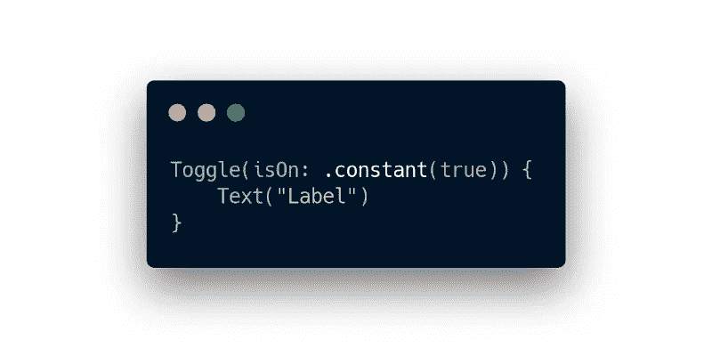
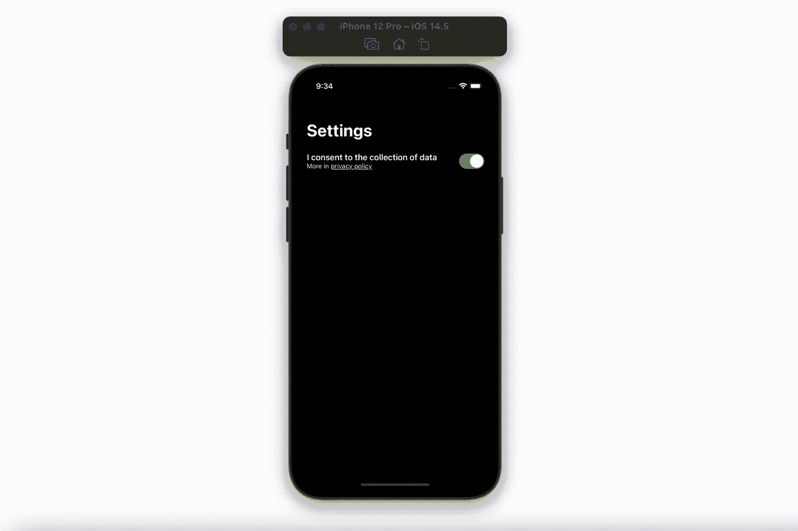

# SwiftUI 中的高级切换开关

> 原文：<https://betterprogramming.pub/advanced-toggle-switch-616b60b3512c>

## 了解如何创建和使用开关，以及如何在发生错误时处理可视状态的变化

作者图片

# 介绍

虽然 SwiftUI 的开发越来越多，但是很多日常工作中有用的细节仍然不明显，甚至不存在。

在这种情况下，通常有必要采取替代方案来解决我们的问题。

这种情况也会影响`Toggle`开关。它的基本实现是显而易见的，但是为了本文的目的，让我们以 GDPR 同意状态的变化为例，尽量使它形式化，就像它应该出现在生产代码中一样。

# 履行

让我们从具有标题、副标题和拨动开关的`CustomToggle`结构的实现开始，如下所示:

这是一个好的开始，现在让我们创建一个视图和一个视图模型，它将负责显示`Toggle`开关并处理与之相关的逻辑:

出于本文的目的，`CustomView`中的`viewModel`以及`CustomViewModel`中的`GdprAgreementsService`都没有被注入，这是生产实现中的一个显而易见的过程。如您所见，这里还使用了`AnyPublisher`扩展来消除不必要的返回值:

基本实现中的最后一件事当然是视图模型中已经初始化的`GdprAgreementsService`:

让我们在这一点上暂停一下。为什么发布者`saveAgreements (isGdprAccepted: Bool?)`值是可选的？

这个过程(出于本文的目的)允许您轻松模拟`saveGdprState (state :)`方法中的错误，并揭示`Toggle`开关状态错误，因为即使用户将`isOn`状态更改为`true`，协议状态也不会更新——因此用户的可见状态和实际情况之间存在差异。

当然，反过来也是一样，当用户希望选择不同意跟踪时。

# 解决办法

为了防止出现故障时视觉状态和实际状态之间的差异，必须能够从外部影响开关的切换状态。

可以将它分成两个标志:`isOn`，只负责它的状态，以及`isPermissionGranted`，负责处理同意。

为此，`CustomToggle`视图的实现应该更新如下:

现在，由于将`isPermissionGranted`标志转移到了`.onTapGesture`动作，我们可以在不修改同意的情况下设置`Toggle`开关状态。

我们还需要对`CustomView`的身体做一个小小的改动:

……在`CustomViewModel`中还有更多:

瞧啊。由于这些修改，在服务出错和未能设置许可的情况下，`Toggle` switch 将返回到其先前的正确状态。通过修改`changePermissionState()`方法中的`isGdprAccepted`标志，我们可以很容易地测试它当前的操作。可选地，在`case .failure`中，可以显示关于未成功变更同意的错误警告或修改截止时间值，以增加切换状态变更动画之间的间隔。

## 决赛成绩

# 摘要

以上解决方案并不完美，大家满怀希望的展望未来，等待进一步的更新。然而，目前，它肯定会促进接口和逻辑层的统一和同步，这转化为消除与应用程序维护相关的未来问题，并照顾其正常运行。

希望你喜欢学习 SwiftUI 的一些东西。请随时关注我的 [Twitter](https://twitter.com/chrislowiec) 上的最新文章。