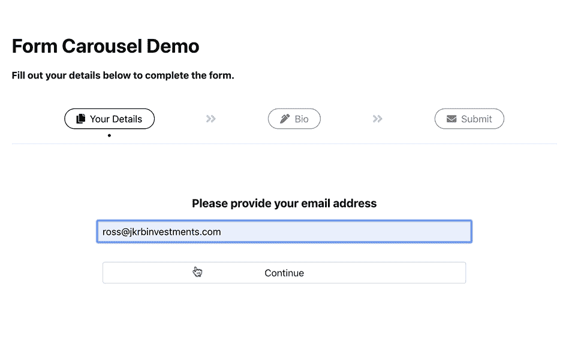
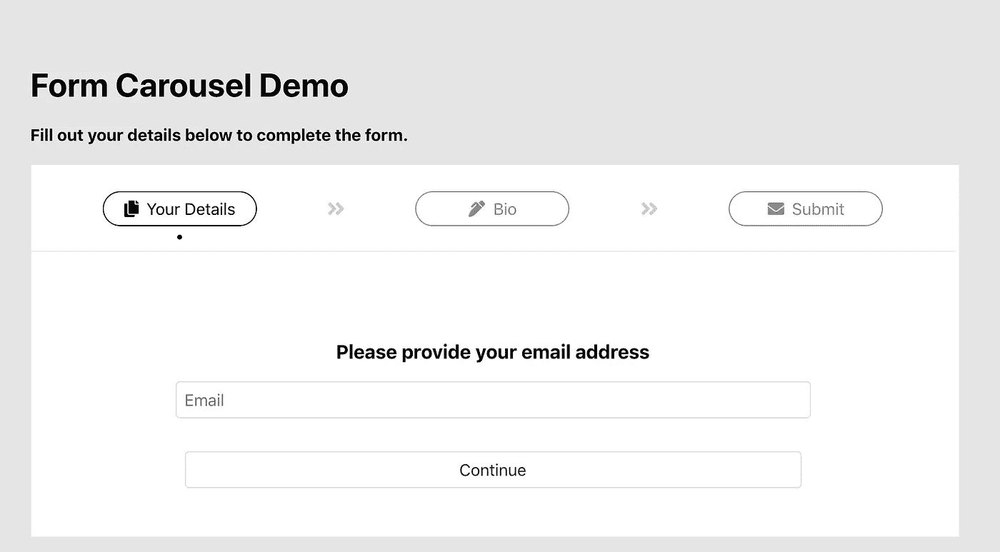
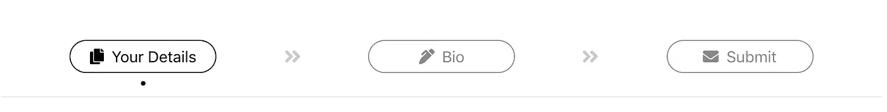
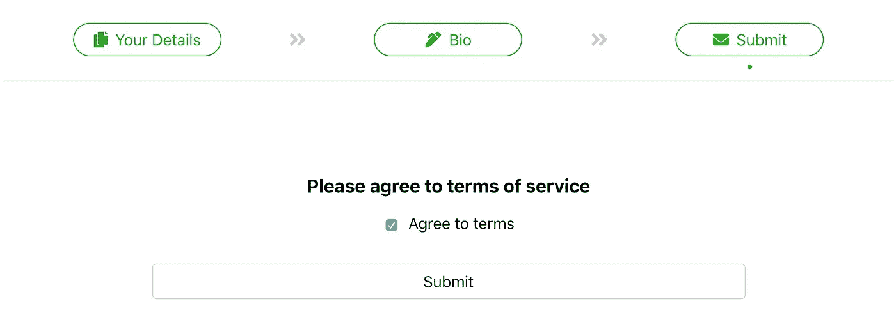

# 高级打字稿示例:反应表单转盘

> 原文：<https://betterprogramming.pub/advanced-typescript-by-example-react-form-carousel-ab2545d5a8e3>

## 具有 Formik 和样式组件集成的类型化 carousel 的演练


# 一个真实的 TypeScript & React 示例项目

TypeScript 在生态系统中对 React 和周围的包有很好的支持——这篇文章将演示如何将这些技术结合起来创建一个可靠的组件:一个定制的 carousel，其中包含表单并与表单集成。

我们将一步一步地完成这个项目——它也可以在 Github [这里](https://github.com/rossbulat/ts-react-formik-carousel)克隆。转盘被设计为与表单状态集成，并且当表单的该部分完成时，转盘的每个阶段都有变成绿色的链接。每个阶段都有一个嵌入其中的 [Formik](https://jaredpalmer.com/formik/) 表单。carousel 本身就是一个组件，`FormCarousel`，它可以将定制组件作为它的舞台。

这是一个正在运行的项目的截屏，展示了一旦表单被验证(通过 Formik 的`validation`函数)，转盘的各个阶段是如何被动画化并更新到完成状态的:



具有表单集成的类型脚本和反应转盘

这个解决方案需要访问一些聪明和时尚的方式来一起使用 TypeScript，React 和 JSX。它是最基本的，设想开发人员想要扩展这个初始设置或修改它以集成到现有的项目中。

该项目旨在便于跟踪和参考:

*   **字母排序:**所有 CSS 属性、组件属性和类型/接口属性都是按字母排序的
*   [**样式化组件**](https://www.styled-components.com/) 已经从组件逻辑中分离出来，以便于参考和阅读
*   **单一类型来源:**所有`FormCarousel`的具体类型都在`types.ts`文件中定义，该文件位于`FormCarousel`组件文件夹中。接下来，我们将简要介绍项目结构，强调解决方案如何划分为一系列组件，以便于定制
*   **开源:**该项目可以从 [GitHub](https://github.com/rossbulat/ts-react-formik-carousel) 中拉出，在本地运行(欢迎修改！).稍后我将简要介绍安装步骤和依赖项

在这次演讲中，我们将更多地关注类型脚本、道具和组件结构，而不是 CSS 和样式，尽管所有使用的样式都可以根据具体项目的需要进行研究或扩展。

# 项目安装和依赖项

最简单的开始方式是在本地运行项目，但是我们也将介绍一个基本项目的设置步骤。

## 安装项目

该演示基于 [Create React App](https://github.com/facebook/create-react-app) ，将以熟悉的方式打包。从 GitHub 克隆它并安装依赖项:

```
**# local setup**git clone [https://github.com/rossbulat/ts-react-formik-carousel.git](https://github.com/rossbulat/ts-react-formik-carousel.git)cd ts-react-formik-carousel
yarn && yarn start
```

该项目处于最小状态，不需要太多的依赖。如果您需要一个全新的设置，也许想要完全创建您自己的版本，使用包含 TypeScript 的`create-react-app`安装一个基础项目:

```
**# generate typescript CRA** npx create-react-app my-carousel-app --typescript
```

***注意:*** `*npx*` *允许我们从节点模块(或已安装的 NPM 包)执行二进制。它本身是一个全局包，可以用* `*yarn global add npx*` *安装。我们还假设 CRA 也安装了；用* `*yarn global add create-react-app*` *这样做。*

从这里，我们可以跳转到项目目录并安装依赖项:

```
cd my-carousel-app**# styled-components with its types**
yarn add [styled-components](https://www.npmjs.com/package/styled-components) @types/styled-components**# formik form management**
yarn add formik**# FontAwesome icons are used for stage buttons** yarn add [@fortawesome/react-fontawesome](https://www.npmjs.com/package/@fortawesome/react-fontawesome) \ 
@fortawesome/fontawesome-svg-core \
@fortawesome/free-solid-svg-icons
```

这些都是我们需要的依赖；这可以通过参考项目的`[package.json](https://github.com/rossbulat/ts-react-formik-carousel/blob/master/package.json)`文件来验证。这突出了为您的应用程序定制 carousel 解决方案的一大优势——较小的文件大小。

## 定制转盘与一体式转盘

有能力的轮播包的问题就在于此——它们是一体化的解决方案。这对于快速开发周转和原型开发很有用，但代价是更大的应用构建。添加您自己的定制也变得更加困难，因为您必须遵守所有软件包的设计原则，同时尽量避免破坏已经存在的东西。

**毫无疑问，定制解决方案是一个更好的长期解决方案，有利于你的应用程序的用户体验，并允许你保持加载时间短，只包括你需要的功能。事实上，我们这里的依赖项实际上都不是特定于轮播的，它们都可以在整个应用程序中使用:**

*   **样式化组件将用于样式化您的整个应用程序**
*   **Formik 将成为你的应用程序的表单管理器**
*   **只有所使用的字体超赞图标会被捆绑到您的最终版本中，并且可在您应用程序的其他区域导入**

**此外，没有什么可以阻止您将您的定制 carousel 解决方案打包到 NPM 包中，以便在您的整个项目中使用。我在这里写了一篇关于如何用你自己的 NPM 注册中心做到这一点的文章。**

**让我们检查一下项目结构，看看`FormCarousel`组件是如何形成的。**

# **项目结构**

**`FormCarousel`由多个组件组成，都放在一个`FormCarousel/`文件夹下。我们的旋转木马的基本概念是能够将任意数量的表单放入任意数量的旋转木马平台。**

*****注:*** *Stage 是我用来表示旋转木马的一个项目的术语。每个项目都是一个阶段，每个阶段都承载一个表单。***

**我们嵌入到 carousel 中的表单可以在您的项目中的任何地方定义，并在它的 props 中提供给`FormCarousel`。生成的文件夹结构如下:**

```
**# component structure**src/
  FormCarousel/
    Stage.tsx
    StageButton.tsx
    Wrapper.tex
    index.tsx
    ... Details.tsx
  Bio.tsx
  *^
  FormCarousel is not aware of Form components*
```

*   **`[Stage.tsx](https://github.com/rossbulat/ts-react-formik-carousel/blob/master/src/FormCarousel/Stage.tsx)`和`[Wrapper.tsx](https://github.com/rossbulat/ts-react-formik-carousel/blob/master/src/FormCarousel/Wrapper.tsx)`是样式组件——简单地定义了轮播的 CSS 结构**
*   **`StageButton.tsx`是一个可点击的按钮，点击后导航到该阶段**
*   **`index.tsx`是`FormCarousel`组件本身，它组装样式化的组件、舞台按钮和舞台。这就是组装一个`FormCarousel`所需要导入的全部内容(我们将在下一节访问导入和传递道具到`FormCarousel`)**

**即使表单组件与`FormCarousel`解耦，它们仍然需要遵循转盘阶段期望的类型，以确保对转盘的支持，例如将阶段更新为完成状态。如果我们现在进入一个阶段的界面(我们将在整篇文章中更深入地研究类型和类型脚本特定的语法)，我们可以确切地看到每个阶段在道具方面的期望:**

```
**# snippet from** [**FormCarousel/types.ts**](https://github.com/rossbulat/ts-react-formik-carousel/blob/master/src/FormCarousel/types.ts)export interface FormCarousel_Stage {
   **form: React.ComponentType<FormCarousel_Form>;**
   icon: React.ReactNode;
   label: string;
}
```

**请注意`form`属性，它是一个通用的 React 组件，需要它的 props 符合`FormCarousel_Form`类型。只要有一个`form`组件遵循这一点，TypeScript 就不会抛出任何编译器错误。我们将进一步讨论`FormCarousel_Form`道具。**

**有了对 carousel 如何构造的高级概念理解，现在让我们看看`FormCarousel`是如何导入的，以及表单和其他配置是如何作为道具传递到组件中的。然后，我们将一路向下，一路上参观一些有趣的语法。**

# **导入和使用<formcarousel></formcarousel>**

****

**使用`FormCarousel`就像导入它并给它一个道具:`stages`一样简单。这是在演示项目的`[App.tsx](https://github.com/rossbulat/ts-react-formik-carousel/blob/master/src/App.tsx)`中完成的，我们为每个阶段提供了一个表单、一个图标和一个标签:**

**`FormCarousel`只带一个道具，`stages`。如果我们参考组件签名，我们可以准确地找到该道具需要包含的内容:**

```
export class FormCarousel extends React.Component<**FormCarouselProps**, FormCarouselState>
```

**通过跳转到`FormCarousel/types.ts`，我们可以看到`FormCarousel`期望一个`FormCarousel_Stage`的数组:**

```
export interface FormCarouselProps {
  **stages: FormCarousel_Stage[];**
}export interface FormCarousel_Stage {
  form: React.ComponentType<FormCarousel_Form>;
  icon: React.ReactNode;
  label: string;
}
```

*****注意:****CMD+点击你编辑器内的类型名(我用的是 VS 代码)跳转到定义文件。***

**我们在上面简要介绍了`FormCarousel_Stage`，但现在我们可以介绍剩余的属性:**

*   **`icon`属性需要一个字体很棒的图标形式的 React 节点。这是因为`[react-fontawesome](https://www.npmjs.com/package/@fortawesome/react-fontawesome)`包为我们提供了包装在 React 组件中的 SVG**
*   **`label`属性只是一个字符串，它将与图标一起显示在舞台的相应`StageButton`中**

**`form`属性是最神秘的，我们现在不需要担心一般的`<FormCarousel_Form>`类型——我们只是在这个阶段提供一个 React 组件，并且在呈现组件时，将在 JSX 元素中为它提供道具。**

**有了给`FormCarousel`的`FormCarousel_Stage`数组，我们现在可以使用这些道具来构建转盘本身。**

# **在 FormCarousel 组件内部**

**逻辑的实质发生在`[FormCarousel/index.tsx](https://github.com/rossbulat/ts-react-formik-carousel/blob/master/src/FormCarousel/index.tsx)`内部。**

**`FormCarousel`有一些状态，在我们的`types.ts`文件中定义为`FormCarouselState`:**

```
export interface FormCarouselState {
  activeStage: number;
  stageOut: number;
  stageCompleted: Array<boolean>;
}
```

**每个阶段都有一个从`0`开始的索引。这是索引轮播的最简单的方法，有利于映射或循环每个阶段，每个阶段都有一个匹配索引的对应键。**

*   **`activeStage`存储当前显示的阶段——默认索引为`0`**
*   **`stageOut`跟踪过渡出来的阶段。这仅仅是为了制作动画。我们需要知道哪个阶段要制作动画(我们已经知道`activeStage`是要制作动画的阶段)。在初始渲染时，给定一个值`-1`,以确保没有一个会过渡出来**

**`stageCompleted`只是一个表示每个阶段是否完成的布尔数组，在初始声明时给出一个空数组:**

```
state: FormCarouselState = {
  activeStage: 0,
  stageOut: -1,
  stageCompleted: []
};
```

**这个数组的长度是任意的——它取决于我们通过前面提到的`stages`属性传递到组件中的级数。因此，我们在组件的`constructor`中填充这个状态值，根据我们通过 props 提供的级数动态定义数组的长度:**

```
constructor (props: FormCarouselProps) {
    super(props);

   const stages = props.stages.map((item: FormCarousel_Stage) => {
      return false;
    });
   this.state.stageCompleted = stages;
  }
```

**通过用`[Array.map()](https://developer.mozilla.org/en-US/docs/Web/JavaScript/Reference/Global_Objects/Array/map)`遍历每个阶段，我们可以构造一个新的数组，用值`false`索引每个阶段。上面的代码片段做到了这一点，并用结果数组更新了`this.state.stageCompleted`。**

*****注意:*** *如果你想在初始渲染时启动一个完整的表单，你可以在这里检查你的表单组件以确定表单是否完整——随意添加额外的道具来帮助更多的配置。***

## **轮播互动方法**

**`FormCarousel`定义了两个方法来更新它的状态，这两个方法被传递给`StageButton`和每个表单组件，以便与转盘本身进行交互:**

*   **`toggleActiveStage()`:更新转盘活动阶段的方法**
*   **`setStageCompleted()`:切换特定阶段是否已完成的方法。这将在 Formik 的`handleSubmit()`方法中被调用，我们将在下面看到。**

**这些方法没有什么突破性的，但是，`setStageCompleted()`遵循了一个重要的惯例，即在操作状态对象的值之前复制它，然后用`setState()`将它应用到组件状态。此函数在将复制的状态对象中的阶段的完成状态应用到状态本身之前，更新该状态:**

```
**# duplicating state -> amending -> setState pattern**const stageCompleted: Array<boolean> =       
   Object.values(this.state.stageCompleted);stageCompleted[index] = true;this.setState({ stageCompleted: stageCompleted });
```

**这些方法，以及组件的状态，现在可以用来配置要传递给`StageButton`和每个表单组件的道具。呈现这些组件发生在 JSX 内部定义的两个映射中。**

**这是我们的目标模式:**

```
...
render() {
 <Wrapper>
  <header>
      { loop through stage buttons and render }
        { include arrow icon in-between buttons }
  </header>
  <div> 
      { loop through forms, display active form and animate in}
        { also display previous form to animate out }
  </div>
 </Wrapper>
}
...
```

*****注意:*** *映射一个对象也可以在 JSX 之外完成，但这在其他项目和文档中常见。有时内联 JSX 制图对于开发者来说更容易阅读，并且将你所有的 JSX 标记保存在一个地方。***

**接下来让我们回顾一下这是如何完成的，触及一些组成我们的`render()`函数的有趣语法。**

# **渲染了一下<stagebutton></stagebutton>**

****

**3 个 StageButton 组件，中间有字体分隔箭头**

**让我们看看`StageButton`是如何生成的，遍历每个`props.stages`来实现:**

**这里有几件有趣的事情:**

*   **如果我们的映射索引大于 0，我们已经使用`React.Fragment`来包装每个`StageButton`和可能的`FontAwesomeIcon`(我们不需要第一个`StageButton`左边的箭头！)**

***为什么用* `[*React.Fragment*](https://reactjs.org/docs/fragments.html)` *？JSX 渲染方法必须有一个最顶层的组件，如果我们在* `*StageButton*` *旁边渲染一个图标，情况就不一样了。* `*React.Fragment*` *就是为这样的场景而推出的。我们还把强制可迭代的* `*key*` *道具与* `*React.Fragment*` *列入其中。***

*   **我们映射的`i`参数也充当我们的阶段索引，并被传递到`StageButton`中，因此它知道它代表哪个阶段**
*   **`toggleActiveStage()`作为一个道具被传入`StageButton`，给按钮更新传送带的权限**

**如果我们访问`FormCarousel_StageButton`界面，我们可以看到所有支持的`StageButton`道具:**

```
export interface FormCarousel_StageButton {
  active: boolean;
  complete: boolean;
  icon: React.ReactNode;
  index: number;
  label: string;
 ** toggle (index: number): void;**
}
```

**确实包含了`toggle`方法的签名，每个阶段`index`也是如此，还包含了其他配置，如阶段是否为`active`和`completed`。这些道具最终决定了按钮的样式，例如颜色和活动指示器(活动舞台按钮下面的项目符号)。**

## **<stagebutton>的样式组件</stagebutton>**

****

**StageButton 的三种状态:完成、活动和非活动**

**如果我们看一下`[StageButton.tsx](https://github.com/rossbulat/ts-react-formik-carousel/blob/master/src/FormCarousel/StageButton.tsx)`本身，我们可以看到它被一个`StyledButton`组件所包装，该组件通过`props.toggle()`处理一个点击事件来更新 carousel:**

```
**const StyledButton = styled.button<FormCarousel_StyledStageButton>`
   ...
`;**return (
   **<StyledButton**
     complete={props.complete}
     disabled={props.active ? true : false}
     **onClick={() => { props.toggle(props.index) }}**
   >
     {props.icon !== undefined && props.icon}
     {props.label}
     {props.active && <span>&bull;</span>}
   **</StyledButton>**
);
```

**有趣的是，样式化组件支持泛型类型，这给了我们严格定义样式化组件的机会。`FormCarousel_StyledStageButton`类型迎合了该样式组件所需的道具:**

```
**// type specifically for a styled component**export interface FormCarousel_StyledStageButton {
  complete: boolean;
  disabled: boolean;
  onClick (index: number): void;
}
```

**`completed`属性在`StyledButton`本身中被多次访问，以确定默认的灰色或完整的绿色是否应该被分配给属性— `border`是这些属性之一:**

```
**// accessing props to determine property values**const completedColor = '#28a81b';
const inactiveColor = '#888';
const activeColor = '#000';const StyledButton = styled.button<FormCarousel_StyledStageButton>`
   border: 1px solid **${props =>** props.complete === true ? `${completedColor} !important` : inactiveColor**};
**   ...
`;
```

**`StageButton`的完整实现可以在这里找到[。](https://github.com/rossbulat/ts-react-formik-carousel/blob/master/src/FormCarousel/StageButton.tsx)**

# **呈现阶段(表单组件)**

**像`StageButton`一样，我们也迭代`FormCarousel`的`props.stages`并呈现适当的表单，以及表单进入和退出所需的动画。**

**该循环类似于以下内联 JSX:**

```
**// rendering forms in-line JSX**<div>
{this.props.stages.map((stage: FormCarousel_Stage, i: number) => {
     **const Form: React.ComponentType<FormCarousel_Form> = 
       stage.form;
    ** return (
       <Form ... />
    );
  })}
</div>
```

**注意我们是如何抓取`stage.form`并将新对象键入为`React.ComponentType<FormCarousel_Form>`。这是告诉 Typescript 编译器`stage.form`到底是什么所必需的。然后我们将`Form`渲染成一个 JSX 元素以及所有需要的道具。**

**`FormCarousel_Form`接口定义了每个表单组件需要的道具，4 个粗体属性对我们的表单很重要:**

```
export interface FormCarousel_Form {
  className: string;
  **index: number;**
  key: number;
 **setCompleted (index: number, completed: boolean): void;
  toggleStage (index: number): void;
  transition: StageTransition;** }
```

**除了这两个 carousel 方法，我们还定义了表单的 stage `index`和 iterable 的 required`key`prop——两者是相同的。**

**`transition`是这里有趣的属性——它有一个特定的类型，限制了它可以接受的值。让我们进一步探讨这个问题。**

## **舞台过渡关键帧动画**

**`StageTransition`类型定义了所有可能的`transition`值，这些值决定了舞台上实际发生的关键帧动画:**

```
export type StageTransition = 
   'stage_in_left' | 'stage_out_left' | 
   'stage_in_right' | 'stage_out_right' | 
   'none';
```

**`StageTransition`是一个[字符串文字类型](https://www.typescriptlang.org/docs/handbook/advanced-types.html#string-literal-types)，它定义了过渡接受的关键帧动画名称。舞台可以从左边或右边进入或退出。我们确实可以通过参考活动阶段索引和前一阶段索引来计算正确的转换。**

**这正是在`transition` prop 中所做的，通过简单地嵌入多个`expression ? true : false`语句来确定最终的阶段转换:**

**这也可以作为一组 if-else 语句来完成，但是这种方法允许我们将语法保持在最少——并且保持为内联 JSX。**

**随着动画变得越来越复杂，您可能希望创建自己的动画控制器类，而不是将此逻辑作为道具嵌入！在任何情况下，上面的程序块都声明:**

*   **如果`activeStage`指数小于`stageOut`指数，则从左侧转变`activeStage`，否则从右侧转变`activeStage`**
*   **如果`activeStage`指数小于`stageOut`指数，则向右移动`stageOut`，否则向左移动`stageOut`**
*   **仅将过渡应用于`activeStage`和`stageOut`索引。所有其他阶段都有一个`none`过渡**

**我们没有提到的另一个属性`className`，将为不是`activeStage`或`stageOut`的所有阶段保存一个值`hidden`:**

```
<Form
   className={
     this.state.activeStage !== i && this.state.stageOut !== i 
       ? `hidden` 
       : ``
   }
   ...
/>
```

**有了这个逻辑，我们就可以确保只显示转入和转出的两个阶段，而隐藏其余的阶段。**

**现在，关键帧动画本身是在`[Stage.tsx](https://github.com/rossbulat/ts-react-formik-carousel/blob/master/src/FormCarousel/Stage.tsx)`中定义的，这是一个样式化的组件，它定义了所有与表单相关的 CSS 并包装了表单组件。**

**`transition`道具首先传入样式化组件:**

```
**// from within any Form component (Details, Bio, Submit)**<Stage transition={props.transition}>
   ...
</Stage>
```

**现在组件知道了正确的转换，它可以被嵌入到`animation`属性中。还要注意我们的`StateTransition`字符串文字值如何匹配关键帧动画名称:**

**这就结束了旋转木马的动画解决方案。概括地说，只需要显示活动阶段和退出阶段，并分别附加一个输入和输出动画。**

**现在剩下要访问的就是表单本身，通过 Formik 经由`withFormik()` HOC 进行管理。**

# **圆盘传送带表单**

**本节利用 Formik 的 HOC，`withFormik()`，将 Formik 的功能包装在一个表单中。我已经发表了一篇关于 Formik 和这个 HOC 的文章，在深入本节之前可能是一篇有用的阅读，可以在这里找到。**

**我们在这里要关注的是如何利用 TypeScript 来使 Formik 类型安全，这涉及到我们的自定义 carousel 道具和“FormikBag”——Formik 自己的一系列用于管理包装表单的道具。**

**正如我们在`[App.tsx](https://github.com/rossbulat/ts-react-formik-carousel/blob/master/src/App.tsx)`中看到的，我们有三个表单组件作为道具被导入到 carousel 中；`[Details](https://github.com/rossbulat/ts-react-formik-carousel/blob/master/src/Details/index.tsx)`、`[Bio](https://github.com/rossbulat/ts-react-formik-carousel/blob/master/src/Bio/index.tsx)`、`[Submit](https://github.com/rossbulat/ts-react-formik-carousel/blob/master/src/Submit/index.tsx)`。这些组件故意保持简单，以免使读者困惑或超出讨论范围，坚持每个表单一个输入。**

****表单是旋转木马的一个很好的用例，应该在现代应用程序开发中更多地使用。****

**让我们通过`Detail`来了解输入 Formik 表单的重要概念。**

## **解构细节形式**

**本项目中的每个 Formik 模板都以相同的方式构建:**

*   **定义表单标记的表示组件，利用 Formik 提供的组件有`Form`、`Field`、`ErrorMessage`等。**
*   **特设包装了表示组件，定义了 Formik 特定的功能，如验证、提交和初始表单值**

**让我们检查一下表示性组件签名，以了解注入其中的道具的范围:**

```
const DetailsForm: React.FC<**FormCarousel_Form & FormikProps<Form_Details>**> = (props) => {
   ...
}
```

**我们定义了一个交集类型，将`FormCarousel_Form`和`FormikProps<Form_Details>>`组合在一起，组成我们的组件`props`。**

**`FormDetails`简单定义我们期望的表单值。在我们的例子中，`Details`表单只包含一个`email`字段:**

```
export interface Form_Details {
   email: string
}
```

**`FormikProps<T>`，一个促进 props `withFormik()`注入范围的类型，也为我们的表单值类型的传入提供了一个通用类型。因此我们到达`FormikProps<Form_Details>`。`FormCarousel_Form`则方便了我们在`FormCarousel/index.tsx`中通过的所有道具。**

**一旦定义了`DetailsForm`，我们就开始用`withFormik()`包装它。**

## **withFormik 特设集成**

****

**formikHOC 管理验证，正如这里看到的一个空的 Bio 错误消息**

**参考 [TypeScript Formik 文档](https://jaredpalmer.com/formik/docs/guides/typescript#withformik)，我们需要为 HOC 提供两种通用类型——表单属性和表单值。看起来是这样的:**

```
const Details = **withFormik<FormCarousel_Form & FormProps, Form_Details>**({
   ... })(DetailsForm);
```

**我们再次提供了从`FormCarousel`传来的与 Formik 道具结合的道具，以及与`Form_Details`结合的表单值。处理好类型后，我们就可以像在 Formik 中一样处理我们的业务，定义验证、初始值等。**

**有趣的是，在`handleSubmit()`中，我们从我们的自定义道具中抓取了`setCompleted()`和`setActiveStage()`，它们现在位于`props.formikBag`中。表单成功提交后，将执行这些方法，从而更新转盘状态:**

```
...
handleSubmit: (values, formikBag) => {
   formikBag.props.setCompleted(formikBag.props.index, true);
   formikBag.props.toggleStage(formikBag.props.index + 1);
}
...
```

**这就是我们的 Formik 管理的表单与 carousel 组件交互的方式。在状态改变时，传送带重新呈现，这又导致阶段转换。**

****

**处于完成状态的转盘，由每个阶段按钮突出显示**

# **总结**

**本演练试图展示一个使用 TypeScript、React 和 Formik(以及样式化组件！)来创建一个有用的可重用组件，以便于表单显示。**

**该解决方案已经完全定型，并准备好进行扩展以适应各个项目。**

## **了解本项目中使用的概念的更多信息**

**在我关于这个主题的文章中了解更多关于 TypeScript 和泛型的使用:**

**[](https://medium.com/@rossbulat/typescript-generics-explained-15c6493b510f) [## 解释了类型脚本泛型

### 了解什么是泛型以及如何在 Typescript 中使用泛型

medium.com](https://medium.com/@rossbulat/typescript-generics-explained-15c6493b510f) 

要复习样式组件，请查看如何将它与应用程序的明暗模式结合使用:

[](https://medium.com/@rossbulat/react-dark-mode-with-styled-theming-and-context-57557de6400) [## 用风格化的主题和上下文来反应黑暗模式

### 如何用 React 挂钩、上下文和样式组件切换主题

medium.com](https://medium.com/@rossbulat/react-dark-mode-with-styled-theming-and-context-57557de6400) 

对于 Formik 的具体研究，请查看我的文章，重点关注 Formik 提供的`withFormik()` HOC 和其他组件:

[](https://medium.com/@rossbulat/react-forms-with-formik-hocs-and-functional-components-df394afd2039) [## 与 Formik HOCs 和功能组件反应的形式

### 使用 Formik HOCs 开发表单并将 Formik 注入定制组件

medium.com](https://medium.com/@rossbulat/react-forms-with-formik-hocs-and-functional-components-df394afd2039)**