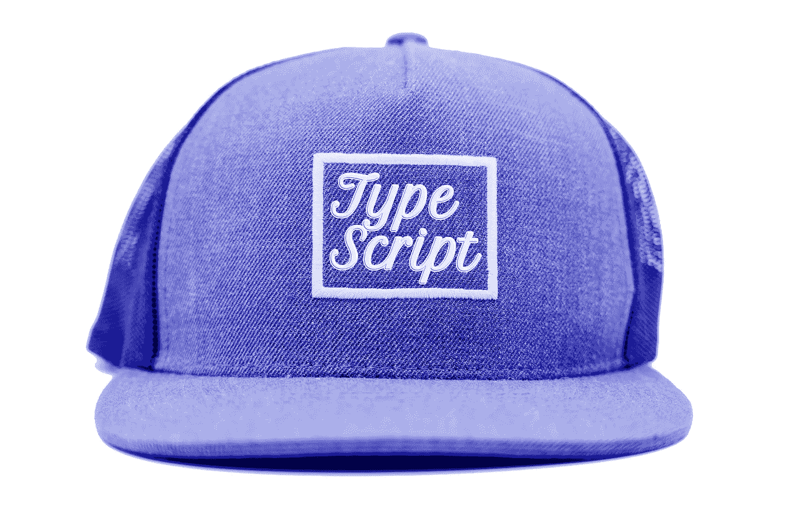
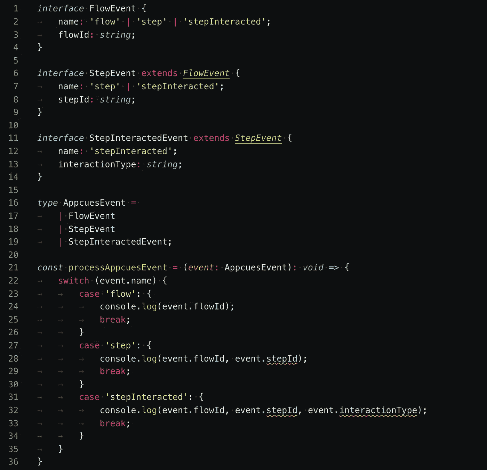

# 高级 TypeScript:如何对有区别的联合使用接口继承

> 原文：<https://betterprogramming.pub/advanced-typescript-how-to-use-interface-inheritance-with-discriminated-unions-dddf77cb3836>

## 当您的事件相互延伸时，您需要做什么



修改图像。原 via [Unsplash](https://unsplash.com/photos/PH8GUKG-Do0) 。

最近，我需要为将在 TypeScript 项目中使用的 JavaScript 事件侦听器创建类型。有多个相互扩展的事件——子事件包含父事件的属性，事件属性需要在侦听器中访问。

显而易见的解决方案是对联合类型使用接口继承。我使用可靠的资源 TypeScript Handbook、Stack Overflow 和 Medium——寻找实现这一点的方法，但是，我找不到如何使它工作的描述。我需要继续使用这种方法，因为另一个明显的解决方案很糟糕:复制事件属性🤢。

所以，我用这个问题做了一个玩具例子，和我在[贸易班](https://tradeshift.com/jobs/)的队友讨论了这个问题，我们一起想出了一个解决方案😎。

这是我希望找到的文章。

# 受歧视的工会

TypeScript 提供了一个强大的功能，允许将多个接口组合成一个联合类型。这意味着可以用一个参数调用一个函数，该参数的接口是 union 类型中的任何一个接口。像`type`这样的公共属性应该包含在每个接口中，TypeScript 使用它来确定在访问属性时验证哪个接口。

## **区别并集的一个例子:**

```
Output:Stewie's bark volume is 77 db. 
Reginald's coat type is tabby.
```

# 接口继承

TypeScript 的另一个有用的特性是接口继承。接口可以扩展其他接口，这导致父接口的属性被添加到子接口。这对于维护软件开发的 [DRY 原则来说非常棒。](https://en.wikipedia.org/wiki/Don%27t_repeat_yourself)

## **接口继承的一个例子:**

目前为止一切顺利！

# 问题:继承接口的联合

当联合类型中的接口互相扩展时会发生什么？这是我在建模[客户端 AppCues 事件](https://docs.appcues.com/article/301-client-side-events-reference)时需要使用的模式。

**第一次尝试(失败🥺):**



因为`name`存在于所有接口中，所以父接口需要包含所有子`name`值(子属性是父属性的专门化)。这意味着将子事件名称添加到父事件中，这并不理想。更糟糕的是，由于父母包含了孩子的`name`价值观(见红色曲线),歧视失败了😬).

# 解决方案:引入基本接口

我们得出的解决方案是为每个事件添加一个基本接口，基本接口互相扩展。**基本接口包含的属性也需要出现在子事件**中。

每个事件还有一个从其基本接口扩展而来的辅助接口。**因为辅助接口不互相扩展，所以它们包含不被继承的值**——在本例中，是`name`属性。辅助接口被组合成联合类型。

**继承接口的区别并集:**

```
Output:best flow 
best flow, best step 
best flow, best step, best interaction
```

有用！🙌

遵循最佳实践，我还使用了一个`enum`作为事件名称，并在接口属性中添加了`readonly`修饰符。

# 结论

TypeScript 是一种用于向 JavaScript APIs 添加开发时检查的表达性语言。使用具有区别联合的接口继承模式可以防止无效的属性访问，并简化开发体验。编码快乐！