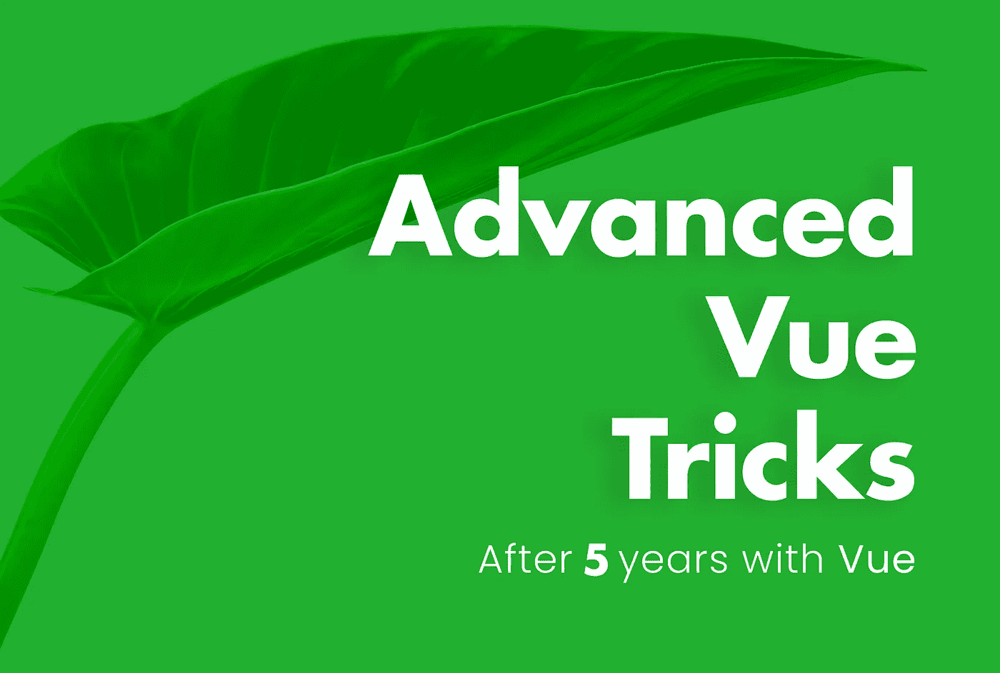
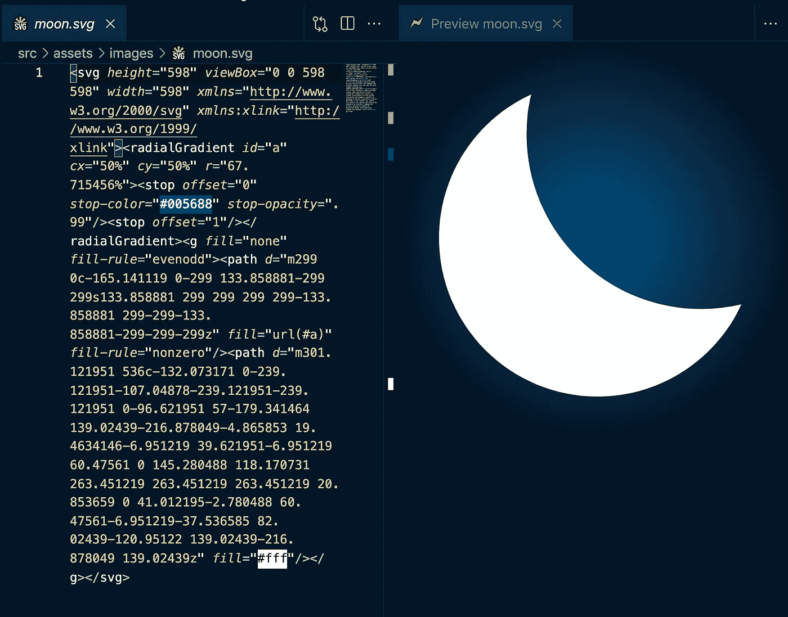
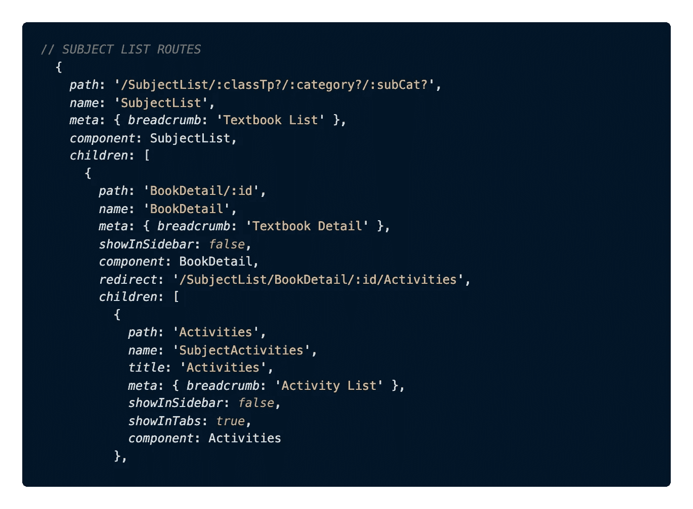
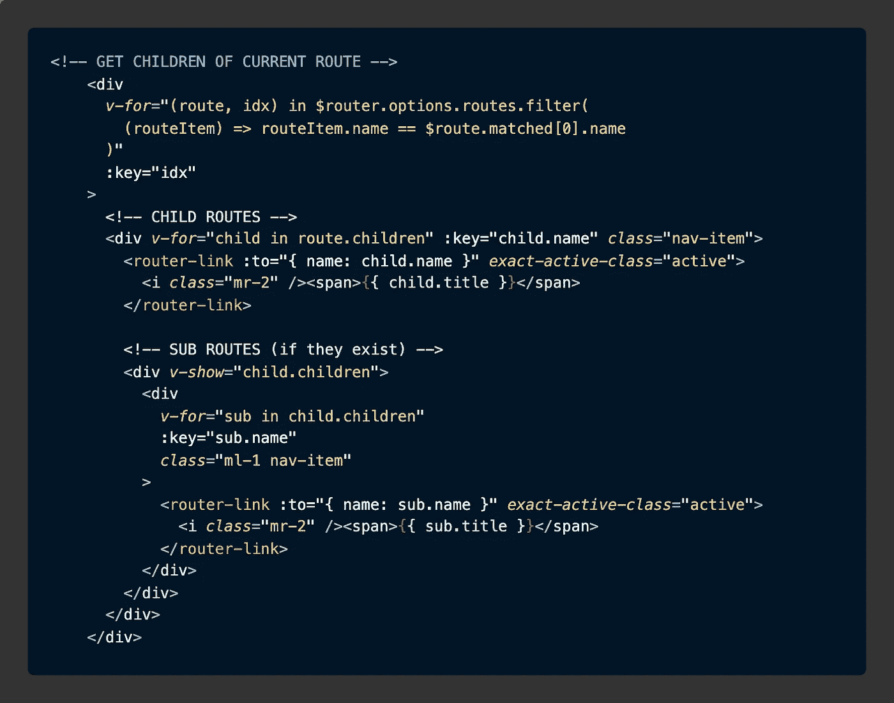
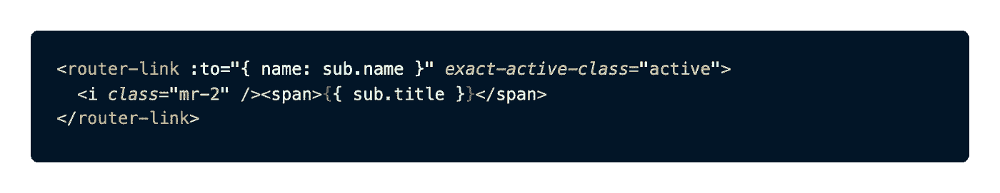
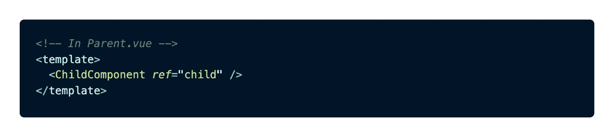
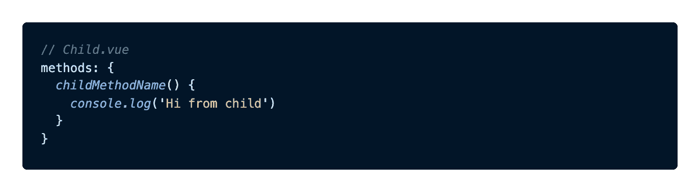

# 11 个高级 Vue 编码技巧

> 原文：<https://betterprogramming.pub/advanced-vue-tricks-6e315347c378>

## 我在 Vue 工作 5 年后的策划列表



图片由 [**提图斯**](http://titusdecali.com/) 拍摄

今天，我为大家带来了一个精选的知识集合，帮助大家更快地构建 Vue 应用，同时使它们更具性能，更易于大规模管理。

## **这些高级小技巧从何而来？**

*   五年的 Vue。
*   在 Vue 2 和 Vue 3 中构建了 20 多个大型客户项目。
*   来自有影响力的 Vue 开发者的精选简讯提示。

虽然高级 Vue 开发人员会发现这些概念非常有用，但我已经详细描述了如何实现它们，因此没有一个初学者会被落下！

如果你需要任何进一步的解释，请留下评论，我很乐意帮忙。有自己的高级战术？也可以随意分享这些！

好了，让我们开始吧。

# 动态 SVG 组件

如果你像我一样，喜欢手工制作你的应用程序——选择独特的 SVG 图标来适应你的风格指南，并将它们与自定义动画和风格配对。

这样做的问题是，要改变 SVG 图像的颜色，您需要访问模板中内嵌的 SVG 代码。根据 SVG 的大小，即使只有一两个矢量图像，也会使模板代码迅速膨胀。

我已经测试了各种方法和包来访问`fill`属性，而不会破坏我的模板，结果是添加`hover`或`active` CSS 状态的最好方法是在 SVG 中更改一个或多个`fill`属性，这实际上是最明显的方法——只是让它成为一个组件！

所以，当我们需要这种功能时，而不是使用这个:

```

```

相反，我们将在 VSCode 中打开我们的`.svg`图像，然后复制我们图像的`<svg~`代码:



复制 Svg 代码(使用 [**Svg 预览**](https://marketplace.visualstudio.com/items?itemName=SimonSiefke.svg-preview) 预览您的 SVG 图像)

***边注:*** *为了确保你看到的是正确的图像的代码，我建议安装一个名为**[***Svg 预览***](https://marketplace.visualstudio.com/items?itemName=SimonSiefke.svg-preview)**的 VSCode 扩展(如上图)。这将打开图像的侧面板预览，如果您更改 SVG 代码，它也会更新。***

**现在，我们将这个代码粘贴到一个新的`component`模板中。我建议把你所有的 SVG 图标组件放到一个新的文件夹中，并相应地命名它们`(components/SVG/**IconMoon.vue**)`以保持事物的有序。**

**一旦我们把它作为一个组件，我们就可以通过使用`<IconMoon />`把它放到我们应用程序的任何其他组件或页面中:**

****

**在浏览器中测试动态 SVG 组件**

**在上面的例子中，当我将鼠标悬停在 SVG 上时，我只是在我想改变的部分上设置了一个类(这里称为`.inner`)，但是我也可以直接访问所有 SVG 的属性，所以在保持其他组件没有 SVG 代码膨胀的情况下，你可以用这个方法做很多事情。**

**如果您想要一些如上所述的扩展功能，您只需要创建一个定制的 SVG 组件。否则，你可以像平常一样简单地使用它们，就在图像的`src`之内。**

**除了动态图标样式和动画，您还可以通过道具来改变 SVG 的大小和其他方面(就像任何其他组件一样)。[**Vue docs**](https://vuejs.org/v2/cookbook/editable-svg-icons.html)**提供了一个很好的例子，如果你还不熟悉，可以用图标来完成。****

# ****使用`Vue-Router`数据实现更智能的导航链接****

****您可能没有意识到，但是`Vue-Router`可以像任何其他数据存储一样使用。您可以访问应用程序的所有可用路径，添加元数据以使逻辑更智能，甚至自动填充导航条、页面面包屑等内容！****

****然而，乍看起来这并不明显，也不能像我们通常访问路线那样直接访问。****

****以下是我们将添加到模板中的基本代码:****

****从 vue-router 访问所有数据和元数据****

****有了这个`v-for`，您可以直接在模板中访问路由器树的所有`children`路由和单个路由元数据。****

****我最近在一个项目中使用它来生成一个动态边栏导航组件。我在`router`中设置了一个`showInSidebar`元数据属性，我想隐藏在工具条中。我也能够自动生成所有的边栏链接，而不用对每一个进行编码。****

****我是这样设置我的`router`路线的:****

********

****为面包屑设置子路由和元数据(可以是任何值)****

****客户端还有一个额外的需求，他们不仅需要从路由器生成侧边栏路由，还需要从 API 数据生成侧边栏路由。上面的方法也以一种干净和可管理的方式解决了这个任务。我能够控制如何从路由器直接显示本地路由，以及是否使用 API 提供的路由。我还用它制作了自动面包屑来显示用户的路线历史。****

****在这下面(这里没有显示),我还有一个单独的部分，允许侧边栏切换到使用从 API 发送的一组路由。为了触发它，我简单地使用了一个`v-if`，如果它们存在，它就使用它们，否则它将返回使用来自`vue-router`的路由。****

****在我的`SideNavbar`组件模板中:****

********

****用法示例****

****您可能已经注意到了`exact-active-class`代码:****

********

****自动突出显示链接的精确活动类****

****这样，如果路由器链接的目的地与当前路由匹配，Vue 会自动设置一个活动类。****

****这是一个很好的技巧，它绕过了我们用来实现这一点的典型逻辑，并将其简化为`exact-active-class=”className”.`****

****我经常把它用于导航条链接——它既减小了模板的大小，又使东西更整洁。****

# ****从子组件访问父数据( )****

****有时我们想从父节点访问数据，但不想经历传递属性的麻烦。如果您只需要从`$parent`的数据对象中获取一个快速值，您可以简单地通过引用`$parent`来完成:****

****访问子代中的父代数据****

****如果你想要更多在组件间传递数据的好方法，
Erik Hanchett 有一个[很棒的视频](https://www.youtube.com/watch?v=rKWSj3zfBAs&t=46s&ab_channel=ProgramWithErik)和一些其他选项。****

# ****用`.includes( )`简化你的`:class`和`v-if`逻辑****

****有了 v 指令的强大功能，我们很容易忘记我们仍然可以在模板中使用纯 JavaScript 的高级功能。****

****例如，假设您想要设置一个`class`，但是仅当用户在三条特定路线中的任何一条上时。当您第一次编写这个逻辑时，它可能看起来像这样:****

```
****:class="
  $route.name === 'Home'
  || $route.name === 'Gallery' 
  || $route.name === 'Profile' 
  ? 'classOnlyOnThesePages' 
  : ''
"****
```

****然后，你可以学着像这样把它缩短一点:****

```
****:class="{ 
  'classOnlyOnThesePages' : 
  $route.name === 'Home'
  || $route.name === 'Gallery' 
  || $route.name === 'Profile'
}"****
```

****但最好的写法肯定是这样的:****

```
****:class="{ 
  'classOnlyOnThesePages' : 
  ['Home', 'Gallery', 'Profile'].includes($route.name)
}"****
```

****如果你不喜欢这些东西毁了你的模板，有这样一种方法:****

```
****// <template>
<div :class="classByRoute">
  Changes based on route
</div>
...// <script>
computed: { 
  classByRoute() {
    return 'classOnlyOnThesePages' : 
      ['Home', 'Gallery', 'Profile'].includes($route.name)
  }  
}
...// <style>
.classOnlyOnThesePages {
  background: red;
}
...****
```

****这不仅可读性更好，而且以后扩展起来也容易得多。****

# ****当路线改变时滚动到顶部****

****当您更改路线时，Vue 会保持您在页面上的当前位置。这有时很有用，但大多数时候只是一个麻烦。如果你向下滚动一个很长的列表，然后转到另一个页面，你的滚动条将会在新页面的底部，而不是你期望的顶部。****

****解决这个问题很简单。只需在您的`app.js`文件中添加一个`watch:`，它会在每次路线更改后触发滚动到顶部:****

****每次更改路线时滚动到顶部****

# ****对干燥机代码使用全局实用方法****

****几乎每个 Vue 项目都有在应用程序的多个地方重用的逻辑。为了让我们的代码保持干燥(不要重复)和易于管理，我们应该创建一个单独的`utils.js`文件来保存这个重用的逻辑，并且可以从任何地方访问。****

*******注意:*** *您可能认为 Vuex 很适合这类事情，但是除非您想将您的实用程序方法产生的值存储在 state 中，否则它真的不适合这个场景。如果你只是想从一个全局函数返回一个值，那么一个单独的****utils . js****文件就是与 Vue.prototype 配对的键(如下所示)。但是，如果您仍然想在您的实用程序中访问您的 Vuex 状态，您可以这样做:* `import store from '../store'` *，然后做类似* `store.getters` *或* `store.state` *的事情来访问您的 Vuex 状态的属性。*****

****好的——首先我们要设置我们的`utils.js`文件，并添加一个全局方法，将文本复制到用户的剪贴板:****

****全局 Vue 实用程序功能****

****现在我们已经有了我们的实用方法，我们只需要让它在整个应用程序中可访问。我们可以将它们导入到一个组件中，并以这种方式使用它们，但是我发现让它们在全球范围内可用会产生更干净、更可读的代码，同时使东西更容易访问。****

****为了使这些函数全局可用，我们将编辑我们的`main.js`文件。Vue 2 和 Vue 3 之间的设置略有不同，因此相应地选择您的口味。****

## ****在 Vue2 中****

```
******// *Utils*** *import* Utils *from* './utils/utils.js' **// *Init Global Utils***Vue*.*prototype*.*$utils = Utils****
```

## ****在 Vue3 中****

```
******// *Utils*** *import* Utils *from* './utils/utils.js'   *//* *<-- import file* const *app* = *createApp*(App) **// *Init Global Utils***app.config.globalProperties.$utils = Utils   *// <-- set globally**app.mount*('#app')****
```

****现在，我们可以在任何地方访问我们的实用程序方法，只需使用以下代码:****

```
*******// In template***
$utils.copyToClipboard(text)***// In methods***
this.$utils.copyToClipboard(text)****
```

# ****检测用户是在台式机上还是在移动设备上****

****检测用户在哪个平台上的方法经常变化。在评估了你可以做到这一点的许多方法之后，我决定用一个做得很好并且会*(希望是*)的包🤞 *)* 这些因素变化时保持更新。****

*   ****用`npm i vue-mobile-detection --save`安装[**vue-mobile-detection**](https://www.npmjs.com/package/vue-mobile-detection)****
*   ******在您的`App.vue`文件中，添加一个`mounted()`挂钩，将用户平台存储在您的 Vuex 商店中。******

******安装 App.vue 时保存用户的平台******

******如果你正在使用 Vuex，你现在可以为上面的`$store.commit`创建一个变体，将值设置为`state`，然后使用一个 getter 在你的应用程序中的任何地方访问`platform`值。我最近在区块链的一个项目中使用了这种方法，在这个项目中，了解用户的平台以触发正确的区块链钱包(浏览器扩展钱包，或移动应用钱包)是至关重要的，它非常有效。******

*********注意:*** *如果你没有使用 Vuex，你可以用* `*localStorage.setItem*` *把这个值保存在用户的 localStorage 中，然后用* `*localStorage.getItem*`在你的应用中的任何地方使用它******

```
********// in App.vue inside of your *mounted()* hook:**
const currentPlatform = this.$isMobile() ? ‘mobile’ : ‘desktop’*localStorage.setItem*('platform', currentPlatform) **// Use it anywhere**
*localStorage.getItem*(‘platform’)******
```

# ******当用户按 ENTER 时聚焦于下一个表单输入******

******表单是一个巨大的皮塔饼。现有的一些软件包(我最喜欢的是`[vue-formulate](https://vueformulate.com/)`)大大减少了这种情况，但是不管你使用的是什么软件包，或者你是否从头开始编写表单，这都是你的用户会喜欢的概念。******

******如果用户在关注此输入时按 enter，它会将光标焦点设置到以下输入框:******

```
******<input 
 type="text"
 **@keyup.enter="$event.target.nextElementSibling.focus()"**
/>******
```

> ******这是我从迈克尔·泰森的 Vue tips 时事通讯中学到的一些技巧——我强烈推荐你订阅！******

# ******动态刷新(重新加载)特定组件******

******在很多极端情况下，组件需要在不影响其所在页面的情况下重新加载。有时您需要强制它用新属性刷新，或者因为当新属性传递给它时，您正在使用的包没有按预期更新。******

******以编程方式重新加载单个组件******

******当然，如果您想重新加载整个页面，也很容易:******

```
*********// Using traditional JS*** *(If you don't have access to $router)
window.location.reload*() **// Using vue-router**
this.$router.go(0)******
```

# ******从父组件调用子组件的方法******

******通常，父组件通过`props`事件将数据发送给子组件，子组件通过`$emit`事件将数据发送给父组件。但是有时我们可能希望从只存在于子组件中的父组件中触发方法。听起来很复杂？这不是和 Vue `refs`提供了完美的解决方案吗！******

******这里有一个更清楚的例子，以防上面说的太简短:******

************

******用 **ref** 设置子组件******

************

******使用 **this 访问子方法。$refs********

************

******仅存在于子组件上的方法******

# ******验证组件属性******

******验证你的道具有两个作用。它会告诉你，如果你传递了一个不正确的道具给一个组件，它会让你很容易看到这个组件被设计成接受什么选项。您可以附加任何您想要的逻辑来创建自定义属性验证器，但是下面的情况可能是您使用最多的(验证字符串选项):******

******在下面的例子中，我创建了一个自定义的`Button`组件，我在我的应用程序中使用它。注意，我有`variant`和`type`道具。******

********注意:** *对于自定义按钮组件，请务必不要使用* `*type*` *作为道具，因为* `*variant*` *已经是 HTML 按钮上的一个东西，应该是一个单独的道具来处理表单*`*submit*`**和* `*reset*` *之类的东西。********

******对于这些道具中的每一个，我声明我只想接受几个不同的选项。如果我传递了错误的东西，这将帮助我调试我的代码。它还将帮助其他人查看我的代码，以了解该组件可以接受哪些选项。******

******我希望你喜欢这些提示，并发现它们很有用。如果你有自己的高级技巧，请在评论中分享，或者询问关于使用上述概念的任何其他问题。我很乐意帮助你。******

******哦，如果你想把你的 Vue 应用本地化成多种语言，我有一个简化的工作流程，可以在一个小时内完成——不，我说真的！******

******请点击这里查看:******

******[](/vue-i18n-ultimate-guide-fb3d9db48c94) [## 仅用 1 小时翻译任何 Vue.js 应用程序

### 本地化任何规模应用程序的终极自动化工作流程

更好的编程](/vue-i18n-ultimate-guide-fb3d9db48c94)******