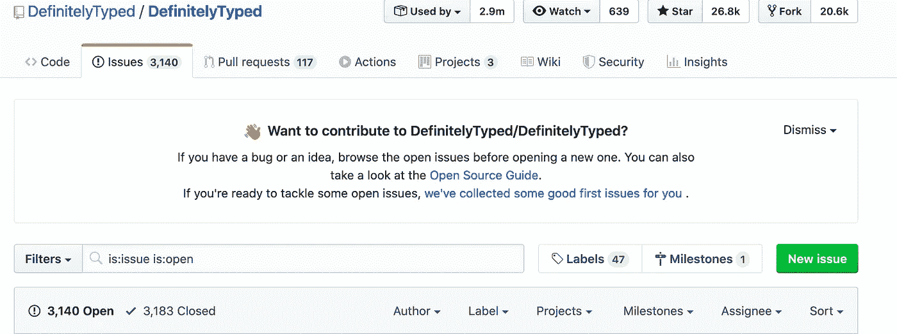
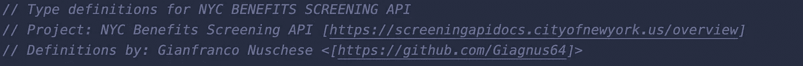
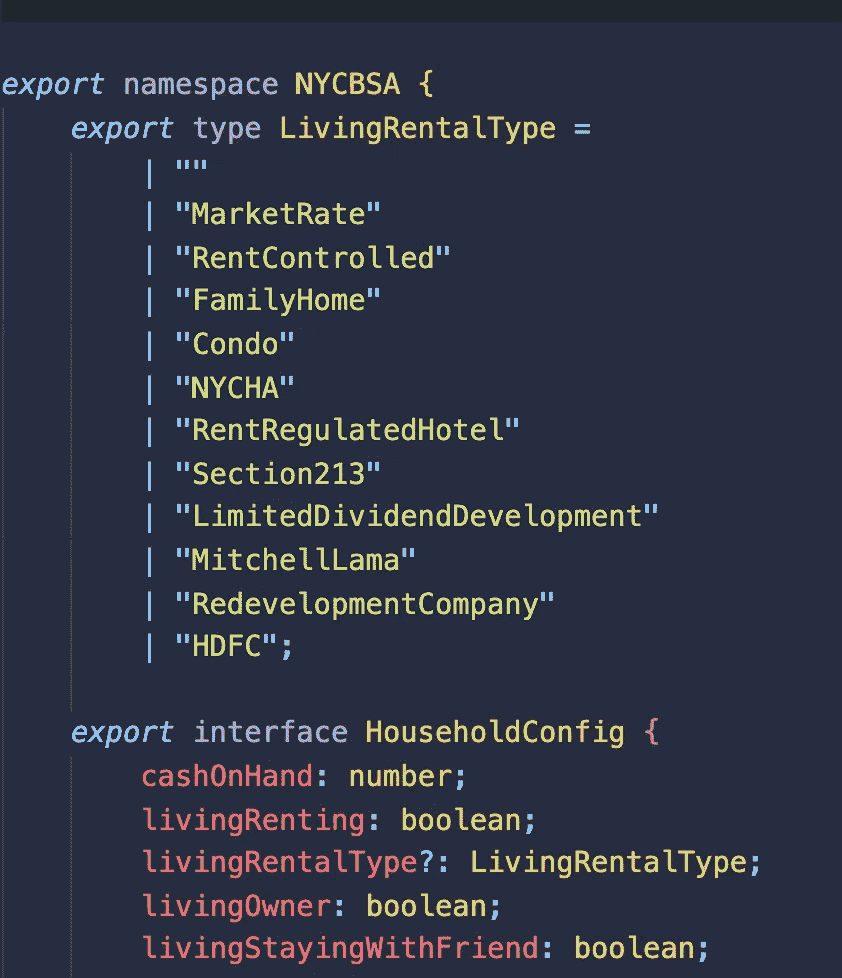
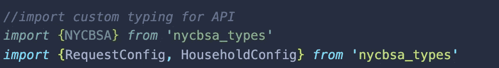

# 打字稿声明文件中的冒险

> 原文：<https://betterprogramming.pub/adventures-in-typescript-declaration-files-46e6b540b2d>

## 允许其他开发人员使用 NPM 包的类型而不必编写自己的类型的文件

由[乔纳森派](https://unsplash.com/@r3dmax?utm_source=medium&utm_medium=referral)在 [Unsplash](https://unsplash.com?utm_source=medium&utm_medium=referral) 上拍摄的照片。

我目前正在使用 Express 和 React 进行一个项目，以练习我的打字稿和笑话。我正在使用 [NYC Benefits Screening API](https://screeningapidocs.cityofnewyork.us/overview) ，在为我的 API 请求编写类型和接口的过程中，我想，“哇，如果我可以与其他可能想要使用这个 API 的人共享我的类型，那该多好啊？”

经过一些研究，我知道我应该写一个类型声明文件，并把它放在 NPM 的一个包中。在这篇文章中，我将描述我的工作流程，并讨论如何编写一个文件，并将其发布在 NPM 包中。

# 类型脚本声明文件

声明文件将所有类型和声明保存在一个单独的有组织的文档中，以保持代码的模块化。这些文件允许其他开发人员使用 NPM 包的类型，而不必编写自己的类型。有时 NPM 包附带声明文件和如何使用它们的说明，但是如果你的包没有附带类型呢？

输入[明确键入](https://github.com/DefinitelyTyped/DefinitelyTyped)。DefinitelyTyped 允许开发人员为没有类型的包请求和贡献类型。它是完全开源的，为开发者提供了资源和指南来共同处理类型声明文件，还有一个发布管道。您可以使用[类型搜索](http://microsoft.github.io/TypeSearch/)来搜索您的包中已经编写的类型。

类型通常可以在您的`node_modules`文件夹中的`@types`文件夹中找到。即使您以前从未使用过 TypeScript，如果您查看您的一个旧项目，您可能会发现这个文件夹中有您的一些 NPM 模块的类型。

此时，如果您仍然不能为您的包找到类型，您将需要决定使用一个不同的包，或者更有趣的方法是编写您自己的类型声明文件！

这是一大堆问题！

# 你的第一份申报文件

稍等一会儿！在您开始为一个包编写类型之前，您应该首先对您的包进行一些测试和研究，以确保您理解它是如何工作的。如果你是一个打字新手或者软件包很复杂，为它编写类型可能会很困难。一个让你的脚(或手，就此而言)沾湿的好方法可能是接受对一些已经写好的明确类型化的文件的一些拉请求。

另一个可能的途径是为轻量级 API 的请求创建一个更简单的包或声明文件。在我的例子中，NPM 上没有对应于纽约福利筛选 API 的包，所以我只需要找到如何发布我的类型供其他人使用。

TypeScript 有一些制作声明文件的[指南](https://www.typescriptlang.org/docs/handbook/declaration-files/introduction.html)，包括模板和最佳实践。我强烈建议在尝试编写声明文件之前通读这一节。每个声明文件都是不同的，但是集成声明的两种主要方式是通过模块和通过全局名称空间。

# 导出您的类型

如果你正在为一个已经存在的包创建一个声明文件，你将希望根据这个包来实现你的类型。大多数包都是模块化的，但是可能有一些仍然使用全局范围。TypeScript 建议使用模块化样式，以避免污染全局命名空间。因为我的 API 没有相关的包，所以我将发布一个模块化路由的 NPM 包。

注意:如果您正在为现有的包添加类型，您应该编写测试或者使用您正在键入的包中提供的测试，以确保您的类型编写正确！

我使用的是 TypeScript 网站上提供的一个模板，所以我的文件中的第一行是类型所对应的包和作者信息。

我的类型文件的信息，使用来自 TypeScript 网站的模板。

为了导出文件中的类型，我们可以简单地在所有类型/接口前面写`export`。但是，如果您有大量的类型或组织成不同部分的类型，您应该将它们放在一个命名空间下。命名空间允许我们导入一个名称下的所有类型，而不是分别导入所有类型。它还有助于避免与不同包或自定义类型中的其他类型发生命名冲突。

命名空间 NYCBSA 下的一组类型。

我希望能够使用名称空间导入或者单独导入每种类型，所以我只是复制了我的类型(没有名称空间声明),在它们前面的文件底部有`export`。

# 制作 NPM 套餐

一个 NPM 包很容易发布，但是你首先要测试你的包以确保它能工作。我测试我的包的方式是`npm pack.`这个命令将你的包捆绑到一个可以使用命令`npm install <tarball-destination.tgz>`安装的档案中。

一旦确保在本地安装软件包后可以正确导入类型，就可以继续发布软件包了。

## 出版

在您考虑发布之前，您应该写一个自述文件，以便让人们知道您的软件包是做什么的以及如何使用它。你还应该确保你的`package.json`中的所有信息都是正确的。(许可证、描述、作者、依赖关系等。).一旦你得到了，你就需要在 NPM 上做一个帐户。使用`npm login`在命令行上登录后，您可以使用`npm publish`公开发布您的包。你可以[检查](https://www.npmjs.com/package/nycbsa_types)这个例子的包。

# 资源

*   [https://docs . npmjs . com/creating-and-publishing-unscoped-public-packages](https://docs.npmjs.com/creating-and-publishing-unscoped-public-packages)
*   [http://blog . wolk software . com/contributed-to-definitely typed](http://blog.wolksoftware.com/contributing-to-definitelytyped)

 [## Typescript 中的声明文件是什么？

### 角度:全色域版

medium.com](https://medium.com/razroo/what-are-declaration-files-in-typescript-476c1c06f353)  [## CJ Thompson/typescript-示例

### 关于如何为 npm 模块编写声明文件的 TypeScript 示例-CJ Thompson/TypeScript-示例

github.com](https://github.com/cjthompson/typescript-examples)  [## 发布前测试 npm 包

### 当开发一个 npm 包时，你必须确认它实际上可以被使用。这是…

开发到](https://dev.to/vcarl/testing-npm-packages-before-publishing-h7o)