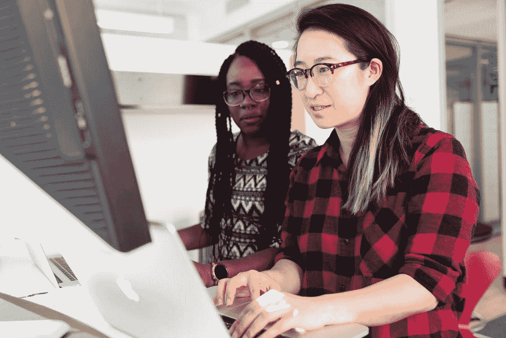

# 每个初级软件工程师都需要阅读的建议

> 原文：<https://betterprogramming.pub/advice-that-every-junior-software-engineer-needs-to-read-2439a5ea02f3>

## 高级软件工程师希望他们在大三时就知道的事情

克里斯蒂娜·莫里路在[像素](https://www.pexels.com/photo/woman-wearing-red-and-black-checkered-blouse-using-macbook-1181472/)上拍摄的照片。

上周，我有机会会见了我们行业的高级软件工程师，听到了他们对一个简单问题的回答:“当你还是初级软件工程师时，你希望自己知道些什么？”

以下是他们不得不说的话:

> “我希望我还是初级工程师的时候就知道，从高级工程师那里寻求反馈很重要。我问问题时总是很紧张，因为我认为我会被认为幼稚或没有经验。但问题是，我太天真，没有经验。克服这一点的最好方法是向最优秀的人学习。
> 
> 随着时间的推移——以及大量的尝试和错误——我明白了被聪明的工程师包围是一件多么幸福的事。即使当高级工程师撕毁我的代码审查或反对我的设计决策时，我知道它最终会帮助我改进。“— [孙李贝蒂](https://medium.com/@SunnyB)，高级软件工程师

> "向高级工程师寻求反馈是很重要的."

> “去买比特币！说真的，不要因为过去的失败而自责。人生苦短。”— [高级软件工程师詹姆斯·埃弗斯](https://www.linkedin.com/in/jd-evers/)

> “大三学生应该先自己尝试一些事情，并且聪明地知道什么时候该问什么问题。”

> “当我还是一名初级开发人员时，我希望知道的最重要的事情是，可以提出问题。理解从一开始就不知道所有事情是可以的，这真的非常非常重要。更重要的是，通过提问，低年级学生可以挑战他们的高年级同学，这导致了双向的智慧流动。问正确的问题是每个人在整个职业生涯中都需要的，所以为什么不早点开始呢？
> 
> 也就是说，在最简单的事情上寻求帮助不是一个好主意。大三学生应该先自己尝试一些事情，并且聪明地知道什么时候该问什么问题。“— [Simon Holdorf](https://twitter.com/simonholdorf) ，工程经理

> “理解从一开始就不知道所有事情是可以的，这真的非常非常重要。”

> “试着自己寻找答案。在问问题之前，导师喜欢看到你在某个地方取得了成功，即使是在谷歌上搜索你不理解的文档。我发现了隐藏的宝石，如 Java 主题的 [Baeldung](https://www.baeldung.com/) ，代码示例的 Spring Docs，以及搜索 GitHub 以查看您的问题之前是否已经解决。
> 
> 代码评审是一个学习的好地方——而不是批评。有时候抱怨一些代码看起来或感觉起来很容易，尤其是如果不是你写的。然而，我这样做了一次，发现我的团队里有原作者。谈论一个说错话的时刻。然而，他们并没有批评我，而是给了我一个机会去学习过去的设计模式，并在未来应用更新的模式。
> 
> 我们都有自己构建的旧框架，可能并不引以为豪，因此避免贬低代码的外观是至关重要的，因为它在过去十年中不断发展。“— [科特·贝克](https://www.linkedin.com/in/kurt-baker-82290983/)，助理首席软件工程师

> “从长远来看，在你往上爬的时候，知识财富会给你带来丰厚的回报。”

> “从一批实习生开始，我总是被投入到寻找任何给定任务的最快解决方案的竞赛中。我希望我的大学毕业生能够被引导到一个不断学习和适应技术变化的方向。
> 
> 除了我每天的承诺清单，我希望我已经接触到了 T 形知识的模型。T 型知识的概念很简单:在增加知识广度的同时，深入一个能让你成为关键人物的领域。从长远来看，当你攀登阶梯时，知识财富会给你带来丰厚的回报。
> 
> 有时，甚至我的知识和努力工作也没有得到关注和认可。在小隔间的角落里工作，并认为我的工作会自己说话，这被证明是一个神话，我很快意识到，在这个巨大的科技公司，光靠它是不够的。一个人需要建立一个强大的关系网，把每一个关系网都当成你口袋里的一分积蓄，你可以在职业生涯的多个阶段花掉并从中获益。“— [Prachi Srivastava](https://www.linkedin.com/in/prachi-srivastava-412aab56/) ，副首席软件工程师

你是高级软件工程师，对初级工程师有建议吗？对本文留下回应，帮助成长下一代开发者！