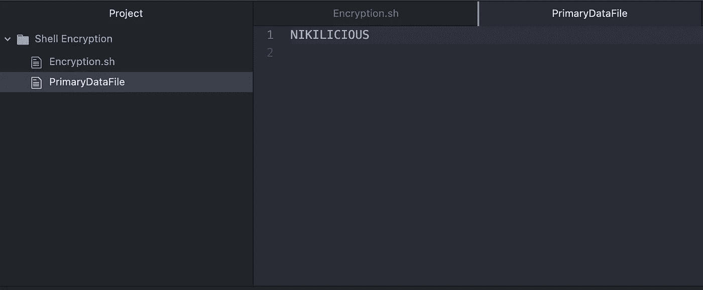
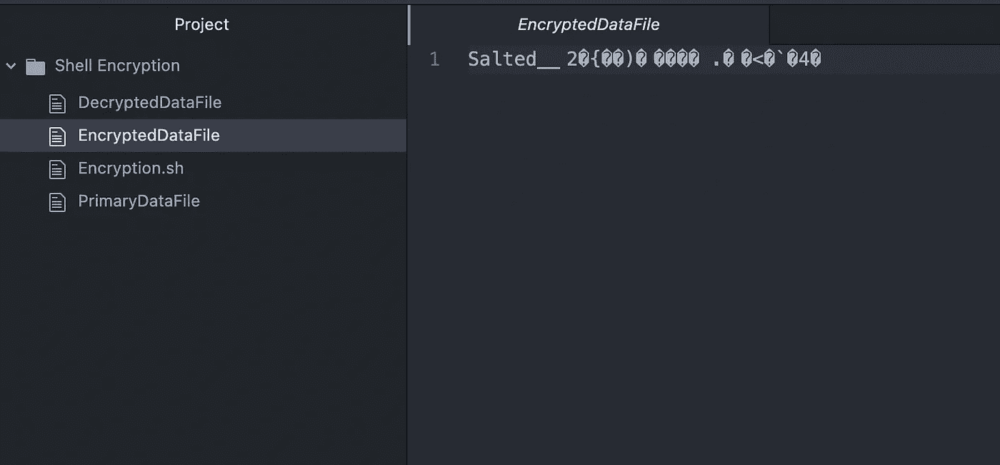
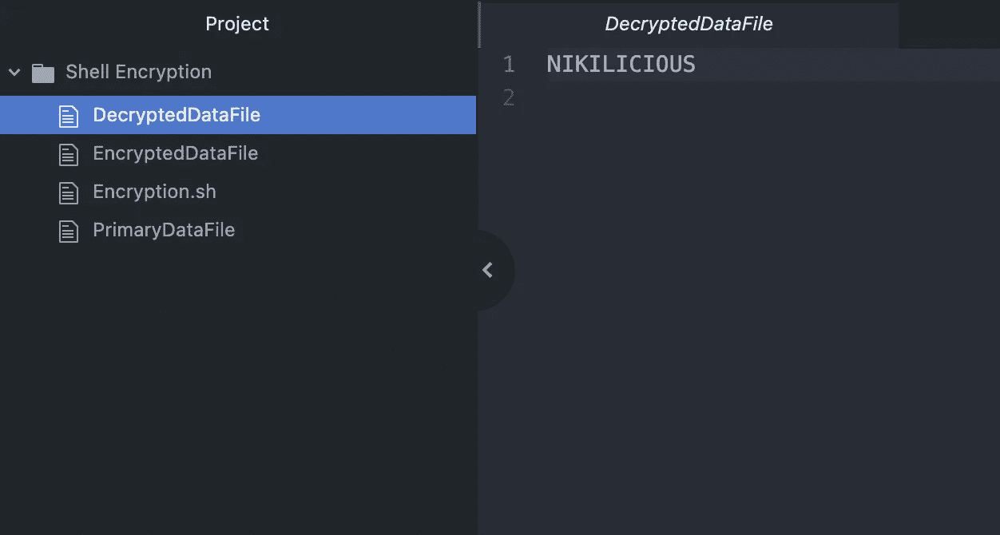

# 使用 Bash 脚本通过 OpenSSL 进行 AES 256 加密/解密

> 原文：<https://betterprogramming.pub/aes-256-encryption-decryption-with-openssl-using-bash-script-94cf3b8125ba>

## *使用 OpenSSL 工具加密一个文件中的数据，然后解密成另一个文件*


*照片由* [*飞:D*](https://unsplash.com/@flyd2069?utm_source=medium&utm_medium=referral) *上* [*下*](https://unsplash.com?utm_source=medium&utm_medium=referral)

在本文结束时，您将了解到:

*   如何创建您的第一个 bash 脚本
*   如何从命令行输入读取数据
*   使用 OpenSSL 工具的 AES 256 加密/解密
*   将数据读写到文件中

## 注意

可以使用命令`./<filename.sh>`通过终端运行`.sh`

如果您在运行`.sh`文件时遇到权限被拒绝的错误，您可以通过使用下面的终端命令授予文件权限来修复它。

```
**sudo chmod +x samplescript.sh**
```

## 创建 Bash 文件

我们将为这个项目设置一个专用文件夹，因为我们需要创建一个加密文件以及一个解密文件。我将创建一个名为`Shell Encryption`的文件夹。现在，这将是我们工作的主要目录。

我们将在这个文件夹中创建一个`.sh`文件。我将在整个故事中使用 Atom IDE 来开发这个 bash 脚本。

我们将简单地创建一个新文件，并将其命名为`Encryption.sh`加密是我选择的文件名，您可以选择任何您想要的名称，只是文件的扩展名必须是`.sh`

## 读取命令行输入

这里有两种选择，一种是加密我们拥有的可读数据，然后解密这些数据。

因此，我们将让用户选择是否要进行加密或解密操作。

为此，我们将打印并列出选项供用户选择。下面是我们将如何设置列表选项:

这里我们将创建一个函数，它将打印终端中的所有选项，然后读取用户输入并执行相应的操作。
我们`echo`向用户提问，用选项号来选择。1 用于加密，2 用于解密，3 用于退出。

接下来，我们将读取来自用户的输入，并运行一个开关案例，其中我们针对所做的选项选择执行相应的操作。

我们还将编写一个可以用来获取`PassKey`用户输入的函数。相同的`PassKey`将用于加密和解密数据。

为了获取`PassKey`，我们将使用`read`编写一个简单的函数，如下面的代码片段所示。

现在我们已经收到了来自用户输入的`PassKey`。我们需要将它保存到一个变量中。

所以我们将把`PassKey`作为函数返回来传递，然后从调用者那里访问它，如下所示:

```
fetchPasskey PASSKEY
```

`PASSKEY`将保存输入的密钥值。

## 创建加密和解密函数

我们将使用 OpenSSL 工具包进行加密和解密。OpenSSL 是一个众所周知的 Linux 加密工具包。OpenSSL 是免费的，它有巨大的功能，并且很容易在 Bash 脚本中使用。

**OpenSSL** 使用标准输入和标准输出，它支持广泛的参数，比如命令行开关、环境变量、命名管道、文件描述符和文件。关于 OpenSSL 的更多信息，你可以访问这里的。

我们在这里写了两个函数，一个用于`Encrypting`，一个用于`Decrypting`，如下所示。

第一个函数`encryptData`我们在第一行中所做的是获取函数参数实参并将其赋给`passkey`。`"${1}"`仅代表功能参数中的第 1 项。

> `***-in***` *代表输入文件名* `***-out***`**代表输出文件名*`***-e***`**加密输入数据* `***-d***`**解密输入数据* 这里的参数应该像 `*pass:<Passkey>*`一样被提及***

**`decryptData`函数与`encryptData`函数相同，但我们将给出`-e`而不是`-d`
，我们只需指定输入文件，输出文件将自动创建。这里我们已经提到了所有的输入文件和输出文件:**

```
**PrimaryDataFile 
EncryptedDataFile 
DecryptedDataFile**
```

# **让我们测试一下**

**在测试我们所写的内容之前，我们必须创建一个文件并向其中输入一些数据。这里我们将通过给它一个类型或扩展名来创建一个新文件。**

**我们将其命名为`PrimaryDataFile`，因为这是我们在 encrypt `openssl`中提供的输入文件名。**

**我们将在`PrimaryDataFile`上输入一些数据。在这里，我简单地添加了一个文本`NIKILICIOUS`。该文本将被加密，稍后解密。**

****

**主数据文件**

**我们将通过运行以下命令来运行 bash 脚本。
`./Encryption.sh`**

**运行 bash 脚本后。我们将选择加密选项，并给出一个`Passkey` = 12345。参考下面的截图。**

****

**按下 enter 键后，您可以看到数据`NIKILICIOUS`将被加密并保存在名为`EncryptedDataFile`的文件中。**

****

**现在我们将解密`EncryptedDataFile`中的加密数据。为此，我们将再次运行 bash 脚本并选择选项 2。**

**之后，我们将给出与加密`12345`时相同的密钥值。之后，解密后的值将被存储在`DecryptedDataFile`中。**

****

**是啊！！我们已经使用 bash 脚本成功地完成了加密和解密。我们可以通过在加密过程中添加一个加载器来使外观和感觉更好，这将在下一个故事中介绍。**

**您可以在下面找到 Github 链接:**

**[](https://github.com/Nikilicious09/AES256OpenSSL) [## GitHub-nikilicious 09/AES 256 OpenSSL

### 此时您不能执行该操作。您已使用另一个标签页或窗口登录。您已在另一个选项卡中注销，或者…

github.com](https://github.com/Nikilicious09/AES256OpenSSL)** 

**我希望您已经理解了我们如何轻松地创建一个 bash 脚本来加密和解密数据。**