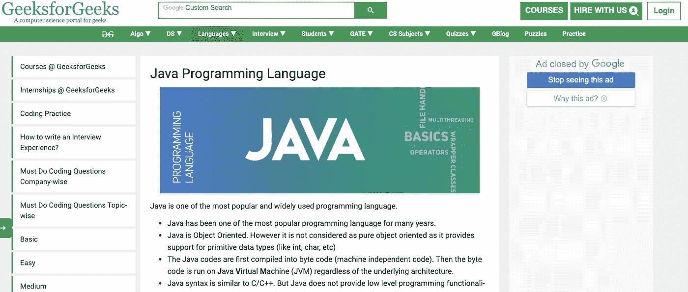
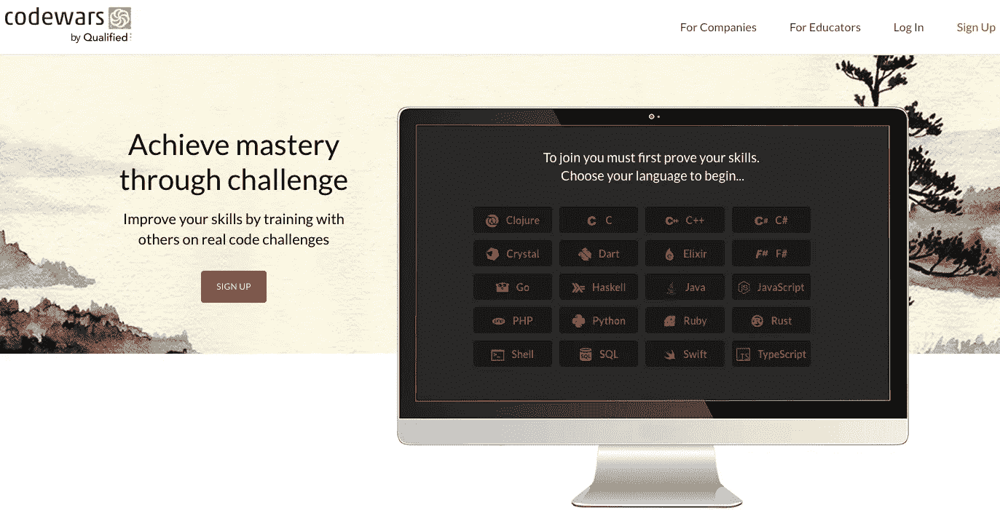

# 年龄只是一个数字

> 原文：<https://betterprogramming.pub/age-is-just-a-number-413e91f17a0e>

## 为什么学习 Java 活到老学到老

瑞安·麦奎尔的照片

“总的来说，我想改变我的职业……改变我生活中的某些东西，恐怕为时已晚。我是(在此输入 30 岁或 40 岁以上的年龄)。太老了……”

如果我每次听到这样的话都有一分钱，我会得到一百万。此外，每个说这话的人都有一张像《怪物史莱克》里的猫一样的脸。或者，一个不可逆手术前的真雄猫的脸。

这里我得解释一下。我听所有这些 jeremiads，因为几年前，我开始教人们 Java。我喜欢教书，所以我把我的爱好变成了我的第二份工作——第一份是高级 Java 开发人员。

对了，我 30 多岁就当家教了。但是，本文的主题不是补习，而是作为一个成熟的学生学习 Java。

许多潜在的转换者担心他们已经错过了改变生活的所有机会，因为生活的年数不是从 1 或 2 开始的。是这样吗？

这里我们试着解析以下问题:

*   人如果已经 30，35，40，等等，还能学到自己想学的东西吗？
*   上面提到的这些人，如果之前没有接触过这个职业，能成为一名职业程序员吗？
*   有哪些真正的问题可以阻止一个成熟的学生成为职业程序员？怎么处理他们？

我们开始吧。

# 老年人的学习能力比年轻人差吗？

我的表弟，博，是一位专业的学术钢琴家。今年，他从音乐学院毕业。所以，让我数一数…他的研究花了 18 年！古典音乐家学习时间长，一般很早就开始了。

同样的情况，比如说，舞者和运动员。如果你想在体育运动中取得成功，你需要从你还不知道你想取得什么成绩的年纪开始。

对此有一个生理学上的解释。据波说，一双高质量的钢琴手只有在孩子 12 岁之前的童年才有可能。要想在体操上取得成功，你只需要非常年轻的人的肌张力特征。

如果你的声音已经改变，或者如果你是一个女孩，即使你唱得很美，你也不会被男孩合唱团接受。当然，这并不意味着你不能在任何年龄以业余水平做以上所有的事情(当然，除了男孩合唱团)。

问题是由于生理原因使其成为你的职业。但是编程呢？

我权威地坚持认为，没有类似的生理原因会阻止你在 40 岁时掌握编程并获得一个新的职业。

*   如果你的思维方式有些逻辑性，而且你没有记忆问题。
*   如果你对创造什么感兴趣，无论你是 40 岁还是 20 岁，都没有根本的区别。

在这个年龄，大脑的僵化和无法将新知识注入大脑没有特定的过程。

当然，我听说过很多次，成年人的学习成绩普遍较差。是吗？这取决于成年人如何对待他们的生活。

比方说，你十多年前毕业，没有做过任何学习，你可能已经放弃了学习的过程。那样的话，对你来说就困难了。但是，你可以解决它，要有耐心。

成年转换者没有生理上的原因。坏消息是:还有许多其他困难。好消息是:你可以解决这些问题。

# 问题 1。给自己心理压力，害怕失败

如果你正在考虑转行，你可能对目前工作或生活的某些方面不满意。

一个人年纪越大，失败和错误的选择就越多。因此，每一次新的失败看起来都更真实，而且这个人不想再经历另一次“失败”。

“我现在 38 了，从头再来怎么样？如果我没有足够的能量怎么办，事实上，为什么我决定我可以？”我的学生阿诺德说。他没有马上说，但是当他面对第一个困难的任务时。

展望未来，我会说他完全解决了这些问题，但不是立即解决。最重要的是，困扰他的不是年龄(大脑没有干涸，信息是准确的！).

问题不在于缺乏知识。这是对他的优势和机会的怀疑。

# 问题二。公众的抵制和轻蔑

“你是成年人，你的老板可能是比你小 15 岁的人！”嗯，也许吧。那又怎样？没必要拿自己和这个比你年轻的人相比。不如拿自己今天和昨天比较一下。

有时候，公众抵制的问题更明显。例如，你有家庭或类似的责任，不能放弃工作或花很多时间在学习上。

“我妻子生我的气了。因为我的训练，我无法对她和我们的孩子给予足够的关注。我有一份很好的工作，没有人意识到我为什么要开始这新的一页编码。”

“我的朋友们认为这是中年危机的表现，”我的学生，41 岁的凯西说。现在 43 岁，Java 初级开发者。

# 问题三。缺乏时间和精力

这个问题有三个，但却是头号问题。这是最难解决的问题，尤其是如果你有义务，比如说，你不能放弃的家庭和工作。

你不仅需要找到时间，还需要让自己习惯于将精力分配给常规课程。

是的，这对你来说不太可能是新闻，但是你的学习应该是日常的。如果你想达到一个稳定的结果，最好每天都做，至少隔天做一次。

# 问题 4。一些 IT 公司的“青年崇拜”

这个问题与问题 2 部分重叠，但是更局部和具体。

大多数公司在简历中不要求年龄，因为这是个人信息。尽管如此，几乎所有的人力资源经理都会查看你在社交网络上的页面，并试图确定你的年龄，你是否有孩子，等等。

承认这一点是令人不快的，但很多时候，这些点可能会影响你的申请，不利于成年候选人。尤其是入门级的岗位，比如见习或者 Java 初级。

# 如何抵抗这些问题

## **1。记住你不是这个世界上唯一的成熟编程学生**

例如，我的见习项目学生中大约有一半超过 30 岁。你可能会在网上找到很多成年人转行成功的故事。所以，不要犹豫。恐惧是成功的第一杀手。

## **2。请记住，自我发展至关重要**

一个喜欢某样东西的人永远不会感到孤独、无聊和平庸。我是说，这不会浪费时间。

## **3。如果你很长时间没有学习任何东西，比如 10 年，你可能会忘记学习过程**

这是一个成熟学生的真正问题，而不是“老年人”不要试图自己记住过程(例外:你是一个热衷于自学的人，但如果你是，你一直在学习一些东西)。

也许你应该试着找个导师或者报名参加课程。它帮助你的大脑回忆上学是什么样子，吸收新知识。

值得理解的是，学习应该是有规律的，而不是时不时的。顺便说一下，它不仅可以是编程，还可以是其他东西。但是，如果你在系统地尝试某件事，这不是问题。

## **4。编程不需要身体的灵活性和年轻神经元的速度**

这需要耐心和系统的方法。因此，正确的想法是制定你的课程。

如果你是学用课程或者有家教的话，都不是问题。如果你决定自学，找一个好的在线课程，使用为你量身定制的课程。

## **5。如果你对编码很认真，并且打算成为一名 Java 开发人员，那么每天学习 4 到 5 个小时，或者至少 2 个小时**

哪里有时间学习这些东西？第一，你需要意识到是自己时间不够，还是只是错觉？

有时候，缺乏时间是因为没有能力组织时间。不必要的习惯。缺乏能量。能量取自另一种能量。

这里有一个我 37 岁学生的故事:

“我做过销售经理，教堂唱诗班是我的爱好。我一周去两次。有时，会有额外的排练和音乐会。当我开始编程时，我意识到我不会把所有的东西都放在一起。

不情愿地，我退出了唱诗班…而且，我开始在晚上少看电视。我很难过，当我想到退学的时候，我首先想到的是唱诗班。

我花了六个月时间刻苦学习。瞧，现在我是一名初级程序员，又可以在我最喜欢的唱诗班唱歌了！".

如果你不能离开你的工作，试着重新考虑你可以拒绝什么，至少是暂时的。

## **6。编程是你需要每天训练的实用技能**

学习如何编码的最好方法是…编码。写很多代码。阅读研究某一特定主题的讲座，并做一些编码任务。三个，五个，甚至二十个。

80%的学习时间用于实践，20%用于阅读讲座或文档。

# 编码练习资源

去哪里找练习任务？现在比以往任何时候都容易。以下是一些包含优秀编码练习的资源:

[CodeGym](https://codegym.cc/)**——这是一个不错的在线 Java 核心课程，适合初学者到中级水平的学生。这里的明星特色是一个练习系统。不同级别和验证系统检查你的代码大概有 1000 个问题。**

**CodeGym 课程由 40 个级别组成；每个包括 15-30 个编码任务，10-20 个 Java 讲座，和一些激励学生的文章。**

****

**GeeksForGeeks 是我最喜欢的学习网站之一。它充满了不同的文章，课程和挑战性的任务。试试看，嗯，我相信你会在那里找到有趣的学习内容。**

****

**Codewars 是一个开发者通过挑战来掌握代码的地方。适合中高级 Java 学生。你会发现这里有挑战性的任务，而不是讲座。**

## **7.**毫不犹豫地提出你的问题****

**是的，那是几乎所有 30+学生的弱点。他们很害羞，害怕问一些愚蠢的问题。你猜怎么着每个编码的学生都问过一些愚蠢的问题，不是一次两次了…**

**更有甚者:这个星球上的每一个程序员在学习和工作中都会问一些愚蠢的问题。加入这个团体，它会让你的教育更有效。**

**试试 [Stack Overflow 的](https://stackoverflow.com/questions/tagged/java) Java 段或者[code branch](https://coderanch.com/c/java)(最后一个是初学者友好的)。你也可以使用 Reddit 社区，例如， [learnprogramming](https://www.reddit.com/r/learnprogramming/) 、 [Java](https://www.reddit.com/r/java/) 和 [learnjava](https://www.reddit.com/r/learnjava/) 。在那里，您可以提出问题或找到学习 Java 的有用技巧。**

## **8.让人力资源经理不要根据你的年龄，而是根据你的推理能力和语言知识来评价你**

**试着从你的学习中做一个项目，上传到 GitHub。只向你的朋友开放你的社交网络和年龄信息。**

**附:几乎所有这些建议对所有年龄的学生都有效。**

**如果你准备好改变，现在还不算太晚。如果你太懒，不准备为了你的 Java 学习牺牲任何东西，那就太晚了，即使你还是个孩子。**