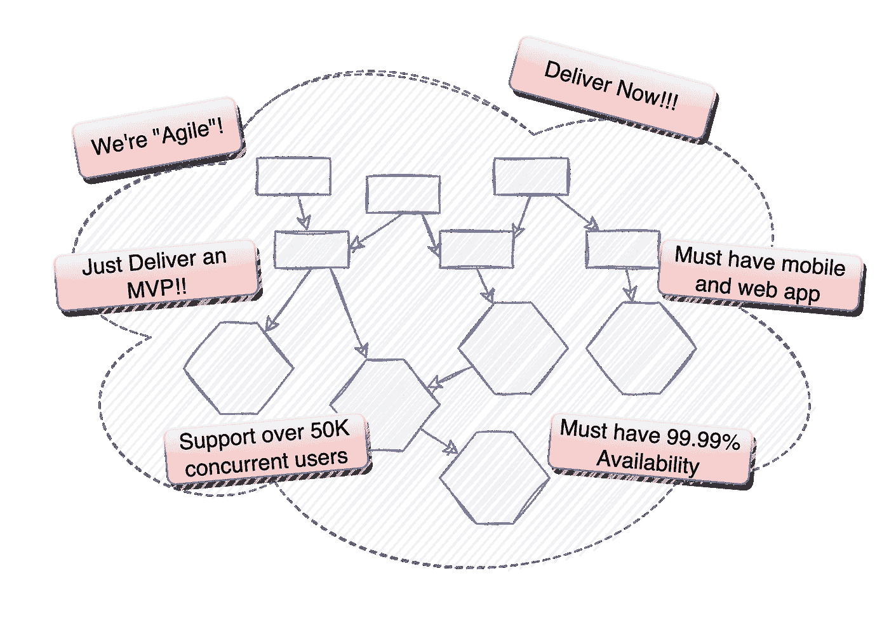
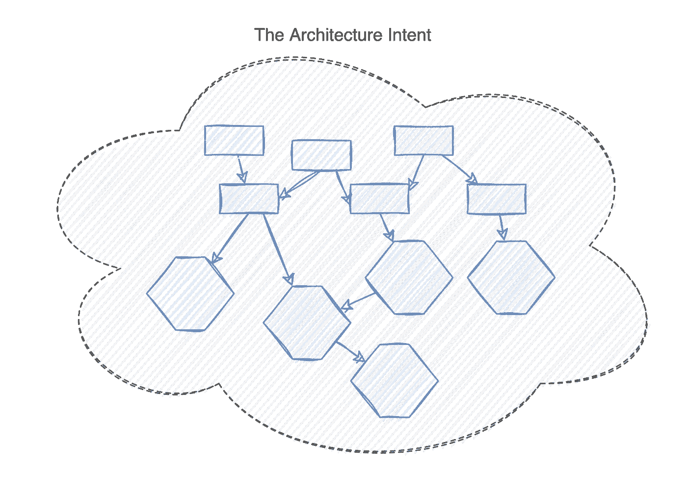
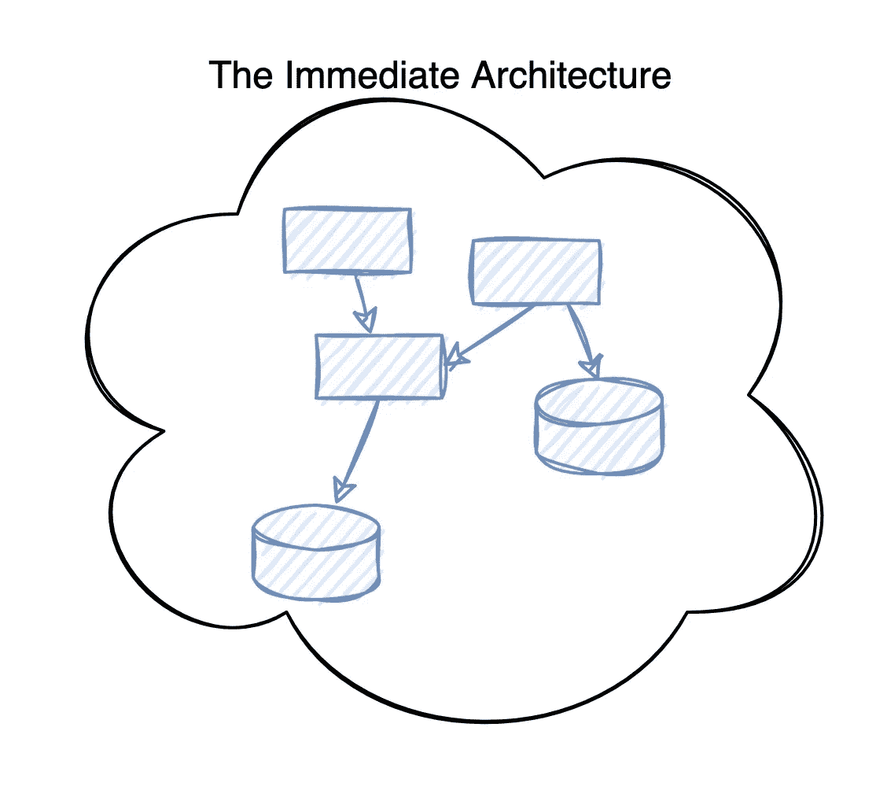

# 敏捷架构:意图与直接

> 原文：<https://betterprogramming.pub/agile-architecture-intent-vs-the-immediate-36d327289b2d>

## 如何在敏捷的世界中交付一个可靠的架构？这里有一种创建适应不断变化的架构的方法

作者图片

从前，在项目生命周期的早期，架构应该是“完成”的。

这是检查所有“T0”特性(可伸缩性、可用性、可观察性等)的重要一步。).

因此，考虑到当今快节奏的世界，客户可能看不到(昂贵的)架构阶段的实际好处，我们如何实现“敏捷架构”？

# 敏捷世界中的建筑

有很多关于敏捷架构的文章，但是我认为我们还没有一个公认的实践。

建筑做得好，做得彻底，是很难的。如果你不相信我，我推荐[软件架构基础](https://learning.oreilly.com/library/view/fundamentals-of-software/9781492043447/)和[软件架构:难点](https://learning.oreilly.com/library/view/software-architecture-the/9781492086888/)。此外，还有所有特定的云基础架构和 DevOps 架构。

好的架构必须考虑许多不同的观点(技术的和人的),并且不断地权衡这些观点。

# MVP 论点

有一个学派认为不需要架构，开发人员可以构建最小可行产品(MVP)。

对于简单的解决方案，这可能是一个有价值的练习。如果做得正确，MVP 可以在帮助定义客户想要什么方面提供许多经验。从这个意义上来说，这是一种原型的形式。

然而，MVP 的任何增长都需要某种形式的架构。

**先不说:**如果你有一个客户为解决方案付费，你建议向客户交付*最低可行产品*，这听起来就像是“我们将为你给我们的钱交付最低可行产品”。然而，如果你说你将*首先*构建一个 MVP 来加速需求收集过程，然后交付他们购买的健壮的解决方案，那是一个非常不同的命题。

作为交付 MVP 项目的架构师，您需要帮助正确地确定范围。确保 MVP 是一次性的，或者更典型地，当 MVP 已经回答了问题时，有一个明确的点，并且有一个到完整产品的结构化演进。

# 建筑仍然需要做

除了快速松散的创业之外，架构在某些时候仍然需要做。

通常，推迟到以后会导致一个昂贵的旅程。

# 交付架构意图

当今世界没有大的预先设计(BUFD)的空间，这是一件好事。BUFD 已经在没有明确价值的情况下投入了数百万美元，而且通常设计完成后就过时了。

对此的解决方案是开发*架构意图*。

架构的意图是大局的东西。

给定您的项目、客户、解决方案或企业的需求，处理所有“能力”的最终架构是什么？哪些可能的产品有助于实现目标？

从表面上看，这可能听起来像 BUFD，但是您所做的是设定长期的架构愿景。并非所有的细节都已具体化。这将取决于您的具体解决方案，以确定可能需要进一步充实的架构上的重要方面。

只是足够的大局观架构来定方向。

除了少数(现在很少)政府 IT 项目，没有人能够从一开始就实施完整的架构。

架构意图为整个架构设定了方向。然而，架构的意图可以而且将会改变。

正如所有敏捷或增量交付一样，需求会发生变化。需求变更可以改变由架构意图设定的方向。

此外，转型计划可能需要多年时间。当您交付架构意图的某些方面时，可能会有不同于您开始时的技术可用。

# 但是现在呢？

随着架构意图设定长期愿景，朝着该愿景的构建将是渐进的。

给定架构意图，哪些方面首先交付直接需求？

此外，考虑到开发团队当前的技术能力，有多少意图需要缩减以避免交付风险？

再一次，架构就是关于这些权衡的。这些都是带有商业含义的权衡，而不是建筑师孤立地做出的。

与*的架构意图*不同，*的直接架构*是具体的。对需要发生的事情有精确的规范或政策。

作者图片

# 直接架构到架构意图

不出所料，从直接架构到架构意图的步骤形成了您的路线图，并定义了产品或发布增量。

根据项目的敏捷程度，只有路线图中的下一步可能被很好地定义。目标是不要做太多 BUFD 当需求改变时，浪费的努力。

# 这难道没有在一开始就留下一个缺乏基本架构的解决方案吗？

不。作为一名架构师，您仍然需要确保所有必需的“能力”都在直接的架构中。但是，对于初始增量，可能会与客户进行一些协商。

您可能还会发现，数据量和用户数量最初很低，允许采用分阶段的方法来支持可伸缩性和并发性。

# 你有什么想法？

你尝试过在敏捷的世界中交付可靠的架构吗？

你觉得建筑意图和直接建筑的概念对你有意义吗？