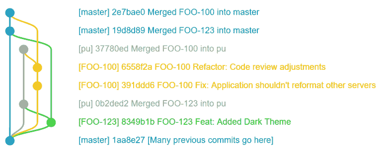
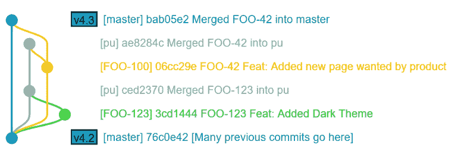
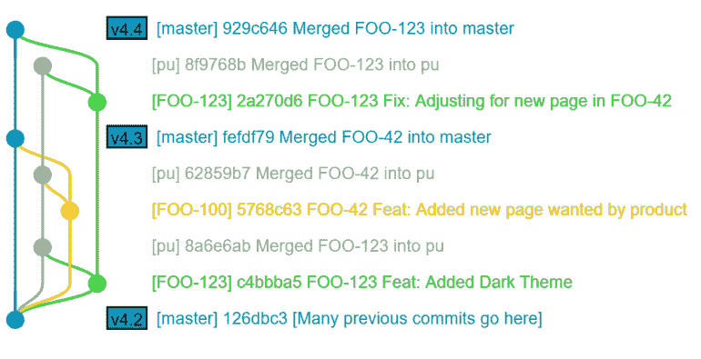
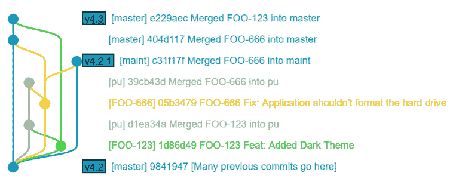

# 与 gitworkflows 的敏捷 Git 集成

> 原文：<https://betterprogramming.pub/agile-git-integration-with-gitworkflows-d6207bcf4ed>

## 当集成特性和修复时，gitworkflow 的简化版本如何给敏捷团队带来灵活性和安全性

在本文中，我们将探索基于 [gitworkflows](https://git-scm.com/docs/gitworkflows) 的特性分支的使用，以便在特性和修复完全就绪时集成它们。虽然这是一个不太为人所知的工作流程，但它提供了很大程度的自由度和灵活性。

在本文中，我们不会涵盖所有的 gitworkflows，而是一个简化的变体，集中于处理单个持久化分支、单个集成分支和单个特性分支。

注意:对于那些熟悉 [GitFlow](https://datasift.github.io/gitflow/IntroducingGitFlow.html) 的人来说，我应该注意到虽然名字相似，*这是两个完全不同的工作流程。*本文将只介绍 Git 核心团队的工作流程。

# 对动态 Git 策略的需求

在我描述这个工作流是什么之前，让我们看几个场景:

*   假设您负责一个大型组织内部的应用程序。您向它添加功能，并在问题出现时提供修复。您的组织喜欢频繁地发布，您可能知道也可能不知道哪些工作项将被包含，直到接近最终的预发布测试周期。
*   或者，您正在开发相同类型的应用程序，并且您的一个特性在测试后期发现了一个不明显的 bug，需要从发布中删除。
*   或者，假设一个开发人员实现了一个新的特性，这个新特性使得测试环境停止，并且必须被删除，直到修复后测试才能继续。

在这些场景中，都需要一定程度的开发灵活性。您的核心需求是能够*快速从一个版本中删除特性或修复，而不会引入重大风险*。

这就是工作流的全部内容——能够根据需要快速添加或删除分支的功能。

# 仅仅使用一个开发分支怎么样？

那么，为什么需要这样做呢？难道我们不能让所有的开发人员在一个持久开发分支上编码，并定期为主要特性分离分支，然后将它们合并回来吗？

嗯，也许吧，但是如果您在发布之前发现开发分支中两周前提交的特性有问题，您有什么选择？

*   延迟发布以进行修复。
*   重新提交以禁用该特性，希望您正确地禁用了它，并且这是唯一引入的新问题。
*   与缺陷一起发布。

在我看来，这些都不是很好的选择。你不得不冒不必要的风险，或者在不必要的时候推迟约会。

# 分支结构概述

使用 Git 核心团队的工作流，您只需根据不包括引入问题的分支的组合定制一个发布。

在这个工作流中，您有*特性分支*，它们代表了被更改的单个工作项。这些是您的个人修复和新功能。

每个特征分支从*主分支*分支。除了它所代表的意义之外，这没什么太不寻常的。 *Master 代表可发布的代码。*这是经过全面测试的代码，由产品管理部门审查，不会引入任何回归问题。

工作流有趣的地方在于它的*提议更新*分支的概念(通常简称为 *pu* )。*提议的更新*是一个包含已完成的特性或修复的分支，这些特性或修复已准备好被共同评估以形成一个完成的构建。

注意:gitworkflows 也提倡一个`next`分支和一个`maint`分支。`next`相当于预发布环境，而`maint`基于上一个生产版本。你可能需要也可能不需要这些分支。

# 测试和集成

因此，所有的测试和产品评审都是基于提议的更新分支进行的。

一旦集成测试分支被证明是好的，在将它们合并之前，在将特性分支重新基于主分支之后，用于单独变更的特性分支被合并到主分支中。

这为我们做了几件事:

*   它保持了版本历史的整洁。
*   它确保了特性分支不会互相渗透，这样你就不会依赖于你不想依赖的代码。
*   如果集成分支被破坏，我们可以随意重新生成它。

我可以在这里更详细地解释这些，但是最好向您展示单个特性的生命周期。

# 案例研究:添加黑暗主题

因为每个应用程序都需要一个黑暗的主题，让我们在案例研究中以此为例。

Priya 查看了团队的敏捷董事会，决定在票务系统中加入 ID 为“FOO-123”的“添加黑暗主题”故事。她查看了用户故事和接受标准，认为她已经有足够的信息可以开始了，所以她将它分配给自己并创建了一个分支。

她通过切换到`master`分支然后运行`git checkout -b FOO-123`来创建这个分支。

这将基于工作项的标识符(FOO-123)从当前分支创建一个分支，然后切换到当前分支。

然后 Priya 花时间进行测试和修改，直到她对自己的功能满意为止。一旦她准备好了，她就打开一个从`FOO-123`到`pu`(建议更新)分支的合并请求(也称为拉请求)。

Jerome 对分支进行了代码审查，对工作很满意，并批准了合并请求，因此 Priya 将其合并到`pu`中。

持续集成服务器看到了触发构建的`pu`分支的变更。构建成功，随后部署到测试环境中。

在那里，质量保证审查该特性，没有发现任何问题。产品管理部门看着它，同样很高兴。

# 从建议的更新中删除项目

不幸的是，Landon 一直在做一个新的页面，没有考虑到新引入的主题。黑暗主题在这个页面上表现不好，所以当产品管理和质量保证部门审查 Landon 的页面时，就产生了一个问题。

因为开发周期只剩下一天，而 Landon 的新页面对业务至关重要，所以团队决定从这个版本中删除黑暗主题，并将其移到下一个版本中。

为了做到这一点，团队决定从当前的`master`分支中重新创建`pu`分支。他们要么通过删除并重新分支最近的`master`提交的`pu`，要么通过硬重置`pu`以匹配最近的`master`提交，然后强制推送。

注意:强制推动是危险的和破坏性的，会吹走分支上的变化。

在这种情况下，我们想要删除对`pu`分支的更改，并从原始状态开始。

如果让几个有资格的人执行强制推送来定期重置`pu`分支让您感到厌烦，我建议您考虑删除`pu`分支并重新分支，但是这样做可能会有额外的开销。

一旦`pu`分支可用，所有*应该*集成到其中的特性分支将被合并回其中，新的构建将被生成并部署到测试环境中。

我喜欢把它想象成一个高度可配置的菜单，在这里你可以选择每个特性是否是一个分支的一部分。

# 集成到母版中

下一个冲刺阶段，一旦发布被清除，Priya 对 FOO-123 做了一些额外的调整，以允许黑暗主题在 Landon 的新功能上正确呈现。一旦她准备好了，她就提交另一个拉请求，并在获得批准后合并到`pu`中。

这一次，一切都很好，FOO-123 获得了批准，并进入了发行版。该特征现在需要合并到`master`分支中。

虽然将`pu`直接合并到`master`分支*可以*工作，但是它有一些缺点:

*   您需要检查`pu`分支，以确保与它集成的每一个特性都已经通过测试，并被批准发布。如果你犯了一个错误，你就向一个生产就绪的分支中添加了一些未经测试的东西。
*   将整个集成分支合并到`master`中会使阅读和理解单个提交历史变得更加困难，因为特性会从一个分支转移到另一个分支。虽然查看单个特性可能有意义，但是阅读实际的整个分支历史会更困难。

因此，我们需要*将特征分支合并到主分支中，而不是将建议的更新合并到主分支中。*

这是人们理解 Git 核心团队工作流程的首要问题，所以强调这一点很重要。

取而代之的是，我们首先切换到我们的特性分支，然后`git rebase master`将该特性重新基于最新版本的 master。这有助于保持我们的版本历史原始，并允许我们在分支内部解决合并冲突，而不是在我们正在集成的分支内部。

一旦完成，合并被提交，我们切换到`master`分支，然后通过`git merge FOO-123`(分支的名称)合并主题分支。

提交和推送合并后，它现在是下一个版本的正式部分，如果您愿意，可以删除单个特性分支*和*。

# 师父有问题怎么办？

如果代码进入了需要移除的`master`分支，那么现在就有问题了。这个工作流不擅长处理这个任务，因为`master`应该是持久的。

正因为如此，如果你有任何疑问，我强烈建议你推迟合并到`master`中，因为在这个过程的后期合并到 master 中要比试图从 master 中删除一些东西或修补 master 容易得多。

您可以做的事情之一是制定一个规则，一旦工作项被产品管理批准，它们就被关闭并合并到`master`中，任何调整都需要一个新的工作项，而不是重新打开旧的工作项。

根据我的经验，这往往会产生良好的结果，但你的里程可能会有所不同。

如果你*真的*需要对`master`进行调整，在我看来你有几个选择:

*   要求一个新的工作项通过管道并进入`master`分支，包含您想要的任何变更。
*   将`master`恢复到已知的良好状态，然后强制将项目推回并合并到该状态。
*   使用 revert commit 将特定的提交还原到 master 并在以后重新集成。

这些都不是很好的选择:

*   你总是希望`master`是可发布的，所以等待一个新项目的到来限制了你的灵活性。
*   除非在极端情况下，否则强制推送在你的`master`分支上做起来太危险了，所以它不应该是你正常工作流程的一部分。
*   还原提交会使您的版本历史变得混乱，如果后续提交修改了相同的代码区域，甚至可能无法工作。

总而言之，在集成之前，你最好花额外的时间来确保特性真的很好。

# 其他建议

我强烈建议您在`master`分支上标记发布，因为标记的存在允许您快速创建一个`maint`分支，以便在以后需要时提供补丁，而不必猜测或搜索哪个提交散列对应于您的最后一个产品发布。

我主张你应该在每次冲刺开始的时候把你的`pu`分支重置为`master`。这有助于在比较特征分支和`pu`分支时保持分支比较的准确性。这也使得识别`pu`分支中仍悬而未决的东西变得容易。

一些版本控制工具，如 GitHub 的 web 用户界面，通过将您试图集成的分支合并到您的特性分支来处理合并冲突。

当试图将一个特征分支合并到`pu`时，这是一个问题，因为你不希望其他特征在你不知情的情况下进入特征分支。相反，使用命令行或外部工具如 [GitKraken](https://www.gitkraken.com/invite/4tRysUoN) 来解决`pu`中的合并冲突。

如果你不喜欢`pu`这个名字，我推荐叫分公司`qa`。我个人用`releases`代替`master`，用`qa`代替`pu`，但是概念是一样的，不管你用哪个术语。

# 维护版本呢？

这个模型不太适合长期运行的维护分支。如果你在一个不经常发布的环境中工作，你应该考虑像 GitFlow 或者其他 Git 方法。

一般来说，在 Git 核心团队的工作流程下，您会发现自己希望更频繁地从`master`发布补丁，而不是将补丁发布到产品中。

然而，如果您*确实*需要做一个修补程序，您可以切换到您在给定版本的`master`分支上创建的标签，并在该位置创建一个代表产品补丁的新分支。

或者，您可以总是拥有一个`maint`分支，并更新该分支以指向最新的产品发布，提交每个发布。

创建修补程序分支后，您可以分支该分支，为生产修补程序创建单独的功能分支。然后，将您的特性分支合并到修复分支，生成一个构建，让 QA 和产品验证这个构建，然后将它应用到生产中。

这个不同的工作流的存在是为了防止`master`中比生产标签更新的变更进入生产。

一旦应用了生产补丁，该特性也应该合并到`pu`中，然后在`pu`中测试后再合并到`master`中。如果做不到这一点，将会导致一个回归问题，即在下一个版本中不再存在应用的产品补丁。

虽然您*可以用这种方式*处理维护问题，但是如果您确实习惯性地需要生产补丁和维护分支，您应该考虑更频繁地发布*，以便在计划的发布中更容易实现缺陷解决，并且补丁是为那些真正可怕的高严重性错误保留的。*

*如果事情严重到足以保证生产补丁对您的团队来说是经常发生的，那么您也应该好好审视一下您的开发和测试实践。*

# *结论*

*这个工作流程并不适合所有人，但是如果您想要绝对控制哪个构建中有什么特性，这是一个需要认真考虑的工作流程。*

*这只是 gitworkflow 的一种风格。如果您想了解更多，我推荐您阅读以下材料:*

*   *[git workflow 文档](https://git-scm.com/docs/gitworkflows)*