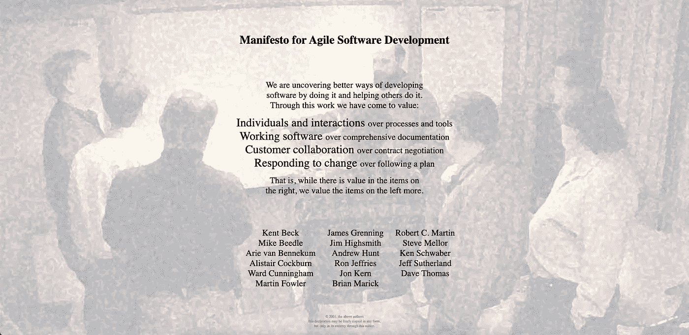
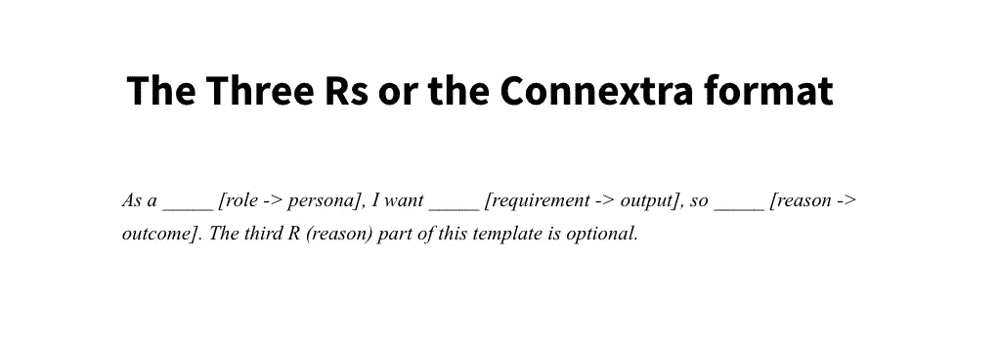
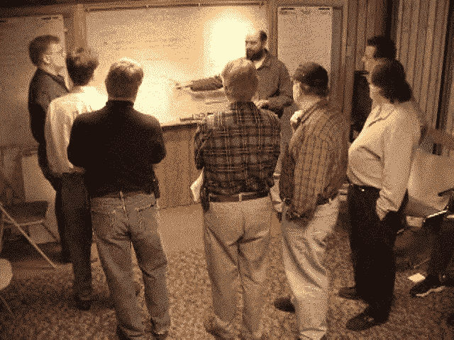
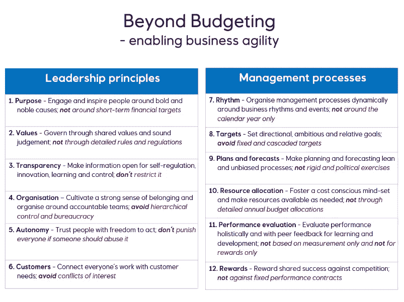

# 敏捷宣言 20 年

> 原文：<https://betterprogramming.pub/agile-software-development-manifesto-be453882314>

## [软件工程](https://rakiabensassi.medium.com/list/software-engineering-7a179a23ebfd)

## 二十年敏捷实践的反思

敏捷软件开发宣言([来源](https://agilemanifesto.org/)

> 2001 年 2 月 11 日至 13 日，在犹他州瓦萨奇山脉雪鸟滑雪场的小屋，17 个人聚在一起聊天、滑雪、放松，并试图找到共同点——当然，还有吃饭。出现了敏捷的“软件开发”宣言。来自极限编程、SCRUM、DSDM、自适应软件开发、Crystal、特性驱动开发、实用编程的代表，以及其他同情文档驱动的、重量级软件开发过程的需要的人召集了会议。
> 
> — [吉姆·海史密斯](https://agilemanifesto.org/history.html)

2021 年 2 月是《敏捷软件开发宣言》发表 20 周年——这是软件市场的一场革命，影响了许多行业。

即使宣言没有改变，其理解的应用也因地而异。我从事敏捷软件开发已经十多年了。在此期间，作为一名自由工程师，我目睹了十多家公司使用敏捷——所有公司都以不同的方式实现它。

我见过:

*   因为看不到评估的具体好处而放弃评估的团队。
*   据至少一个开发人员说，一个 scrum 大师不允许任何故事被添加到没有准备好的 sprint 中，并且遗漏了一些细节。通过应用这个约束，团队结束了花费大约 30%的时间讨论清晰性、准备情况和评估故事。这种经历对产品负责人来说是有压力的，他被指责没有做好自己的工作，并准备了糟糕的描述。
*   一名开发人员被指控反对 scrum，因为他们改进了 UI 并清理了代码，这在为 sprint 计划的故事中是不需要的。
*   人们把敏捷解释为一个发挥创造力的空间，一种你可以展示你的新想法和挑战现有状态的方法。
*   一个大约有 13 名成员的 scrum 团队:UX 设计师、测试人员、开发人员、后端、前端、iOS 和 Android 开发人员。该团队中的所有开发人员都参加了每个故事的评估会议。然后，为了增强敏捷性的实现并减少角色之间的差距，团队开始应用结对编程。每个开发人员必须和他的每个队友结对编程——一个 iOS 开发人员和 Java 开发人员，一个 JavaScript 开发人员和一个 Android 开发人员，一个 Android 开发人员和一个 iOS 开发人员，等等。

每日站立练习是我见过的所有敏捷或 scrum 团队使用的唯一练习。

在这篇文章中，我们将看看敏捷的概念，实践是如何随着时间的推移而变化的，以及在一个不断变化的世界中它将走向何方。

# 敏捷到底是什么？

Taiga 的团队从近 15 年的敏捷经验中提炼出了两条原则。第一个原则是:

## **团队是集体团结一致的表现**

> “……像我们在这一原则中所述的这样一个团队能够应对起起落落，并理解每一项决策背后的原因。更少的认知失调，更多的同理心，一个更可持续的过程可以在这里蓬勃发展。”

根据谷歌的内部研究，[心理安全](https://medium.com/swlh/characteristics-of-successful-team-60272e59a2c6)是团队成功的最关键因素。虽然全世界都在关注敏捷的技巧和诀窍，但是“*个人和交互比过程和工具*更重要”的中心思想仍然很难正确理解。

我们需要"*围绕有积极性的个人建立项目。给他们所需的环境和支持，并相信他们能完成工作*”这是敏捷宣言背后的第五个[原则](http://agilemanifesto.org/principles.html)所坚持的。

Taiga 团队的第二个敏捷原则是:

## 浪费是可以容忍的，不可容忍的是不跟踪浪费

> “敏捷经常被认为是一个非常好的废物减少器。废物有各种形状和颜色。完成不需要的工作，没有相关利益相关者参加的会议，没有适当的优先级，早期优化，技术债务(在软件开发中)，低总线系数…浪费越多，可预测性越低。
> 
> 只要团队意识到这种浪费的来源，并在某些情况下以某种方式接受它，压力就可以增加一点，并允许一些额外的自由度，这可能会导致更少的总体浪费。"

# 敏捷实践中的变化

在一个不断变化的世界中，人们对软件应该做什么的期望越来越高，单个程序员已经被团队所取代。这增加了沟通和协调的复杂性，使得坚持传统的软件工程方法成为一个糟糕的选择。

在她的文章“[20 Jahre Agiles Manifest—definitv den Kinderschuhen entwachsen](https://www.heise.de/hintergrund/20-Jahre-Agiles-Manifest-definitiv-den-Kinderschuhen-entwachsen-5049684.html)”中，商业教练兼变革经理尤塔·埃克斯坦(Jutta Eckstein)提供了一份敏捷性变革清单。以下是摘录:

*   评估不再有任何附加价值。如果团队确保故事总是大小相同，那么就没有必要评估每一个单独的故事。
*   很长一段时间以来，只有当故事符合 [Connextra](https://learning.oreilly.com/library/view/user-experience-mapping/9781787123502/92d21fe3-a741-49ff-8200-25abf18c98d0.xhtml) 格式(“作为一个……我想要……所以……”)时，它们才会被认可或接受。相反，人们现在再次提到这样一个事实，即故事只是作为一种关于故事内容的对话备忘录(对话笔记没有格式)。

三 Rs 或 Connextra 格式([图像源](https://learning.oreilly.com/library/view/user-experience-mapping/9781787123502/92d21fe3-a741-49ff-8200-25abf18c98d0.xhtml)

*   心流变得越来越重要。这包括这样一个事实，即冲刺或迭代通常不再扮演重要的角色。这意味着团队不是每两周计划一次，而是每天在看板模式下协调哪些可以完成，哪些可以从待办事项列表中添加。这意味着计划更可能是连续的，回顾通常也是连续的反思和修正。

由[拍摄的照片](https://unsplash.com/@airfocus?utm_source=medium&utm_medium=referral)在[的 Unsplash](https://unsplash.com?utm_source=medium&utm_medium=referral)

*   特别是在黑人的命也是命示威的高潮期间，有人呼吁重新命名 Scrum Master 角色(因为术语“Master”在历史上是用来区分它和 slave 的)。然而，Scrum 社区已经通过了这个建议。(与 GitHub 相反，在 GitHub 中，Master 在讨论过程中被重命名为 Main。)
*   随着开发速度的提高，像 DevOps 这样的新运动有助于创造一种更好的方式，在更广阔的背景下看待软件开发。然而，DevOps 的基本思想并不总是被理解。越来越多的公司将 DevOps 团队放在开发团队旁边，或者担任 DevOps 工程师的角色。他们忽略了一个事实，即 DevOps 是一种态度，一种文化，而不是一种职能，角色或特殊任务。

尤塔·埃克斯坦补充道，作为宣言基础的“轻量级”方法如今几乎没有仍然发挥作用的了。这些包括，例如，水晶方法或适应性软件开发。极限编程(XP)近年来经历了一个上升期，因为 Kent Beck 在因个人原因多年未露面后向社区做了报告。

同样值得注意的是，第三个敏捷宣言原则有一个短见，它将软件交付的频率限制在“几个星期”，但是 DevOps 和连续交付周期现在允许我们在一天内发布多个软件。[鲍勃大叔关于这一点的回答](https://techbeacon.com/app-dev-testing/uncle-bob-martin-agile-manifesto-15-years-later)如下:

> “在 2001 年的时候，我们无法想象能在几周内完成任何事情。Tom Gilb 是社区中唯一一个可以参加会议的人，但是他没有出席会议。我们认为两周是下限，没有人费心去挑战它，这显然是短视的。”

一些雪鸟参与者围绕着 2001 年宣言的文本([图片来源](https://agile-lounge.com/18-years-of-agile-manifesto-for-software-development/)

# 敏捷何去何从？

敏捷性不再仅仅在软件开发的上下文中被理解，即使清单清楚地有那个确切的焦点。我们认为“扩展敏捷”是基于整个组织需要按照敏捷原则运作这一信念的回应。业务敏捷性现在是一个越来越热门的话题。

为了将敏捷哲学应用到传统的企业流程中，Bjarte Bogsnes 在他的文章“[敏捷转型和房间里的大象](https://www.agilealliance.org/agile-transformation-and-the-elephant-in-the-room/)”中强调了一个主要挑战:

> “很难使用同样的框架和同样的语言来扩展敏捷，而这种框架和语言在转变软件开发方面做得非常好。”对于不熟悉橄榄球的高管来说,“Scrum”听起来像是一种皮肤病。“冲刺”不是跑得更快。“懈怠”不是懒惰。“连续交付”不是高效的装配线。
> 
> 我们需要一个翻译，帮助管理团队更好地理解敏捷在公司层面的含义。业务敏捷性在实践中真正意味着什么？"

根据博格斯的说法，“房间里的大象”是旧的管理过程:预算。因为它被视为商业法则，不可避免且不可触及，同时，如果不改变它，任何敏捷转型都将举步维艰。

> “我们正在讨论预算 ***，*** 这可能是敏捷转型最根本的障碍。不仅仅是年度预算和预算过程本身，还有它背后的思维方式。两者在很多方面都是敏捷的对立面。预算建立在两个基本假设上:未来是可预测的，人们是不可信任的。它不会变得更加不灵活。”博格斯写道。

根据 Bjarte Bogsnes 的说法，世界上许多组织已经通过遵循 12 条超越预算原则解决了这个问题，并为他们的流程增加了业务敏捷性。“预算编制”可以成为一种领导文化和绩效管理体系，而不是狭义的计划和控制。

业务敏捷性:超越预算原则的 12 条([图片来源](https://www.agilealliance.org/agile-transformation-and-the-elephant-in-the-room/))

# 最终想法

尽管近年来出现了各种其他宣言——如[敏捷营销宣言](https://agilemarketingmanifesto.org/)、[敏捷人力资源宣言](https://www.agilehrmanifesto.org/)、[敏捷 2](https://agile2.net/agile-2/the-values-and-principles-of-agile-2/) 、[敏捷之心](https://heartofagile.com/)和[现代敏捷](https://modernagile.org/)——这些替代方案并不能取代最初的宣言。

像[大声工作](https://workingoutloud.com/)和[专注于敏捷的一个方面的新工作](https://en.wikipedia.org/wiki/New_Work)这样的发展也表明敏捷思想仍然流行，尽管宣言已经写了 20 年了。

> 我们通过自己动手和帮助他人来发现开发软件的更好方法。通过这项工作，我们得到了价值:
> 
> ***个人与交互*** *超过流程与工具*
> 
> ***工作软件*** *综合文档*
> 
> ***客户协作*** *合同谈判*
> 
> ***响应变化*** *超过跟随计划*
> 
> *也就是说，虽然右边的项目有价值，但我们更看重左边的项目。*
> 
> *—* [*敏捷宣言*](http://agilemanifesto.org/)

🧠💡我为一群聪明、好奇的人写关于工程、技术和领导力的文章。 [**加入我的免费电子邮件简讯独家访问**](https://rakiabensassi.substack.com/) 或在此注册媒体。