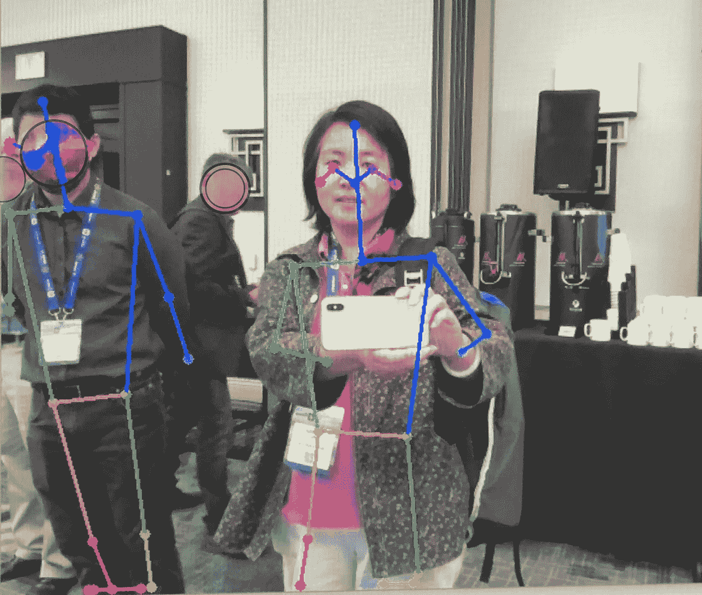
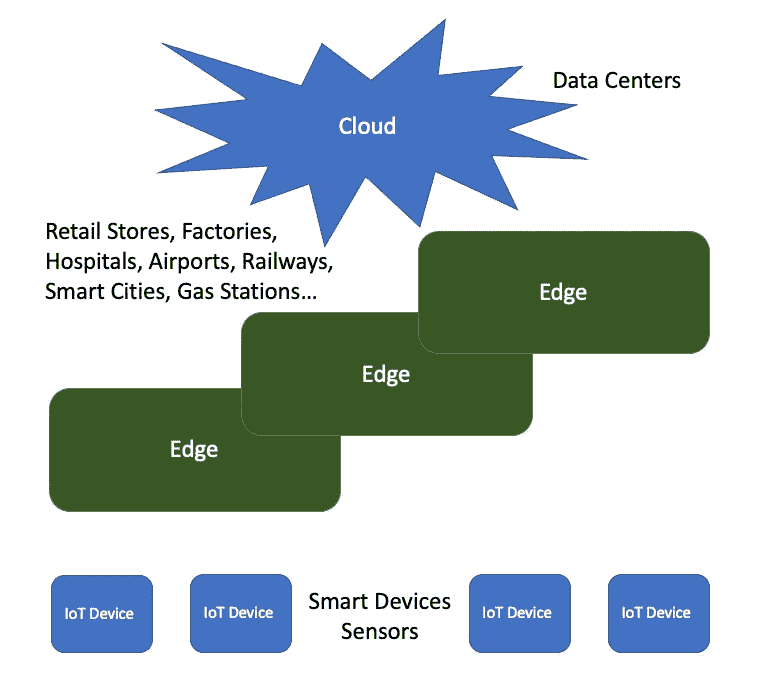
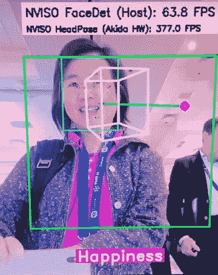
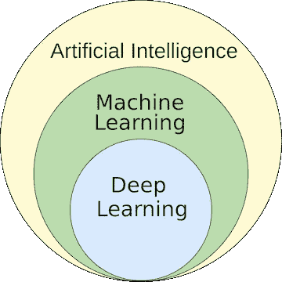
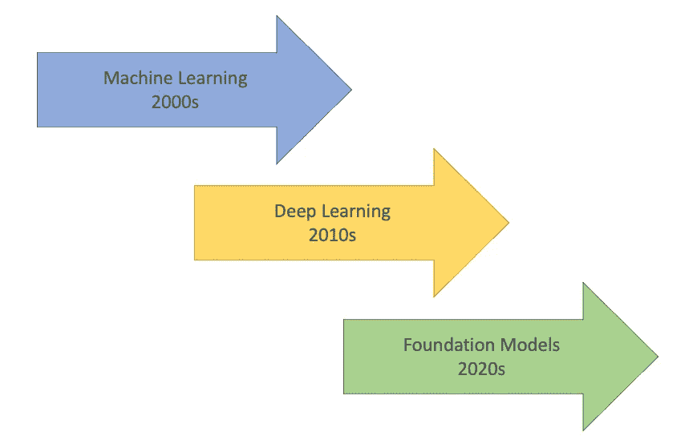

# 2022 年的人工智能前沿

> 原文：<https://betterprogramming.pub/ai-frontiers-in-2022-5bd072fd13c>

## 人工智能硬件峰会和 2022 年边缘人工智能峰会的要点



作者制作的图像——由神话演示系统制作的对象模型

[人工智能硬件峰会](https://aihardwaresummit.com/events/aihardwaresummit)于 2022 年 9 月 13 日至 15 日在加州圣克拉拉万豪酒店举行。它专注于系统优先的机器学习，以减少 ML 生命周期中的价值实现时间，并为 AI 开发开启新的可能性。在 2022 年感受人工智能的脉搏并了解其前沿是一件大事。

今年，人工智能硬件峰会首次与[边缘人工智能峰会](https://www.kisacoresearch.com/events/edge-ai-summit)同处一地，专注于经济、高效和优化的边缘人工智能。两次会议的通行证。这是人工智能专家聚集在一起，构建更好技术的绝佳机会。

以下是我们从两次峰会中学到的东西:

```
[Edge AI is a huge growth and performance improvement opportunity](#f1b0)[AI chips can detect human emotions](#8b02)[TPG can be used for edge AI](#5d66)[Foundation models bring a new era of AI](#7787)[Next steps for large-scale AI infrastructure](#1846)
```

# 边缘人工智能是一个巨大的增长和性能提升机会

Edge AI 正在整个物理世界的设备中部署 AI 应用程序。它位于网络的边缘，靠近数据所在的位置。



作者图片

*   边缘计算可以发生在物联网设备上，这些设备是智能设备或传感器。它为设备提供了最短的延迟和最高的带宽。
*   edge 有多个层，具有不同的 API 功能。物联网设备是能力较弱的设备；更有能力的边缘是零售店、工厂、医院、机场、铁路、智慧城市、加油站等。更大规模的边缘有更多的计算能力和存储容量来执行 AI 处理。
*   云、虚拟或物理数据中心在计算能力、可扩展性、安全性、能源和存储方面拥有最佳的编程环境。然而，由于云远离数据所在的位置，它到达设备的延迟和带宽最差。

AI 解决方案不限于一层。通常，它跨越多个层，利用智能设备的快速响应和在更强大的边缘和最强大的云上增加的人工智能能力。

例如，车辆传感器在检测到物体时会发出嘟嘟声，车辆网络会自动调整汽车方向以避免碰撞。这些记录被发送到交通中心进行初步处理。所有数据都在交通云中进行汇总和处理，在那里，驾驶建议会不那么紧急地发送给司机。

由于深度学习(神经网络训练和推理)的成熟和计算能力的增强，Edge AI 取得了进步。5G 还通过更快、更稳定、更安全的连接来推动物联网设备。Edge AI 将 AI 带入现实生活中的设备和强大的数据中心。Edge AI 是一个巨大的增长和性能提升机会。

# 人工智能芯片可以检测人类的情绪

边缘计算可以发生在物联网设备上。有传统的 AI 模型，如[回归分析](/machine-learning-theory-and-programming-supervised-learning-regression-analysis-8ed2d86f5714)、[逻辑回归](https://enlear.academy/logistic-regression-in-machine-learning-672c0e8c8053)、[神经网络](https://medium.com/geekculture/machine-learning-theory-and-programming-supervised-learning-neural-networks-74a598cb9e42)、[支持向量机](https://javascript.plainenglish.io/machine-learning-theory-and-programming-supervised-learning-support-vector-machine-d6cc7a5747f1)、[多类分类](https://javascript.plainenglish.io/machine-learning-theory-and-programming-supervised-learning-for-multiclass-classification-ee0d9d32150e)、 [K-Means 聚类](https://javascript.plainenglish.io/machine-learning-theory-and-programming-unsupervised-learning-k-means-clustering-52eeea41cba0)。边缘 AI 模型更具有任务针对性，例如通用检测器、高速检测器、分类器、密度、重新识别、个人防护设备(PPE)、热检测器、人脸检测、人脸识别、人脸特征检测、场景分割和骨架检测器。

我们已经在很多展台看到了人脸和人脸特征检测。这是在[大脑芯片](https://brainchip.com/)展台拍的照片。



作者图片

神经形态处理器 IP Akida 模拟人脑，在采集点分析重要的传感器输入。它是由 Akida 完全可定制的基于事件的 AI 神经处理器在边缘进行实时推理和学习。通过推理，芯片得出结论，上面这张脸处于“幸福”模式。其他可用的模式有“中性”和“悲伤”

物体检测在边缘人工智能中很重要。以下是其现状的两个方面:

*   准确性:从物联网设备获得的原始图像可能会因反射、模糊、脏污、雪、雨、雾等而失真。它需要对目标识别和分类进行校准。模型精度不断提高。
*   效率:图像分析需要是实时的，并且可能是高帧率的。它包括地理信息系统(GIS)校准和目标跟踪。边缘计算降低了服务器延迟和带宽。

以下是在 [Mythic](https://mythic.ai/) 展台播放的人群管理视频。

作者提供的视频

它在现实世界的场景中运行人工智能推理。它可以实时识别人群中的物体。

正如我们在[的另一篇文章](/reading-the-tea-leaf-from-the-first-ever-mlops-conference-7f507990a392)中所讨论的，技术进步必须遵循规则。通用数据保护条例(GDPR)是欧盟法律中关于数据保护和隐私的条例。它保护个人数据的处理和这些数据的自由流动。

既然人工智能处理器如此强大，可以读取我们的状态并将其存储在某个地方，那么关于我们的数据，我们有多少隐私？成熟的边缘市场带来了机遇和挑战。

# TPG 可以用于 Edge AI

[中央处理器(CPU)](https://en.wikipedia.org/wiki/Central_processing_unit) 是执行包含计算机程序的指令的电子电路。它被认为是计算机的大脑。

[图形处理单元(GPU)](https://en.wikipedia.org/wiki/Graphics_processing_unit) 是一种专用处理器，旨在操纵和改变内存，以加速在帧缓冲区中创建图像，并输出到显示设备。GPU 用于游戏、工作站、云、人工智能培训、自动驾驶汽车等。

[张量处理单元(TPU)](https://en.wikipedia.org/wiki/Tensor_Processing_Unit) 是 Google 为神经网络机器学习开发的 AI 加速器专用集成电路(ASIC)，使用 Google 自己的 TensorFlow 软件。谷歌于 2015 年开始在内部使用 TPU，并于 2018 年将其提供给第三方使用。2018 年 7 月，谷歌宣布了 Edge TPU，旨在为边缘计算运行机器学习模型。

TPG 可以用于边缘人工智能，更多的供应商正在研究 TPU 作为人工智能加速器。

# 基础模型带来人工智能的新时代

机器学习已经成为人工智能的一部分。它是对计算机算法的研究，可以通过经验和使用数据自动改进。深度学习是机器学习的一个子集，是一个有三层或更多层的神经网络。深度学习试图模拟人脑的行为来从大量数据中学习。



Lollixzc，CC BY-SA 4.0<[https://creativecommons.org/licenses/by-sa/4.0](https://creativecommons.org/licenses/by-sa/4.0)>，通过维基共享

人工智能已经从一个纯粹的学术努力发展成为一种力量，推动着无数行业的行动，影响着数百万人的日常生活。机器学习盛行于 2000 年代，深度学习主导了 2010 年代。2020 年代，是粉底模特的新时代。



作者图片

对于这个新时代，人工智能希望取代主导人工智能领域的特定任务模型。术语[基础模型](https://crfm.stanford.edu/)是由斯坦福以人为中心的人工智能研究所定义的:

> 近年来，一种新的构建人工智能系统的成功范式已经出现:在大量数据上训练一个模型，并使其适应许多应用。我们称这样的模型为基础模型。

它还提到，基金会模型已经证明了令人印象深刻的行为，但可能会意外失败，怀有偏见，并很少被理解。尽管如此，他们正在大规模部署。这是来自 [OpenAI](https://openai.com/) 的两个成功的例子:

*   [生成式预训练变压器 3 (GPT-3)](/exploring-gpt-3-in-next-js-4a2744011827) 是一个自回归语言模型，产生类似人类的文本。输入一个简短的提示，系统会生成一整篇文章。
*   DALL-E 2 是一个新的人工智能系统，可以从自然语言描述中创建逼真的图像和艺术。本文的[头像是由](/is-deno-ready-for-primetime-a1ea5cd4bea1) [Anupam Chugh](https://anupamchugh.medium.com/) 使用 DALL-E 2 生成的。

SambaNova 展示了基础模型平台 [DataScale](https://sambanova.ai/products/datascale/) ，它有四层产品:芯片、软件、系统和服务。

# 大规模人工智能基础设施的下一步

根据国际数据公司(IDC)的数据，全球在人工智能系统上的支出将从 2021 年的 853 亿美元跃升至 2025 年的 2040 亿美元以上。2021–2025 年期间的复合年增长率(CAGR)将为 24.5%。

研究人员和开发人员正在研究大规模人工智能基础设施的下一步措施:

*   硬件架构很重要。具有人工智能优化加速器的高性能计算机必须为人工智能模型提供更强的计算能力。
*   软件比硬件更重要。高效利用计算能力的软件，比如训练稀疏神经网络，对 AI 开发更有意义。
*   数据中心环境的计算能力、可扩展性、安全性、能源和存储都很重要。
*   甚至冷却也很重要。对于高密度的计算设备，数据中心的冷却环境需要精心设计。可以选择使用外部空气、冷水、温水和/或温水进行冷却。

# 结论

为期三天的峰会结束了。我们了解到，边缘人工智能是一个巨大的增长和性能改善机会，成熟的边缘市场带来了机遇和挑战。

继机器学习和深度学习之后，基础模型开始了一个新时代。GPT-3 和 DALL-E 2 是 OpenAI 的大型项目。研究人员和开发人员正在研究大规模人工智能基础设施的下一步措施。

AI 硬件峰会暨 Edge AI Summit 2022 后一周， [NVIDIA GTC (GPU 技术大会)](/ai-is-fuel-in-nvidia-gtc-20889051753)召开，从另一个角度展示了 AI 前沿。

感谢阅读。

```
**Want to Connect?**If you are interested, check out [my directory of web development articles](https://jenniferfubook.medium.com/jennifer-fus-web-development-publications-1a887e4454af).
```

*备注:*

*   *感谢*[*kisa co Research*](https://www.kisacoresearch.com/)*邀请我参加这两个峰会，与人工智能专家见面，交流未来人工智能发展的想法。*
*   *感谢许多演讲者为本文提供内容。*
*   感谢许多展台向我展示了正在研发的优秀人工智能产品。