# 人工智能生成的解说视频，史蒂夫·人工智能和 ChatGPT

> 原文：<https://betterprogramming.pub/ai-generated-explainer-videos-with-steve-ai-and-chatgpt-13b21751d8ec>

## 不花一分钱就开始

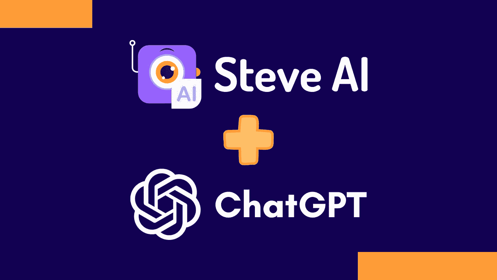

史蒂夫·艾和 ChatGPT

我正在寻找不同的用例来使用 ChatGPT，看看它如何使我的生活更有成效，帮助我更有效率，或者只是为了获得一些乐趣和灵感。

当人工智能遇到人工智能时，一些最有趣的事情就会发生，所以我和 ChatGPT 一起创建了一个由人工智能生成的解释者视频。

讲解视频是简短的动画视频，解释一个概念、过程或想法。它们经常被用来推销产品、教授技能或解释复杂的话题。人工智能驱动的解释器创建工具使用来自用户的输入文本，主要称为脚本，并使用该文本生成视频的第一个版本。

因此，事不宜迟，让我们深入了解如何使用生成文本的人工智能和创建视频的人工智能快速实现惊人的结果。

# 聊天 GPT 简介

[ChatGPT](https://chat.openai.com/chat) 是由 OpenAI 开发的自然语言处理(NLP)工具。它是流行的 GPT-3 语言模型的变体，后者是一种经过训练可以生成类似人类文本的机器学习模型。

ChatGPT 提供了各种用例，只要它们与文本有关。你可以让它回答问题，从文本中生成代码，一起集思广益，创建营销文本，商业想法——你能想到的。

# 史蒂夫·艾简介

[Steve AI](https://www.steve.ai/) 是一个人工智能网络平台，使用户能够快速轻松地创建视频、动画和其他视觉效果，并提供大量不同的内容设计风格。

史蒂夫·人工智能将你的文本作为输入，试图理解它，并根据你输入的上下文生成视频场景。然后，你可以根据自己的需要调整这些场景的内容，并让史蒂夫·艾渲染最终的视频。

您可以根据自己的需求轻松定制内容的外观和感觉，并提供多种选项来创建引人入胜的视觉效果。

# 用 ChatGPT 编写视频脚本

对于我的试验，我想制作一个视频，解释我作为 Azure 云解决方案架构师在日常业务生活中所做的工作。我向 ChatGPT 寻求帮助。我给了 ChatGPT 足够的背景来写一个视频脚本，尽可能具体地解释我的工作。

> 我想用人工智能驱动的 explainer 视频创建器创建一个视频。请写一个视频脚本，描述非开发人员我作为 Azure 云解决方案架构师在做什么。解释令人兴奋和易于理解的是，我使用 Microsoft Azure 规划、构建和开发集成平台。这些平台使用其他开发团队来方便地开发集成项目，以便应用程序和服务可以在混合云和本地场景中相互通信。还要说明我负责提高上述平台的安全性、成本和性能。我还注意执行政策和遵从治理。

从这个提示开始，ChatGPT 回复了一个已经有很好内容的文本，这对于不在一片绿地上开始特别有用。但是它太长了，也有点太专业了。这就是 ChatGPT 开始发光的地方，因为从那时起，我就像一个头脑风暴的伙伴一样使用它。我们一起修改了文本，同时我继续询问类似于*“请解释长段短段***或*“为非开发人员解释得更容易理解”*的提示。**

**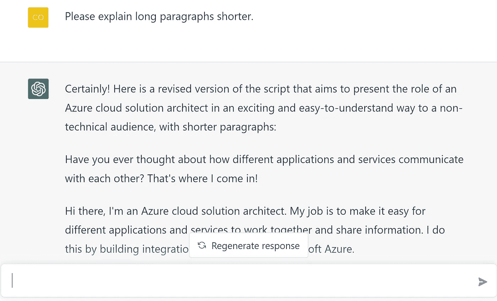**

**ChatGPT 用户界面**

**所以最后我得到了下面的脚本:**

> **你有没有想过不同的应用程序和服务是如何相互通信的？这就是我进来的地方！**
> 
> **大家好，我是 Azure 云解决方案架构师。我让不同的应用程序和服务能够轻松地协同工作并共享信息。我使用微软 Azure 构建集成平台。**
> 
> **想象一下，这些平台是连接不同应用程序和服务的桥梁，允许它们无缝地通信和协同工作。[..]**

**有了这个剧本，我就可以开始和史蒂夫·艾合作了。**

# **史蒂夫·艾上场了**

**在我的试验中，我只使用了史蒂夫·艾的免费订阅，在我的情况下，已经有足够的内容可以玩了。最后，你会在你的视频上有一个水印，所以当用例变得更专业时，你肯定会想获得一个付费订阅，从每月 15 美元开始。**

**在仪表板上，我从一个“自动生成脚本”项目开始，已经出现了一堆选项，我从中选择了我认为最适合我的情况的选项。**

**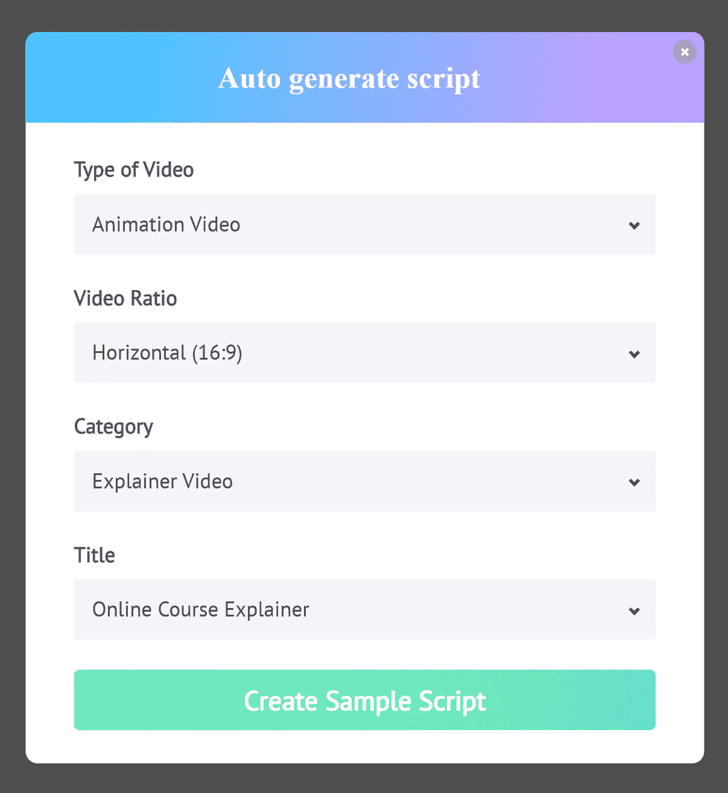**

**新视频项目的开始设置**

**接下来，我从最后一个 ChatGPT 响应中复制了整个内容(没有第一段和最后一段)，并将其一次性粘贴到编辑器中。很好，史蒂夫·艾已经能把我的文本分成不同的场景了。此外，我选择了“自动突出显示”和“添加画外音”。**

**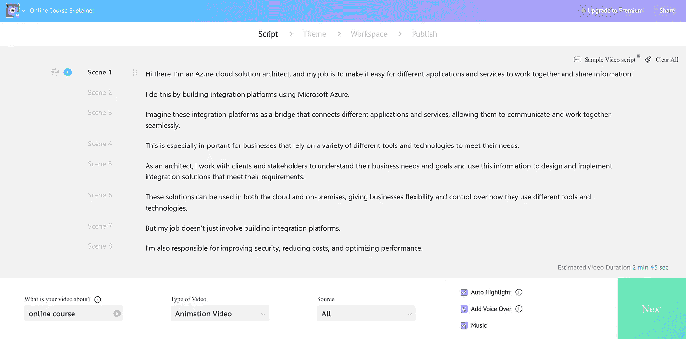**

**粘贴 ChatGPT 文本后的脚本**

**我可以从不同的设计风格中进行选择，每种风格都有一个视频示例。我选择了“努力”的风格。**

****

**可用设计风格的选择**

**在我选择了我喜欢的设计风格后，轮到史蒂夫了。AI 开始生成所有场景，提供带有扬声器的书面文本、动画角色、场景过渡和图标——所有这些都是 AI 认为最适合我提供的脚本的。**

**几秒钟后，编辑器和生成的场景出现在我面前，我已经准备好了。**

**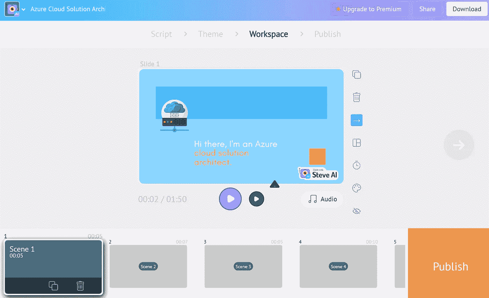**

**史蒂夫·艾编辑**

**人工智能选择的角色是一个女人，所以我需要把它改成一个男性角色，希望它看起来至少有点像我自己。**

**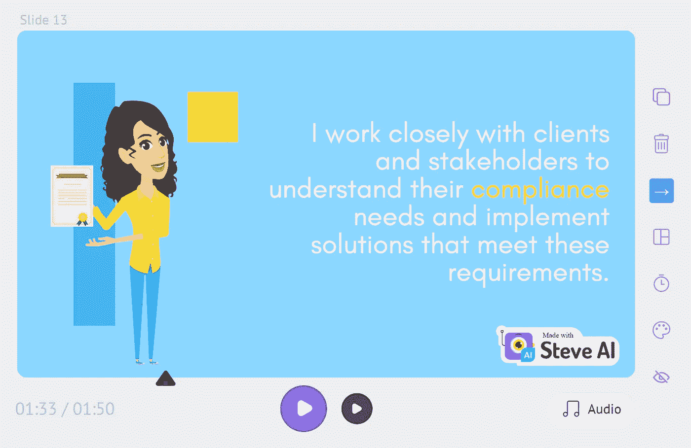**

**自动生成的女性角色场景**

**所以我去了有一个角色的每一个场景，并可以通过从各种角色中进行选择来轻松地改变它。所有这些都与现有的动画流畅地工作。也许有一种方便的方法可以一次改变所有的角色，但是我还是想检查所有的场景。**

**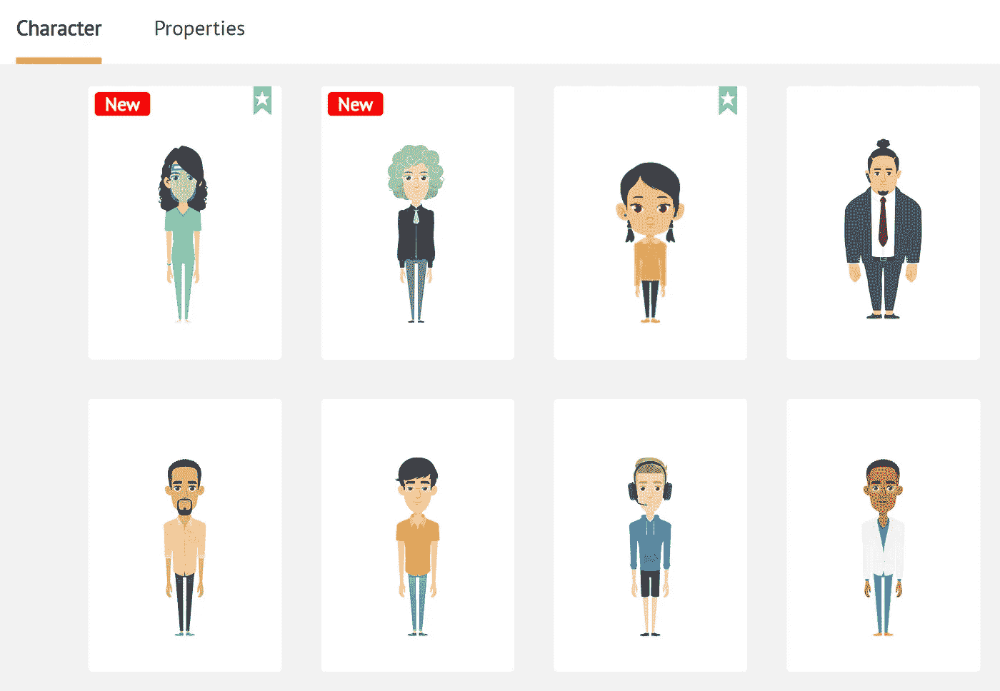**

**可用字符示例**

**最后，“我”展示了这个视频:**

**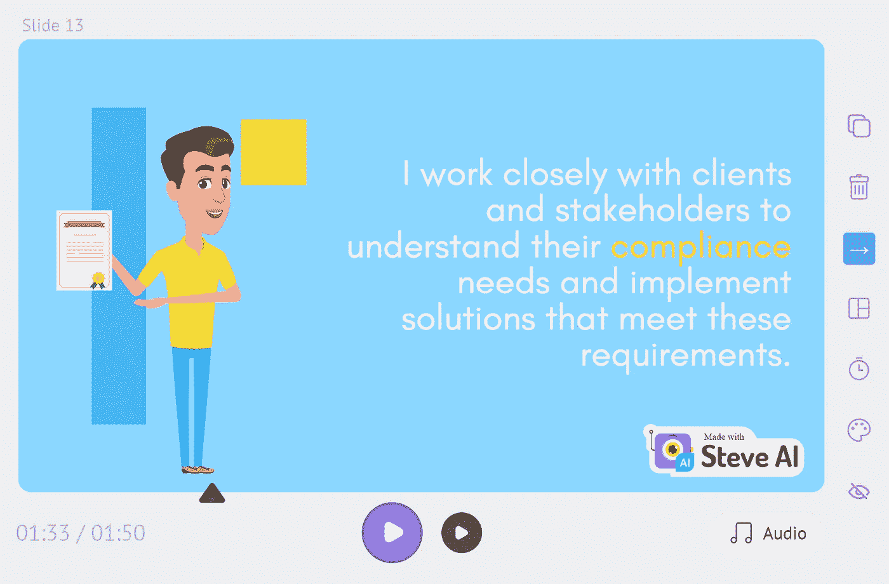**

**角色改变后的相同场景**

**即便如此，大部分的图像对我的剧本来说已经很好了，我想改变一个或另一个，这很容易，给我的感觉是，我至少在这个过程中有点创造力…**

**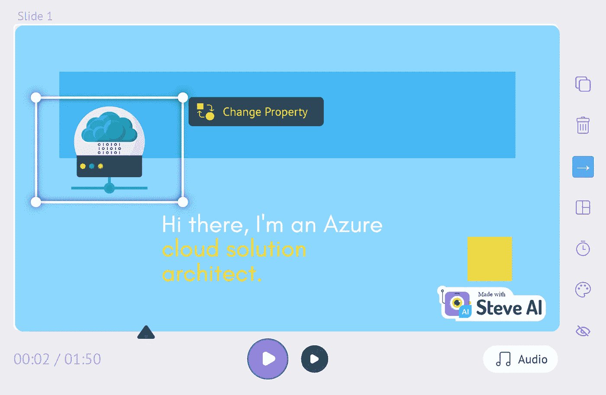**

**改变图像和图标很容易**

**改变提供的角色动画也很容易，史蒂夫 AI 提供了许多不同的动画，所有这些都适用于每个角色。**

**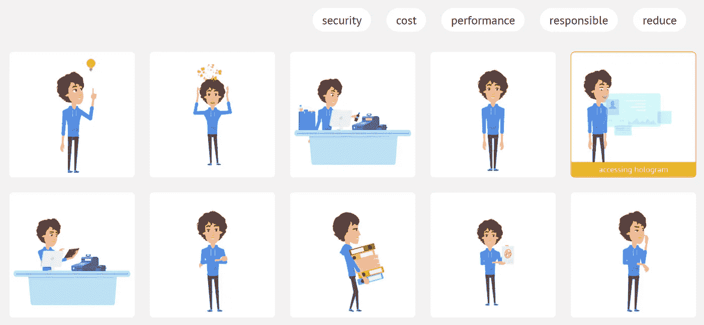**

**改变动画也很容易**

**最后想换个背景音乐，占了大部分时间。不是因为它很难——远非如此——而是因为我非常挑剔。搜索体验还不错，你已经可以试听每首歌了。**

**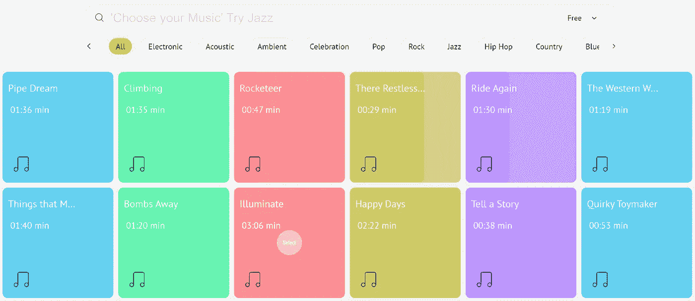**

**可用背景音乐示例**

**当然，有几个图像、人物、动画、音箱、音乐标题都是付费订阅才有的。但是免费内容已经很全面了，玩起来很有趣。**

## **最后，还有视频**

**我并没有刻意改变太多，所以我能够看到 ChatGPT 和 Steve AI 已经可以自己创造出什么。我只是改变了角色、两个图标和一个动画——还有背景音乐。**

**我们开始吧，这是史蒂夫·艾几分钟后创作的视频:**

**我并不是说这是我见过的最令人印象深刻的讲解视频，但在 ChatGPT 和 Steve AI 的不到一个小时的工作中，结果在我看来相当令人印象深刻！**

**史蒂夫 AI 真的有一吨的内容可以乱来，编辑器工作得很好，支持你变得有创意！另外，ChatGPT 做了很棒的工作，集思广益，准备了一个我可以用来入门 Steve AI 的脚本。**

**你肯定会想要调整这两个人工智能工具的结果，而不仅仅是使用它们产生的第一个结果，但是最终，你会得到一些非常惊人的结果，只需要不使用这些工具所需时间的一小部分。**

**解说视频编辑器并不便宜，但最终，仍然非常值得的价格。我只能想象他们需要付出多少努力才能得到现在的服务。**

**试试看，你可以不花一分钱就开始。**

**感谢阅读。**