# 人工智能如何推动英伟达 GTC

> 原文：<https://betterprogramming.pub/ai-is-fuel-in-nvidia-gtc-20889051753>

## 英伟达 RTX、英伟达 Omniverse 和英伟达 AI 是会议的主要议题


克里斯蒂安·威迪格在 [Unsplash](https://unsplash.com?utm_source=medium&utm_medium=referral) 上拍摄的照片

[NVIDIA GTC (GPU 技术大会)](https://en.wikipedia.org/wiki/Nvidia_GTC)是一个面向开发者的全球人工智能大会，汇集了开发者、工程师、研究人员、发明家和 IT 专业人士。会议主要关注人工智能，计算机图形学，数据科学，机器学习和自主机器。

今年，GTC 于 2022 年 9 月 19 日至 22 日在线举行。英伟达首席执行官黄仁勋的开场白令人兴奋:计算正以不可思议的速度前进。推进这个火箭的引擎是加速计算，它的燃料是 AI。

英伟达 RTX、英伟达 Omniverse 和英伟达 AI 是会议的主要议题。它们都是建立在 GPU 之上的。下面我们就来详细了解一下。

# GPU 和 CUDA 编程

在 GTC 2021 上，斯黛芬·琼斯做了一个演讲，[GPU 计算如何工作](https://www.nvidia.com/en-us/on-demand/session/gtcspring21-s31151/)。它深入研究了 [GPU(图形处理单元)](https://en.wikipedia.org/wiki/Graphics_processing_unit)的架构，这是一种专用处理器，旨在操纵和改变内存，以加速帧缓冲区中图像的创建，并旨在输出到显示设备。GPU 用于游戏、工作站、云、人工智能培训、自动驾驶汽车等。

在 GTC 2022 上，斯黛芬·琼斯做了一个后续的演讲，[CUDA 编程如何工作](https://www.nvidia.com/en-us/on-demand/session/gtcspring22-s41487/)。 [CUDA(计算统一设备架构)](https://en.wikipedia.org/wiki/CUDA)是 GPU 中使用的编程语言。演讲解释了硬件设计如何激励 CUDA，以及 CUDA 如何激励硬件设计。

GPU 是巨大的——有 221，184 个线程和 17，280 KB 的共享内存。为了利用 GPU，我们应该高效地使用它。它每秒能够执行 311，869，440，000，000 次操作，一个好的程序可以通过异步执行、资源平衡和线性访问内存来让 GPU 忙于有意义的工作。

# 英伟达 RTX

英伟达 RTX(光线跟踪纹素极端)是光线跟踪和人工智能技术的最先进的平台，正在彻底改变我们的游戏和创作方式。

## 什么是光线追踪？

光线追踪是三维计算机图形学中的一种技术。它在各种渲染算法中模拟光传输，以生成数字图像。它可以模拟各种光学效果，如反射、折射、柔和阴影、散射、景深、运动模糊、焦散、环境光遮挡和散射现象。

GPU 和 CUDA 编程支持显卡的实时光线跟踪。超过 150 个顶级游戏和应用程序使用光线跟踪来提供逼真的图形，具有令人难以置信的快速性能或尖端的新人工智能功能。

RTX 是基于阿达·洛芙莱斯架构的性能和效率的新标准。它旨在设计建筑和产品设计、科学可视化、能源勘探、游戏以及电影和视频制作中的复杂大型模型。旗舰芯片是 RTX 4090 GPU，它的光线跟踪速度比它的前辈快 4 倍。

下面的截图来自 RTX 制作的视频。实时光线追踪使其栩栩如生。

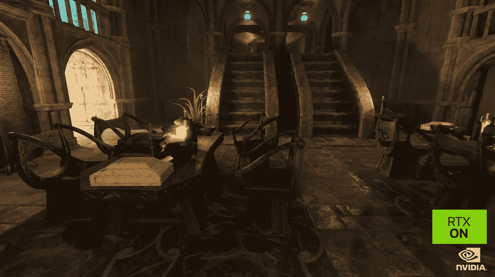

图片来自 GTC

# NVIDIA Omniverse

正如我们在[的另一篇文章](/understanding-metaverse-from-a-developers-perspective-be55d8235345)中提到的，元宇宙定义了 3D 空间，让每个人都能以超乎想象的方式社交、学习、合作和玩耍。元宇宙是多家公司的集体项目。它由全世界的人们创造和分享，对所有人开放。

元宇宙有三个基本要素:

*   XR(扩展现实)——包括 AR(增强现实)、VR(虚拟现实)、MR(混合现实)，以及介于两者之间的一切
*   头像——用户的在线表现
*   数字所有权—基于区块链技术的虚拟资产

NVIDIA Omniverse 是一个构建和运行元宇宙应用的平台。

它可以实现栩栩如生的化身，例如龙。

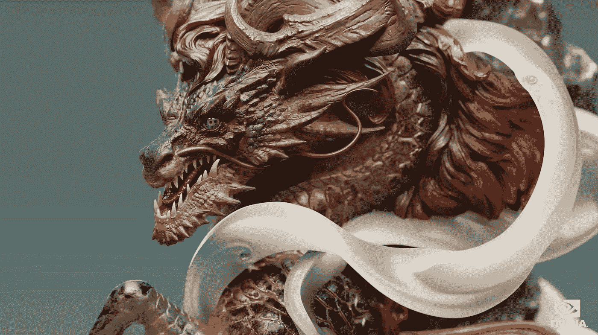

图片来自 GTC

或者是合成女孩。

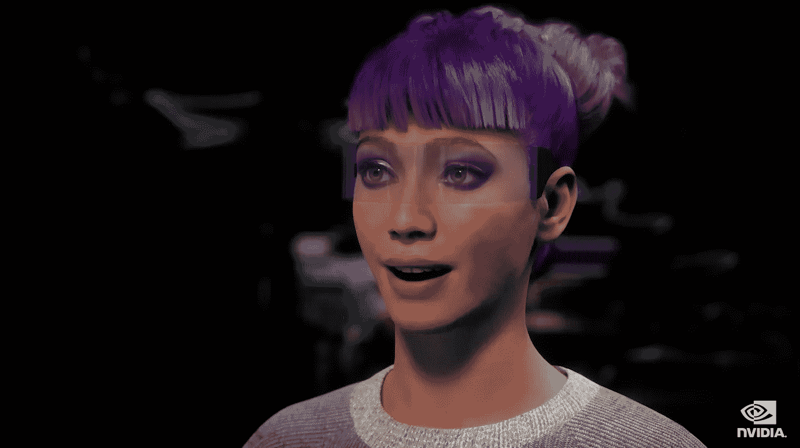

图片来自 GTC

Omniverse 是一个虚拟世界，用于设计、构建和操作物理世界中的事物。换句话说，虚拟世界是现实世界的数字孪生兄弟。

下面的截图是通用汽车公司密歇根设计工作室的数字双胞胎，设计师、工程师和营销人员可以在这里合作。

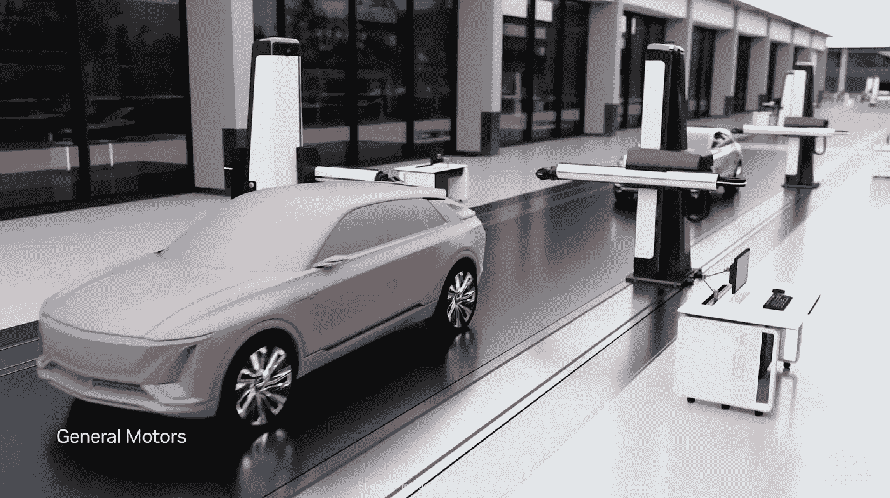

图片来自 GTC

[沉重。AI](https://www.heavy.ai/) 是一家提供高级分析的初创公司，旨在利用大数据支持时间敏感的高影响力决策。它使用 Omniverse 来分析城域和全国范围内的 4G 和 5G 网络。

下面的截图显示了右边的物理世界，和左边的数字世界。

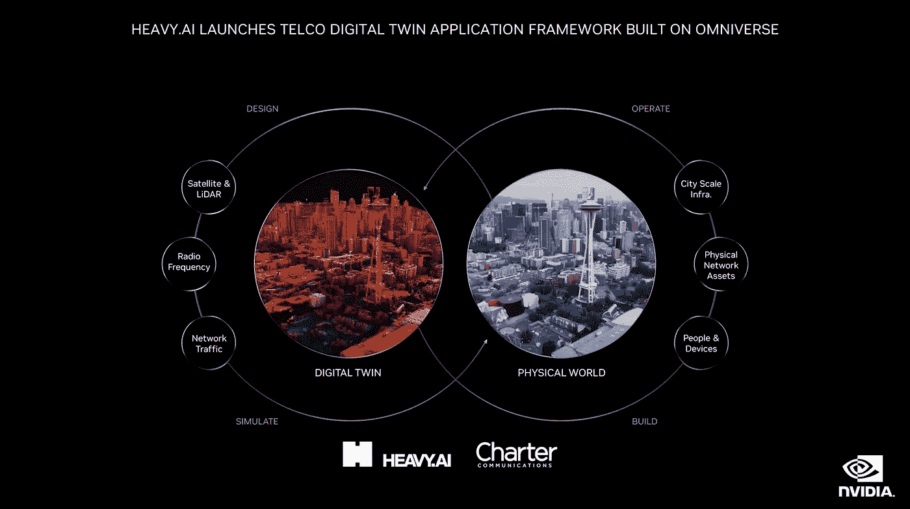

图片来自 GTC

通过 XR 设备，用户可以在 Omniverse 中连接到物理世界和虚拟世界。在下面的截图中，在现实世界的顶部生成了额外的角色。

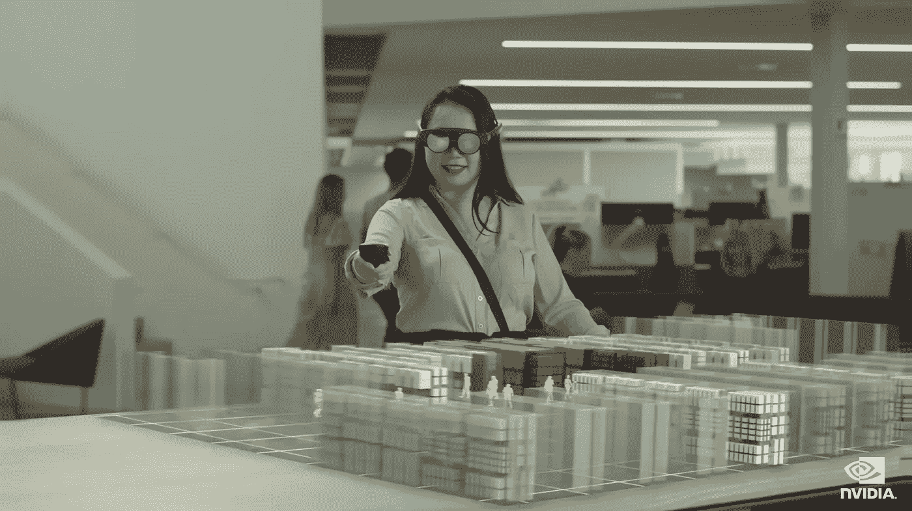

图片来自 GTC

Omniverse 包括三个元素:

*   用户的计算机
*   服务器托管与 Nucleus 数据库的连接，并使用 GPU 运行虚拟世界模拟
*   GDN(图形传输网络)将高性能、低延迟的 3D 体验传输到边缘设备

Omniverse 的连接正在快速增长。目前，有 150 个连接。它包括许多行业，从零售、运输、电信、制造、媒体和娱乐、消费品和奢侈品，到供应链和物流。这可能是一个 100 万亿美元的行业。

# 英伟达机器人公司

机器人技术，包括自动驾驶汽车，是人工智能的下一波浪潮。深度学习的突破打开了创造系统的大门，这些系统可以感知周围的环境，规划一系列行动，并实时执行有用的任务，每次都是如此。

即将推出的 NVIDIA Thor 是专为深度学习设计的新一代机器人处理器。它集中了大量计算机，增强了计算机密度、能效和人工智能推理能力。它用于边缘设备。

目前，自动驾驶汽车使用不同的计算机进行停车、主动安全、驾驶员监控、摄像头后视镜、仪表盘和信息娱乐。有了 Thor，这些功能都可以通过同一台电脑上的软件来处理。

[以下范式](/ai-frontiers-in-2022-5bd072fd13c)在 AI 硬件峰会和 Edge AI Summit 2022 上提出。它描述了云中的人工智能技术和边缘计算的不同层。

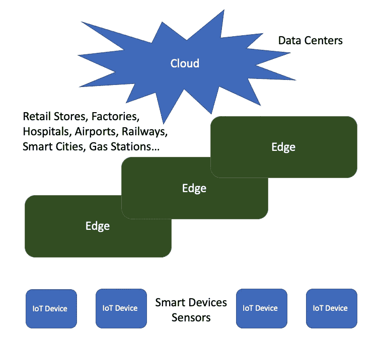

作者图片

这种模式与 NVIDIA 的两个计算机系统的概念是一致的:

*   一台电脑在云中作为人工智能工厂。它通过处理数据、训练人工智能、模拟数字双胞胎和绘制世界地图来开发人工智能。
*   边缘设备中的一台计算机通过处理传感器来操作机器人，以感知环境，避开障碍物，并将汽车开到目的地。

NVIDIA DRIVE 是一个用于自动驾驶汽车开发和部署的端到端平台。它包括一个人工智能管道，可以从记录的传感器数据中构建 3D 场景。3D 场景可以用人类创建的内容或人工智能生成的内容来增强。它能够在全球范围内创建模拟场景。

以下是对生成的雪场景的模拟:


图片来自 GTC

虚拟设计工作室使汽车设计师、软件工程师和电子工程师能够在未来的汽车上合作。

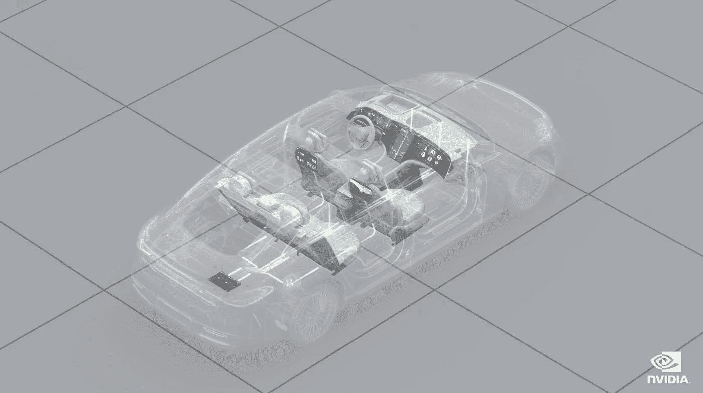

图片来自 GTC

机器人系统是新型计算机。它们是实时系统，能够感知环境，对周围环境进行推理，并根据目标规划行动。

自主车辆的基本处理流水线可以应用于各种机器人系统。NVIDIA 产品已经在各个领域为它们提供了动力。没有具有通用技能的机器人，但是构建机器人系统共享共同的方法和工具。

# 英伟达 AI

今天的人工智能建立在加速计算的基础上，这是一个全栈挑战，需要对问题域的深刻理解，跨每一层计算的优化，以及对所有三个芯片——CPU、GPU 和 DPU——的有效利用。

DPU(数据处理单元)是一种可编程处理器，其片上系统由以下组件组成:

*   行业标准、高性能、软件可编程多核 CPU
*   高性能网络接口
*   灵活且可编程的加速引擎

NVIDIA 持续提供全栈加速计算:

*   提升性能的新芯片
*   新的库加快了科学和工业的关键工作负载
*   新的领域框架有助于开发高性能和易于部署的软件
*   利用丰富的功能安全可靠地部署软件的新平台

已经宣布有 3000 个加速应用，12000 个创业公司，350 万开发者，35000 家公司运行在 NVIDIA AI 上。

CV-CUDA 是一个开源库，旨在构建加速的端到端计算机视觉和图像处理管道。目前，超过 80%的互联网流量是视频。过去需要离线处理的特效现在正在进入云端进行视频直播。CV-CUDA 可以在处理、重新照明、重新定位、模糊背景、超分辨率、人工智能推理和为 AR 创建计算机图形时进行流式处理。

随着新算法和新框架的发展，人工智能继续取得指数级的进步。最近的一项突破是语言处理技术的引入，它使我们能够建立更智能的系统，对语言的理解比以往任何时候都更丰富。

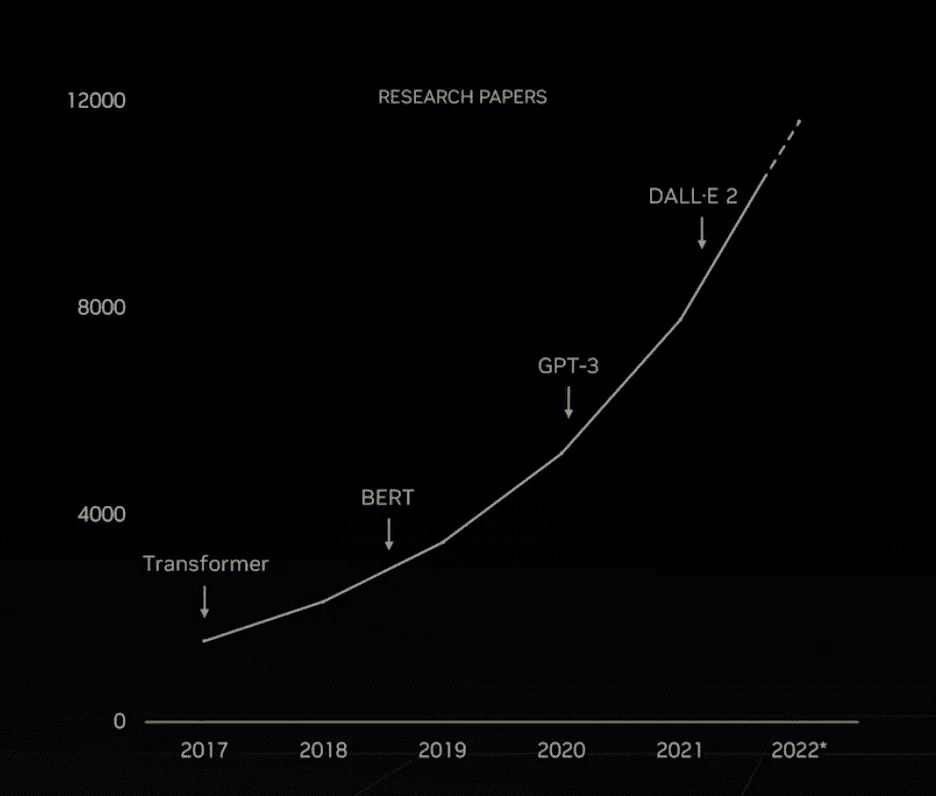

图片来自 GTC

大型语言模型包括以下技术:

*   Transformer:它是一个神经网络，通过跟踪像这句话中的单词这样的顺序数据中的关系来学习上下文，从而学习含义。
*   BERT(Transformers 的双向编码器表示):这是一种预训练语言表示的新方法，可以在各种自然语言处理任务中获得最先进的结果。
*   [GPT-3(生成式预训练变换器 3)](/exploring-gpt-3-in-next-js-4a2744011827) :它是一种自回归语言模型，产生类似人类的文本。输入一个简短的提示，系统会生成一整篇文章。
*   [DALL-E 2](https://medium.com/better-programming/exploring-openai-dall-e-apis-with-next-js-900dc24fbcd6) :它是一个人工智能系统，可以从自然语言描述中创造出逼真的图像和艺术。[这篇文章的特色图片](/is-deno-ready-for-primetime-a1ea5cd4bea1)是由 [Anupam Chugh](https://anupamchugh.medium.com/) 使用 DALL-E 2 生成的。

NVIDIA Hopper transformer 引擎为大型语言模型提供平台。它将训练时间从几天减少到几个小时，或者在更大的模型上，从几个月减少到几周。

NVIDIA NeMo 大型语言模型是一个提示学习框架，它通过训练一个只有几个例子的同伴模型来适应预先训练的语言模型，以执行特定的任务。新的模型被应用于生物学和化学中寻找目标蛋白质和候选药物，它们可以理解化学物质、蛋白质、DNA 和 RNA 序列。

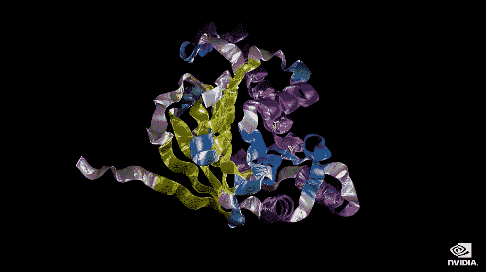

图片来自 GTC

推荐器是一种基于数据分析向用户推荐产品、服务和信息的系统。它是社交媒体、数字广告、电子商务和搜索的引擎。

英伟达格蕾丝·赫柏是大规模人工智能和高性能计算应用的超级芯片。它为运行万亿字节数据的应用程序提供了高达 10 倍的性能，使科学家和研究人员能够为世界上最复杂的问题找到前所未有的解决方案。

格蕾丝·赫柏非常适合推荐系统。一个 120 节点的格蕾丝·赫柏系统可以处理 70 TB 的一流推荐系统。


图片来自 GTC

# 英伟达合作伙伴

英伟达在合作伙伴生态系统中拥有 237 个合作伙伴。其中， [Domino 数据实验室](https://www.dominodatalab.com/)是领先的企业 MLOps 平台。它使 GPU 访问民主化，释放了人工智能基础设施。

多米诺数据实验室是 GTC 的钻石赞助商。这是[关于 Domino 如何提供单一平台来生产数据科学家的工作的演讲。它可以使用 GPU 托管深度学习模型，并使用 NVIDIA Fleet Command 在边缘部署模型。](https://www.nvidia.com/gtc/exhibitors/#/exhibitor/1598048030102001eNcv)

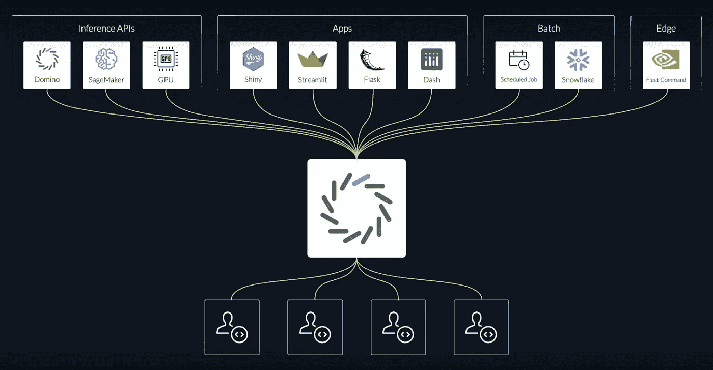

图片来自 GTC

以下是模型训练数据的示例:

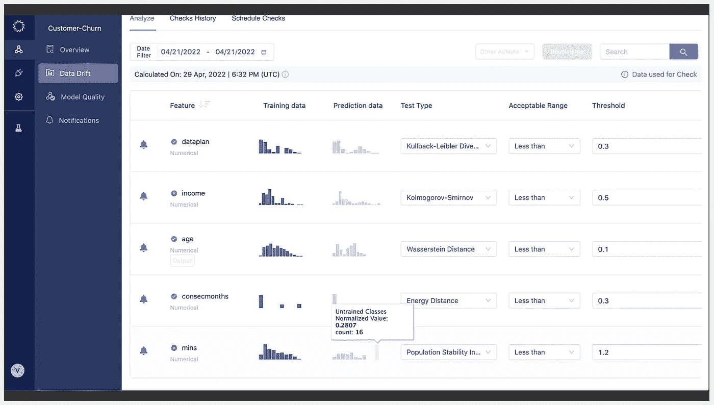

图片来自 GTC

# 结论

我们在线观看了英伟达 GTC 2022。随着新算法和新框架的发展，人工智能继续取得指数级的进步。英伟达展示了推动人工智能进步的全部产品线。

一周前，我们参加了由 Synopsys、Atos、Cadence、Graphcore、高通、Rain、SambaNova、西门子、AMD 等主办的 AI 硬件峰会和 Edge AI Summit 2022。这些公司展示了许多即将推出的新产品，试图打破英伟达的领先地位。

从两个角度看同一个人工智能故事是很有趣的。毕竟，人工智能在改变世界方面已经走过了漫长的道路。

在[之前的文章](/ai-frontiers-in-2022-5bd072fd13c)中，我们展示了人工智能系统如何检测人类特征。作为比较，下面的截图显示了 NVIDIA 系统如何检测人体特征。

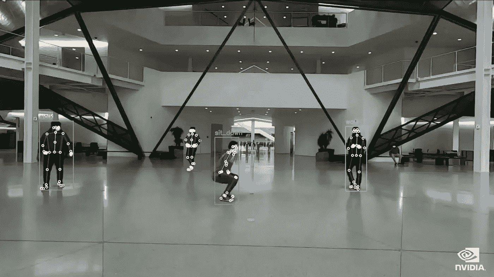

图片来自 GTC

AI 是帮手，创意带给我们更好的世界。

感谢阅读。

```
**Want to Connect?**If you are interested, check out [my directory of web development articles](https://jenniferfubook.medium.com/jennifer-fus-web-development-publications-1a887e4454af).
```