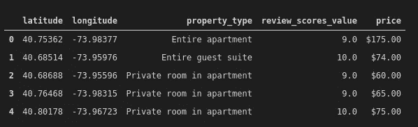
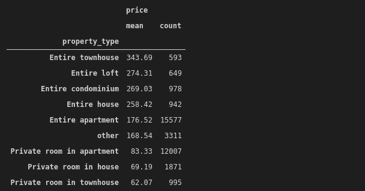
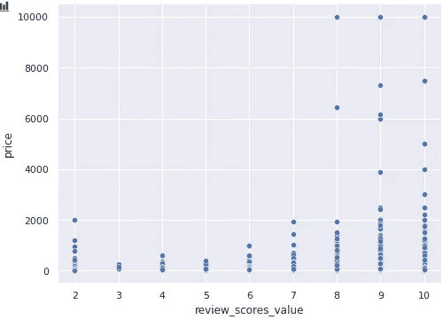
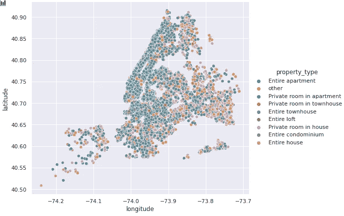

# 对熊猫和海鸟的 Airbnb 数据分析

> 原文：<https://betterprogramming.pub/airbnb-data-analysis-with-pandas-and-seaborn-11ceebba1eab>

## 分析和可视化 Airbnb 数据的实用指南


[菲利斯·萨泽德斯](https://unsplash.com/@filios_sazeides?utm_source=unsplash&utm_medium=referral&utm_content=creditCopyText)在[号航天飞机](https://unsplash.com/s/photos/airbnb?utm_source=unsplash&utm_medium=referral&utm_content=creditCopyText)上拍摄的照片

尽管其业务受到全球疫情的严重影响，但 Airbnb 是近年来的闪亮之星之一。它将需要住处的人和能够提供住处的人聚集在一起。

在本文中，我们将分析 Airbnb 在纽约上市的数据。您可以从 Inside Airbnb [网站](http://insideairbnb.com/get-the-data.html)下载不同城市的数据。来自纽约的数据是在 2020 年 12 月从 Airbnb 网站上获取的。

我们将尝试对 Airbnb 列表有所了解。然而，本文的主要重点是使用熊猫和海马库进行数据分析、处理和可视化。因此，我们在本文中介绍的内容可以应用于几乎任何表格形式的数据集。

让我们从导入库和读取数据集开始。

```
import numpy as np
import pandas as pd
import seaborn as sns
sns.set(style='darkgrid')df = pd.read_csv("/home/soner/Downloads/datasets/abnb_NY.csv")df.shape
(36923, 74)
```

该数据集包含超过 3.6 万个列表和 74 个要素。为了简单起见，我将创建一个包含五个特性的子集:

```
to_keep = ['latitude', 'longitude', 'property_type',   
           'review_scores_value', 'price']df_sub = df[to_keep]df_sub.head()
```



(作者图片)

我们可能想计算不同类型房产的平均价格。让我们首先检查数据集中有多少不同的属性。我们可以通过熊猫的`nunique`功能找到:

```
df_sub.property_type.nunique()
77
```

共有 77 种不同的房产类型，但大多数都没有上市。我们可以通过`value_counts`功能确认:

```
df_sub.property_type.value_counts(normalize=True)Entire apartment             0.421878
Private room in apartment    0.325190
Private room in house        0.050673
Private room in townhouse    0.026948
Entire condominium           0.026488
                               ...   
Shared room in island        0.000027
Private room in tent         0.000027
Private room in dorm         0.000027
Bus                          0.000027
Shared room in bungalow      0.000027
```

前三种类型占据了所有列表的大约 80%。我们可以通过组合百分比很小的属性来缩小属性类型。

让我们保留前八个属性类型，并将其余的归入一个名为“其他”的类别:

```
df_sub.property_type.value_counts(normalize=True)[:8].sum().round(2)
0.91top8 = list(df_sub.property_type.value_counts(normalize=True)[:8].index)top8
['Entire apartment',
 'Private room in apartment',
 'Private room in house',
 'Private room in townhouse',
 'Entire condominium',
 'Entire house',
 'Entire loft',
 'Entire townhouse']
```

91%的上市公司都属于前八类。我们将保留这八个类别，并将其余的更改为“其他”。完成这项任务有多种方式——我将使用列表理解:

```
df_sub.property_type = [x if x in top8 else 'other' for x in   
                        df_sub.property_type]
```

[列表理解](https://towardsdatascience.com/list-comprehensions-in-python-explained-294a464b5245)比使用 for 和 if 循环更有效、更快。让我们确认更改:

```
df_sub.property_type.value_counts(normalize=True)Entire apartment             0.421878
Private room in apartment    0.325190
other                        0.089673
Private room in house        0.050673
Private room in townhouse    0.026948
Entire condominium           0.026488
Entire house                 0.025513
Entire loft                  0.017577
Entire townhouse             0.016060
```

我们现在可以计算每个类别的平均价格。但是，价格列中的值的格式不适合聚合。

```
df_sub.price[:5]0    $175.00
1     $74.00
2     $60.00
3     $65.00
4     $75.00
Name: price, dtype: object
```

我们需要删除开头的`$`符号，并将数据类型从 object 转换为 float。我们需要解决的另一个问题是 1000 以上的价格。逗号用于分隔千位，因此 1000 表示为 1，000。逗号也需要删除。

Pandas 提供了许多函数和方法来在 str 访问器下处理文本数据。

```
df_sub.price = df_sub.price.str[1:].str.replace(',','')\
.astype('float')
```

我们来详细说明一下语法。我们首先选择第一个字符之后的所有字符，即`$`符号。然后`,`被一个空字符串代替，这意味着删除它。最后，数据类型更改为 float。

`groupby`函数可用于计算每种物业类型的平均价格。

```
df_sub[['property_type','price']].groupby('property_type')\
  .agg(['mean','count'])\
    .sort_values(by=('price','mean'), ascending=False).round(2)
```



(图片由作者提供)

我们对`groupby`函数的结果应用了两个聚合，即均值和计数。这些值按平均价格降序排列。最贵的一类是“整栋联排别墅”。

我们可以调查评论分数和价格之间的关系:

```
df_sub.review_scores_value.value_counts()10.0    15148
9.0      8762
8.0      1924
7.0       358
6.0       317
2.0       123
4.0        89
5.0        51
3.0         6
```

大多数评论不是 9 分就是 10 分。比较评论分数和价格的一种方法是使用 Seaborn 的`relplot`功能创建散点图:

```
sns.relplot(x='review_scores_value', y='price', data=df_sub,  
            kind='scatter', aspect=1.4)
```



(图片由作者提供)

数值 9 和 10 在这一栏中占主导地位，但随着评论分数的增加，我们看到价格略有上升趋势。我们还可以观察到一些价格非常高的异常值。

我们还可以根据纬度和经度值提供的位置来分析列表。让我们首先创建这两列的散点图:

```
sns.relplot(x='longitude', y='latitude', data=df_sub,   
            kind='scatter', height=6, aspect=1.2)
```


(图片由作者提供)

每个点都是一个列表，所以散点图代表了纽约的地图。请记住，散点图上的纬度和经度值代表相对位置。为了在纽约的真实地图上绘制它们，我们可以使用像 Geopandas 这样的工具。

如果不同的属性类型用不同的颜色表示，绘图会提供更多的信息。可以使用`relplot`函数的色调参数来实现。

```
sns.relplot(x='longitude', y='latitude', data=df_sub,   
            kind='scatter', hue='property_type',
            height=6, aspect=1.2)
```



(图片由作者提供)

蓝点和绿点代表公寓。我们清楚地看到，在西北侧(曼哈顿周围)，公寓远远多于房屋。皇后区的房源大多是房子。

# 结论

我们已经介绍了一些可用于探索数据集的函数和技术。我们通常在数据集中既有分类特征又有数值特征，因此本文中的函数将对您的大多数数据分析任务有所帮助。

当然，还有更多关于 Airbnb 房源的信息有待披露，Pandas 还提供了更多用于数据分析和处理任务的功能。最好的学习方法是通过熊猫或其他工具来练习。

感谢您的阅读。如果您有任何反馈，请告诉我。