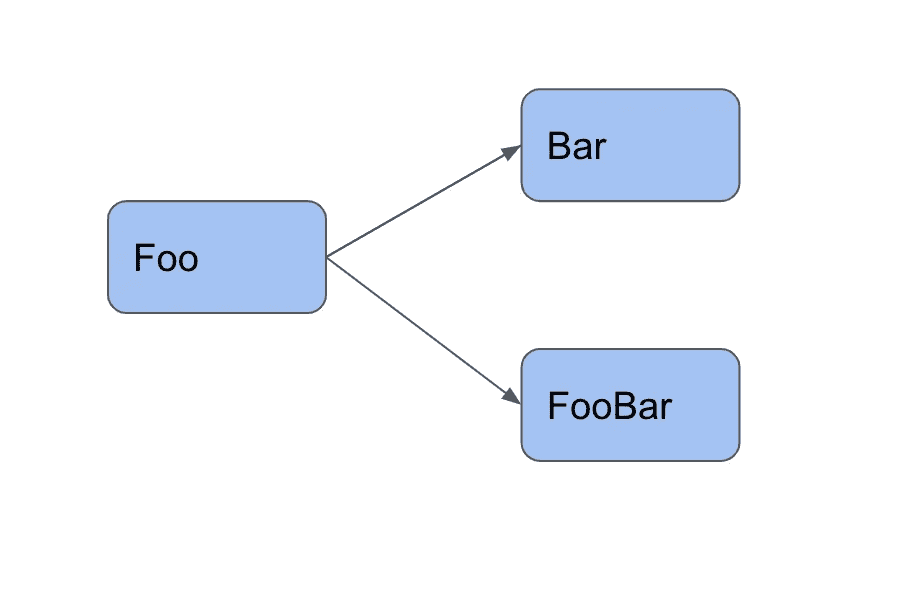
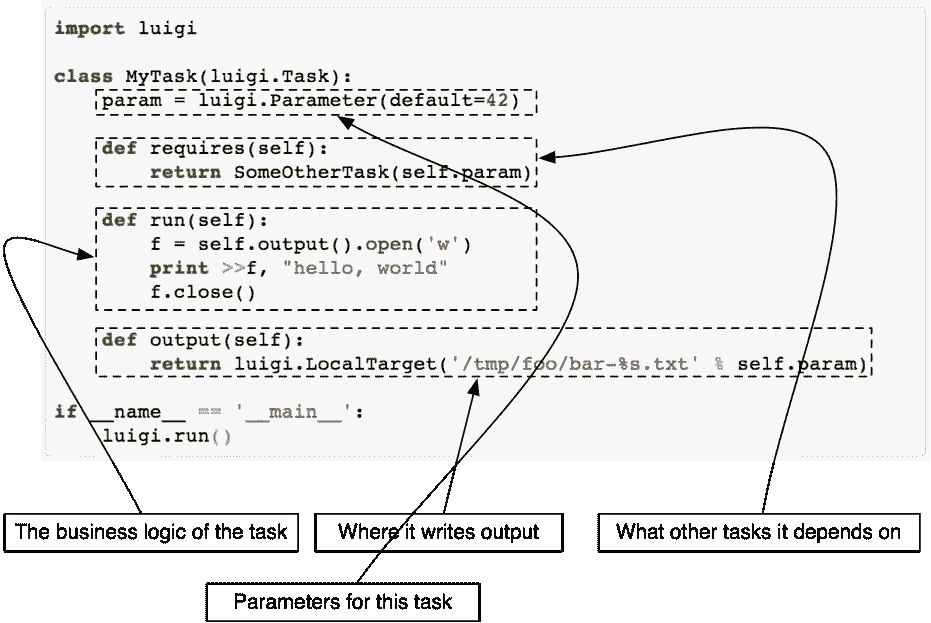
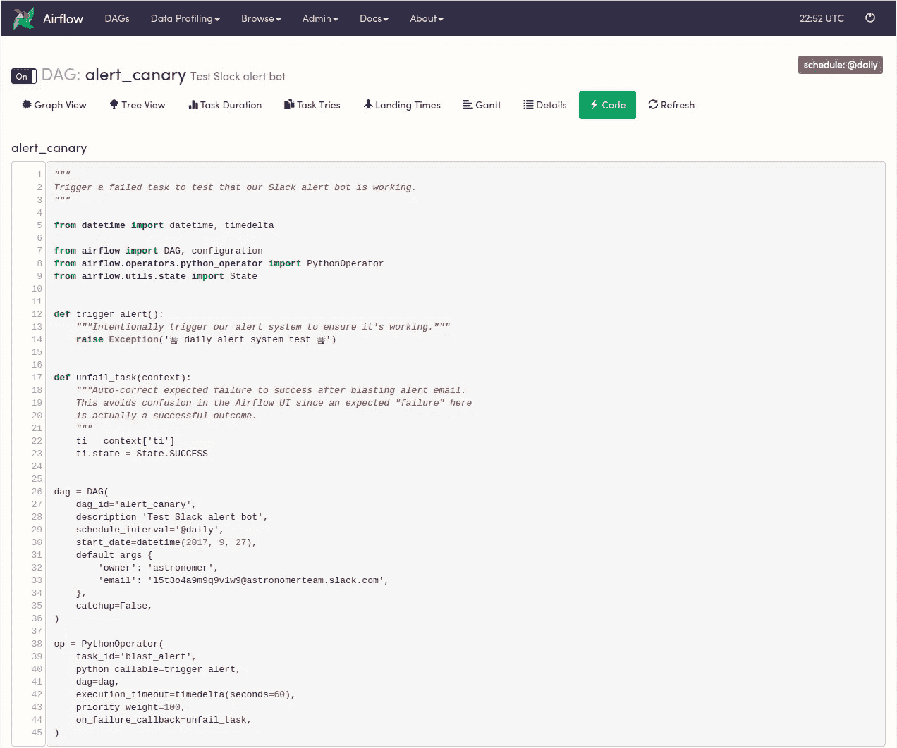
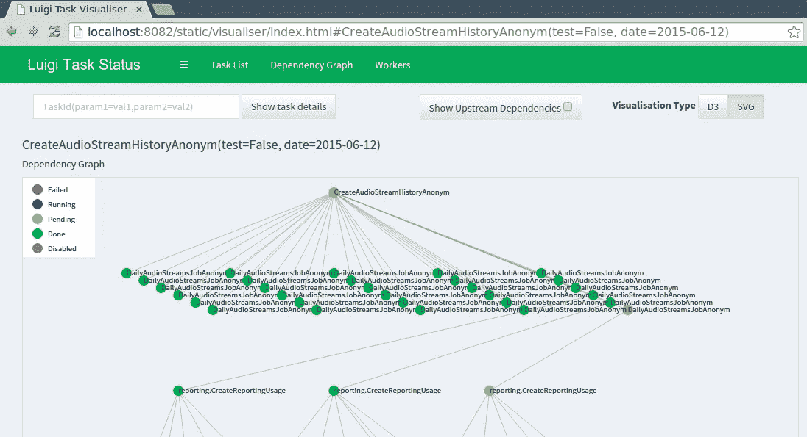
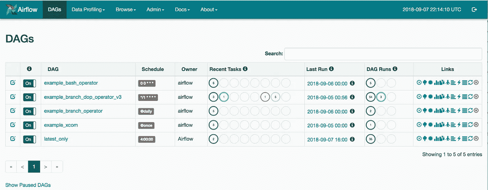

# Airbnb 的 Airflow 对 Spotify 的 Luigi

> 原文：<https://betterprogramming.pub/airbnbs-airflow-versus-spotify-s-luigi-bd4c7c2c0791>

## 从 A 点到 B 点获取数据

[田宽](https://unsplash.com/@realaxer?utm_source=unsplash&utm_medium=referral&utm_content=creditCopyText)在 [Unsplash](https://unsplash.com/s/photos/pipes?utm_source=unsplash&utm_medium=referral&utm_content=creditCopyText) 上的照片

我们最近写了关于[ETL 以及为什么它们很重要](https://medium.com/better-programming/what-are-etls-and-why-are-important-b65b301607d1)。我们想提供一个什么是 ETL 工具的概要。您可以将这些 ETL 工具称为工作流工具，帮助管理从 A 点到 b 点的数据移动。

其中两个流行的工作流工具是 Spotify 的 Luigi 和 Airbnb 的 Airflow。这两个工作流引擎都是为了帮助设计和执行用于数据分析的计算量大的工作流而开发的。

# **什么是 DAG？**

现在，在将 Airflow 与 Luigi 进行比较之前，我们必须理解两个库共有的一个重要概念。本质上，两者都构建了所谓的有向无环图(DAG)。DAG 是以特定顺序运行的任务的集合，这些任务依赖于之前的任务。

例如，如果我们有三个名为`Foo`、`Bar`和`FooBar`的任务，可能会出现这样的情况:`Foo`先运行，`Bar`和`FooBar`依赖于`Foo`完成。

这将创建一个如下图所示的基本图形。如你所见，有一条清晰的路径。现在想象一下，有成百上千的任务。

大型数据组织拥有大量依赖于依赖项的 Dag。拥有对 DAG 的明确访问权限使公司能够跟踪哪里出错，并且不允许坏数据进入他们的数据生态系统，因为如果出现故障，它通常会迫使下游的任务等待，直到它们的依赖关系完成。

这就是像 Airflow 和 Luigi 这样的工具派上用场的地方。

# 什么是路易吉？

Luigi 是一个执行框架，允许你用 Python 写数据管道。

该工作流引擎支持任务依赖性，并包括一个中央调度程序，该程序为帮助者提供了一个详细的库，以在 MySQL、AWS 和 Hadoop 中构建数据管道。不仅很容易依赖于 repos 中定义的任务，代码重用也很方便；您可以轻松地派生执行路径，并将一个任务的输出用作第二个任务的输入。

这个框架由 Spotify 编写，并于 2012 年开源。许多受欢迎的公司，如 Stripe、Foursquare 和 Asana，都使用 Luigi 工作流引擎。

# 什么是气流？

[来源](https://github.com/astronomer/airflow-guides/blob/master/guides/airflow-ui.md)

这个工作流调度器支持 Python 中的任务定义和依赖关系。

它是由 Airbnb 在 2014 年编写的，用于在许多工作节点上执行、调度和分配任务。Airflow 于 2016 年开源，不仅支持日历调度，还配备了一个漂亮的网络仪表盘，允许用户查看当前和过去的任务状态。

该工作流引擎支持关系数据库，旨在存储和保持其状态。由于它的 web 仪表板可视化特性，Airflow 也可以用作传统 ETL 的起点。

其母公司 Airbnb 的气流推动的一些流程包括:数据仓库、实验、增长分析和电子邮件定位。

# 两种开源工作流引擎的比较

这两个 WMS 都很棒。但各有利弊。本节将向您简要比较气流和 Luigi。

## 路易吉和气流的共性

在讨论这两种工具的优缺点之前，我们先来讨论一下它们的共同点:

●可视化工具

●任务代表一个工作单元

●数据结构标准

●有向图的一个节点

●指定同步/异步任务、条件路径和并行命令的选项

此外，这两个工作流引擎都是用 Python 编写的。这使得在大多数公司中实现这些库变得非常容易，因为 Python 相当普遍。

## 路易吉的利与弊

**优点:**

● **自定义日历调度:**虽然大多数 ETL 系统都有要求每小时运行一次的任务，但是 Luigi 并没有日历调度的概念。因此，用户可以根据自己的方便来运行任务。中央调度器包含一个任务历史特性，它还将任务完成情况记录到一个关系数据库中，而关系数据库又将任务完成情况显示在主仪表板上。

● **令人印象深刻的股票库:**Luigi 最好的部分之一是它的股票任务和目标数据系统库——基于 SQL 和基于 NOSQL。每个库都包含了许多作为助手方法内置的功能。这些助手类支持 Hadoop、Hive 查询、缩放、红移、PostgreSQL、Google BigQuery 等等。

● **目标文件和数据集:** Luigi 将文件和数据集直接作为任务的输入或输出，这使得恢复 ETL 系统的历史状态变得更加容易——即使状态数据库丢失。

**缺点:**

● **任务创建和测试:**在创建和测试任务时，Luigi API 相当困难。在创建过程中，任务状态与任务实际要产生的数据紧密相关。因此，工程师倾向于简单地将任务推向生产阶段，因为这是非常反直觉的。

● **不太具有可伸缩性:**由于 Luigi 和 crons 是紧密耦合的，Luigi 中的工作进程数量受到分配给该作业的 cron 工作进程数量的限制。更糟糕的是，工人只能运行上传到中央调度程序的任务。因此，如果您希望在大规模管道中并行化任务，您必须将它们分成不同的子管道。

● **难以使用:**如果你需要查看任务日志并失败，没有简单的方法。每一次，您都必须查看 cron worker 的日志，然后找到任务日志——这本身是非常消耗任务的。此外，任务的 DAG 不能在执行前查看。因此，您不知道在部署期间关联任务时运行的是什么代码。

## 气流的利与弊

**优点:**

1.  **易于使用的用户界面:**借助 Airflow，您可以轻松查看任务日志、层次结构、状态和代码运行。该用户界面还允许您轻松地更改任务状态、重新运行历史任务以及强制任务运行。
2.  **独立调度器:** Airflow 自带调度器，可以让你把任务从 crons 中分离出来，轻松独立伸缩。此外，Airflow 同时支持多个 Dag。这些 Dag 处理两类任务:传感器和操作员。
3.  **活跃的开源社区:**凭借其强大的社区，Airflow 积极地获得了诸如寻呼任务、Slack 集成和 SLA 等特性。聊天室本身非常活跃，所以新手可以在几个小时内得到他们的问题的答案。

**缺点:**

1.  **任务优化:**对于任何一个中型公司来说，流水线中有多个任务，Airflow 有时不清楚如何将这些任务组织到海量的流水线中。
2.  **不直接处理任务:**除了特殊的传感器操作员，气流不直接处理作为任务输入的数据集或文件。在 Airflow 中，状态数据库只存储任务的状态，并记录数据集，因此如果数据库丢失，就很难恢复 ETL 的历史状态。此外，这使得处理正确出现但不产生和输出的任务变得更加困难。
3.  **灵活性较低:**借助气流，员工无法独立开始任务或灵活选择任务——根据自定义计划。由于任务只能由中央调度程序选取，因此 Airflow 使用中央调度程序启动工人。

# 哪个工作流引擎比较好？

如果你问我，我会推荐 Luigi 上空的气流。为什么？不仅用气流测试管道更容易，而且有独立的任务状态。

说到调度，Luigi 在 cron 作业中运行任务，而 Airflow 有自己的 LocalScheduler，允许用户独立扩展任务。此外，Airflow 支持多个 DAG，而 Luigi 不允许用户在管道执行之前查看 DAG 的任务。

另一个重点是用户界面。虽然 Luigi 提供了一个最小的 UI，但 Airflow 附带了一个详细的、易于使用的界面，允许您简单地查看和运行任务命令。

此外，Airflow 的细节——社区贡献——包括服务级别协议、触发规则、图表和 XComs，而 Luigi 没有这些。

# 最后的话

由于它们的核心设计和功能，这两个开源工作流系统都得到了广泛的欢迎。

在社区方面，Airflow 赢得了比赛，但如果您计划使用 Hadoop 或 Google BigQuery，请看看 Luigi。

尽管 Luigi 更容易上手，但 Airflow 提供了更具表现力的可视化和支持。最终，由您的团队来确定您的技术需求是什么。