# Airtable:即时创建电子表格数据库

> 原文：<https://betterprogramming.pub/airtable-create-spreadsheet-databases-in-an-instant-c7878fd8b4e5>

## Airtable 简介，一个具有数据库功能的低代码平台

****

**由[卢卡斯·布拉塞克](https://unsplash.com/@goumbik?utm_source=medium&utm_medium=referral)在 [Unsplash](https://unsplash.com?utm_source=medium&utm_medium=referral) 上拍摄**

**Airtable 是一个低代码平台，允许任何人创建关系数据库和可视化数据。要做到这一点，你甚至不需要了解 SQL 或 Excel。**

**例如，考虑一下你需要多长时间来实现这个目标:**

*   **创建包含记录的数据库**
*   **通过某些条件选择特定的数据**
*   **在图表(条形图、饼图)中显示筛选的数据**
*   **在线与他人共享项目**

**这是一个简单的任务，你可以用 Excel 来完成。但是它的学习曲线有点复杂，因此需要更多的时间。选择 Airtable 的显著优势是您可以通过其在线、用户友好的 GUI 直接开始使用。**

**在本文中，您将了解 Airtable 的主要优势。我将通过一步一步的实际演示来展示它的主要特性。**

**我们开始吧！**

# **Airtable 概述**

## **数百个预先创建的模板**

**如果您不知道从哪里开始或者需要一些灵感，请查看现成的模板。它们是基于类别的。为了让你有个概念，这里有一些营销类的例子:**

****

**您可以在交互模式下点击某个模板进行试用:**

**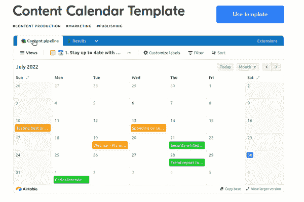**

**Airtable 模板交互模式示例。**

## **API 集成**

**由于它的集成 API，可以很容易地将您最喜欢的工具与 Airtable 连接起来。一些支持的平台包括 Gmail、Instagram、GitHub、YouTube 等等。**

## **自动化**

**自动化为您提供了创建强大工作流的能力。例如，您可以在特定事件发生时自动发送松弛消息。**

**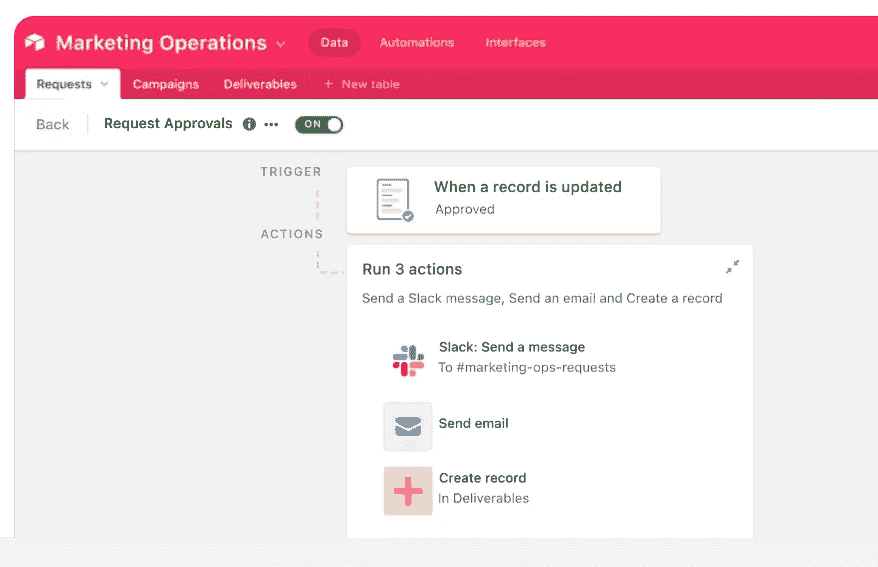**

**自动化工作流示例。**

**不需要编码—您可以拖放事件来创建所需的工作流。但是如果您需要包含自定义逻辑，您可以使用 JavaScript 代码来扩展功能。**

## **扩展ˌ扩张**

**开箱即用的扩展使您能够创建不同图表、图形、指标等的仪表板。**

**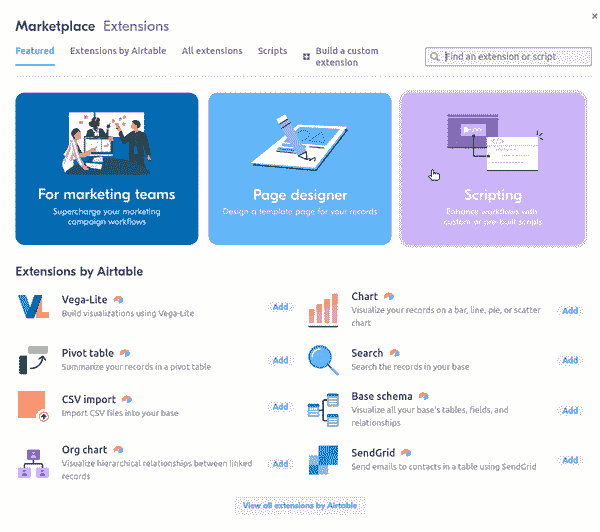**

**Airtable 扩展选择对话框。**

**例如，假设你有一家公司。您希望存储雇员的详细信息，并构建一个关系图来查看谁向谁报告。**

**以下是显示员工关系的组织结构图示例:**

**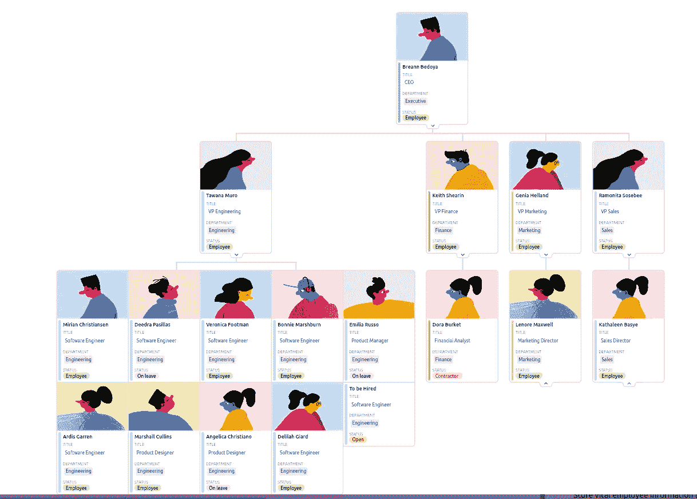**

**Airtable 中的公司组织结构图。**

## **轻松导入数据**

**从现有数据创建数据库非常简单。您可以直接从 CSV 文件或其他工具(如 Google Sheets、Trello、Microsoft Excel 等)导入记录。**

## **协作和数据同步**

**此功能允许您与朋友和同事一起工作。最大的好处是所有东西都存储在云中，你可以在任何地方访问你的作品。**

## **免费增值工具**

**Airtable 是一款免费增值工具。请注意，即使功能有限，您仍然可以完成大量任务。**

**更多信息，请查看[定价页面](https://www.airtable.com/pricing)。**

# **Airtable 演示**

**在本演示中，我们将从 CSV 文件导入数据，并使用它来演示一些方便的 Airtable 功能。**

**这是我们的计划:**

*   **导入数据和修改数据类型。**
*   **添加第三方扩展以可视化数据。**

**我从 kaggle.com 下载了银行卡[交易数据](https://www.kaggle.com/datasets/tharunprabu/my-expenses-data)。原始记录是这样的:**

**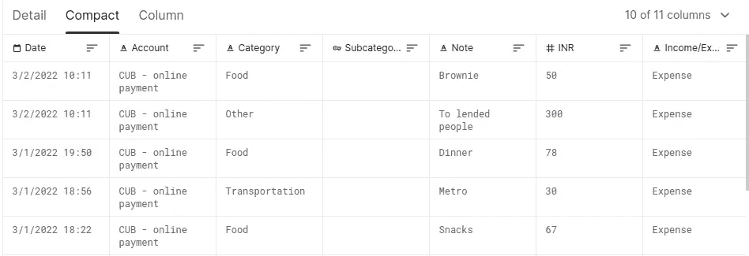**

**从 kaggle.com 提取交易数据。**

**要使用 Airtable，请先注册一个免费帐户。成功登录后，导航到您的工作区并创建一个新的库(这是我们存储所有数据的地方)。**

**点击添加或导入按钮上传数据。Airtable 会检测数据字段，并让您决定要导入哪些字段:**

**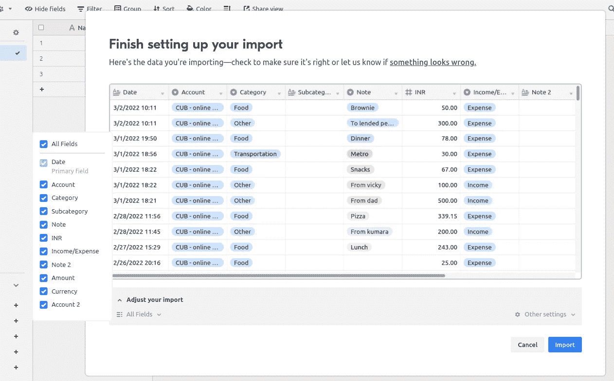**

**已将交易数据导入 Airtable。**

**我已经选择了所有字段。**

**请注意，该值区分收入和费用。因此，如果我们想知道我们花了多少钱，我们必须过滤数据，只显示这些记录:**

**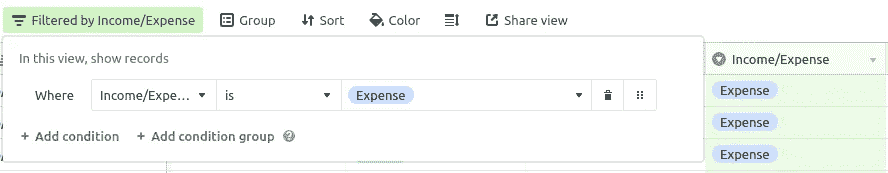**

**筛选条件以显示费用。**

**同样，您可以添加条件组来缩小数据范围:**

**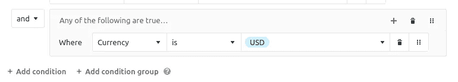**

**条件组示例。**

**让我们改变`Date`字段的数据类型。目前，它被设置为“长文本”，我们希望将其转换为“日期”单击管理字段按钮。您应该会看到所有数据类型:**

**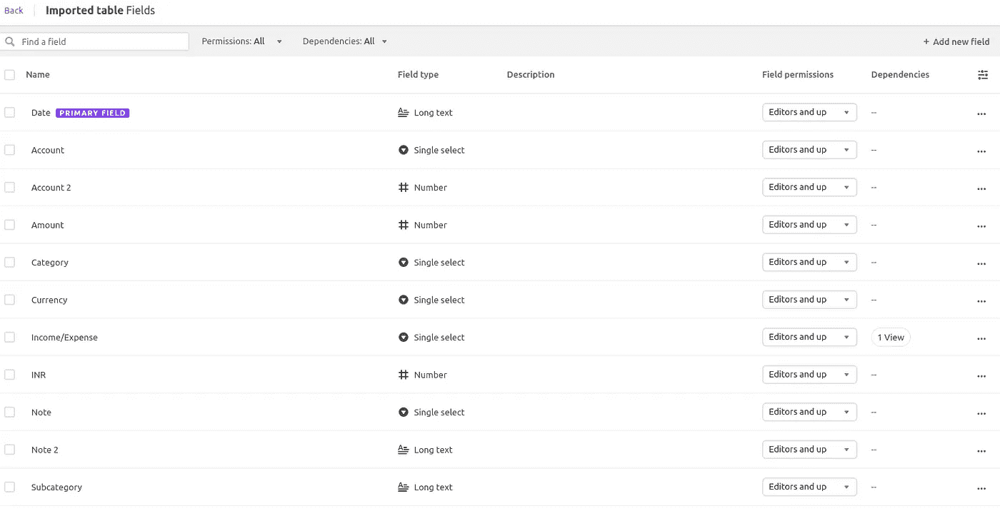**

**管理字段对话框**

**选择日期的字段类型。将出现一个弹出对话框，您可以从丰富的下拉列表中选择新的数据类型:**

**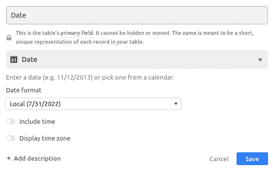**

**选择日期数据类型。**

**Airtable 将为我们进行转换。**

**请注意，`Date`以这种格式出现:2022 年 3 月 2 日 10:11。如果我们想在报告中使用这些数据，最好有一个单独的月份和年份字段。但是这些字段并不存在。不用担心，因为你可以随心所欲地添加新字段和计算数据。**

**单击表格中的+按钮添加新字段，例如“月”由于这将是一个计算字段，请从下拉列表中选择公式:**

**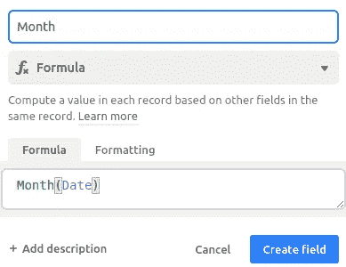**

**月份公式。**

**如果您不知道使用什么公式，请使用自动完成功能检查列表。只要开始输入一些东西，Airtable 就会用一个例子向你展示语法。**

**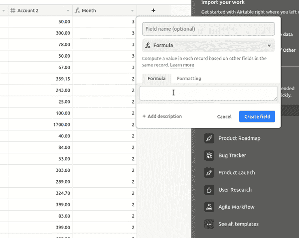**

**选择年度公式。**

**我还想同时看到年份和月份，所以我用这个公式添加了一个字段:`CONCATENATE(YEAR(Date), "-", MONTH(Date))`。**

**我对数据很满意，所以现在让我们用图表把它形象化。我们需要添加图表扩展。**

**截至撰写本文时，您可以免费为每个基础添加一个扩展。**

**单击扩展按钮并选择图表:**

**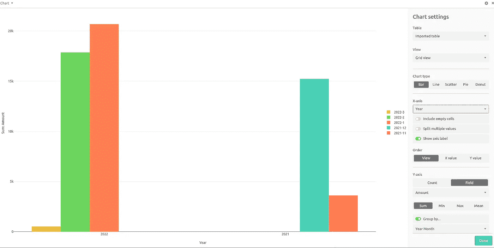**

**使用图表扩展可视化数据。**

**你可以摆弄 X 和 Y 轴，用不同的值分组，等等。**

**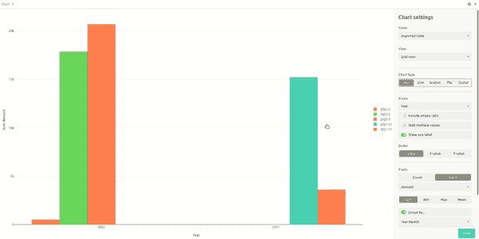**

**用数据尝试图表类型。**

**你需要别人的反馈或帮助吗？只需点击“共享”按钮即可发送协作链接:**

**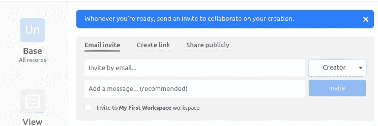**

**协作链接。**

**就是这样！旋转数据库并生成可视化报告非常简单。**

# **结论**

**现在你知道了什么是 Airtable，以及如何使用它轻松地创建数据库/电子表格。如您所见，处理和可视化数据不需要任何 SQL 或 Excel 知识。无论是工作还是个人项目都很方便。**

**如果您对更低代码的平台感兴趣，您可能会喜欢我的其他相关文章:**

** [## 如何使用 CircleCI 创建 CI/CD 管道

### 开始使用 CircleCI 执行实际的 DevOps 任务

better 编程. pub](/how-to-create-ci-cd-pipelines-using-circleci-3110bb61ebf9)  [## 介绍 Nyckel API:一个用于分类的无代码机器学习工具

### 使用 Nyckel API 进行简单的文本和图像分类

better 编程. pub](/introducing-nyckel-api-a-no-code-machine-learning-tool-for-classification-1df96099cc0a)  [## Pipedream: API 集成变得简单

### 了解如何使用 Pipedream 通过几次点击来连接 API

better 编程. pub](/pipedream-api-integration-made-easy-f098de654cd1) 

感谢您的阅读，并祝低编码快乐！**