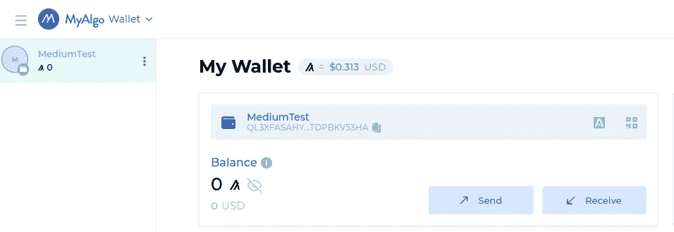
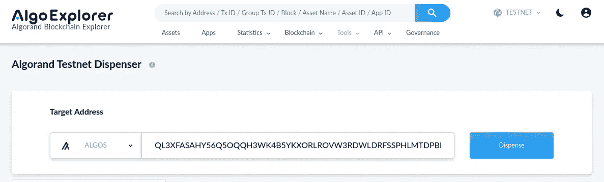
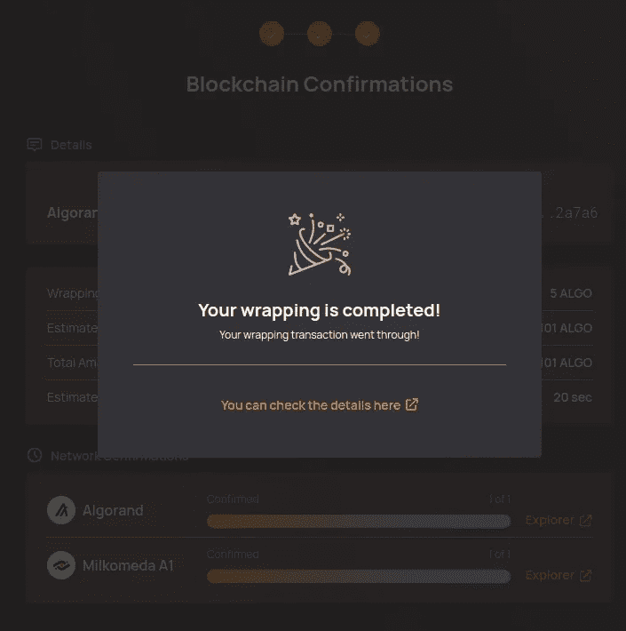
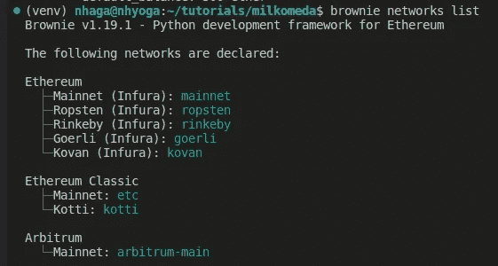
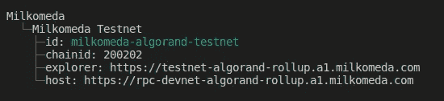
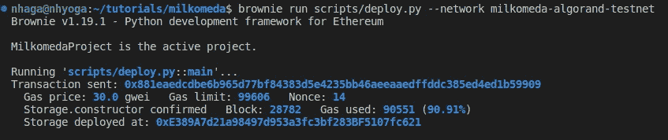
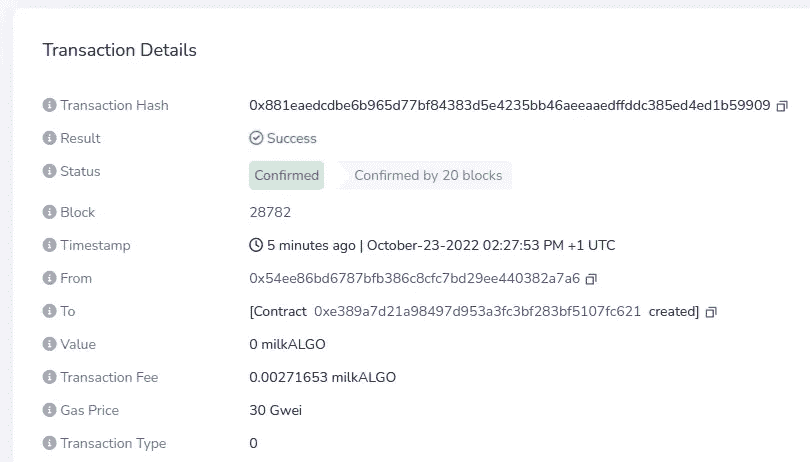
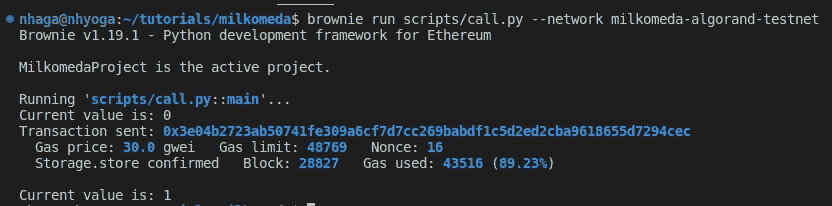
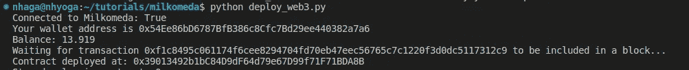
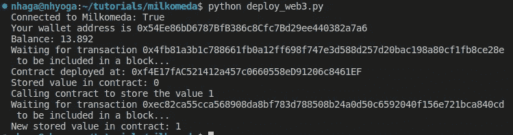

# 使用 Milkomeda A1 在 Algorand 上部署 dApp

> 原文：<https://betterprogramming.pub/algorand-deploying-evm-based-dapps-with-milkomeda-a1-f30b8b513ca7>

## 使用(主要)Python


在本文中，我将展示在 algrand-Milkomeda A1 上部署基于 EVM 的 dApp 是多么简单，主要使用 Python。

Milkomeda 是一种新协议，它将 EVM 功能带到了非 EVM 区块链。在撰写本报告时，L2 通过 EVM 的 algrand-milk omeda A1 和 Cardano 通过 EVM 的 Cardano-Milkomeda C1 侧链为 algrand 提供了解决方案。

A1 Rollup 使用包装 ALGOs (milkALGOs)作为其基础货币，可以使用 Milkomeda 免权限桥轻松桥接。用户可以通过几个简单的步骤将他们的 ALGOs 和其他 Algorand 原生资产(asa)打包到 A1 汇总中。这使得他们能够使用他们的 milkALGOs 与部署在 A1 Rollup 上的基于 EVM 的 dApps 进行交互。

我假设用户从未使用过 Algorand，并将从头开始展示所有步骤:

```
Table of ContentsSetup an Algorand Wallet
[Get Some Testnet ALGO](#53b9)
[Add the Milkomeda Algorand Testnet to Metamask](#932a)
[Create a Dummy EVM Account To Test](#5516)
[Bridge Testnet ALGO to Milkomeda A1](#6e1b)
[Compile and Deploy to Milkomeda A1 a SimpleStorage Contract Written in Solidity Using Brownie](#d07c)
[BONUS: Compile the Same Contract Using Vyper and Deploy Using web3py](#b185)
```

# 第 1 步——设置 Algorand 钱包

Algorand 有几种钱包可供选择。要获得几乎完整的列表，我建议读者去 Algorand 开发者门户上的 discover > wallets 部分，但在本例中，我将使用 MyAlgo wallet。

MyAlgo 是一个 Algorand 网络钱包，具有非托管和安全机制。它帮助用户在处理自己的私钥时直接与 Algorand 区块链进行交互，方法是将私钥安全地加密存储在本地浏览器中，或者使用总账硬件钱包。

要设置钱包，请(I)访问[https://wallet.myalgo.com/new-account](https://wallet.myalgo.com/new-account),( ii)选择一个密码来保护您的钱包，以及(iii)点击添加新帐户并按照步骤安全保存您的助记短语。

您现在应该有一个如下图所示的 Algorand 地址:



MyAlgo 钱包截图

# 第二步——获取一些测试网 ALGO

现在，在你的 MyAlgo 钱包的右上方，从 MAINNET 更改为 Testnet，然后访问 Algorand Testnet 分配器(【https://testnet.algoexplorer.io/dispenser】)并粘贴你新创建的帐户以获得一些 TESTNET 算法。



现在，您应该可以在 MyAlgo 钱包中看到十个 testnet 算法。

# 步骤 3 —将 Milkomeda Algorand 测试网添加到 Metamask

在元掩码中，转到设置>网络>添加网络，并填写以下信息:

网络名称:Milkomeda algrand Testnet
新 RPC URL:[https://rpc-devnet-algorand-rollup.a1.milkomeda.com](https://rpc-devnet-algorand-rollup.a1.milkomeda.com)
Chain ID:200202
货币符号(可选):milkTALGO
Block Explorer URL(可选):[https://testnet-algorand-rollup.a1.milkomeda.com](https://testnet-algorand-rollup.a1.milkomeda.com)

# 步骤 4-创建一个虚拟 EVM 帐户进行测试

为了测试包装算法到 Milkomeda 的桥接，让我们用一个简单的 Python 片段创建一个虚拟的 EVM 帐户。

这将生成一个私钥，您现在可以使用它将帐户导入元掩码。

重要提示:请不要将这样生成的账户用于真实资金。提议过程的随意性不足以保证你的资金安全。

# 步骤 5-将 ALGO 测试网连接到 Milkomeda A1

转到 Milkomeda A1 桥页面[https://algorand-bridge-dev.milkomeda.com/](https://algorand-bridge-dev.milkomeda.com/)并遵循以下步骤:

1.  在右上角的选择框中选择“Devnet”
2.  在网络起点上，选择“阿尔格兰德至米尔科米达”
3.  在令牌上，选择“ALGO”
4.  点击“连接钱包”algrand，选择 MyAlgo 钱包，输入您的密码，然后选择您的 algrand 帐户
5.  点击“连接钱包”元掩码以连接到 A1 上您的 EVM 地址
6.  点击“下一步”，然后点击“签名并发送”

如果一切顺利，你会看到下面的屏幕，现在应该在 Metamask 中看到你的桥接算法。跟随链接将在 A1 桥浏览器上显示事务。



# 步骤 6——使用 Brownie 编译并部署一个用 Solidity 编写的简单存储契约到 Milkomeda A1

假设没有安装 Brownie，创建一个虚拟环境并通过以下方式安装 Brownie:

```
python -m venv venv
source venv/bin/activate
pip install eth-brownie
```

在新的工作目录中初始化一个 brownie 项目:

```
brownie init milkomeda && cd milkomeda
```

现在让我们创建一个非常简单的可靠性契约。在 contracts 文件夹中，创建一个名为`Storage.sol`的文件，并添加以下实体代码:

从创建的工作目录的根目录运行以下命令来编译该协定:

```
brownie compile
```

要检查 brownie 安装中配置的可用网络，请运行:

```
brownie networks list
```



Milkomeda A1 默认是不可用的，我们需要添加它。为此，编辑文件`~/.brownie/network-config.yaml`并添加以下行:

```
- name: Milkomeda
    networks:
     - name: Algorand Testnet
       id: milkomeda-algorand-testnet
       host: [https://rpc-devnet-algorand-rollup.a1.milkomeda.com](https://rpc-devnet-algorand-rollup.a1.milkomeda.com)
       chainid: 200202
       explorer: [https://testnet-algorand-rollup.a1.milkomeda.com](https://testnet-algorand-rollup.a1.milkomeda.com)
```

或者使用 brownie CLI:

```
brownie networks add Milkomeda milkomeda-algorand-testnet chainid=200202 explorer=https://testnet-algorand-rollup.a1.milkomeda.com host=https://rpc-devnet-algorand-rollup.a1.milkomeda.com name="Milkomeda Testnet"
```

如果成功，现在应该可以在列表中看到它，可以通过以下方式查询完整的详细信息:

```
brownie networks list true
```



我们将添加私钥以使用创建的(EVM)帐户。在根目录下创建一个名为`brownie-config.yml`的文件，直接添加私钥。

或者将私钥保存在. env 文件中，并在 brownie 配置中指向它。

现在，我们已经做好了在 Milkomeda A1 上部署存储智能合同的一切准备。在`scripts`文件夹中，创建一个名为`deploy.py`的文件，并添加以下代码:

从 brownie 中，我们导入了`Storage`以便能够使用编译后的契约，`accounts`以便我们能够通过私有密钥添加帐户，以及`config`以便能够访问存储在`brownie-config.yml`文件中的密钥/值对。

然后，我们可以创建签名者帐户，并在 main 函数中部署合同。

我们现在可以在 Milkomeda A1 上部署契约，方法是从终端运行脚本并指示 A1 网络:

```
brownie run scripts/deploy.py --network milkomeda-algorand-testnet
```

输出应该是:



合同已经部署，您可以在 A1 Milkomeda Devnet explorer 上检查事务:

 [## 事务 0x 881 aeedcdb 6b 965d 77 BF 84383 d5e 4235 bb 46 aaeedfddc 385 ed 4 ed 1b 59909—A1 浏览器

### 查看 A1 上的事务 0x 881 aeedcdb 6b 965d 77 BF 84383 d5e 4235 bb 46 aeeaedfddc 385 ed 4 ed 1b 59909

explorer-devnet-algorand-rollup.a1.milkomeda.com](https://explorer-devnet-algorand-rollup.a1.milkomeda.com/tx/0x881eaedcdbe6b965d77bf84383d5e4235bb46aeeaaedffddc385ed4ed1b59909) 

为了与智能合约交互，让我们在脚本目录中创建一个名为`call.py`的单独文件，并添加以下代码:

这里唯一的新导入是通过调用`.from_abi`方法创建契约对象的`Contract`类，该方法将名称、abi 和契约地址作为输入。合同地址是从部署输出中复制的，并在这里进行了硬编码。

然后，我们调用契约上的 retrieve 方法来读取“number”变量中的存储值。然后我们存储一个新值并再次读取它。要从终端调用该脚本，请运行以下命令:

```
brownie run scripts/call.py --network milkomeda-algorand-testnet
```

输出应该是这样的:



我们完了。我们已经在 Milkomeda A1 上部署了一个合同并与之交互，所以在某种程度上，我们已经在 Algorand 上使用了一个基于 EVM 的智能合同。

我承认这个教程可以很容易地适应任何 EVM 兼容链，所以它不是真正的阿尔格兰德特定的，但它只是显示了如何无缝地将现有的 EVM dApp 移植到阿尔格兰德。

# 好处:使用 Vyper 编译相同的合同，使用 web3py 部署

我们现在可以看一个部署相同的智能契约的例子，但它是用 Vyper 编写的，只使用了 web3py。

首先，我们需要契约的 abi 和字节码:

现在让我们通过 RPC URL 连接到 Milkomeda A1。

从生成的私钥设置帐户(假设它在。环境文件)

从 abi 和字节码创建契约对象，并调用构造函数。

至此，代码将产生以下输出:



我们可以在 A1 devnet explorer 上查找事务或已部署的合同:

 [## 合同 0x 39013492 B1 BC 84d 9 df 64d 79 e 67d 99 f 71 f 71 BDA 8 b—A1 Explorer

### 在 Milkomeda 上查看 0x 39013492 B1 BC 84d 9 df 64d 79 e 67d 99 f 71 f 71 BDA 8 b 的帐户余额、交易和其他数据

explorer-devnet-algorand-rollup.a1.milkomeda.com](https://explorer-devnet-algorand-rollup.a1.milkomeda.com/address/0x39013492b1bC84D9dF64d79e67D99f71F71BDA8B) 

现在，为了与契约进行交互，我们可以调用 retrieve 函数来获取存储的值，用“store”函数更改该值，然后再次检索该值。

输出…



感谢阅读！

敬请关注更多内容。