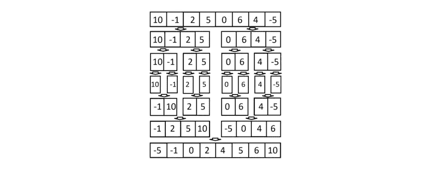

# 算法 101:如何在 JavaScript 中使用合并排序和快速排序

> 原文：<https://betterprogramming.pub/algorithms-101-how-to-use-merge-sort-and-quicksort-in-javascript-6d8908562fe0>

## 合并排序和快速排序是 JavaScript 程序中常见的分治算法。请继续阅读，我们将讨论如何使用它们


图片来源:作者

*本文由 Jerry Ejonavi 撰写。*

编程中的排序涉及到将元素以一定的顺序放入一个列表或数组中。高效排序对于优化其他要求输入数据在排序列表中的算法非常重要。

虽然作为一名软件开发人员，您可能不需要在日常工作中实现排序算法，但了解其中一些算法的内部工作方式是很重要的。这些对于编写面试代码很常见，可以让你成为一个更高效的开发人员。

在今天的文章中，我们将探讨两个最流行的排序算法，合并排序和快速排序。这些对于你的计算机科学和代码优化的基础是必不可少的。

**今天，我们将学习:**

*   [排序算法介绍](https://dev.to/educative/algorithms-101-how-to-use-merge-sort-and-quicksort-in-javascript-13p5#intro)
*   [合并排序算法](https://dev.to/educative/algorithms-101-how-to-use-merge-sort-and-quicksort-in-javascript-13p5#merge)
*   [快速排序算法](https://dev.to/educative/algorithms-101-how-to-use-merge-sort-and-quicksort-in-javascript-13p5#quick)
*   [接下来学什么](https://dev.to/educative/algorithms-101-how-to-use-merge-sort-and-quicksort-in-javascript-13p5#next)

# 排序算法简介

排序算法是一种用于根据特定要求对列表或数组中的项目进行重新排序的算法。例如，排序算法可以从最小到最大组织一组项目。

高效的排序算法对于优化其他算法(如搜索和压缩算法)的效率非常重要。

排序算法由一系列指令组成。它们接受一个数组或列表作为输入，执行操作，并输出一个排序后的数组。

有许多流行的排序算法。九个最受欢迎的是:

*   冒泡排序
*   插入排序
*   合并排序
*   快速排序
*   选择排序
*   计数排序
*   桶排序
*   基数排序
*   堆排序

# 合并排序算法

合并排序是一种高效、通用、基于比较的排序算法。它的工作方式是递归地将数组分成相等的两半，排序，然后合并排序后的两半。

取一个数组`[10, -1, 2, 5, 0, 6, 4, -5]`。下面是合并排序将如何处理它。



合并排序和快速排序实现就是分治算法的例子。概括地说，分治算法有以下几个部分:

*   划分:把问题分成子问题
*   **征服:**递归地处理子问题，直到每个问题都被解决
*   **合并:**合并已解决的子问题，给出原始问题的解决方案

合并排序可以用于各种问题。合并排序的三个最常见的应用是在 O(nLogn)时间内对链表进行排序，解决反转计数问题，以及外部排序。

## 用 JavaScript 实现

下面是 JavaScript 中合并排序算法的代码实现。该算法由两个函数组成:

*   `mergeSort()`函数，负责对数组进行分区
*   `merge`函数，它合并了独立的数组

```
function mergeSort(array) {
  if (array.length === 1) {
    return array;
  }
  const middle = Math.floor(array.length / 2);
  const left = array.slice(0, middle);
  const right = array.slice(middle);
  return merge(
     mergeSort(left),
     mergeSort(right)
  );
}function merge(left, right) {
 let result = [];
 let leftIndex = 0;
 let rightIndex = 0; while (leftIndex < left.length && rightIndex < right.length) {
   if (left[leftIndex] < right[rightIndex]) {
      result.push(left[leftIndex]);
      leftIndex++;
   } else {
      result.push(right[rightIndex]);
      rightIndex++;
   }
 } return result.concat(left.slice(leftIndex)).concat(right.slice(rightIndex));
}
```

让我们试着分析一下正在发生的事情:

1.  如果数组只有一个元素，我们返回数组并终止。(基本情况)
2.  否则，我们将数组分成长度尽可能相等的两半。(除)
3.  通过递归，我们使用`mergeSort()`函数对两个数组进行排序。(征服)
4.  最后，我们合并两个排序后的数组并返回结果。(联合收割机)

以我们上面使用的数组为例。让我们看看如何在 JavaScript 代码中实现合并排序。

```
function mergeSort (unsortedArray) {
  if (unsortedArray.length <= 1) {
    return unsortedArray;
  }
  // In order to divide the array in half, we need to find middle
  const middle = Math.floor(unsortedArray.length / 2); const left = unsortedArray.slice(0, middle);
  const right = unsortedArray.slice(middle); // Use recursion to combine the left and right
  return merge(
    mergeSort(left), mergeSort(right)
  );
}
```

## 时间和空间复杂性

归并排序的时间复杂度保证为 O(nlogn)时间，比其他几种排序算法的平均运行时间和最坏运行时间都要快得多。归并排序是一种空间复杂度为 O(n)的稳定排序。

*   **辅助空间:** O(n)
*   **算法范例:**分治
*   **整理到位:**否
*   **稳定:**是

## 与其他排序算法的比较

实际上，合并排序比快速排序稍慢。它也不像快速排序的就地实现那样节省空间。由于内存分配的不同，合并排序通常比快速排序更适合链表。

# 快速排序算法

像合并排序一样，快速排序也是一种分治算法，但它的工作方式略有不同。

快速排序首先从数组中选择一个主元元素，然后根据其他元素是小于还是大于主元将它们划分为两个子数组。然后对子数组进行递归排序。

快速排序算法不使用任何额外的空间，因为排序是就地完成的。

该算法可以通过多种方式选择枢纽元素。

*   选择第一个元素作为枢轴
*   选择最后一个元素作为轴心
*   选取一个随机元素作为轴心
*   选择中间点作为轴心

## 用 JavaScript 实现

下面的关键过程是我们的配分函数，它选择我们的枢纽。在这个实现中，这是使用 Hoare 分区方案来完成的，该方案通过初始化从数组末端开始的两个索引来工作。指数彼此相向移动，直到发现反转。

反转是一对元素——一个大于或等于轴心，一个小于或等于轴心——它们相对于彼此的顺序是错误的。然后交换反转的值，并重复该过程。

选择一个好的支点是快速实现快速排序的关键。在实践中，快速排序算法使用一个随机化的枢纽，其预期时间复杂度为 O(n log n)。

```
function partitionHoare(array, left, right) {
  const pivot = Math.floor(Math.random() * (right - left + 1) + left);
  while (left <= right) {
    while (array[left] < array[pivot]) { 
       left++;
    } 
    while (array[right] > array[pivot]) {
      right--;
    }
    if (left <= right) {
      [array[left], array[right]] = [array[right], array[left]];
    }
  }
  return left;
}function quicksort(array, left, right) {
  left = left || 0;
  right = right || array.length - 1;
  const pivot = partitionHoare(array, left, right); if (left < pivot - 1) {
     quicksort(array, left, pivot - 1);
  }
  if (right > pivot) {
     quicksort(array, pivot, right);
  }
  return array;
}
```

## 时间复杂度

快速排序算法的时间复杂度为 O(n log n)。在最坏的情况下，这变成 O(n2)。快速排序使用的空间取决于使用的版本。

快速排序的就地版本即使在最坏的情况下也具有 O(log n)的空间复杂度，而平均情况下的空间复杂度是 O(n)O(n)。

*   **算法范式:**分而治之
*   **整理到位:**是
*   **稳定:**默认不稳定

## 与其他排序算法的比较

虽然快速排序的平均运行时间和最佳情况下的运行时间与其他算法(如合并排序)的运行时间相等，但一个实现良好的快速排序将比其他排序算法具有更低的常数因子。

实际上，快速排序通常比合并排序更快。

一般来说，快速排序是一种就地排序(也就是说，它不需要任何额外的存储)。合并排序需要 O(N)额外存储，其中 N 表示数组大小，这可能相当大。

# 接下来学什么

排序是许多复杂编程解决方案的基础。虽然这看起来是一个简单的概念，但对于高效快速的排序算法来说，这是非常重要的。

实际上，排序算法的效率或速度有时可能取决于被排序的数据集的类型。接下来，您应该研究以下算法:

*   插入排序
*   冒泡排序
*   选择排序
*   堆排序
*   桶排序

快乐学习！