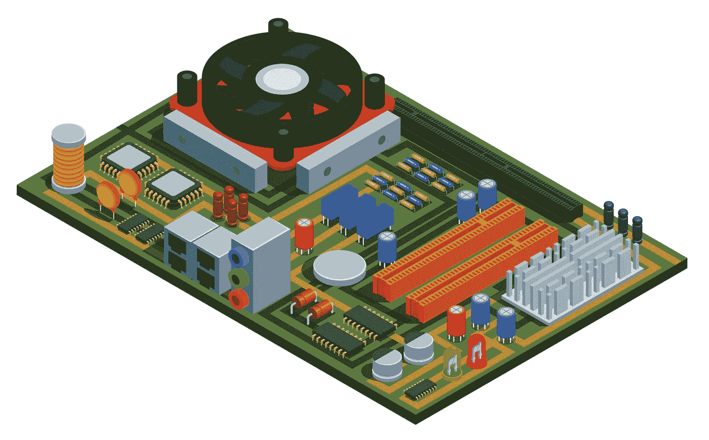
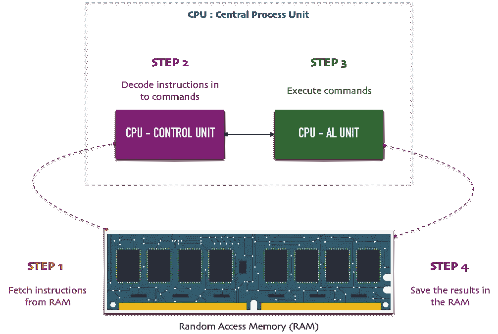
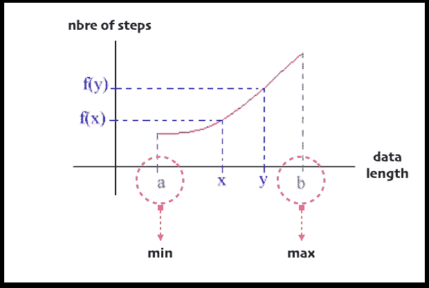
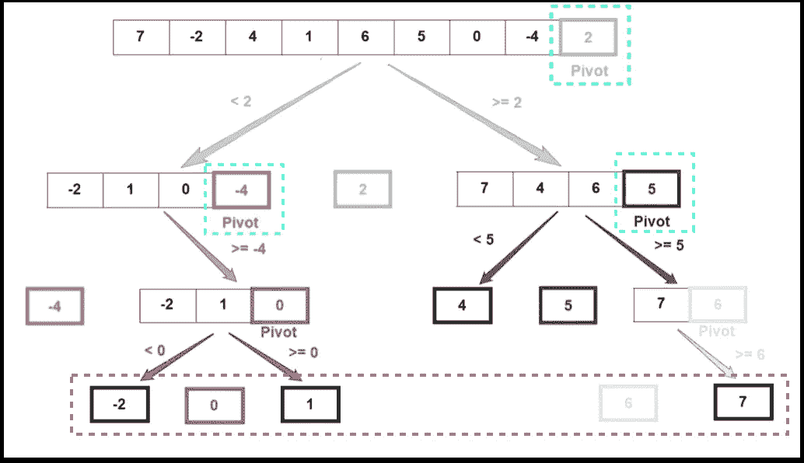
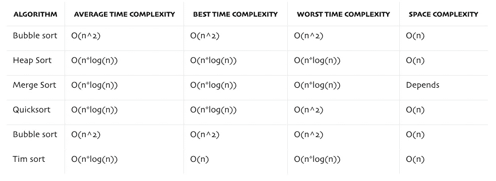
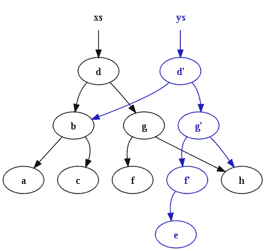

# 算法及其对性能的影响

> 原文：<https://betterprogramming.pub/algorithms-and-their-impact-on-performance-ed7b6d6156de>

## 如何选择合适的算法？


网站加载优化(授权给作者的图片)

# 介绍

“你好，海拉！你能帮我检查一下为什么我的代码用了这么长时间吗？”，“嗨赫拉！您能帮我检查一下为什么我的代码会消耗大量内存吗？”，“当我在本地测试我的代码时，一切都很好，但是在生产中，我的代码挂起了！”

这些都是我的日常问题，我爱他们！为什么？因为这给了我接近机器(电脑)和底层执行的机会。要了解一台机器，就要像机械师或医生一样，了解它的内部工作原理！



主板城市(图片授权给作者)

我确信，如果我想写一个性能代码，我必须从底层开始:

*   运行算法所需的步骤(指令)
*   保存算法代码所需的内存量
*   输入数据所需的内存量
*   所有输出数据所需的内存量

用计算机术语来说，所需的步骤反映了时间复杂度，所需的内存量反映了空间复杂度。

通过减少时间和空间的复杂性，我们获得了资源和金钱。我们不能每次都通过增加和修改硬件来应对性能和资源的缺乏。

我们写的软件应该是有效和高效的！

太棒了。但是，让我们停下来简化一下我的意思！

假设你是一名飞行员，你需要从法国飞到伊斯坦布尔。你的煤油数量有限，因为飞机的油箱是有限的。你要怎么办？是啊，很好！你会选择短轨迹！这样一来，你将节省时间和消耗！

代码也是如此:为了让它消耗更少的资源(CPU、内存、GPU)，我们应该总是选择最优路径。

如果软件是一辆汽车，那么我们可以说设计和架构使得拥有一个好的和漂亮的框架成为可能:有弹性的，可伸缩的，可扩展的，可维护的，等等。另一方面，低水平使得拥有高效的高性能汽车成为可能。啊哈，外在美是不够的。代码也必须从内部美观！

请注意，在本文中，当我谈到性能时，我指的是执行速度，当我谈到消耗时，我指的是分配的内存。

那么，代码指令是如何在内部执行的呢？让我们来看看这幅插图:



指令的生命(作者图片)

*   CPU 执行作为机器语言指令序列存储在主存储器中的程序。
*   它通过从内存中反复读取或检索指令，然后执行该指令来实现这一点。
*   完成后，结果将被保存回内存。

就这些了，伙计们！

你可以看到我们需要内存来存储程序以及最终和中间的结果。

现在是时候给你我解决算法相关的性能和内存问题的神奇配方了！

我的食谱包括:

*   选择正确的算法
*   选择正确的数据结构
*   一些分析和验证我们选择的技巧

在本文中，我将重点介绍如何选择正确的算法，并使用一些技术来分析和验证我们的选择。在我以后的文章中，我将解释其他部分。说够了，我们开始吧！

# 哦！哦！大 O！

## 等等，什么是大 O？

让我们来看看这张图表:



算法变异的极限(图片由作者提供)

```
min: when we have a reduced number of input data (usually locally).
max: when we have a lot of input data (usually in production).f(min) = minimum required steps to execute the code.
f(max) = maximum required steps to execute the code.
```

在计算机世界里，我们称之为:

*   `f(max)` : *O(N)* ，N 的大 O。
*   `f(min)`:*ω(N)*，N 的大ω。
*   大 O 用来描述算法最坏情况下的运行时间。
*   大ω用于描述给定算法的最佳运行时间。

啊哈，魔法！

在这篇文章中，我将重点放在大 O(噩梦)。

> “大 O 告诉你数据和算法的效率之间的比例关系。它准确地描述了步骤数是如何随着数据的增加而增加的。”——数据结构和算法常识指南，第二版，Jay Wengrow

简而言之，大 O 表示算法的性能如何随着数据的变化而变化？如果有`N`数据项，算法要走多少步？

大 O 将是我们衡量算法速度的度量。

如果一个算法需要减少的指令(或步骤)来执行，那么它就被认为是快速的。注意到了！

## 等等，记忆呢？

你知道我们也可以用大 O 来表示空间复杂度吗？啊哈，我们只需要重新表述概念和问题。

对于内存消耗，我们要说:如果有`N`个数据元素，算法会消耗多少内存单元？哒哒！

## 那大 O 怎么帮我们呢？

让我们总结一下:

*   性能:如果有`N`数据元素，算法要走多少步？
*   内存:如果有`N`个数据元素，算法会消耗多少内存单元？

大 O 帮助我们预测一个算法的性能和消耗，甚至在它被执行之前！

让我们看看大 O 在行动中的力量！

# 一些经典算法

## 冒泡排序

冒泡排序是一种简单的排序算法，它比较列表中一对相邻的元素。如果一个元素的顺序不对，我们就把它和之前的元素交换。否则，元素保持在相同的位置。哇，大数据的敏感算法！

下面是一些代码:

老式冒泡排序

执行步骤:

```
"data input : ", [89, 13, 57, 44, 71, 51]
"data i : ", [89, 13, 57, 44, 71, 51]
"data i : ", [13, 57, 44, 71, 51, 89]
"data i : ", [13, 44, 57, 51, 71, 89]
"data i : ", [13, 44, 51, 57, 71, 89]
"data i : ", [13, 44, 51, 57, 71, 89]
"data i : ", [13, 44, 51, 57, 71, 89]
"sortedTab : ", [13, 44, 51, 57, 71, 89]
```

冒泡排序的效率:

第一个循环需要`data.length`步骤:

```
for (let i = 0; i < data.length; i++) {
```

第二个循环也需要`data.length`步骤:

```
for (let j = 0; j < data.length; j++) {
```

如果`data.length = n`，那么冒泡排序算法的最坏情况时间复杂度为 O(n)。OMG！

因为我们是在不创建副本或临时数组的情况下就地修改数组，所以冒泡排序的空间复杂度为 O(1)。

当数组元素较少且数组接近排序时，冒泡排序是有效且高效的。

## 插入排序

插入排序背后的思想是，数组实际上被分成一个排序部分和一个未排序部分。未排序部分的值被选择并放置在排序部分的正确位置。

就像整理扑克牌一样:

*   假设在纸牌游戏中第一张牌已经被分类。
*   然后我们选择一张未分类的卡片。
*   如果选定的未排序卡片大于第一张卡片，它将被放置在右侧。
*   否则会放在左侧。
*   类似地，所有未分类的卡片被取出并放在它们的确切位置。


订购的卡片(授权给作者的图片)

哇，又一个棘手的大数据算法！

插入排序中有四种步骤:删除、比较、移位和插入。

下面是更多的代码:

复古插入排序

以下是一些执行步骤:

```
"data input : ", [89, 13, 57, 44, 71, 51]"data i : ", [89, 13, 57, 44, 71, 51]
"data i : ", [13, 89, 57, 44, 71, 51]
"data i : ", [13, 57, 89, 44, 71, 51]
"data i : ", [13, 44, 57, 89, 71, 51]
"data i : ", [13, 44, 57, 71, 89, 51][13, 44, 51, 57, 71, 89]
```

插入排序的效率:

冒泡排序算法的最坏情况时间复杂度为 O(n)，空间复杂度为 O(1)。OMG！

## 线性搜索

这是最简单、最自然、最直观的算法:

*   线性搜索将接受一个数组和一个目标值。
*   从数组的开头开始搜索。
*   检查该值是否等于目标值。
*   如果是，停止并返回该值的索引。
*   如果没有，继续下一个元素。

哇哦。简单但昂贵且贪婪，尤其是对于大数据！

下面是更多的代码:

老式线性搜索

线性搜索的效率:

*   如果目标值在开始，算法将总是在恒定时间`O(1)`运行。
*   如果目标是数组中的最后一个元素，那么算法将进行`n`比较(`n`是输入数据的长度)。
*   如果目标元素在数组中间的某个地方，那么时间复杂度大约为`O(n/2)`。

线性搜索的时间复杂度为 1 —线性时间复杂度。

线性搜索的空间复杂度为`O(1)` —常数空间。它不使用辅助数据结构来寻找目标值。

哇，一个敏感的大数据搜索算法！

## 二进位检索

二分搜索法背后的思想是通过将搜索区间一分为二来搜索一个有序的数组。我特别喜欢这个算法，因为它让我想起了我们猜数字的游戏:更低，更高，更多！

为您提供更多代码:

复古二分搜索法

二进制排序的效率:

二分搜索法算法的时间复杂度为`O(log n)`。

*   当中心索引将直接匹配期望值时，最佳情况的时间复杂度将是`O(1)`。
*   最坏的情况可能是列表两端的值或者不在列表中的值。

在迭代方法中，空间复杂度将是`O(1)`。而在递归方法中，空间复杂度将是`O(log n)`。

还不错！我们还可以改进，看！

# 改进老式算法

## 合并排序

如果你想在现实生活中看到“分而治之”的策略，这个算法将是最好的例子。

以下是合并排序的工作原理:

*   它将整个列表分成子列表或“n”个子列表。
*   它递归地继续这个过程，直到每个子列表都有一个元素。
*   一旦这个“分而治之”的过程完成，它就开始合并每个子列表来创建一个排序列表。

将问题分解成更小的子问题，直到它们变得足够简单，可以直接解决。我喜欢！

下面是更多的代码:

合并排序

现在，让我们一步一步地看代码:

```
Consider this input data :
[5, 7, 1, 4, 6, 3, 2]Divide the array into two sub-arrays :
[5, 7, 1] and [4, 6, 3, 2]Again each array will be divided into two subarrays :
[5], [7, 1] and [4, 6], [3, 2]Continue over and over :
[5], [7], [1], [4], [6], [3], [2]
[5, 7], [1, 4], [3, 6], [2]
[1, 4, 5, 7] [2, 3, 6]
[5], [7], [1], [4], [6], [3], [2]Now the first step is complete as each array has only one item in it.Now we will compare the array elements and merge these single item arrays into pairs :
[5, 7], [1, 4], [3, 6], [2]
[1, 4, 5, 7] [2, 3, 6]
[1, 2, 3, 4, 5, 6, 7]
```

合并排序的效率:

合并排序的时间复杂度为`O(n log(n))`。

归并排序的空间复杂度为`O(n)`。

对于排序算法来说，合并排序非常快，但是速度的提高是以占用更多内存空间为代价的。数组越大，需要存储在内存中的数组就越多(因为要分割它们)。行动。

快速排序算法也遵循分治法。它根据某种条件将元素划分成更小的部分，并对这些划分的更小部分执行排序操作。啊哈，它对大型数据集很有效！

是的，更多的代码给你:

快速排序

以下是我们工作的更多解释:



快速排序执行步骤(图片由作者提供)

快速排序的效率:

*   快速排序的平均事例时间复杂度为 O(n log (n))，与归并排序相同。即使输入数组很大，它的表现也很好。它提供了高性能，并且相对容易编码。
*   它不需要任何额外的内存。
*   快速排序的主要缺点是主元选择不当会将算法的时间复杂度降低到 O(n)。

哇，这不是一个稳定的排序算法！

## 蒂姆排序

Tim 排序是一种混合的稳定排序算法，源自合并排序和插入排序，旨在对多种真实数据执行良好。哇哦。

它是由 Tim Peters 在 2002 年开发的，用来取代 Python 之前的排序算法。此后，它被 Java 的 OpenJDK、V8 JavaScript 引擎以及 Swift 和 Rust 语言所采用。啊哈，这证明了蒂姆是表演型的。

出于好奇:

[提姆排序 Python 定义](https://svn.python.org/projects/python/trunk/Objects/listsort.txt)

[Tim Sort Python 实现](https://svn.python.org/projects/python/trunk/Objects/listobject.c)

在我们继续之前，我想说，如果你不知道 Tim Sort 的算法，你真的错过了计算机科学中一个重要而有趣的部分！

下面是一个开源实现示例(JavaScript):

[](https://github.com/LXSMNSYC/TimSort) [## GitHub-LXSMNSYC/TimSort:JS/ES 中的 Tim sort 实现。

### JS/ES 中 TimSort 的实现。为教育目的制作的。TimSort 是一种混合稳定排序算法，由…

github.com](https://github.com/LXSMNSYC/TimSort) 

时间排序的效率:

*   Tim Sort 是一种自适应排序算法，需要 O(n log n)次比较来对 n 个元素的数组进行排序。
*   Tim 排序的空间复杂度为 O(n)。

## 是时候总结一下到目前为止我们所看到的了！



排序算法的比较(图片由作者提供)

# 一些空间复杂性提示

## 就地更改数组

默认情况下，我在代码中采用函数式方法。不允许突变，所有函数都是纯函数。然而，在我创建副本之前，特别是对于大量数据，我必须确保这种语言提供了浅层副本、结构化共享或写时复制等概念(我们将在后面看到)。如果没有，我选择“就地改变阵列”策略。

上述函数就地更改输入数据:

```
const inPlaceChange = (data) => {
  for (let i in data) {
    data[i] = data[i] * 2;
  }
}const tab  = [1, 2, 3, 4];console.log(tab) // [1, 2, 3, 4]inPlaceChange(tab);console.log(tab) // [2, 4, 6, 8]
```

上面的函数在改变数组之前创建一个副本:

```
const copyChange = (data) => {
  const dataCopy = [
    ...data
  ]
  for (let i in dataCopy) {
    dataCopy[i] = dataCopy[i] * 2;
  }
  return dataCopy;
}const tab = [1, 2, 3, 4];console.log(tab) // [1, 2, 3, 4]const newTab = copyChange(tab);console.log(tab) // [1, 2, 3, 4]
console.log(newTab) // [2, 4, 6, 8]
```

创建副本前要小心。我们通常避免对大数据进行深度拷贝，而是使用浅层拷贝或一些技术，如结构共享和写入时拷贝。让我们看看！

## 结构共享

当我们采用函数式风格和数据不变性时，我们通过创建数据的副本(新版本)来处理数据更改，而不是在不影响性能的情况下改变数据。

结构化共享提供了一种在多个版本的 it 之间共享数据的有效方式，而不是复制整个数据。这类似于 git 的工作方式。哇哦。



[维基百科](https://en.wikipedia.org/wiki/Persistent_data_structure#/media/File:Purely_functional_tree_after.svg) —持久数据结构

在上面的模式中，`ys`共享`xs`的结构。

## 写入时复制(cow)

“写入时拷贝”意味着每个人都有一份相同数据的共享拷贝，直到数据被写入，然后制作一份拷贝。复制大量复杂的数据可能是一项昂贵的操作。如果副本从未被修改，那么就没有必要产生这个成本。超级！

更多详情如下:

[](https://raganwald.com/2019/01/14/structural-sharing-and-copy-on-write.html) [## 探索结构化共享和写时复制语义，第一部分

### 这篇文章非常随意地探讨了在使用大型数据时实现高性能的两种相关技术…

raganwald.com](https://raganwald.com/2019/01/14/structural-sharing-and-copy-on-write.html)  [## 持久数据结构-维基百科

### 在计算中，持久数据结构或非短暂数据结构是一种总是保持数据完整性的数据结构

en.wikipedia.org](https://en.wikipedia.org/wiki/Persistent_data_structure) [](https://en.wikipedia.org/wiki/Copy-on-write) [## 写时复制-维基百科

### 写时复制(COW)，有时也称为隐式共享或隐藏，是一种资源管理技术，用于…

en.wikipedia.org](https://en.wikipedia.org/wiki/Copy-on-write) 

# 你知道吗？

Timsort 从 V8 v7.0 和 Chrome 70 开始提供！

[](https://v8.dev/blog/array-sort) [## 在 V8 中整理东西

### Array.prototype.sort 是 V8 中自托管 JavaScript 实现的最后几个内置功能之一。移植它为我们提供了…

v8.dev](https://v8.dev/blog/array-sort) [](https://github.com/v8/v8/commit/5a3893958a8211722b01f6b5bbfdd4498a45ff57) [## [array]将 Array.p.sort 移动到 Torque 并使用 TimSort 而不是 QuickSort v8/v8@5a38939

### 浏览文件[array]Move array . p . sort to Torque 并使用 TimSort 代替 QuickSort 这个 CL 改变了排序…

github.com](https://github.com/v8/v8/commit/5a3893958a8211722b01f6b5bbfdd4498a45ff57) [](https://github.com/v8/v8/commit/9d406a0249289880f13be1c057fe95077533a9a9) [## Reland "[array]将 Array.p.sort 的 QuickSort 更改为 TimSort " V8/V8 @ 9d 406 A0

### browse files Reland "[array]Change quick sort to Tim sort for array . p . sort "这是原始更改的 Reland…

github.com](https://github.com/v8/v8/commit/9d406a0249289880f13be1c057fe95077533a9a9) 

# 结论

嗯，这或多或少是一个漫长的算法之旅。

很明显，算法的选择对性能和所使用的资源，尤其是存储器，有直接的影响。

感谢发明家和数学家，他们为我们提供了一种度量标准，在算法真正执行之前，或多或少地准确预测了算法的行为。

在这个层次上，有些人会问我:如果编程语言已经提供了排序、搜索等本地方法，我们为什么还要学习和了解这一部分呢？？这个问题问得好，下面是我的回答。

首先，我们需要知道我们在生产中出现问题或调试时使用什么。如果本地方法的内部算法实现了快速排序或 Tim 排序，我们就放心了。否则，我们必须提高警惕并加以改进。

然后，有时一些语言本身没有实现最优方法。

知道并掌握大 O 概念，能够在问题出现之前就预测出来，这是非常好的。在执行之前，一切都是精心计算和选择的。

为了提高性能和资源消耗，您应该接近低水平。大 O，时间复杂度和空间复杂度在软硬部分之间提供了很好的抽象。

啊哈，你现在知道如何选择正确的算法了吗？是的，很好，你知道怎么根据“大 O”！

大 O 不仅仅指排序和搜索算法，而是一个适用于所有类型算法的通用概念。排序和研究通常作为一个简单的例子来说明大 o 的应用。

最后，我祝你在算法优化的世界和大 O. O .的宇宙中一路顺风！哦！大 O！

在以后的文章中再见！

感谢您阅读我的文章。

```
**Want to Connect?**You can find me at GitHub: [https://github.com/helabenkhalfallah](https://github.com/helabenkhalfallah)
```