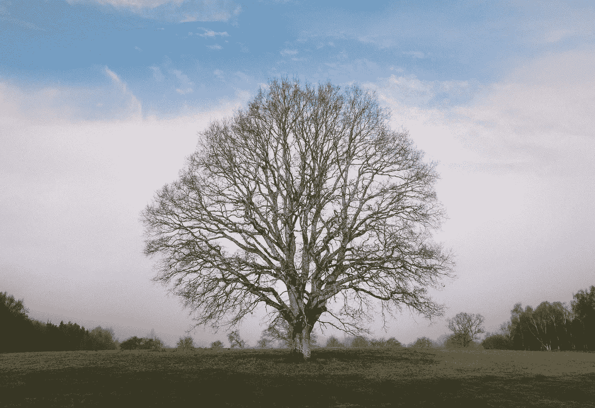
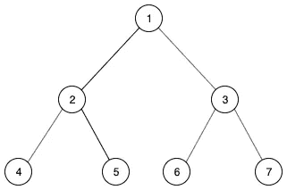
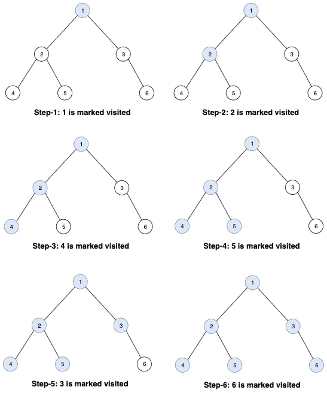
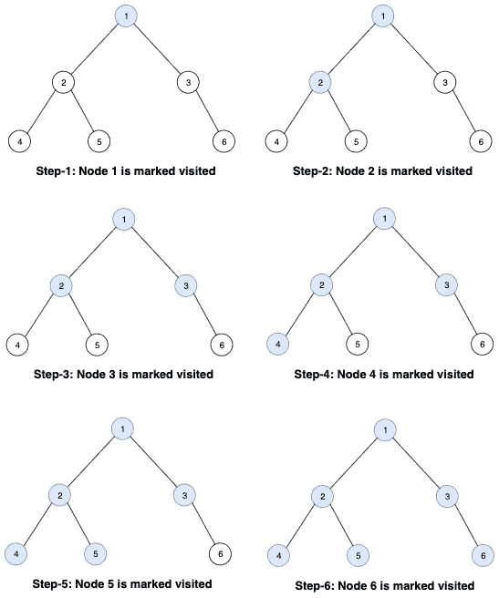

# 算法:广度优先搜索与深度优先搜索

> 原文：<https://betterprogramming.pub/algorithms-searching-through-a-tree-33610e4577bd>

## 在树中搜索的不同方法

卢克·理查森在 [Unsplash](https://unsplash.com/s/photos/tree?utm_source=unsplash&utm_medium=referral&utm_content=creditCopyText) 上的照片

这篇文章是关于遍历或搜索树形数据结构的。树是一种非线性数据结构。它不像数组或链表那样线性存储数据，而是分层存储(图 1)。

我们将讨论两种流行的搜索算法:广度优先搜索(BFS)和深度优先搜索(DFS)及其应用。我们也将看到哪一个表现更好，什么时候。这是为新的或重温这个主题的读者准备的。

图 1:一棵树的图画

# 1.深度优先搜索

DFS 是一种遍历树的搜索算法。搜索是通过访问一个节点，然后在访问其兄弟节点之前访问所有子节点来完成的(具有相同父节点的节点被称为*兄弟节点*)。

让我们通过一个例子来理解这一点:

图 2:深度优先搜索

可以使用一个栈来实现[一个*栈*是一个用于存储对象的数据结构，其中对象是根据后进先出(LIFO)原则插入和移除的]:

1.从根节点开始。标记它访问过。
2。将其左侧子节点和右侧子节点推送到堆栈中。
3。从堆栈中弹出一个节点，并将其标记为已访问。将其左侧子节点和右侧子节点推送到堆栈中。
4。对每个未访问的节点重复步骤 3。

## **时间复杂度**

时间复杂度为 *O(V+E)* ，其中 *V* 为顶点数， *E* 为边数。

## **空间复杂度**

空间复杂度为 *O(h)* ，其中 *h* 为树的最大高度。

## **应用**

1.  DFS 用于查找两个节点之间的路径。
2.  它可以用来进行拓扑排序，这可以用来根据给定的依赖关系来调度作业。
3.  它还可以用来寻找谜题的答案，例如，找到一条走出迷宫的路径，该路径存储在堆栈中。

# 2.广度优先搜索

就像 DFS 一样，BFS 也是一种搜索算法——但有一点不同。首先访问同一级别的节点(然后是下面级别的节点)。一个*级*是根节点和节点+ 1 之间的连接数。

让我们用一个例子来形象化这一点。我们将使用用于 DFS 的同一棵树来理解它们的区别。

图 3:广度优先搜索

可以使用一个队列来实现[一个*队列*是一个用于存储对象的数据结构，其中对象是根据先进先出(FIFO)原则插入和移除的]:

1.从根节点开始。标记它访问过。
2。将其左子节点和右子节点推入队列。
3。从队列中弹出一个节点，并将其标记为已访问。将其左子节点和右子节点推入队列。
4。重复步骤 3，直到队列为空。

## **时间复杂度**

时间复杂度同 DFS— *O(V+E)* ，其中 *V* 为顶点数， *E* 为边数。

## **空间复杂度**

空间复杂度为 *O(l)* ，其中 *l* 为单级节点的最大数量。

## **应用**

1.  BFS 用于查找两个节点之间的最短路径。
2.  它被用来在 GPS 系统中寻找邻近的位置。
3.  它还被用于查找像 BitTorrent 这样的对等网络中的所有相邻节点。

# BFS 和 DFS，你该选哪个？

两种算法的时间复杂度是一样的。但是在空间复杂性的情况下，如果最大高度小于单个级别中的最大节点数，那么 DFS 将比 BFS 更优化空间，反之亦然。

因此，如果问题涉及到寻找最近邻居或最短路径，BFS 表现得更好——就像在 DFS 的情况下，叶子节点首先被访问。

但是在解决难题或拓扑排序的情况下(即，在到达叶节点时需要评估结果的情况)，DFS 表现得更好。