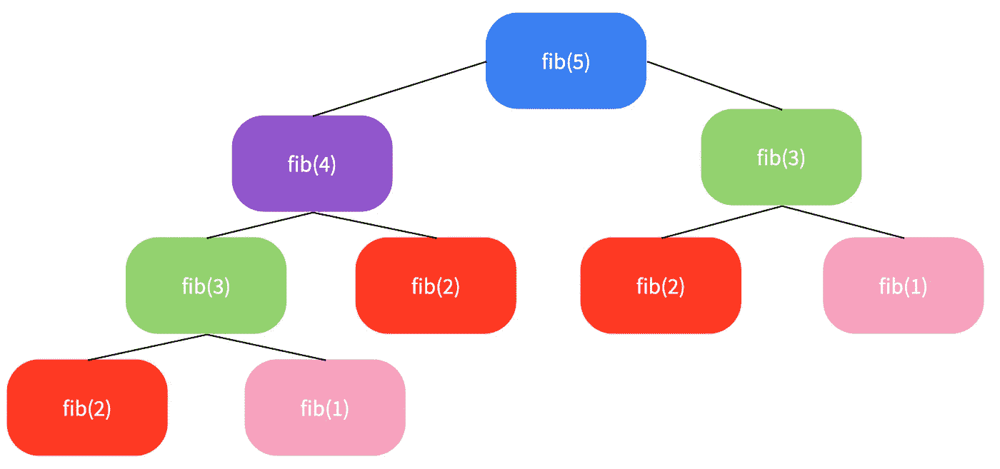

# 算法:求解斐波那契数列

> 原文：<https://betterprogramming.pub/algorithms-solving-the-fibonacci-sequence-9aee63a7a946>

## 递归地、记忆地、迭代地解决它


图片由 [Gerd Altmann](https://pixabay.com/users/geralt-9301/) 在 [Pixabay](https://pixabay.com/illustrations/fibonacci-spiral-science-golden-3210944/) 上拍摄

你可能听说过斐波那契数列是“黄金比例”。这个名字是由于数字之间的比例为 1.618034。

据说，当我们看到树木的生长点或花瓣，或我们的身体部位(一个鼻子，两个眼睛，每只手五个手指)时，它会在自然界中表达出来。

我不会讨论斐波那契背后的理论，而是用 JavaScript 函数解决它的两种半方法。

# 什么是斐波那契数列？

斐波那契数列以意大利数学家莱昂纳多·比萨的名字命名，是一个数字序列，其中前两个数字之后的每个数字都是前面数字的总和。下面我们来看看。

```
Fibonacci Sequence:
1, 1, 2, 3, 5, 8, 13, 21, 34, 55, 89...Such that:  
1 + 1 = 2; 
2 + 3 = 5; 
3 + 5 = 8;
8 + 13 = 21;
13 + 21 = 34;
21 + 34 = 55;
34 + 55 = 89;
and so on to infinity
```

我们可以把数字想象成一个树状的数据结构。如果我们将序列组织成一棵树，我们就可以计算该位置上任何数字的斐波那契值。

从底部开始向上，我们可以添加子对并向上到达`fib(5)`，这里的值实际上是 5。我们可以看到`fib(1), fib(2), fib(3)`被多次重复。

解决这个序列的一种方法是使用动态编程。我们可以通过寻找重复来将问题分解成更小的块。



解决这个问题的一些方法是使用递归、记忆或迭代。正如我们将看到的，它们都有自己的时间复杂性。让我们深入其中，用 JavaScript 编写斐波那契函数。

# 天真的解决方案——o(2^n)

如果`fib(1) = 1`和`fib(2) = 1`，那么我们可以算`fib(n) = fib(n-1) + fib(n-2)`。因此，我们可以使用递归来编写一个解决方案，如下所示:

```
function fibRecursion(n) {
   if(n <= 2) return 1;
   return fib(n-1) + fib(n-2);
}
```

该函数接受一个整数 *n* 。在第 1 行，我们有一个基本情况，即小于或等于 2 的整数 *n* 将给出起始数 1，因为我们想从第三个数开始计数。

然后，在最后一行，我们递归地调用函数。这种解决方案被认为是幼稚的，因为尽管它完成了工作，但不是最佳的。这个函数的 big-O 时间复杂度是 O(2^n) 非常慢。

如果我们回头看树，这个解决方案会让我们一遍又一遍地检查每个孩子，即使我们已经计算了值。

在`fib(5)`的例子中，还不太清楚这个函数会如何运行缓慢，但是当我们开始使用更大的输入值时，树会快速增长，运行起来会变得非常昂贵。

让我们看看一个更好的解决方案，仍然使用递归。

# 递归和记忆解— O(n)

简单解决方案的一个问题是有许多重复的函数调用。对此进行优化的一种方法是记住之前计算的值并存储这些值。这个概念被称为*记忆*。

记忆化是一种优化技术，它通过在重复相同输入时存储结果来加快运行时间。我们可以将数据存储或记忆在数据结构中，如数组或对象。

因此，让我们这样做，并将计算出的值存储到一个数组中。这一次，我们的函数将采用两个参数:`n` 和`memo=[]`。

我们在 2 号线又有了基本情况。在第 1 行，我们说如果索引为`n`的 memo 数组不是未定义的，我们想要返回值。

var `res`被分配递归函数调用。`memo[n]`将被重新分配给`res`的值。该函数最终将返回位置 *n* 处序列的整数。

这种解决方案最终比简单的解决方案要快得多，因为随着 *n* 的增长，运行的时间也会增长。因此，这种递归和记忆的解决方案具有 O(n)的大时间复杂度。

空间复杂度也不是很大。随着 *n* 的增长，内存化占用了相当大的空间，所以这个解决方案的*空间复杂度*也是 O(n)。

这个解决方案遵循一种*自上而下的方法* 从树根开始，一直到孩子。

# 迭代解法:制表，又名“自下而上”——O(n)

我提到了对两个半解决方案的关注，而不是三个，因为记忆解决方案包括递归。

让我们看看另一种用迭代求解斐波那契的方法。您可能知道，迭代包括一次又一次的循环，直到满足某些条件。像 memoization 一样，我们将存储每个位置的值，但我们将使用“表”而不是“备忘录”。

在我们的例子中，“表”也是一种数据结构，就像数组或对象一样。这种迭代方法被称为*制表*。制表在 O(1)处比记忆化具有更好的空间复杂度，然而，大 O 时间复杂度仍然是 O(n)。

让我们来看看函数:

我们在 1 号线又有了基本情况。在第 2 行，我们建立了我们的“表”,它是前两个数字的数组。因为我们从索引 1 开始，所以索引 0 可以设置为 0 或者未定义。

然后，我们从索引 3 开始循环，直到到达 *n* 。最后，我们只返回第 n 个索引*的值。就是这样！我们只是从桌子的“底部”开始向上爬。*

# 结论

我个人认为迭代更容易理解。乍一看，代码比递归简单得多。

在我们的斐波那契数列的例子中，如果我们要优化时间和空间的复杂性，迭代似乎是一种方法。

递归、记忆和列表/迭代都是动态编程的一部分。这里有一些资源，你可以看看，以了解更多！快乐编码。

# 资源

[](https://frontendmasters.com/courses/practical-algorithms/introducing-dynamic-programming/) [## 了解动态编程简介 JavaScript 算法实用指南

### Bianca 讨论了动态编程，这是一种数据优化技术。动态方法将值缓存到…

frontendmasters.com](https://frontendmasters.com/courses/practical-algorithms/introducing-dynamic-programming/) [](https://www.tutorialspoint.com/dynamic-programming-in-javascript) [## JavaScript 中的动态编程

### 动态编程将问题分解成越来越小的可能的子问题。这些子问题是…

www.tutorialspoint.com](https://www.tutorialspoint.com/dynamic-programming-in-javascript) [](https://www.freecodecamp.org/news/demystifying-dynamic-programming-24fbdb831d3a/) [## 揭开动态编程的神秘面纱

### 通过 Prajwal M 揭秘动态编程图像信用…

www.freecodecamp.org](https://www.freecodecamp.org/news/demystifying-dynamic-programming-24fbdb831d3a/)