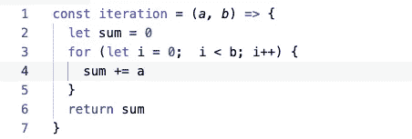
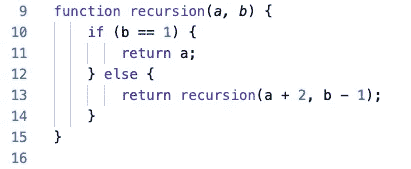
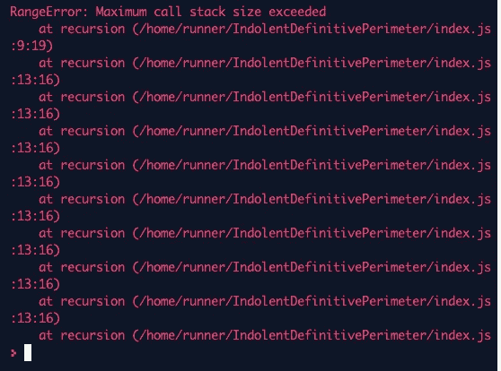

# JavaScript 算法:递归与迭代

> 原文：<https://betterprogramming.pub/algorithms-with-javascript-recursion-vs-iteration-f28cfe6ce29e>

## 以正确的方式实现自动化

我认为我们构建软件的最重要的原因之一是因为它可以为我们做无聊的、迭代的任务，而不会抱怨它们太多太无聊的工作。至少，如果我们正确地构建我们的程序，这是真的。


斯图尔特 _ 罗杰 _ 迈尔斯(pixabay.com)途经[Needpix.com](https://www.needpix.com/photo/974027/rat-race-businessman-repetitive-3d-rendering-boring-business-character-cog-cogwheel)

反复重复同一个操作有两种方法:迭代和递归。

# 循环

JavaScript 为迭代提供了很多方法。有`for`、`while`、`do while`、`for in`、`for of`。此外，还有更高级别的循环，如`map`或`forEach`。顺便说一下，像`find`、`includes`和 `sort`这样的方法实际上也是循环的，所以要明智地使用它们。

对于我们的例子，我们将使用`for loop`。让我们构建我们的迭代函数:



这是一个非常简单的函数，接受两个参数。第一个是数字，我们添加到结果中。第二个参数表示我们将进行多少次迭代。

# 递归

JavaScript 递归意味着函数调用自己，直到满足某个条件。让我们用递归构建一个函数:



与第一部分一样，该函数接受同样的两个参数。然后我们检查参数 b 是否等于 1。如果是，函数返回第一个参数。如果没有，我们返回带有更新参数的函数本身。

两种功能都工作得非常好。再来看看性能。

# 比较迭代和递归性能

为了检查执行函数需要多少时间，我们将使用`console.time`方法。

我将从 200 个操作开始，然后这个数字呈指数增长。

200-操作案例:

```
200 operations:400Iteration #1: 1.224ms400Recursion #1: 0.258ms
```

对于 200，递归似乎比迭代快得多。

2000 次手术:

```
4000Iteration #1: 1.501ms4000Recursion #1: 1.226ms
```

递归仍然比迭代快，但并不比第一种情况快多少。

```
2000 operations:40000Iteration #1: 5.738ms
```

递归:



"超过了最大调用堆栈大小。"哇，刚刚发生了什么？

我们在递归的情况下有一个错误，因为它将每个函数调用添加到调用堆栈中。每个浏览器都有调用堆栈大小的限制。比如 FireFox 最大调用栈是 350801，Chrome 是 25237。

但是迭代会尽你所能地工作。我加了 20 亿次运算测试迭代能力。这花费了一些时间，但是迭代毫无怨言地处理了它:

```
2000000000 operations:4000000000Iteration #1: 8109.370ms
```

# **结论**

看起来递归比迭代更便宜。但是我们应该小心，不要让递归超出它的处理能力。

可以在[回复](https://repl.it/@PavelIlin/RecursionVsIteration)里玩。

总是为你的反馈而高兴。感谢阅读！