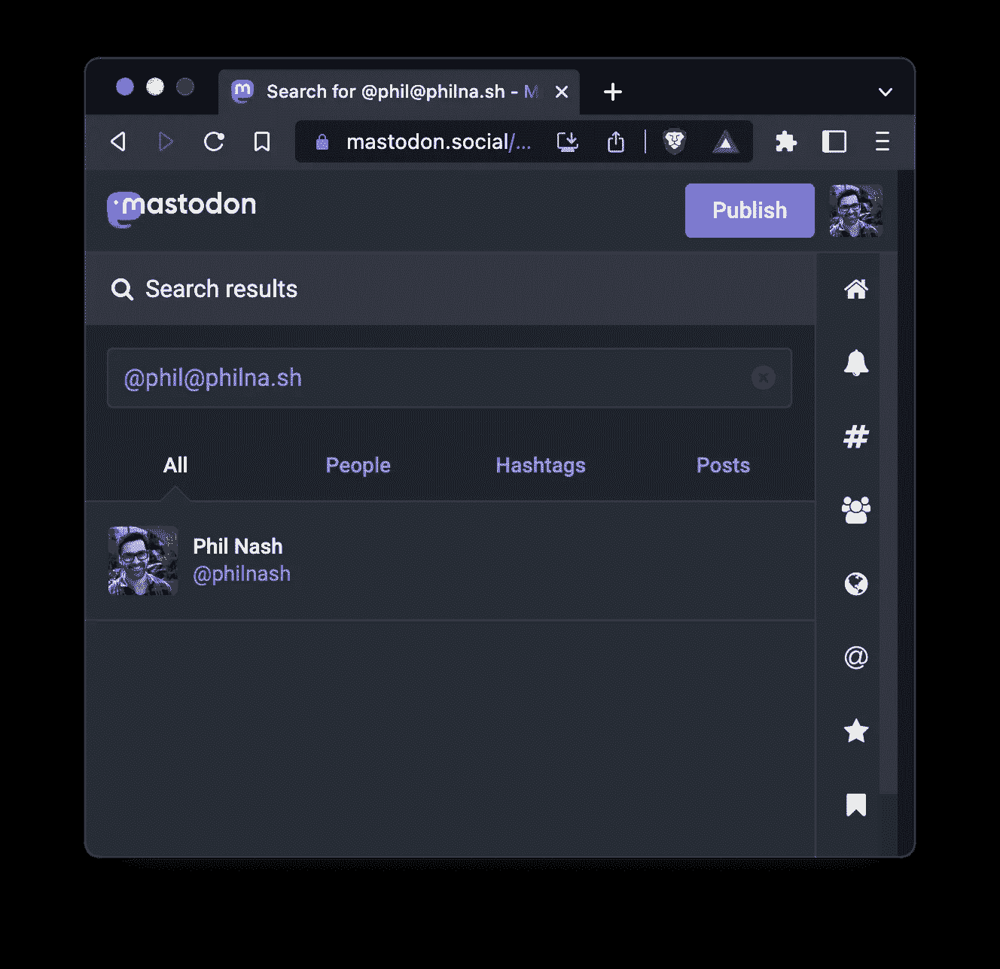

# 别名你的乳齿象用户名到你自己的域与 Jekyll

> 原文：<https://betterprogramming.pub/alias-your-mastodon-username-to-your-own-domain-with-jekyll-1aa272a337d9>

## 去一趟多元化的美食之旅


乳齿象不同于大多数在线服务。这是一个联合网络，所以当你建立一个账户时，你需要[选择一个服务器来使用](https://docs.joinmastodon.org/user/signup/)。然后，您的用户名就变成了您的句柄和您注册的服务器的组合。比如我目前是[@ philnash @ mastosdon . social](https://mastodon.social/@philnash)。

但是如果你想更个性化一点呢？如果你想为你的 mastocon 帐户使用你自己的域，而不必托管整个 mastocon 服务器，那该怎么办？

使用你自己的域名意味着无论你使用什么样的实例，或者如果你移动了实例，你都可以共享一个始终指向正确的配置文件并个性化到你自己的站点的乳齿象用户名。

# 拯救网络手指

原来你可以这么做。Maarten Balliauw 写了乳齿象如何使用 WebFinger 向电子邮件地址添加额外信息。类似于相关简档页面或 [ActivityPub](https://activitypub.rocks/) 流的信息。

实现 WebFinger 需要您的域用相关账户的 JSON 表示来响应对`/.well-known/webfinger`的请求。如果你有一个乳齿象账户，你可以通过请求`https://#{instance}/.well-known/webfinger?resource=acct:#{username}@#{instance}`来查看你的 WebFinger JSON 是什么样子。

例如，我的 WebFinger JSON 可以从这个网址获得:`[https://mastodon.social/.well-known/webfinger?resource=acct:philnash@mastodon.social](https://mastodon.social/.well-known/webfinger?resource=acct:philnash@mastodon.social)`。

要将一个乳齿象帐户与您自己的域相关联，您可以自己从一个`/.well-known/webfinger`端点提供这个 JSON。

# Jekyll 的网络手指

正如 Maarten 在他的文章中指出的，您可以将 JSON 响应从您的乳齿象实例复制到一个文件中，然后从您自己的站点提供该文件。

我的网站由 Jekyll 提供支持，所以我想让我和其他使用 Jekyll 的人更容易创建和服务 WebFinger JSON。

我之前也做过 Jekyll 插件，像 [jekyll-gzip](https://github.com/philnash/jekyll-gzip) ， [jekyll-brotli](https://github.com/philnash/jekyll-brotli) ， [jekyll-zopfli](https://github.com/philnash/jekyll-zopfli) ，还有[Jekyll-web _ monetary](https://github.com/philnash/jekyll-web_monetization)。

我开始工作并建造了`[jekyll-mastodon_webfinger](https://github.com/philnash/jekyll-mastodon_webfinger)`。

# 如何使用它

按照以下步骤，你可以在 Jekyll 网站上提供自己的 WebFinger JSON 来指向你的乳齿象档案:

1.将`jekyll-mastodon_webfinger`添加到您的 gem 文件中:

```
bundle add jekyll-mastodon_webfinger
```

2.将该插件添加到您在`_config.yml`的插件列表中:

```
plugins:
  - jekyll/mastodon_webfinger
```

3.将您的乳齿象用户名和实例添加到`_config.yml`:

```
mastodon:
  username: philnash
  instance: mastodon.social
```

下次构建站点时，您将在输出目录中找到一个`/.well-known/webfinger`文件，并且当您部署时，您将能够使用自己的域来引用您的乳齿象帐户。

您可以通过检查我的域上的 WebFinger 端点:[https://philna.sh/.well-known/webfinger](https://philna.sh/.well-known/webfinger)或者通过在您的乳齿象实例上搜索`@phil@philna.sh`来查看结果。



由于这是一个静态文件，它有点像一个包罗万象的电子邮件地址。你其实可以搜索`@any_username@philna.sh`就能找到我。如果您想对此加以限制，您需要构建一个能够动态响应请求的端点。

# 提供乳齿象蹼指反应的其他方法

我不是唯一考虑过这个问题的人。除了 Maarten 关于这个主题的原始帖子，其他人已经开发了工具或者发布了关于如何在你自己的网站上做这件事的帖子。

Lindsay Wardell 写了如何将乳齿象与 Astro 整合在一起，包括展示如何在她的 Astro 网站上显示她的反馈。

张秀坤·昆德尔组装了一个 [Netlify 插件，为你的 Netlify 托管网站生成一个乳齿象 WebFinger](https://github.com/dkundel/netlify-plugin-mastodon-alias) 文件。

# 去一趟多元化的美食之旅

乳齿象越来越受欢迎的一个有趣的副作用是学习和理解支持这种社交网络联盟的协议。 [WebFinger](http://webfinger.net/) 和 [ActivityPub](https://activitypub.rocks/) 正迎来它们的辉煌时刻，我期待看到在它们的基础上还能构建什么样的集成和应用。

与此同时，你可以使用本文中的技巧，将你自己的域名作为乳齿象档案的别名。如果你喜欢它，请通过搜索`@phil@philna.sh`或[https://mastodon.social/@philnash](https://mastodon.social/@philnash)与我联系。

*最初发布于*[*https://philna . sh*](https://philna.sh/blog/2022/11/23/alias-your-mastodon-username-to-your-own-domain-with-jekyll/)