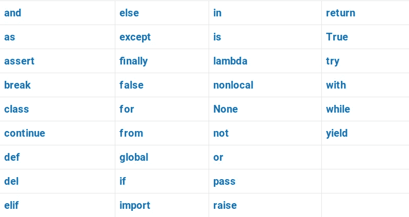
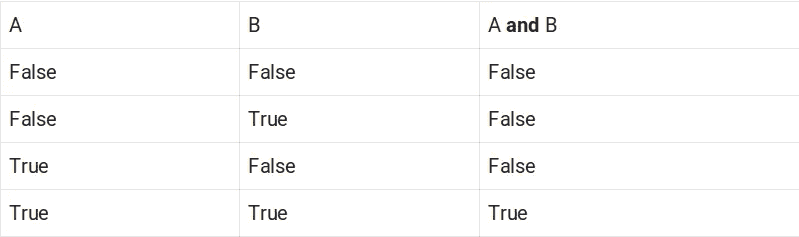
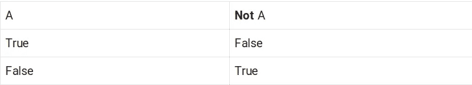
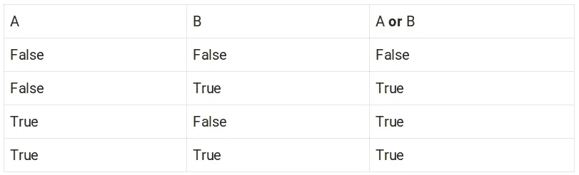

# Python 中所有 33 个保留关键字

> 原文：<https://betterprogramming.pub/all-33-reserved-keywords-in-python-98e55f6c8ded>

## 带示例的 Python 关键字鸟瞰图



作者图片

Python 中有 33 个保留关键字。这意味着任何对象都不能与这些关键字同名。

以下是 Python 中所有保留关键字的列表。

# 和

`and`操作符是 Python 的逻辑操作符之一。

如果包围它的两个语句都为真，那么`and`操作符返回真。

以下是 Python 中 and 运算符的真值表:



例如:

输出:

```
True
```

# 如同

Python 中的`as`语句将返回的对象重新分配给一个新的标识符。

在 Python 中通常使用`as`语句有两种情况:

1.  用别名导入模块。
2.  用上下文管理器打开文件。

例如，您可以为名为`[datetime](https://docs.python.org/3/library/datetime.html)`的导入模块创建一个别名:

当您有一个长的模块(或模块成员)名称，并且必须反复重复时，创建别名非常有用。

作为另一个例子，下面是使用上下文管理器打开文件的样子:

# 维护

Python 中的`assert`语句用于在给定评估`True`的条件下继续执行。如果条件为假，则抛出`AssertionError`。

您可以在 assert 调用中包含一条错误消息。这将通过`AssertionError`显示为错误信息。

例如，让我们确保没有被 0 除。

输出:

# 破裂

Python 中的 break 关键字是一个控制流语句。它用于从循环中跳出。执行将在下一条语句处继续。

break 语句用于终止没有充分理由继续的循环。

例如，让我们创建一个数字列表和一个目标数字。当我们从数字列表中找到目标数字时，就没有理由继续循环。

输出:

# 班级

Python 中的`class`关键字用于定义类。

类是 Python 中创建对象的蓝图。类将数据和功能捆绑在一起。编写类会在项目中创建一个新的对象类型。然后，您可以在项目中创建该自定义类型的新实例。

例如，让我们创建一个`Fruit`类。使用这个类，您可以在代码中创建不同名称的`Fruit`对象。

# 继续

`continue`语句是 Python 中的控制流语句之一。它用于停止循环中的当前迭代。

与 break 不同，continue 语句不退出循环。

当没有理由继续当前迭代时，continue 语句非常有用。

例如，给定一个数字列表和一个目标数字，我们将在列表中搜索目标。

为此，我们创建了一个 for 循环来检查每个数字。如果这个数字不是目标数字，我们继续下一个数字。当目标被发现时，我们就打破这个循环。

输出:

# 极好的

Python 中的`def`关键字用于声明一个函数或方法。

Python 中的函数是一个可重用的代码块，可以调用它来执行特定的操作。

函数也可以使用参数来执行操作。

例如，让我们创建一个以名称作为参数的函数。用一个名字调用这个函数会问候一个有这个名字的人:

输出:

# 倒三角形

Python 中的 del 语句用于删除对象。

例如，让我们删除数字列表的第一个元素:

输出:

```
[2, 3]
```

# 否则如果

`elif`语句与 if 语句结合使用，检查条件是否成立。

Elif 是“else if”的简写。当 if 语句中的条件不成立时，elif 语句检查其他条件是否成立。

例如:

输出:

```
You can go to driving school
```

# 其他

在 if-elif-else 语句中，else 语句用于执行在没有先前条件为`True`时发生的动作。

例如:

输出:

```
You cannot drive yet
```

还可以在 Python 循环中使用 else 块。这样，您可以在循环终止后立即执行一段代码。

例如，以下是 For 循环后的 else 语句:

输出:

以下是 while 循环后的 else 语句。

输出:

如果没有发现错误，else 块还可以在错误处理中用于运行一段代码。

输出:

# 除...之外

except 语句是 Python 中 [try-except](https://www.codingem.com/try-catch-in-python/) 错误处理结构的一部分。

在错误处理中，try 块试图运行一段代码。如果这段代码抛出一个错误，except 块会捕获它。

Python 中的错误处理非常有用，因为错误是在代码中处理的，所以程序不会崩溃。

例如，让我们使用错误处理来尝试将 10 除以 0:

输出:

```
Cannot divide by 0!
```

这里，except 块捕获一个`ZeroDivisionError`，当试图将一个数除以 0 时抛出。

# 最后

finally 块是 try-except 错误处理结构的可选部分。

无论是否抛出错误，finally 语句总是执行代码。您可以使用 finally 语句来运行一些清理代码，例如关闭文件。

例如，让我们试着除以零:

输出:

```
Cannot divide by 0!
Error handling complete.
```

在这里，您可以看到 finally 块中的代码被执行了，尽管抛出了一个错误。

# 错误的

在布尔逻辑中，假代表不真。

在 Python 的布尔逻辑中有两个值 True 和 False。

假表示某事不是真的。

例如:

```
print(1==2)
```

输出:

```
False
```

# 为

Python 中的`for`关键字用于为循环创建一个[。](https://www.codingem.com/for-and-while-loops-in-python/)

for 循环遍历一系列值，如列表、字典或元组。

使用 for 循环，可以对序列中的每一项执行语句。

例如，让我们使用 For 循环对一组数字求平方:

输出:

```
[1, 4, 9]
```

Python for 循环也可以写成 comprehension。

例如，上面的例子是一行简写的:

输出:

```
**[1, 4, 9]**
```

# 从

要包含 Python 模块中的特定成员，请在 import 语句中使用`from`语句。

例如，让我们从`[math](https://docs.python.org/3/library/math.html)`模块中导入`sqrt()`函数:

```
from math import sqrtprint(sqrt(16))
```

输出:

```
4.0
```

# 全球的

在 Python 中，可以像访问任何其他变量一样访问全局变量。

但是要在 Python 中修改一个全局变量，你需要使用`global`关键字。

例如:

输出:

```
3
```

下面是一个更能说明问题的例子:

输出:

# 如果

在 Python 中，if 语句用于检查条件是否为真。如果是，则执行一些动作。

```
if condition:
    # some action
```

通常，if 语句与 elif 语句和 else 语句结合使用。

例如:

输出:

```
You can drive
```

# 进口

要在项目中包含 Python 模块，请使用`import`语句。

例如，让我们导入`[math](https://docs.python.org/3/library/math.html)`模块来引入一些有用的数学工具:

输出:

```
4.0
```

# 在

Python 中的 in 语句可用于检查 iterable 中是否存在元素。如果找到一个，则返回 True，如果没有找到，则返回 False。

例如，您可以检查某个号码是否在号码列表中。或者你可以测试一个字符是否存在于一个字符串中。

下面是一个代码示例:

输出:

```
True
```

# 是

Python 中的 is 语句用于检查两个对象是否是相同的对象。换句话说，如果两个对象指向同一个内存地址。

例如:

```
a = [1, 2, 3]b = aprint(a is b)
```

输出:

```
True
```

这里的`a`是`b`，因为`b`指向与`a`相同的内存地址。

让我们看另一个例子，即使对象看起来完全相同，`is`语句也返回`False`:

```
a = [1, 2, 3]
b = [1, 2, 3]print(a is b)
```

输出:

```
False
```

之所以这样评价`False`是因为即使物体看起来一样，但在引擎盖下并不一样。

您可以通过检查对象的 id 来验证它:

```
a = [1, 2, 3]
b = [1, 2, 3]print(id(a))
print(id(b))
```

输出:

```
4389559616
4389860736
```

事实上，is 语句检查对象的 id 是否匹配，以确定它们是否是同一个对象。

点击了解更多关于 is 操作符、`id()`函数以及在 Python [中复制项目的信息。](/shallow-copy-vs-deep-copy-in-python-357e5f502bf9)

# 希腊字母的第 11 个

Python 中的`lambda`函数是一个匿名函数。它可以接受任意数量的参数，但只有一个表达式。

你可以用常规函数替换 lambda 函数，但不能反过来。

当你只需要这个功能一次，并且不需要一个单独的方法来完成工作时，Lambdas 是有用的。

lambdas 的一个很好的用例是映射一列数字。

*   lambda 函数应用于列表中的每个元素。
*   当映射完成时，没有 lambda 的踪迹。

下面是它在代码中的样子:

输出:

```
[1, 4, 9]
```

请注意如何使用常规函数做完全相同的事情:

输出:

```
[1, 4, 9]
```

`map`函数接受`square()`函数，并将其应用于列表中的每个元素。

与 lambda 方法相比，这种方法的缺点是现在你有了一个永远不会再使用的函数`square()`。

# 非局部的

**非本地**关键字用于函数内部的函数。它使得变量不仅仅属于内部函数。

下面是一个使用非局部变量的示例:

输出:

```
World
```

在`inner()`函数中，`**nonlocal**`关键字意味着“变量 **x** 不仅仅在`inner()`函数的范围内。相反，它也引用外部函数的变量`x`。这就是为什么在`inner()`函数内部改变变量也会在函数外部改变变量。

如果在没有非本地声明的情况下运行上面的代码，会得到不同的结果:

输出:

```
Hello
```

这是因为`inner()`函数中的变量`x`只属于那个函数的作用域。因此，它不会影响外部函数中的变量 **x** 。

# 没有人

您可能听说过编程中的空值。

在 Python 中，没有空值。反而有`None`。

None 是表示缺少值的对象。它就像一个空的物体。

例如，您可以不为变量赋值:

输出:

```
None found
```

在 Python 中，没有**返回**语句的函数总是返回 **None** 。

例如:

输出:

```
None
```

# 不

**not** 运算符是 Python 中的逻辑运算符。当一个值为**假**时，它返回**真**，反之亦然。

以下是**而非**运算符的真值表:



例如:

输出:

```
Cloudy
```

# 或者

Python 中的 or 运算符是一种逻辑运算符。您可以使用 or 运算符检查两个条件中是否有一个为真。

以下是 Python 中 or 运算符的真值表:



例如:

输出:

```
You won
```

# 及格

在 Python 中，不能有空的实现。

例如，您不能声明一个没有实现的函数。

要省略 Python 中“冒号后”的实现，请使用`pass`语句。

例如:

# 上升

在 Python 中，可以用 raise 语句引发错误。这些错误将在回溯中可见，如果处理不当，它们将取消程序的执行。

例如，如果变量`x`不是一个整数，让我们用一个定制消息来产生一个`TypeError`:

输出:

# 返回

return 关键字用于将函数或方法调用的结果发送回调用者。

例如，将两个值相加的函数应该返回结果:

输出:

```
3
```

# 真实的

在布尔逻辑中，真代表某事为真。

在 Python 的布尔逻辑中有两个值:真和假。

`True`代表某物正在`True`。

例如:

```
print(1==1)
```

输出:

```
True
```

# 尝试

在 Python 的 error try-except 错误处理方案中，try 语句启动一个试图执行的代码块。如果失败，except 块将捕获错误。

例如，让我们试着将一个数除以零:

输出:

```
Cannot divide by 0!
```

这里，try 块中的代码抛出了一个异常。这是由 except 块捕获的。except 块处理错误，而不是使程序崩溃。

# 随着

Python 中的 with 语句用于资源管理和错误处理。

with 语句取代了常用的 try/finally 错误处理语句。

您会看到在 Python 中处理文件时常用的 with 语句。with 语句确保在抛出错误时，文件进程不会阻塞其他进程。with 语句确保正在处理的文件在处理后关闭。

这段代码从名为“example.txt”的文本文件中读取这些行。

# 在…期间

Python 中的 while 语句用于启动 while 循环。

while 循环是一种循环结构，可用于在 Python 中迭代值。

while 循环继续迭代，直到某个条件不再成立。

例如，您可以使用 while 循环遍历数字列表:

输出:

```
1
2
3
```

# 产量

Python 中的 **yield** 语句意味着函数返回迭代器。

在 Python 中，yield 从一个函数返回，而不破坏它的变量。yield 语句暂停函数的执行。当再次调用该函数时，从最后一条 yield 语句继续执行。

为了更好地理解 yield 做什么，您需要理解 Python 中的生成器、迭代器和可迭代对象。我强烈推荐查看这篇[文章](/yield-in-python-76413d5e2a27)。

例如，下面是一个生成函数，它生成从零到无穷大的正数。警告:这将创建一个无限循环:

输出是一个死循环:

```
1
2
3
4
5
6
.
.
.
```

从语法上看，`all_positive_nums()`似乎返回了无限多的正数。实际上，它按需生成值，并且只存储一个值。

这是发电机的全部意义。您可以循环遍历一个项目流，而不用一次性将它们存储在内存中，但从语法上看，好像您已经这样做了。

Python 中有很多保留的关键字。但是这些都是 Python 中目前保留的关键字。

感谢阅读！

*附注:一定要把我的新帖子收进你的收件箱。* [***做到这里***](https://artturi-jalli.medium.com/subscribe) *！还有，想在 Medium 上阅读更多世界级的故事，可以考虑* [***成为会员***](https://artturi-jalli.medium.com/membership) *。每月只需 5 美元。此外，你的写作也能赚钱。当我开始做* ***的时候，我用编程文章在前 6 个月赚了 5000 美元*** *。通过注册* [***与此链接***](https://artturi-jalli.medium.com/membership) *，你将支持我与你的费用的一部分，没有额外的费用给你。如果你这样做了，非常感谢！*