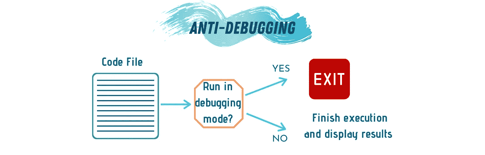
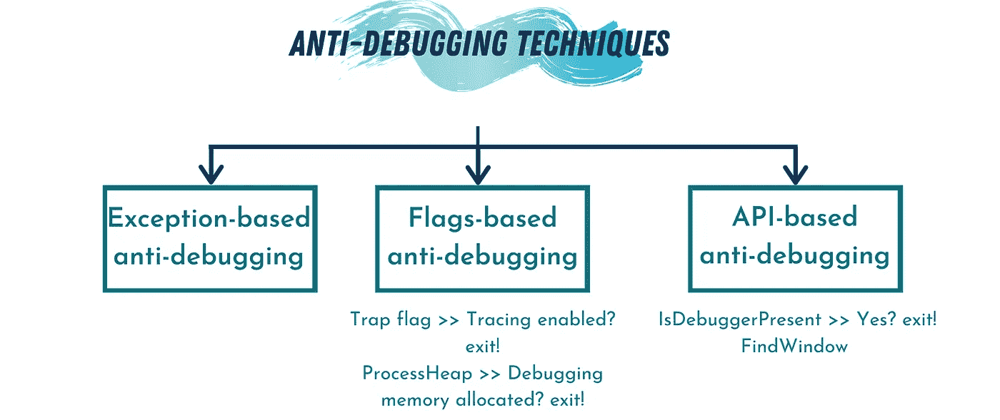
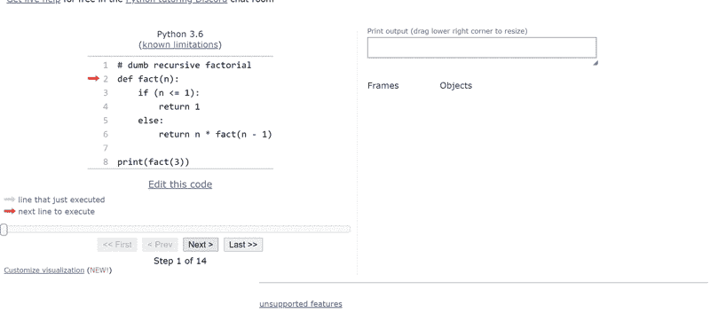
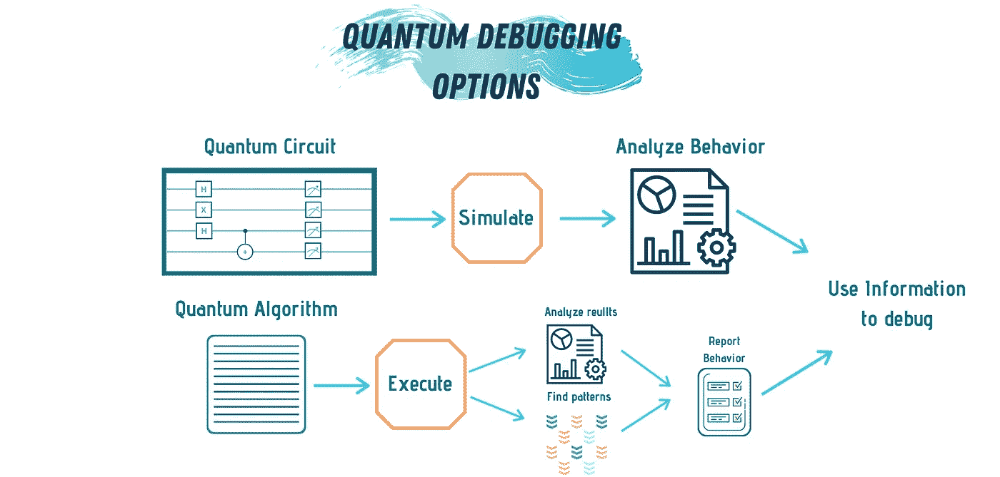

# 关于调试的所有内容:高级主题

> 原文：<https://betterprogramming.pub/all-about-debugging-advanced-topics-4f2eba9212e4>

## 标准调试器之后是什么？

作者照片(使用 [Canva](https://www.canva.com/) 制作)。

在软件开发的世界里，调试无疑是最关键也是最可怕的任务之一。然而，有效地调试任何程序的能力是一种将普通人和优秀的人区分开来的技能。

> "编程让你思考问题，在调试过程中学习知识."— [尼古拉斯·尼葛洛庞帝](https://www.azquotes.com/quote/755494)

开发软件时，遵循一组特定的步骤，直到最终产品问世:

*   设定和分析目标应用程序的需求。
*   设计软件。
*   测试代码。
*   调试和修复错误。
*   维护代码库。

这些步骤构成了软件项目的生命周期。毫无疑问，测试和调试阶段是最耗时的阶段。在大多数项目中，开发人员花 50%的时间在这些步骤上，另外 50%的时间只花在调试上。通过从一开始就编写简单、清晰的代码，可以显著减少调试时间。

> “调试比一开始写代码要难两倍。因此，如果你尽可能聪明地编写代码，从定义上来说，你还没有聪明到可以调试它。”— [布莱恩·克尼根](https://www.defprogramming.com/quotes-by/brian-w-kernighan/)

调试有不同的传统方法，如基于跟踪的调试、增量调试或基于频谱的调试。当我们试图定位的 bug 存在于本地存储并定期维护的代码库中时，最好使用这些方法。对于特殊系统，如嵌入式系统、分布式系统和并行系统，遵循特殊的调试技术。

有一些关于调试过程的高级主题和问题要么没有得到解答，要么将调试的思想提升到了一个新的水平。在本文中，我们将探讨其中的一些主题:

1.  反调试技术
2.  可视化调试器
3.  量子计算调试
4.  调试中的研究问题

# 反调试技术

作者照片(使用 [Canva](https://www.canva.com/) 制作)。

反调试是添加到应用程序代码中的一组技术，用于检测和阻止调试应用程序的过程。反调试的主要应用之一是恶意软件应用。恶意软件分析师也称为逆向工程师，其工作是对蠕虫、僵尸程序和病毒等威胁进行逆向工程。恶意软件分析师将一步一步地运行恶意软件，改变一些变量来注入应用程序与内存交互方式的变化。

换句话说，分析师使用一些调试技术来了解恶意软件的行为。一旦完成，分析师就可以采取行动对恶意软件进行逆向工程，这是恶意软件的创建者不希望发生的事情。

反调试技术旨在防止程序在调试模式下运行。这些技术是为了减缓调试恶意软件的过程。然而，如果分析师足够优秀，他们可以克服这一点，分析恶意软件的行为，并最终对其进行逆向工程。反调试需要深入了解应用程序的运行环境，并精通汇编语言。

有几种方法可以在应用程序中实现反调试属性。先说前三。

## **1。基于 API 的反调试**

在这种方法中，恶意软件设计者嵌入了一些检测恶意软件何时被调试的检查。如果是，它将退出程序。最常用的标志有:

*   `IsDebuggerPresent`—这可能是检测恶意软件何时以调试模式运行的最直接的标志。
*   `FindWindow` —用于检测机器上是否存在特定的调试器。

## **2。基于标志的反调试**

使用这种方法，恶意软件将包含检测指示调试过程是否已经启动的若干行为的标志。

*   `Trap flag` —控制程序的跟踪。
*   `ProcessHeap` —用于检测进程进入调试模式时创建的内存堆。

## **3。基于异常的反调试**

这种方法在软件中添加断点时直接进行检查。如果是，它将退出软件。

作者照片(使用 [Canva](https://www.canva.com/) 制作)。

# 可视化调试器

使调试成为一项相当具有挑战性的任务的是理解代码背后的抽象层次的困难。对于我们的大脑来说，追踪代码背后的指令是很复杂的。

这就是可视化调试器的用武之地。

可视化算法不同步骤的概念可以帮助开发人员更好地理解他们代码的机制。任何可视化调试器的核心都是一种叫做程序/软件可视化的技术。使用术语*软件可视化*是因为它更通用，包括程序和算法。可视化工具将逐步显示程序中表示的数据结构以及算法动画。

许多研究人员的目标是创建可视化调试器，以简化许多最常用的编程语言和开发环境的调试过程。用来提高可视化调试器效率的方法之一——同时使它们的设计更容易——是构建特定于应用程序的可视化调试器。可视化调试器通过执行执行树的一些图形挖掘来进行操作，以分析和获得具有给定输入的程序的具体执行步骤的计划。

可视化调试器仍然是一项正在进行的研究工作，大部分工作仅限于学术用途。不过有一个我觉得很有趣的软件可视化工具叫做 [Python Tutor](http://www.pythontutor.com/) ，用来可视化编程学习过程。还支持其他语言如 [JavaScript](http://www.pythontutor.com/javascript.html#mode=edit) 和 [C++](http://www.pythontutor.com/cpp.html#mode=edit) 。

[Python 导师](http://www.pythontutor.com/visualize.html#mode=display)的屏幕录制。

# 量子计算调试

调试量子计算机是开发和构建全功能量子计算机的最大挑战之一。对于量子计算机来说，这甚至比经典计算机更成问题。这背后的原因是量子计算机的运行方式。

量子计算机使用量子力学的某些方面来执行计算。量子计算机使用的两个[主要原理是量子纠缠和叠加。本质上，量子计算是反调试的。如果我们试图偷窥执行中的一个中间步骤，纠缠和叠加就会打破，我们就无法继续执行程序。](https://medium.com/digital-diplomacy/the-three-pillars-of-quantum-computing-d80ff5f50ec7)

作者照片(使用 [Canva](https://www.canva.com/) 制作)。

解决这个问题的一种方法是模拟程序，然后将模拟用作调试工具。普林斯顿大学计算机科学教授 Margaret Martonosi 指出了调试量子计算机的三种方法:

1.  调试量子算法仅基于关于坍缩量子状态的信息，这是算法显示为错误答案的状态。
2.  使用卡方统计和概率论来估计代表正确答案的状态。
3.  在算法中寻找可以帮助程序员发现问题的模式。

# 正在研究调试中

技术是永远在进行的研究。所有领域都有很多进步，调试也不例外。除了量子调试，当前调试的研究问题有:

*   调试并发应用程序
*   远程调试
*   调试机器学习
*   人工智能算法

即使是现有的调试工具也有改进的空间。我们能让它们更容易学习吗？我们能给它们添加可视化和代码性能分析吗？

如果你考虑过，前途无量。

# 结论

在本文中，我们讨论了一些关于调试的特殊主题和高级问题。我们讨论了反调试技术，可视化调试器，调试量子计算机，以及一些目前正在研究的调试领域中尚未解答的问题。

调试将始终是软件开发中的一个重要步骤，尽管未来可能会出现新的进展，但了解调试的历史和基础知识对于每个开发人员来说都是必须的——不管他们的经验水平如何。

这是讨论调试和调试器的系列文章中的最后一篇。以前的文章有:

*   [关于调试的一切:简介](https://medium.com/better-programming/all-about-debugging-an-introduction-b9eeb0b24681)。调试概述，为什么它是软件开发人员的必备工具/技能，以及调试和测试的区别。
*   [关于调试的一切:技巧。](https://medium.com/better-programming/all-about-debugging-the-techniques-920b06d61a9e)我们讨论了调试中使用的不同方法以及它们之间的区别。
*   [所有关于调试:特殊系统](https://medium.com/better-programming/all-about-debugging-special-systems-7bf281d45f6f)。讨论了调试特殊系统，如大规模调试、并行系统调试等。

# 参考

1.  Britton、Jeng、l . Carver、g . Cheak、p .和 t . Katzenellenbogen(2013 年)。可逆调试软件。*判断总线。学校，剑桥大学，剑桥，英国，理工大学。代表*。
2.  加尼翁，迈克尔&泰勒，斯蒂芬&戈什，阿努普。(2007).通过反调试的软件保护。安全与隐私。5.82–84.10.1109/MSP
3.  Mukherjea，s .，& Stasko，J. T. (1994 年)。走向可视化调试:在源代码级调试器中集成算法动画功能。 *ACM 人机交互汇刊(TOCHI)* ， *1* (3)，215–244。