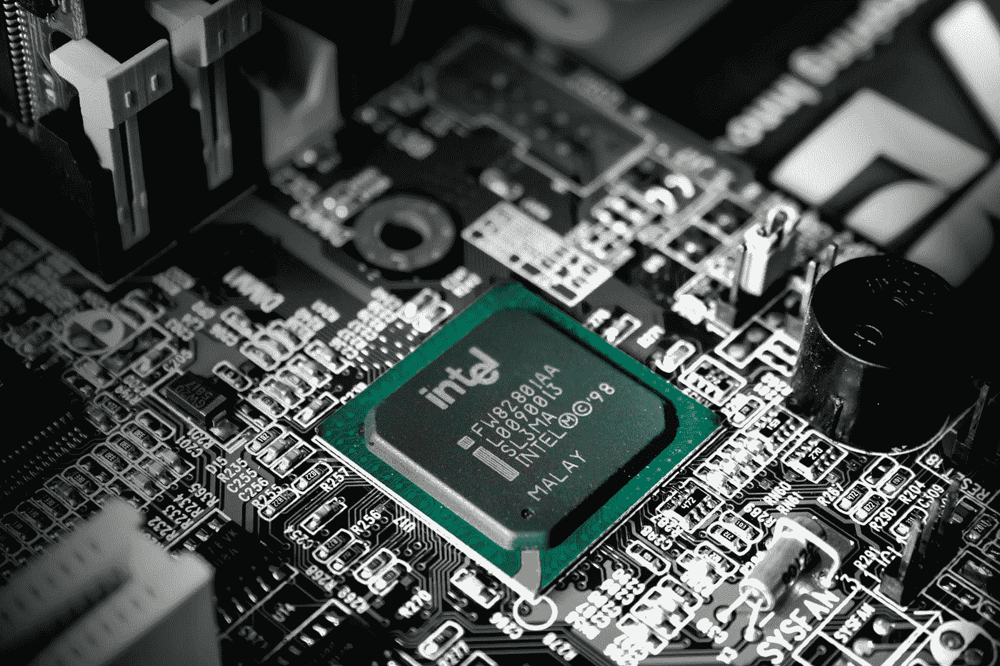
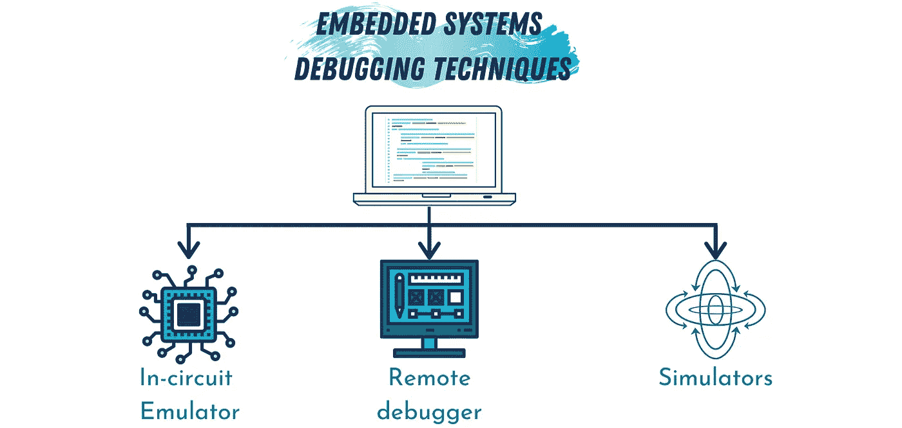
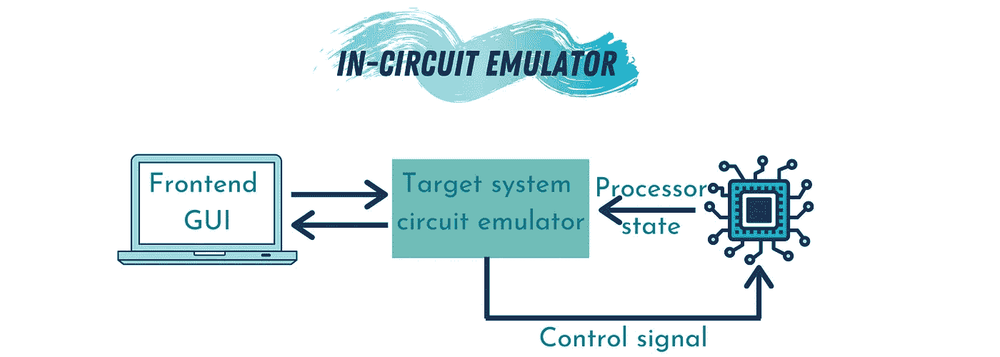
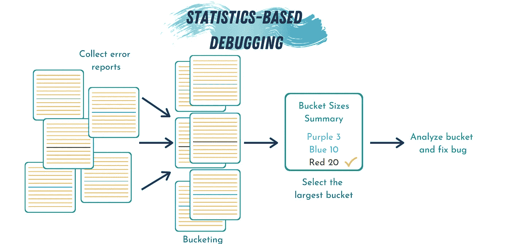
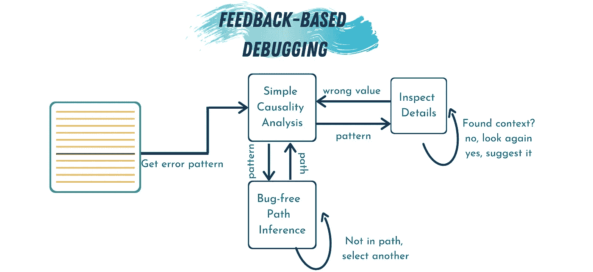
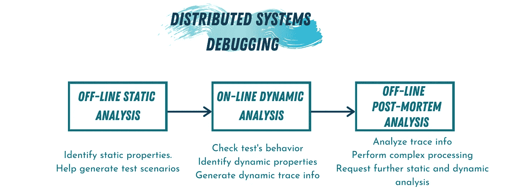

# 关于调试的一切:特殊系统

> 原文：<https://betterprogramming.pub/all-about-debugging-special-systems-7bf281d45f6f>

## 超越通用程序

作者照片(使用 [Canva](https://www.canva.com/) 制作)。

调试是每个软件开发人员/工程师应该具备的基本技能之一。除了是一项重要的技能之外，调试无疑是任何软件开发过程中最关键的一步。确保产品或服务完美运行是该产品或服务成功的必要条件。

要开发和实现一个软件产品，我们必须经历几个步骤，从收集产品的需求和实现到测试和调试，最后到部署和维护产品。可能需要最多时间和精力的步骤是调试阶段。

调试过程可以分为两个主要步骤:定位错误源(bug)和修复错误。查找 bug 可能是一项非常具有挑战性的任务——尤其是对于较大的代码库(或者我们稍后将讨论的特殊系统)。如果代码库存储在本地并定期维护，则定位 bug 的传统技术(如基于跟踪的调试、增量调试或基于频谱的调试)在定位 bug 时非常有用。但是，如果数百万用户使用代码库，或者它分布在不同的位置，那该怎么办呢？那么，定位和修复误差源可能就不那么简单了。

在这篇文章中，我们将讨论一些特殊的系统以及如何去调试它们。我们将主要关注:

1.  嵌入式系统调试
2.  大规模调试
3.  分布式并行系统调试

# 嵌入式系统调试

由[斯莱文·久拉科维奇](https://unsplash.com/@slavudin?utm_source=medium&utm_medium=referral)在 [Unsplash](https://unsplash.com?utm_source=medium&utm_medium=referral) 上拍摄的照片。

在我们进入调试嵌入式系统的策略之前，让我们先定义一下什么是嵌入式系统。嵌入式系统是计算机硬件和软件的结合体，设计用于特定的一个或多个功能，以独立运行或在更广泛的系统中运行。在我们日常使用的工具和设备中，嵌入式系统随处可见。它们可以在汽车、照相机、家用电器和移动设备中找到。

因为嵌入式系统是设计硬件和软件的过程，所以调试嵌入式系统是一项具有挑战性的任务变得显而易见。与桌面应用程序不同，在桌面应用程序中，程序员可以在屏幕上运行代码库和调试器，并通过调试器监控代码的执行，而嵌入式系统程序员不能这样做。

作者照片(使用 [Canva](https://www.canva.com/) 制作)。

通常，软件被编译成二进制文件，然后上传到硬件。对于要编译的软件，它必须没有语法错误。将软件上传到硬件后，如果系统没有按预期运行，那么错误可能来自硬件或代码中的语义错误。程序员做的第一步是通过确保硬件是完美的或无错误的来排除硬件错误。一旦他们这样做了，唯一可能的错误原因就是软件。

嵌入式开发人员调试软件的一种方法——相当于“打印”调试——是使用 led 来确保程序流程正确。就像打印调试一样，使用 led 是一种简单的调试技术。然而，它不是一种可伸缩和可维护的技术。调试嵌入式系统有三种更好的基本技术:远程调试、模拟和在线仿真。

## 远程调试

远程调试是下载、执行和调试嵌入式软件的常用方法之一。远程调试器的工作方式是将嵌入式软件连接到计算机，然后使用软件 GUI 让开发人员与硬件进行交互。远程调试器有两个部分:

1.  前端调试器:这是调试器的一部分，包含 GUI 并为程序员提供关于代码执行的选择。
2.  后端调试器:也称为“调试监视器，*”*它是一款专门为嵌入式处理器设计的软件。它在处理器复位时启动，处理前端调试器和硬件之间的运行时指令。调试监视器的一个例子是 [GNU](https://www.gnu.org/software/gdb/) 可移植调试器。

## 模拟器

模拟器是一种可以安装在任何计算机上的软件，用于模拟目标处理器的功能和指令集。模拟器在设计过程的早期阶段非常有价值，在这一阶段我们只有软件，但还没有实现任何硬件。然而，模拟器的缺点是它们只模拟处理器，而不模拟环境交互外设。

## 在线仿真器

作者照片(使用 [Canva](https://www.canva.com/) 制作)。

在线仿真器(或 ice)是一种专门的软件，允许开发者在程序运行时检查处理器的状态。ice 本身被认为是嵌入式系统，拥有自己的处理器和存储器(RAM、ROM)。模拟器使用远程调试器与程序员或开发人员进行交互。它们支持强大的调试功能，如硬件断点和实时跟踪。

# 大规模调试

调试单个用户运行的单个程序是一项相当简单的任务，有固定的步骤:

*   发现错误。
*   插入一些断点，并在调试器模式下运行代码。
*   检查中间结果以定位错误发生的位置。
*   修复 bug，更新程序。

当部署的系统数量增长到数百万，数百万用户报告不同的错误时，挑战就出现了。那我们怎么能指出漏洞呢？

有两种方法可以用来调试大型系统:基于统计的调试和基于反馈的调试。

## 基于统计的调试

作者照片(使用 [Canva](https://www.canva.com/) 制作)。

我将在这里讨论的方法被微软用来调试 Windows 操作系统。他们使用所谓的基于统计的调试。微软使用的系统被称为 Windows 错误报告系统。

> “Windows 错误报告(WER)是一个分布式系统，可以自动处理来自 10 亿台机器的错误报告。”— [微软](https://www.microsoft.com/en-us/research/publication/debugging-in-the-very-large-ten-years-of-implementation-and-experience/)

统计调试器通过三个步骤工作:

1.  接收用户的错误报告。
2.  收集桶中的错误数据(可能由同一 bug 引起的错误报告的集合)。
3.  使用数据统计作为调试工具来修复错误。

该系统通过收集大量的错误报告来工作，这些报告用于帮助程序员知道哪些错误是最普遍和最经常发生的。收到数据后——这是一个持续的过程——程序员对他们的桶进行排序,并从包含最大量错误报告的桶开始调试。

许多其他服务，如脸书、Twitter 和谷歌服务，使用某种基于统计的调试来找出错误并修复它们。

## 基于反馈的调试

作者照片(使用 [Canva](https://www.canva.com/) 制作)。

在传统的调试技术中，开发人员在代码中插入断点并逐行执行，直到找到错误。为此，他们需要回答三个问题:

1.  我们应该在哪里添加断点？
2.  我们应该添加多少断点？
3.  如何才能避免过度检查代码(增加不必要的断点)？

在基于反馈的调试器中，一个叫做 *microbat* 的工具被用来利用来自开发者的反馈来回答这些问题。一个微机器人在一次运行中执行代码并生成执行树。然后，开发人员指出代码中的错误(例如，变量的值不正确)。这被称为“反馈步骤”微机器人接受这个反馈，并推荐一行产生错误的代码。

microbat 通过执行三个步骤来推荐代码行:

1.  简单因果关系分析:microbat 解析步骤间的动态数据/控制关系，免去设置断点的负担。例如，如果一个特定的变量出现错误，microbat 会提示变量值发生变化的最后一行代码。
2.  无 Bug 路径推断:基于因果关系分析，microbat 沿着执行轨迹逼近一些可能的无 bug 路径，这样开发者就不需要检查不太可能包含 bug 的路径。
3.  清晰指南:在某些情况下，尤其是当代码库很大时，开发人员可能会在检查代码的正确性时迷失方向。在这里，开发者可以给 microbat 不清楚的反馈。它然后会尝试提示这一特定代码行的上下文。

使用这种方法可以节省开发人员在调试过程中的宝贵时间。

# 分布式并行系统调试

作者照片(使用 [Canva](https://www.canva.com/) 制作)。

分布式程序(DP)由一组顺序进程组成，这些进程使用某种分布式内存通信模型进行协作。使用术语“分布式”是因为这种进程不能依赖于物理共享存储器或全局时钟抽象来实现同步。当考虑分布式内存系统时，并行应用程序自然包括在这个概念中，例如那些受支持的集群计算平台。分布式程序依赖于特定人工语言的语义，这种语言习惯于表达进程间的并发性、分布性、并行性和通信。

调试分布式系统有多种技术。在本文中，我们将讨论三种最常用的方法:

1.  基于静态分析的离线分布式调试:这种方法以程序代码为基础，不需要实际的程序执行。它依赖于程序行为的静态模型，这些模型可以用来检查程序属性的某些变化。使用这种方法，开发人员可以指出程序的行为何时不准确，从而定位错误。
2.  基于动态分析的在线分布式调试:由于静态分析的局限性，在线方法有时被用来帮助动态评估程序的行为。这种策略依赖于在线观察技术，因此它们必须应对精确构建程序不同状态的困难。
3.  基于事后分析的离线分布式调试:事后分析方法提供了对程序行为的极好回顾，因为它们依赖于先前收集的程序跟踪。这减少了由在线策略引起的运行时开销。它还支持使用程序分析和可视化工具来分析完整的计算历史。

# 结论

根据要调试的系统类型、执行调试过程的开发人员的偏好以及要调试的错误类型，调试有不同的技术和方法。每种技术都更擅长解决特定系统的问题，但是它们都是为了同一个目标:消除代码库中的错误。

这是讨论调试和调试器的系列文章中的第三篇。以前的文章有:

*   [关于调试的一切:简介](https://medium.com/better-programming/all-about-debugging-an-introduction-b9eeb0b24681)。调试概述，为什么它是软件开发人员的必备工具/技能，以及调试和测试的区别。
*   [关于调试的一切:技巧。](https://medium.com/better-programming/all-about-debugging-the-techniques-920b06d61a9e)我们讨论了调试中使用的不同方法以及它们之间的区别。

本系列的下一篇也是最后一篇文章是:

*   关于调试的一切:高级方法。将讨论关于调试器、反调试软件、可视化调试器以及最新调试研究的未解之谜。

# 参考

1.  Michael Barr，Ambony Massa，“使用 C 和 GNU 开发工具对嵌入式系统进行编程，第二版”，第二版，O'Reilly publications，2006 年。
2.  Glerum，k .、Kinshumann，k .、Greenberg，s .、Aul，g .、Orgovan，v .、Nichols，g .、……和 Hunt，G. (2009 年 10 月)。*(超)大型调试:十年实施经验*。
3.  林，孙，薛，刘，董，(2017 年 5 月)。*反馈式调试*。2017 年 IEEE/ACM 第 39 届国际软件工程大会(ICSE) IEEE。
4.  熊伟库尼亚、何塞和洛伦索、若昂和杜阿尔特。(2001).*并行和分布式程序的调试*。97–129.