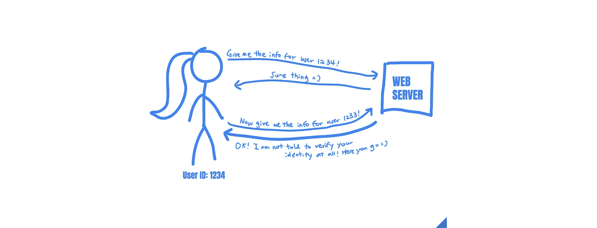

# 关于 IDOR 攻击的所有信息

> 原文：<https://betterprogramming.pub/all-about-idor-attacks-64c4203b518e>

## 攻击者如何使用不安全的直接对象引用非法访问数据


亚历山大·辛恩在 [Unsplash](https://unsplash.com?utm_source=medium&utm_medium=referral) 上拍摄的照片。

您是否想过数据泄露是如何发生的？

如今，似乎每五分钟就有一家新公司被攻破。但是这些漏洞到底是如何发生的呢？黑客是如何获取敏感数据的？在本文中，我们将讨论一个简单但非常有影响力的漏洞，攻击者经常使用它来获得对机密数据的访问:IDOR。

# IDOR 是什么？

IDOR 代表“不安全的直接对象引用”尽管 IDOR 的名字又长又吓人，但它实际上是一个容易理解的漏洞。本质上，IDOR 缺少访问控制。

假设 example.com*是一个允许你和其他用户聊天的社交媒体网站。而且你注册的时候注意到你在网站上的用户 ID 是 *1234* 。该网站有一个页面，允许您查看您与朋友之间的所有消息。当您点击主页上的“查看您的消息”按钮时，您会被重定向到此 URL，在此您可以在网站上看到您与朋友的所有聊天消息:*

```
https://example.com/messages?user_id=1234
```

现在，如果你把地址栏里的网址改成这个呢？

```
https://example.com/messages?user_id=**1233**
```

您注意到现在可以看到另一个用户 1233 和他们所有朋友之间的所有私人消息。刚刚发生了什么？此时，您已经发现了一个 IDOR 漏洞。

您能够看到用户 1233 的消息，因为在服务器返回用户的私人信息之前没有进行身份检查。服务器没有验证你是否是用户 1233，或者你是否是一个冒名顶替者。它只是按照您的要求返回信息。



作者照片。

当访问控制没有正确实现，并且对数据对象(如文件或数据库条目)的引用是可预测的时，就会发生 IDORs。在这种情况下，很容易推断出您可以通过访问这些 URL 来检索用户 1232 和用户 1231 的消息:

```
https://example.com/messages?user_id=1232
https://example.com/messages?user_id=1231
```

如果网站为每个用户使用一个唯一的、不可预测的密钥，网站将不会易受攻击，因为攻击者将无法猜测 *user_key* 的值:

```
https://example.com/messages?user_key=6MT9EalV9F7r9pns0mK1eDAEW
```

相反，社交媒体网站实现了不安全的直接对象引用。这些可预测的“直接对象引用”将隐藏在它们背后的数据暴露给互联网，允许任何人获取被引用的信息。

# IDOR 的含义

正如您可能想象的那样，IDORs 对企业来说可能是灾难性的。在这种情况下，想想当 example.com 的用户发现任何人都有可能阅读他们的私人信息时，他们将面临的糟糕公关！

这个漏洞可以被更激进地利用:攻击者可以编写一个脚本来查询所有用户 id，并自动抓取所有数据！如果此漏洞发生在在线购物网站上，攻击者可能会获得数百万个银行帐户、信用卡号和地址！

IDORs 也不仅仅局限于阅读其他用户的信息。它们还可以用来代表其他用户编辑数据。假设您可以通过以下网址在*example.com*上更改自己的密码:

```
https://example.com/change_password?user_id=1234
```

此页面上有一个 IDOR，如果您访问此 URL，您可以更改用户编号 1233 的密码:

```
https://example.com/change_password?user_id=1233
```

这意味着你可以不经用户同意，通过更改他们的密码来接管平台上任何用户的账户！密码重置、密码更改和帐户恢复等关键功能上的 IDORs 是危及整个 web 应用程序的关键漏洞。

# 预防 IDORs

idor 很常见，因为它们很难检测，所以防止 idor 的最好方法是在开发过程中实现保护。

要利用 IDOR 漏洞，必须有对数据对象的直接对象引用，并且缺少访问控制。因此，为了防止 IDORs，您可以:

1.  避免直接对象引用。
2.  对每个应用程序资源实施详细的访问控制。

首先，您可以使用间接对象引用来引用资源。例如，应用程序可以根据用户的会话将用户提供的 ID 映射到后端的另一个对象 ID。例如，假设您的网站有文件上传功能，用户应该只访问他们自己的上传。如果像这样在 URL 中使用直接引用:

```
example.com/uploads?id=username-uploads-3
```

攻击者可以通过像这样操纵文件 ID 参数来读取其他人的文件。

```
example.com/uploads?id=username2-uploads-3
```

另一方面，如果您让用户指定文件索引:

```
example.com/uploads?id=3
```

然后在后端映射到真实的文件 ID，用户无法控制整个文件 ID，也无法操纵 URL 参数访问别人的文件。

```
Real file ID: username-uploads-3 
```

也可以使用不可预测的散列或随机字符串来引用对象，而不是使用简单的数字 ID。这使得枚举真实数据 id 和获取敏感数据变得更加困难，甚至是不可能的。

但是 IDOR 漏洞的根本原因是缺少访问控制。如果您可以在返回敏感资源之前检查用户的权限，那么直接对象引用根本就不是问题。因此，为了防止 IDORs，您应该做的第二件事是实现健壮的访问控制。对于每个应该受到限制的应用程序资源，您应该验证用户确实被授权访问它。

有没有办法找到已经在你的应用程序中存在的 IDOR 漏洞？自动漏洞扫描器在寻找 IDORs 方面相当糟糕，因为它们无法识别哪些资源需要哪种保护。因此，发现现有 IDORs 的最佳方式是通过审查源代码，查看是否所有直接或间接的对象引用都受到适当的访问控制的保护。

最后，手动测试也是测试 IDOR 的有效方法。在手动测试时，您应该创建两个不同的帐户，看看是否可以使用第二个帐户访问第一个帐户的信息。请记住，IDORs 可以出现在 URL 参数、表单字段参数、文件路径、头、cookies 等等中。因此，您可以通过捕获和检查每个应该被限制的请求来检查 IDORs，更改这些引用资源的字段，并尝试从另一个帐户侵入您的帐户。

IDORs 是一个危险的漏洞，会威胁到用户的隐私和应用程序的完整性。但是可以通过实现间接对象引用和健壮的访问控制来可靠地防止它们。

今天的安全课到此结束。感谢阅读！