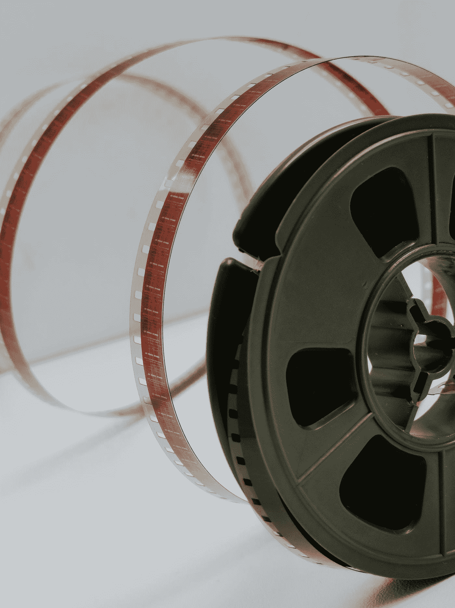
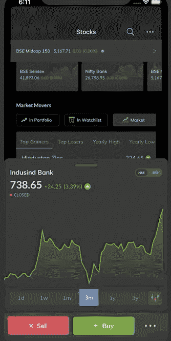
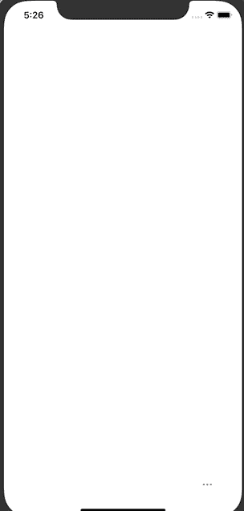

# 关于 iOS 动画的一切(第一部分)

> 原文：<https://betterprogramming.pub/all-about-ios-animations-part-1-d49a021527>

## 深入探究 iOS 中的关键帧动画



照片由 [Denise Jans](https://unsplash.com/@dmjdenise?utm_source=medium&utm_medium=referral) 在 [Unsplash](https://unsplash.com?utm_source=medium&utm_medium=referral) 上拍摄

# 概观

一个优秀的应用程序都是关于顶级的 UX、互动动画和微交互的。在本系列中，我们将讨论在 iOS 应用程序中制作视图动画的不同方法。这是**系列的第 1 部分**，我们将研究[关键帧动画](https://developer.apple.com/documentation/uikit/uiview/1622552-animatekeyframes)并将实现一个小用例。

# 今天有什么菜

为了更好地理解，让我给你一个我们试图复制的要点。



*这是来自某热门理财 app**[***pay TM Money***](https://apps.apple.com/us/app/paytm-money-stocks-trading-app/id1344431352)***的动画。****

*需要注意的要点:*

1.  *顶部的三个视图看起来像连锁的动画，因为它们堆积起来形成了一个视图堆栈。*
2.  *三点按钮会变成十字按钮。*

*这看起来像是 animateKeyFrame 动画的合格候选对象。*

# *先决条件:*

1.  *你应该知道 UIView，frame，layer 的基础知识。*
2.  *通过调整约束或变换视图，您应该了解简单的动画技术。*

# *入门指南*

*在这里下载项目[。](https://github.com/arjunbaru/KeyFrameAnimationDemo)*

*这里我们有一个视图控制器，它有三个视图(`topView`、`middleView`、`bottomView`)，固定在右下角。这些视图位于 stackView( `vStackView`)中。*

*我们有一个`dotButton`放在 stackView 的下面，固定在右下角。*

*当视图加载时，我们将视图从其实际位置转换到最右侧。*

*我们有一个助手 enum `Position`将我们的视图从右向左转换，反之亦然。*

```
*enum Position {case reset
case rightAlignedfunc  transform(view: UIView) -> CGAffineTransform {switch self {
case .reset: return .identity
case .rightAligned:
return CGAffineTransform(translationX: view.frame.maxX + 100, y: 0) }
 }
}*
```

*在我们实现动画之前，让我们看看关键帧动画提供了什么以及何时使用它。*

# *动画关键帧:*

*`UIKit`用`UIView.animate()`方法提供了一种简单的动画视图方式。我们定义了一个可以执行一段时间的块。但是如果我们必须链接动画，我们必须嵌套动画代码块。*

*幸运的是，UIView 提供了多一种方法，可以解决干净代码的问题，并且有更多的优势。*

```
*class func animateKeyframes(withDuration duration: [TimeInterval](https://developer.apple.com/documentation/foundation/timeinterval), 
                      delay: [TimeInterval](https://developer.apple.com/documentation/foundation/timeinterval), 
                    options: [UIView](https://developer.apple.com/documentation/uikit/uiview).[KeyframeAnimationOptions](https://developer.apple.com/documentation/uikit/uiview/keyframeanimationoptions) = [], 
                 animations: @escaping () -> [Void](https://developer.apple.com/documentation/swift/void), 
                 completion: (([Bool](https://developer.apple.com/documentation/swift/bool)) -> [Void](https://developer.apple.com/documentation/swift/void))? = nil)*
```

*你可以从[苹果文档](https://developer.apple.com/documentation/uikit/uiview/1622552-animatekeyframes)中读到这些参数。我们将关注`animation`参数，它是一种闭包。*

# ***实现显示按钮:***

*我们将在`dotButton`开始做以下事情*

1.  *我们将**动画**`top``middle`和`bottom`从右往左看。*
2.  *我们将**旋转**出`dotButton`，将其 alpha 从 1 减小到 0，最后将其隐藏。*
3.  *我们将**取消隐藏**，**旋转**并增加**α**，使`crossButton`位于`dotButton`顶部。*

*向`dotButton`添加一个目标函数，如下所示:*

```
*@objc func onTapOfDotButton() {
showOptions()
}*
```

*现在，让我们实现`showOptions`函数。实现以下代码:*

*我们来理解一下上面提到的几点。*

*`//1`我们取消隐藏此时 alpha 为 0 的`crossButton`。*

*`//2`我们有一个`animateKeyframes`方法，可以产生`0.5`秒的动画，并有`0`的延迟。*

*`//3`我们通过`addKeyframe`方法添加第一组链接动画。让我们看看它的参数:*

*`**withRelativeStartTime**`:我们把它交给了`0/0.5`，这是说这个内部动画应该在我们拥有的动画总时长的开始时开始。*

*我们给它起了个名字叫`0.3/0.5`，这是一种说法，根据我们可用的总时间，我们的区块应该被激活到什么程度。*

*`**animations**`:在这个块里面，我们**把**我们的`bottomView`转换到它的初始位置(到我们给的约束，固定在右下角)。*

*`//4` & `//5`我们遵循与步骤`//3`中解释的`bottomView`相同的步骤。唯一的变化是在`//4` **开始时间**是`0.1/0.5`和`//5` **开始时间**是 `0.2/0.5`，这为两个视图的动画提供了 0.1 秒的延迟，从而有助于创建所需的效果。*

*`//6`这段代码为我们的`dotButton`和`crossButton`处理旋转动画。动画将延迟 0.2 秒开始，因此`relativeStartTime`为`0.2/0.5`，动画持续时间为`0.3/05`。在模块内部，我们将`dotButton`和`crossButton`旋转到角度`-PI`(产生逆时针旋转)并改变两个按钮的 alpha。由于这两个按钮的动画在同一个块中，它给了我们想要的变换效果。*

# *实现隐藏按钮:*

*我们将做与上述实现相反的事情。*

1.  *我们将**从左到右动画化** `top`、`middle`和`bottom`视图。*
2.  *我们将**旋转**出`crossButton`，将其 alpha 从 1 减小到 0，最后将其隐藏。*
3.  *我们将**取消隐藏**，**旋转，**并增加`dotButton`上的 **alpha** 。*

```
*@objc func onTapOfCrossButton() {
   hideOptions()
}*
```

*现在，让我们实现`hideOptions`功能。使用以下代码:*

*`hideOptions`与`showOptions`方法有相似之处。不同的是，我们首先从右侧的`topView`动画开始，然后是其他视图。*

*此外，`crossButton`和`dotButton`的旋转在`PI`处产生顺时针旋转效果。*

# *`Result:`*

*构建并运行:*

**

*示例动画*

*厉害！我们学习了关键帧动画，它有助于链接动画视图。接下来，我们将在本系列教程的第二部分学习`basicAnimation`。*

# *另请参见:*

*[](https://medium.com/better-programming/building-a-custom-transitioning-for-viewcontroller-in-ios-13-cbf9b4de3d9b) [## 在 iOS 13+中为 ViewController 构建自定义过渡

### 让我们在应用程序中构建自定义过渡

medium.com](https://medium.com/better-programming/building-a-custom-transitioning-for-viewcontroller-in-ios-13-cbf9b4de3d9b) [](https://medium.com/swlh/creating-youtube-style-loading-animation-d30b465ce0ca) [## 创建 Youtube 风格的加载动画

### 为你的应用程序定制加载动画

medium.com](https://medium.com/swlh/creating-youtube-style-loading-animation-d30b465ce0ca)*