# 所有关于可靠性的数据位置—存储

> 原文：<https://betterprogramming.pub/all-about-solidity-data-locations-part-i-storage-e50604bfc1ad>

## 深入了解存储参考和智能合同存储布局。


> 这是[“所有关于数据位置”](/solidity-tutorial-all-about-data-locations-dabd33212471)子系列的第一部分。

在今天的文章中，我们将更详细地介绍 EVM 中的一个重要数据位置:智能契约存储。

我们将看到合同仓库的布局是如何工作的。如何写入程序集中的约定存储区？我们还将使用来自 [OpenZeppelin](https://docs.openzeppelin.com/) 和 [Compound](https://compound.finance/docs) 的一些契约来学习`storage`引用在实践中是如何工作的，同时学习这些流行契约和协议背后的可靠性代码。

# **目录**

*   介绍
*   存储布局
*   存储基础
*   与存储交互
*   函数参数中的存储指针
*   函数体中的存储指针
*   读取存储的成本。
*   结论

# 介绍

理解以太坊和 EVM 连锁店的存储模式对于良好的智能合同开发是必不可少的。

您可以在智能合约上永久存储数据以便将来执行时可以访问的唯一位置是它的存储区。每个智能合约都在自己的永久存储中维护其状态。它的作用类似于*“智能合同的迷你数据库”*，但与其他数据库不同，该数据库是公开可访问的。存储在智能合约存储中的所有值都可供外部免费读取(通过静态调用)，而无需向区块链发送交易。

然而，写入存储是非常昂贵的。事实上，就汽油成本而言，这是 EVM 最昂贵的作业。存储器的内容可以通过`sendTransaction`调用来改变。这种呼叫会改变状态。这就是契约级变量被称为状态变量的原因。

需要记住的一件重要事情是，根据以太坊和 EVM 的设计，一个契约既不能读取也不能写入它自己以外的任何存储。协定 A 可以从另一个协定 B 的存储中读取或写入的唯一方式是当协定 B 公开使其能够这样做的函数时。

# 存储基础

智能协定的存储是一个持久的读写数据位置。这意味着，如果在一个事务中将数据写入协定存储中，那么一旦事务完成，数据就会持久保存。在该事务之后读取合同存储将检索由该先前事务写入/更新的数据。

每个合同都有自己的存储，可以对其进行描述并将其绑定到以下规则:

*   保持状态变量
*   事务和函数调用之间的持久性
*   阅读是免费的，但写作是昂贵的
*   合同存储是在合同构建期间预先分配的。

驻留在存储器中的变量在固态中被称为状态变量。

关于合同存储，您唯一应该记住的是:

> 存储是长期的，昂贵的！

将数据保存到存储器中是 EVM 中需要最大量气体的操作之一。

写入存储的实际成本是多少？

成本并不总是一样的，计算写入存储的气体是相当复杂的公式，尤其是最新的以太坊 2.0 升级以来)。

简单总结一下，写入存储的成本如下:

*   将存储槽(第一次，或者如果该槽不包含任何值)从零值初始化为非零值需要 20，000 gas
*   编辑存储槽的值需要 5000 汽油
*   删除存储槽中的值可获得 15，000 汽油的退款

阅读合约存储真的免费吗？

智能合约的存储可以从外部(从 EOA)自由读取。在这种情况下，不必支付汽油费。

但是，如果读取操作是修改合同、另一个合同或区块链上的状态的事务的一部分，则必须支付汽油费。

一个合同可以读取其他合同的存储吗？

默认情况下，在执行环境中，smart 只能读取它自己的存储(我们稍后将通过`SLOAD`)。但是，如果智能协定在其公共接口(ABI)中公开了允许从特定状态变量或存储槽读取数据的函数，则智能协定也可以读取其他智能协定的存储。

# 存储布局

正如 [OpenZeppelin 在他们的 EVM 深度第 2 部分文章](https://blog.openzeppelin.com/ethereum-in-depth-part-2-6339cf6bddb9/)中所解释的，智能合约的存储是一个字寻址空间。这与内存或调用数据相反，内存或调用数据是线性数据位置(增长字节数组)，通过偏移量(字节数组中的索引)访问数据。

相反，智能合约存储是键-值映射(=数据库)，其中键对应于存储中的槽号，值是存储在该存储槽中的实际值。

智能合约的存储由槽组成，其中:

*   每个存储槽可以包含长达 32 字节的字。
*   存储槽从位置 0 开始(类似于数组索引)
*   总共有 2 个⁵⁶存储插槽可用(用于读/写)

总而言之:

> 智能合约的存储由 2 个⁵⁶槽组成，其中每个槽可以包含最大 32 字节的值。

在幕后，契约存储是一个键值存储，其中 256 位的键映射到 256 位的值。每个存储槽中的所有值最初都设置为零，但也可以在契约部署期间初始化为非零值或某个特定值`constructor`。

## 作为机库货架的合同仓库

[在他的文章中，Steve Marx](https://programtheblockchain.com/posts/2018/03/09/understanding-ethereum-smart-contract-storage/) 将智能合约的存储描述为“*一个天文数字般大的数组，最初充满零，数组中的条目(索引)是合约的存储槽。”。*

在现实世界中会是什么样子呢？我们如何用我们可能最熟悉的东西来表示智能契约的存储呢？


合同仓库的布局与建筑供应商的机库非常相似。

我邀请你去拜访你当地的建筑供应商！您将很好地了解智能合约的存储情况。

如果你特别去户外(卡车和货车去那里购买袋装水泥、砖块或钢轨)，你会注意到相当多的活动。克拉耶丝到处开车，速度非常快，从货架上拿东西。这相当于 EVM 在读取状态变量时所做的事情:

```
contract *Owner {* address *_owner;* function owner() public returns (address) {
        return _owner;
    }}
```

在上面的合同中，只有一个货架。EVM 从“shelve 0”加载变量，然后卸载(到堆栈上)呈现给你。

## 状态变量的布局

首席 Solidity 开发人员`chriseth`对合同的存储描述如下:

> “您可以将存储视为一个具有虚拟结构的大型阵列，这种结构在运行时无法更改，它是由合同中的状态变量决定的”。

从上面的例子中，我们可以看到 Solidity 为你的契约的每个定义的状态变量分配了一个存储槽。对于静态大小的状态变量，从槽 0 开始，按照定义状态变量的顺序连续分配存储槽(规则不同

Chriseth 在这里的意思是“不能在函数调用中创建存储”。*事实上，如果函数必须是持久的，那么通过函数在新的存储槽创建新的存储变量是没有意义的(然而* `*mapping*` *的情况略有不同)。*

智能协定的存储是在协定构造期间(在部署协定时)安排的。这意味着合同存储的布局在合同创建时就已经确定了。布局是基于您的契约级变量声明而“成形”的，并且这种布局不能被将来的方法调用所改变。

让我们使用`solc`命令行工具来看看之前合同的实际存储布局。如果您运行以下命令:

```
solc contracts/Owner.sol --storage-layout --pretty-json
```

您将获得以下 JSON 输出:

```
======= contracts/Owner.sol:Owner =======
Contract Storage Layout:
{
  "storage":
  [
    {
      "astId": 3,
      "contract": "contracts/Owner.sol:Owner",
      "label": "_owner",
      "offset": 0,
      "slot": "0",
      "type": "t_address"
    }
  ],
  "types":
  {
    "t_address":
    {
      "encoding": "inplace",
      "label": "address",
      "numberOfBytes": "20"
    }
  }
}
```

从上面的 JSON 输出中，我们可以看到一个包含对象数组的`storage`字段。该数组中每个对象引用一个状态变量名。我们还可以看到，每个变量都被映射到一个`slot`，并且有一个底层的`type`。

这意味着变量`_owner` 可以被更改为同一类型的任何有效值(在我们的例子中是`address`)。然而，槽`0`是为这个变量保留的，并且将一直存在。

现在让我们来看看状态变量是如何在存储器中布局的(参见 Solidity 文档以获得进一步的理解)。

考虑以下坚固性代码:

```
pragma solidity ^0.8.0;contract StorageContract {

    uint256 a = 10;
    uint256 b = 20;}
```

所有静态大小的变量都按照它们被定义的顺序依次放入存储槽中。

记住:存储器中的每个槽最多可以容纳 32 字节长的值。

在我们上面的例子中，`a`和`b`是 32 字节长(因为它们的类型是`uin256`)。因此，**它们被分配了自己的存储槽。**

## 将状态变量打包在一个存储槽中。

在我们之前的例子中没有什么特别的。但是现在让我们考虑这样一个场景，其中有几个不同大小的 uint 变量，如下所示:

```
pragma solidity ^0.8.0;contract StorageContract {

    uint256 a = 10;
    uint64 b = 20;
    uint64 c = 30;
    uint128 d = 40; function readStorageSlot0() public view returns (bytes32 result) { assembly {
            result := sload(0)
        } } function readStorageSlot1() public view returns (bytes32 result) { assembly {
            result := sload(1)
        }

    }}
```

我们已经编写了两个基本函数来读取底层的契约存储槽。查看输出，我们得到以下结果:

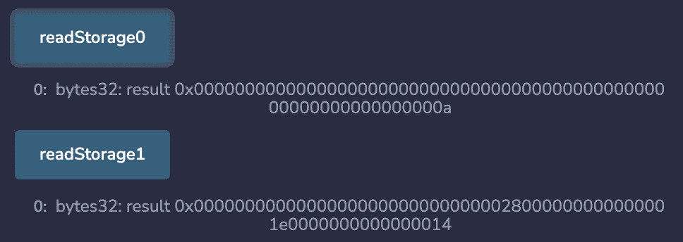

坚固性文件说明:

> “如果可能，需要少于 32 个字节的多个连续项目被打包到单个存储槽中…
> 
> 存储槽中的第一项按低位对齐存储。"

因此，当变量少于 32 字节时，Solidity 会尝试将多个变量打包到一个存储槽中，如果它们能够容纳的话。因此，一个存储槽可以保存多个状态变量。

如果基本类型不适合存储槽中的剩余可用空间，它将被移动到下一个存储槽。对于以下担保合同:

```
pragma solidity ^0.8.0;contract StorageContract {

    uint256 a = 10;
    uint64 b = 20;
    uint128 c = 30;
    uint128 d = 40;

}
```

其存储布局如下所示:

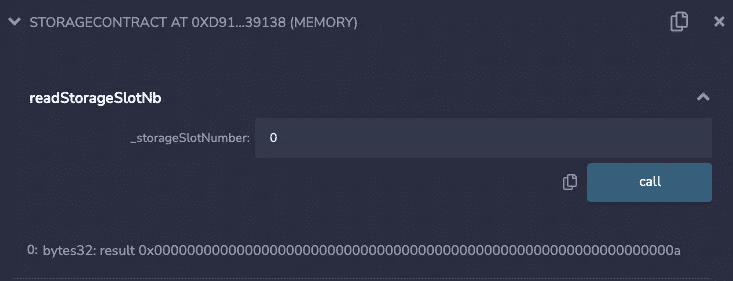

1 读取存储插槽 0 中的值


读取存储插槽 1 中的值

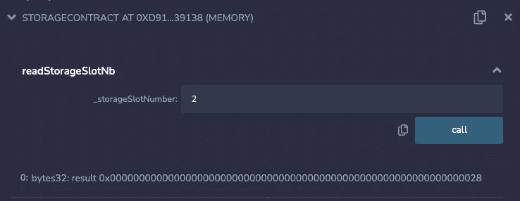

读取存储插槽 2 中的值

让我们看一个更具体的例子一个流行的 Defi 协议:Aave。

**举例:Aave** `**Pool.sol**` **合约**


[图片来源:文章“invezz.com Aave(AAVE)是实现第二层的最新 DeFi 协议”](https://invezz.com/news/2021/01/23/aave-aave-is-the-latest-defi-protocol-to-implement-layer-2/)

Aave 协议使用[池](https://docs.aave.com/developers/core-contracts/pool)作为管理流动性的主要智能合约。这些是主要的“面向用户的合同”。用户直接与 Aave pools 合约交互，以提供或借入流动性(从 Solidity 中的其他合约，或使用 web3/ethers 库)。

在`Pool.sol`中定义的主 Aave `Pool`契约继承了一个与本文主题相关的有趣名称:`PoolStorage`。

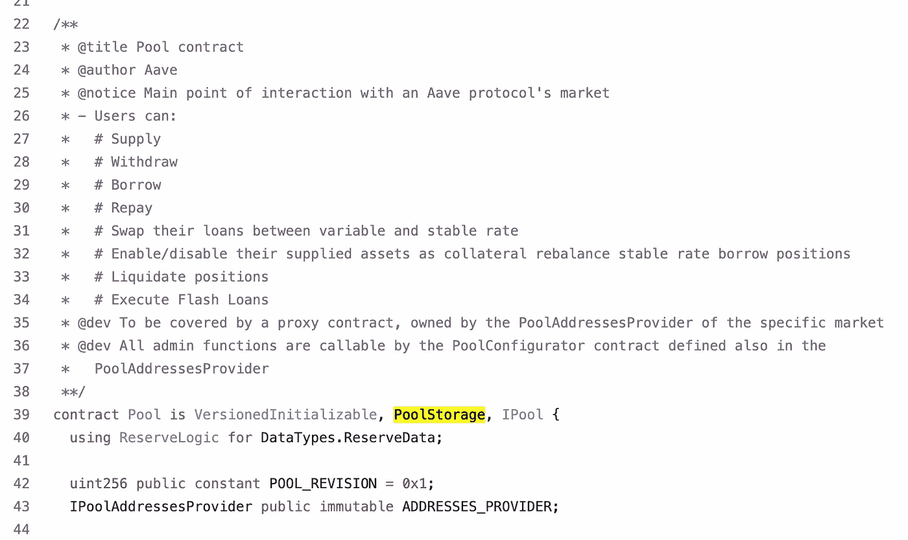

[来源:Aave v3 协议，Pool.sol](https://github.com/aave/aave-v3-core/blob/master/contracts/protocol/pool/Pool.sol)

如协议 Aave v3 的 Natspec 注释中所述，`PoolStorage`契约服务于一个目的:*它* *定义了池契约的存储布局。*

如果我们查看`PoolStorage`契约的可靠性代码，我们可以看到一些状态变量由于它们的类型而被打包到同一个存储槽中:

*   **下面绿色:**闪贷相关的状态变量(`_flashLoanPremiumTotal`和`_flashLoanPremiumToProtocol`)都是`uint128`。将它们打包在一起会占用整个存储插槽(插槽 nb 6)。
*   **下面蓝色部分:**最后两个状态变量`_maxStableRateBorrowSizePercent`和`_flashLoanPremiumToProtocol`属于`uint64`和`uint16`类型。它们也被打包在存储槽(槽 nb 7)中，并且在存储槽中一起占据 10 个字节。这为潜在的其他状态变量留下了一些空间(剩余 22 个字节)。

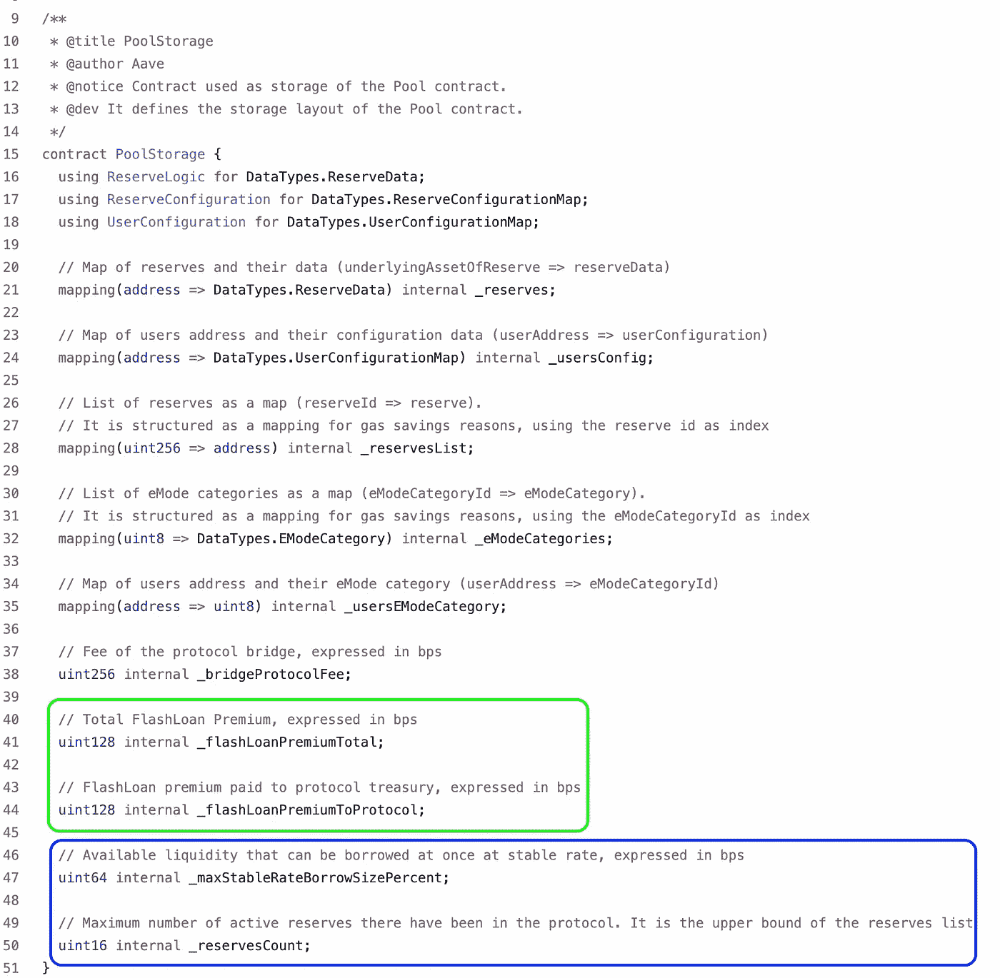

[来源:Aave v3，PoolStorage.sol](https://github.com/aave/aave-v3-core/blob/master/contracts/protocol/pool/PoolStorage.sol)

## 具有继承性的存储布局

契约存储的布局也是基于继承的。如果一个协定继承自其他协定，则其存储布局遵循继承顺序。

*   在 most 基础契约中定义的状态变量从槽 0 开始。
*   在下面的派生契约中定义的状态变量被放置在子顺序槽(槽 1、2、3 等)中。

另外，请注意，将状态变量打包到一个存储槽中的规则同样适用。如果可能的话，通过继承，来自不同父契约和子契约的状态变量共享同一个存储槽。

# 与存储的交互

EVM 提供了两个操作码来与存储交互:`SLOAD`读取，和`SSTORE`写入存储。这两个操作码只在内嵌汇编中可用。Solidity 在编译后将写状态变量转换成这些操作码。

## 从存储器中读取

EVM 可以使用`SLOAD`操作码读取智能合约的存储。`SLOAD`将一个字从存储器载入堆栈。

`SLOAD`操作码在内嵌汇编中可用。它可用于轻松检索存储在特定存储槽中的整个字值。

```
function readStorageNb(uint256 slotNb) 
    public 
    view 
    returns (bytes32 result) 
{
    assembly {
        result := sload(slotNb)
    }}
```

这就是坚固在引擎盖下的作用。当通过 getter 函数读取状态变量时，它会自动使用`SLOAD`操作码。例如 ERC20 中流行的`name()`或`symbol()`功能。这些函数除了返回状态变量之外什么也不做。请看下面来自 OpenZeppelin 的截图。

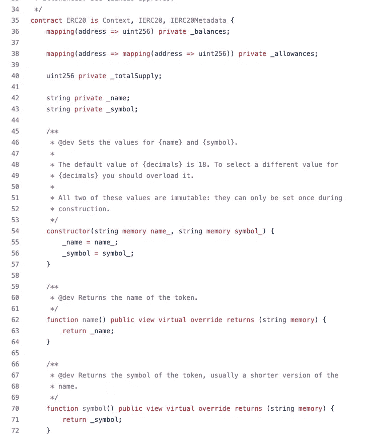

[来源:OpenZeppelin Github 知识库，ERC20.sol](https://github.com/OpenZeppelin/openzeppelin-contracts/blob/master/contracts/token/ERC20/ERC20.sol)

如果您在 Remix 中查询`name()`函数并调试 getter，您将获得下面的操作码。

```
; name()
JUMPDEST
PUSH1 60
PUSH1 03     ; step 1 - push the number 3 on the stack (= slot nb 3)
DUP1 **SLOAD        ; step 2 - pass the number 3 as argument to SLOAD to
             ; load the value stored in the storage slot nb 3 
             ; (where the `_name` variable is stored)**; rest of the opcodes are emitted for brevity
```

## 写入存储

EVM 可以使用`SSTORE`操作码写入智能合约的存储。`SSTORE`保存一个字到存储器。

使用内联汇编，看起来像这样:

```
function writeToStorageSlot(uint256 slotNb) public { string memory value = "All About Solidity";    assembly {
        sstore(slotNb, value)
    }}
```

让我们继续前面来自 OpenZeppelin 的 ERC20 令牌的例子。如果我们部署 ERC20 令牌契约并使用 Remix 调试`constructor`，我们将获得以下操作码。

```
MLOAD  ; 1\. load the token name from memory
PUSH1 ff
NOT
AND
DUP4
DUP1
ADD
OR
DUP6   ; 2\. put back 3 (= slot nb for `name`) on top of the stack 
SSTORE ; 3\. store at storage slot 3 the token `name` parameter
PUSH3 0003ee
JUMP 
```

> [在 Remix 上试用](https://remix.ethereum.org/?#code=Ly8gU1BEWC1MaWNlbnNlLUlkZW50aWZpZXI6IE1JVApwcmFnbWEgc29saWRpdHkgXjAuOC40OwoKaW1wb3J0ICJAb3BlbnplcHBlbGluL2NvbnRyYWN0c0A0LjcuMC90b2tlbi9FUkMyMC9FUkMyMC5zb2wiOwppbXBvcnQgIkBvcGVuemVwcGVsaW4vY29udHJhY3RzQDQuNy4wL2FjY2Vzcy9Pd25hYmxlLnNvbCI7Cgpjb250cmFjdCBNeVRva2VuIGlzIEVSQzIwLCBPd25hYmxlIHsKICAgIGNvbnN0cnVjdG9yKCkgRVJDMjAoIk15VG9rZW4iLCAiTVRLIikgewogICAgICAgIF9taW50KG1zZy5zZW5kZXIsIDEwMDAwICogMTAgKiogZGVjaW1hbHMoKSk7CiAgICB9CgogICAgZnVuY3Rpb24gbWludChhZGRyZXNzIHRvLCB1aW50MjU2IGFtb3VudCkgcHVibGljIG9ubHlPd25lciB7CiAgICAgICAgX21pbnQodG8sIGFtb3VudCk7CiAgICB9Cn0K&optimize=false&runs=200&evmVersion=null&version=soljson-v0.8.7+commit.e28d00a7.js)并在部署 ERC20 令牌后调试事务。

这条推文很好地描述了操作码`SSTORE`如何在 geth 客户端中工作。

我们可以从 geth 客户端的源代码中看到，`SSTORE`从堆栈中弹出两个值，第一个最上面的`loc`是存储位置，第二个最上面的`val`是存储在存储中的值。

我们还可以看到，这两个值在通过`interpreter.evm.StateDB.SetState(...)`写入合同存储器时，将从堆栈中取出的两个项目都转换为`bytes32`值。

因此，我们可以从 geth 客户端的源代码中直接看到我们在**存储布局**一节中解释的内容:智能合约存储将 bytes32 键映射到 bytes32 值，因此 EVM 将所有内容都视为 bytes32 字。

这里还有来自同一位 tweet 作者的最终图表，详细解释了`SSTORE`操作码的流程。

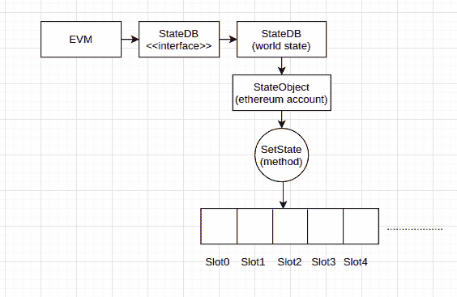

来源:[发自推特的法希尔。](https://twitter.com/721Orbit/status/1511961744238948356?s=20&t=KDGCQ4OwQ47e2NACgQ8WWg)

# 函数参数中的存储指针

`storage`关键字可以作为参数传递给函数的复杂变量。但是这是如何工作的呢？

当在函数参数中指定了`storage`时，这意味着传递给函数的参数必须是状态变量。

让我们用一个非常简单的例子，继续讨论 OpenZeppelin 库。这也将帮助我们更好地理解他们包中的契约和库部分。

OpenZeppelin 提供了一个`[Timers](https://github.com/OpenZeppelin/openzeppelin-contracts/blob/master/contracts/utils/Timers.sol)`库，可以用来构建和处理 Solidity 契约中的计时器和时间点。查看下面的功能`setDeadline(...)`和`reset(...)`及其参数。

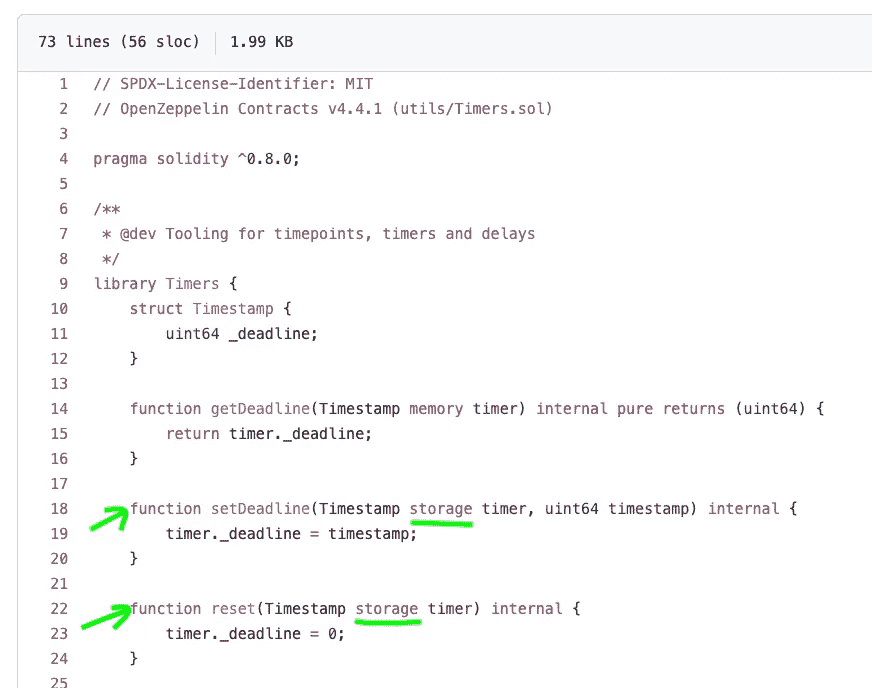

[来源:来自 OpenZeppelin Github 库的 Timers.sol。](https://github.com/OpenZeppelin/openzeppelin-contracts/blob/master/contracts/utils/Timers.sol)

这两个函数只接受存储指针。那是什么意思？

让我们创建一个时间表合同来理解！

如果你试图在 Remix 上编译这个契约，Solidity 编译器会报错如下:

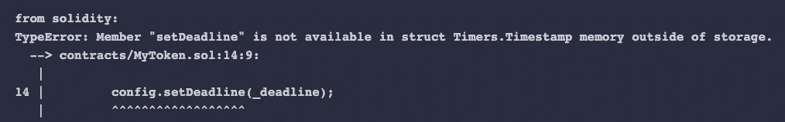

调试存储指针错误 101

这个错误是有道理的。`Timers`库中的`setDeadline(...)`函数只接受存储指针。这意味着该函数将接受以下参数:

*   直接任一状态变量
*   或者对状态变量的引用(另一个`storage`引用，或者我喜欢称之为存储指针)。

然后让我们重写我们的时间表，让它工作。我们还可以添加一个重置按钮来使它工作

我们已经看到了一个函数参数存储指针的基本例子。让我们更深入地看一个更复杂的例子，以便更好地理解函数参数中的存储指针。

当一个函数的参数是一个`storage`引用时，该函数可以直接接受一个状态变量或者一个对状态变量的引用。

让我们继续以`TimeWatch`为例。我们可以使用`Timers`库来建立一个比赛合同。使用合同会降低对比赛组织者或任何第三方的信任度，因为他们可能不信任欺骗计时器和规则的人。

下面是一个原型。该合同通过地图跟踪参与的参赛者及其时间。注意下面的`startRacerTime(…)`功能。

这可以很好地编译，因为`racerTimer`指向了`racers`(约定存储)的映射中的某个条目。因此，由于这个变量是对契约存储的引用，来自`Timers`库的`setDeadline(...)`函数将把它作为有效的函数参数接受。

# 函数体中的存储指针

当变量是基本类型时，将存储变量赋给局部变量(在函数体中定义)总是会复制。

然而，对于复杂或动态类型，规则是不同的。你可以把关键字`storage`传递给一个值，你不想被克隆。

我们将这些变量描述为存储指针或存储引用类型的局部变量。

函数中的任何存储引用变量总是引用在协定的存储上预先分配的一段数据。换句话说，存储引用总是引用状态变量。

让我们使用一个非常流行的智能契约治理协议的可靠性代码，它被用作许多其他治理协议的基础: **Compound。**

## 真实世界示例—复合

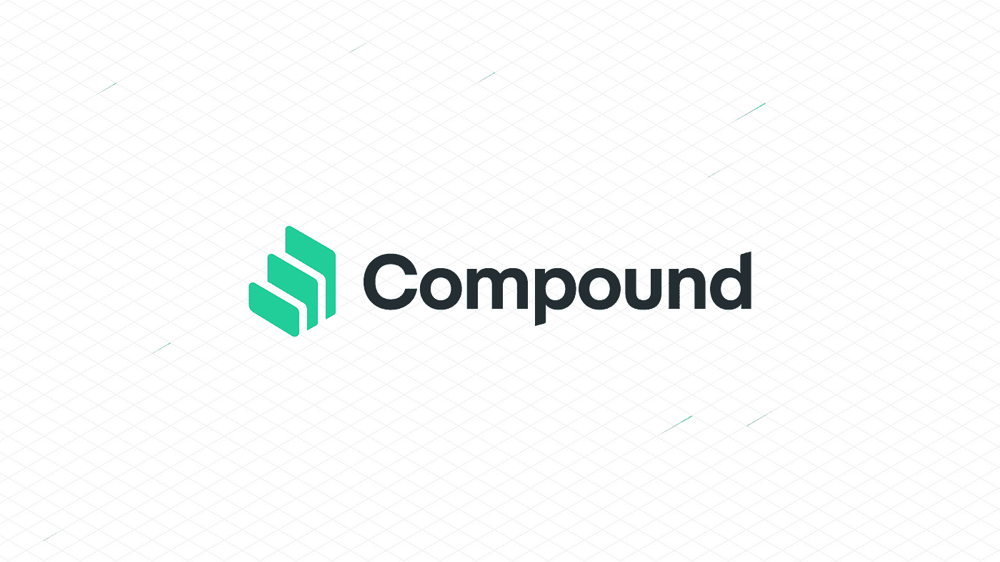

`[GovernorAlpha](https://github.com/compound-finance/compound-protocol/blob/master/contracts/Governance/GovernorAlpha.sol)`智能合同对构建治理协议产生了影响。该合同不仅用作复合公司治理的准系统，还用作 [Uniswap](https://github.com/Uniswap/governance/blob/master/contracts/GovernorAlpha.sol) 或[指数化金融](https://github.com/indexed-finance/governance/blob/master/contracts/governance/GovernorAlpha.sol)的治理准系统。

我们来看一下`GovernorAlpha`的核心功能之一。顾名思义，`[propose(...)](https://compound.finance/docs/governance#propose)`功能可以创建新的建议(例如:改变`cToken`的利率)。如果你看下面，你会看到我们之前解释的两个例子:

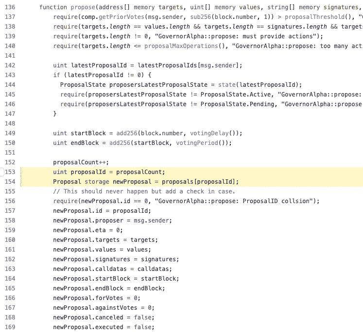

在**行 153** 中，局部变量`proposalId`被赋予状态变量`proposalCount`的值。因为这个局部变量是基本类型(a `uint`)，所以该值被从契约存储器(从状态变量`proposalCount`)复制/克隆到局部变量(在堆栈上)。对局部变量的任何更改都不会传播到协定存储。

在 Compound 中，这一行用于在本地保存新的提议 id(通过递增`proposalCount`行 152 生成)。这也节省了一些汽油。看看第 154 行和第 157 行。如果变量是`proposalCount`(实际状态变量)而不是`proposalId`，这将读取合同存储两次。

**第 154 行:**使用新的`proposalId`，创建一个`newProposal`。由于`newProposal`变量是一个`struct`(复杂类型)，我们必须指定我们希望 EVM 操作的数据位置，当我们以后操作和编辑这个变量时。

这个例子使用了一个`storage`参考。

*   那是什么意思？`newProposal`指合同中的某处存储。
*   它指的是合同仓库中的哪个位置？它引用了`proposals`映射中的一个`Proposal`。
*   哪个`Proposal`？该建议由映射中的`proposalId`引用。

这个`storage`关键词又意味着什么呢？这将意味着对`newProposal`变量所做的每一个改变都将导致数据写入合同存储器。从第 157 行开始，您可以看到新提议的所有细节都是通过`Proposal`结构成员一个接一个地编写的。这些行中的每一行都写入约定存储。

一旦执行了该功能，新的建议将被保存在合同存储中，并且更改将持续。

## 存储引用的幕后发生了什么？

看看下面的例子。基于同样的治理主题。它详细说明了使用存储器引用从存储器*与*复制时使用的 EVM 操作码。

第一个函数`getVotesCount()`从堆栈中复制值，然后返回它。我们可以看到，值是通过`SLOAD`从存储器加载到堆栈的。对变量`currentVotesCount`的任何更改都不会传播回存储器。

相反的第二个例子包含一个`storage`引用。只要我们给`Vote`结构中的成员`hasVoted`赋值，存储就会更新，我们就可以看穿操作码`SSTORE`。

该示例显示了为`storage`引用变量分配新值会更新合同存储。EVM 将此理解为执行`SSTORE`指令的“触发器”。

相反，如前面的示例所示，从存储变量中为其赋值的 elementary 变量不会创建引用，而只是将值从存储中复制到堆栈中。EVM 把这理解为一个简单地执行`SLOAD`指令的触发器。

# 从程序集和 Yul 访问存储

通过指定存储槽和存储偏移量，可以对内联程序集中的协定存储进行读写。

我们之前看到，存储中的一些变量不一定占用一个完整的存储槽，但有时会打包在一起。

我们还看到作为操作码的`SLOAD`只接受存储槽号作为参数，并返回存储在该槽下的完整的`bytes32`值。

但是如何在同一个存储槽中读取一个和其他状态变量打包在一起的状态变量呢？

以下面的合同为例:

```
contract Storage { uint64 a;
    uint64 b;
    uint128 c;}
```

坚固性文件解释了以下内容:

> 对于本地**存储**变量或状态变量，单个 Yul 标识符是不够的，因为它们不一定占据单个完整的**存储**槽。
> 
> 因此，它们的“地址”由一个槽和该槽内的字节偏移量组成。

因此，变量的“地址”由两部分组成:

*   插槽号:变量所在的位置。
*   变量开始的字节偏移量(在该槽内)。

让我们继续看一些基本的汇编代码，以便更好地理解。看看下面的合同及其功能:

```
contract Storage { uint64 a = 1;
    uint64 b = 2;
    uint128 c = 3; function getSlotNumbers() public view returns(uint256 slotA, uint256 slotB, uint256 slotC) { assembly { slotA := a.slot
            slotB := b.slot
            slotC := c.slot

        } } function getVariableOffsets() public view returns(uint256 offsetA, uint256 offsetB, uint256 offsetC) { assembly { offsetA := a.offset
            offsetB := b.offset
            offsetC := c.offset

        } }}
```

通过 Remix 运行这两个函数会产生以下输出:

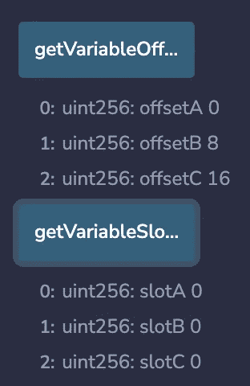

使用内嵌装配和 Yul，

要检索变量`c`指向的槽，可以使用`c.slot`，要检索字节偏移量，可以使用`c.offset`。使用`c`本身会导致错误。

```
function ReadVariableC() public view returns (uint64 value) { assembly {
        value := sload(c)
    }}
```

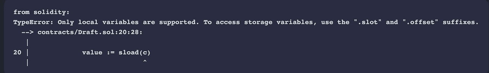

上面的代码将无法编译，并会抛出以下错误

还有一点要提的是，在内联汇编中，你不能给存储变量的`.slot`或`.offset`部分赋值。

```
function doesNotCompile() public { assembly {
        a.slot := 8
        a.offset := 9
    }}
```

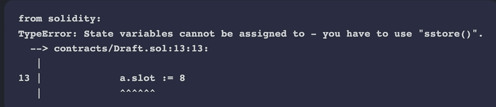

solc 编译器报告的错误(截图来自 Remix)

**Yul 中存储指针的偏移量是多少？**

在函数体中，一些变量可以是存储指针/存储引用。例如，这包括`struct`、`array`和`mapping`。对于这样的变量，`.offset`在 Yul 中总是为零，因为这样的变量总是占据一个完整的存储槽，并且不能与其他变量一起紧密地打包在存储器中。

# 结论

无论是初始化还是修改智能合约中的数据，写入智能合约的存储成本都很高。尽管从协定存储中读取数据是免费的，但如果这些读取操作是更改状态的事务的一部分，您仍应考虑与读取智能协定的存储相关联的 gas 成本。

由于储存操作的高气体成本，固体文件规定了一个重要的考虑因素:

> [您应该将存储在持久存储中的内容最小化到契约运行所需的内容。](https://docs.soliditylang.org/en/v0.8.13/introduction-to-smart-contracts.html#storage-memory-and-the-stack)

建议尽可能将某些数据存储在合同存储区之外，以最大限度地降低相关的天然气成本。

# 参考

[](https://blog.openzeppelin.com/ethereum-in-depth-part-2-6339cf6bddb9/) [## 以太坊深度，第 2 部分- OpenZeppelin 博客

### 感谢你对这篇文章感兴趣！我们正在进行品牌重塑，所以如果有些名字…

blog.openzeppelin.com](https://blog.openzeppelin.com/ethereum-in-depth-part-2-6339cf6bddb9/)  [## 存储可靠性 0.8.15 文档中状态变量的布局

### 契约的状态变量以紧凑的方式存储在存储器中，因此多个值有时使用相同的…

docs.soliditylang.org](https://docs.soliditylang.org/en/v0.8.15/internals/layout_in_storage.html) [](https://github.com/OpenZeppelin/openzeppelin-contracts/blob/master/contracts/utils/StorageSlot.sol) [## open zeppelin-contracts/storage slot . sol at master open zeppelin/open zeppelin-contracts

### 此时您不能执行该操作。您已使用另一个标签页或窗口登录。您已在另一个选项卡中注销，或者…

github.com](https://github.com/OpenZeppelin/openzeppelin-contracts/blob/master/contracts/utils/StorageSlot.sol)  [## 固体中的数据表示

### 适用于代码调试器和其他调试相关实用程序的编写人员。作者哈里·奥特曼[@haltman-at]发表…

ethdebug.github.io](https://ethdebug.github.io/solidity-data-representation/#user-content-locations-in-detail-storage-in-detail) [](https://programtheblockchain.com/posts/2018/03/09/understanding-ethereum-smart-contract-storage/) [## 了解以太坊智能合约存储

### 以太坊智能合约使用一种不常见的存储模型，这种模型经常让新开发人员感到困惑。在这篇文章中，我将描述…

programtheblockchain.com](https://programtheblockchain.com/posts/2018/03/09/understanding-ethereum-smart-contract-storage/) [](https://ethereum.org/en/developers/docs/smart-contracts/anatomy/) [## 智能合约剖析| ethereum.org

### 深入剖析智能联系人的结构——功能、数据和变量。

ethereum.org](https://ethereum.org/en/developers/docs/smart-contracts/anatomy/)