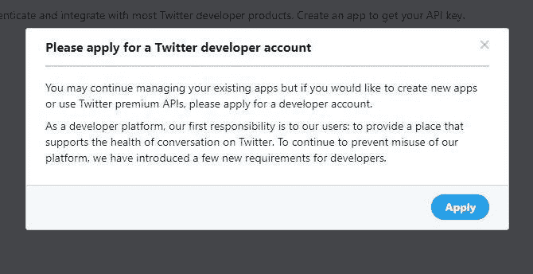
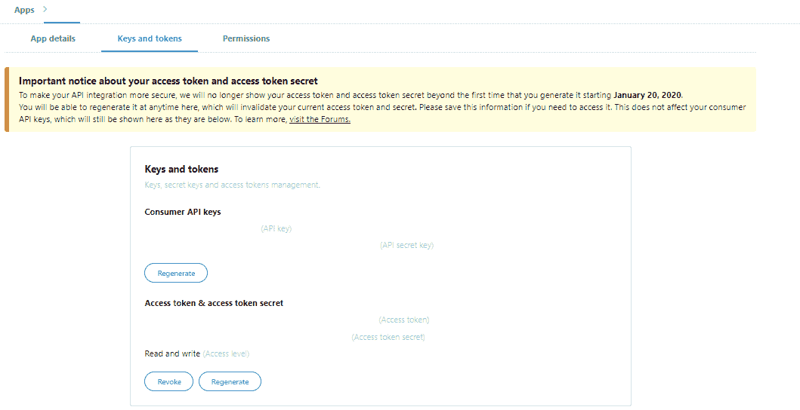
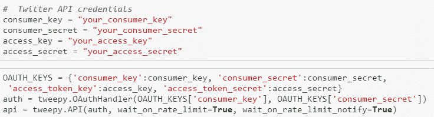
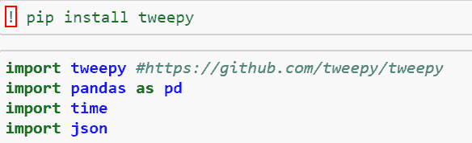
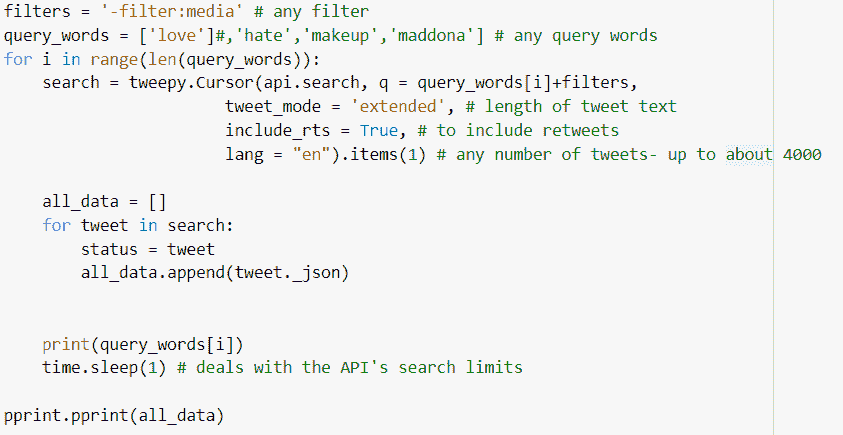
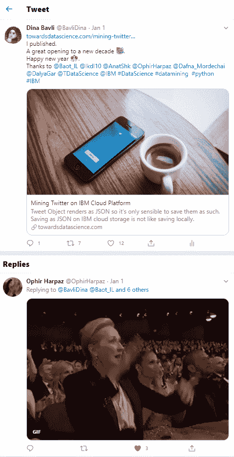
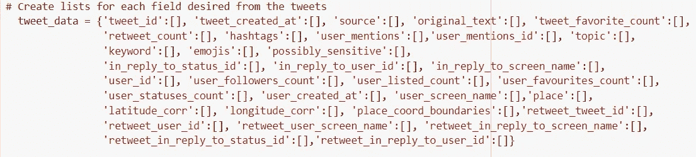
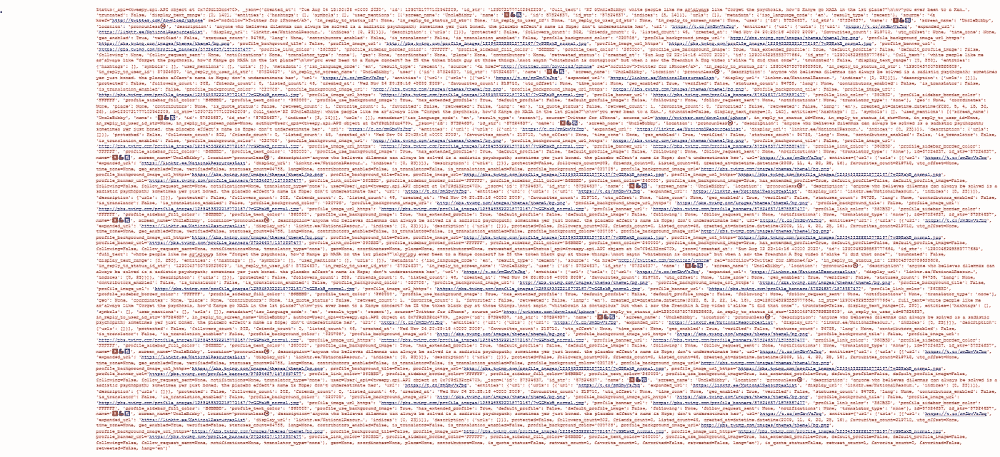
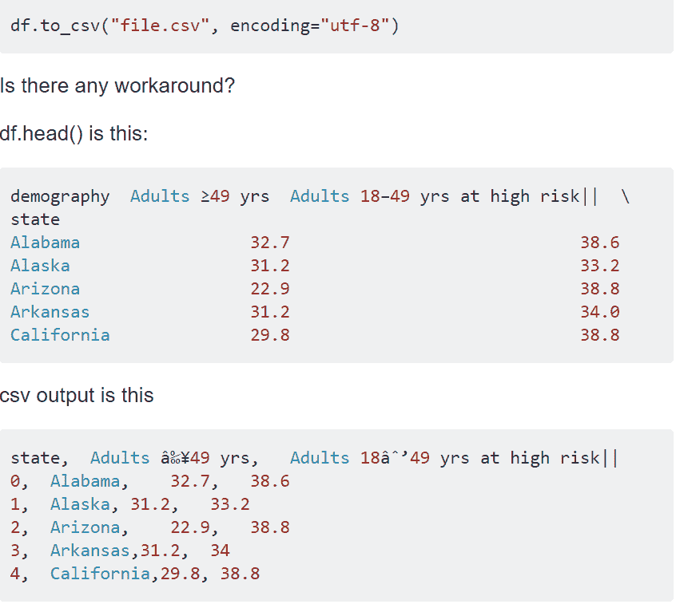

# 如何使用 Tweepy Python 包

> 原文：<https://betterprogramming.pub/all-about-the-tweet-d4321aee73d1>

## 使用 tweepy python 包从 tweepy 中检索您可能想要的所有内容，并将其格式化为 pandas 数据框

亚历山大·沙托夫在 [Unsplash](https://unsplash.com?utm_source=medium&utm_medium=referral) 上拍摄的照片

Twitter 是一个检查不同类型的用户、关系和信息的美丽氛围。这是多种研究的沃土，包括我的研究。

过去的研究也意味着现有的数据集——那么为什么要挖掘 Twitter 的数据流呢？答案当然是，并不是每双鞋都合适，现有的数据集可能不足以满足你的研究目标或范围。

在这篇文章中，我将教你如何创建一个拥有至少两倍功能的数据集(与我找到的数据集和教程相比)。
无论你选择如何处置它们。请允许我介绍你的可能性。我强烈建议你提前检索所有可用于你研究的数据，因为这些数据将来可能会不可用(推文可能会被删除)。

本文的要点和全部代码附在最后。除了一个[视频链接](https://www.youtube.com/watch?v=uPbQ3Xi1lAQ)之外，这篇文章的完整材料可以在这个 [GitHub 资源库](https://github.com/dinbav/SpreadingKnowledge/tree/master/Deep%20Into%20The%20Tweet)中找到。

# **1。从哪里开始？**

## 首先，确保你有一个 Twitter 账户。

为了[连接到 Twitter API](https://developer.twitter.com/en/docs/basics/getting-started) ，你需要一个 Twitter [开发者账户](https://developer.twitter.com/en.html)和你的账户凭证。访问您的密钥和令牌的一种方式是通过[应用](https://developer.twitter.com/en/apps)和应用详细信息——如果需要，您还可以在那里重新生成它们。
在此过程中，您的屏幕上会出现以下内容:

来自推特的截图

推特截图片段

来自推特的截图

您需要保存您的凭据，以便将它们放在代码中的适当位置，如下面的代码截图所示:

所附代码截图

保管好你的证件！请不要分享！这是通过你的帐户访问 Twitter 数据流，虽然我们检索推文只是为了研究和分析它们，但如果你的密钥和凭证落入坏人手中，有人可能会滥用它们。

# 2.安装和导入

第二个基本要素是安装和导入。最重要的一个是 [tweepy](https://www.tweepy.org/) ，这个 python 包帮助我们通过 Twitter API 使用我们的凭证连接到 Twitter 数据流。导入 JSON 也很重要，因为 tweet 结构是 JSON 对象；Pandas 帮助我们将 JSON 字符串解析成表格数据集——这更友好。由于 Twitter API 是有时间限制的，因此 time python 包对于在成批检索的 tweets 之间插入 15 分钟的超时也非常重要。

所附代码截图

# 3.了解 API 搜索

下面是使用`tweepy.Cursor`连接 Twitter API 的语法:

所附代码截图

Tweepy 在每个搜索中接收几个参数，让我们查看它们:

*   查询—您要搜索的术语？
*   过滤器—您不想检索的内容
*   `Tweet_mode` — 140 还是 280 个字符？
*   `Include_rts`——你也想转发吗？
*   Lang Items —您搜索的是哪种语言？

此外，它还有时间限制——大约每 15 分钟 4000 条推文，这意味着我们应该考虑在使用`time.sleep(900)`检索推文的函数中留出 15 分钟的时间。

# 4.推特数据

## **仔细查看一条扩展推文**

> **【正文】:**“你的推文装不下 140 个字？🤔\ n \ n 我们正在尝试一些新的小团体，并增加字符…https://t.co/y1rJlHsVB5",
> 
> " extended_tweet": {
> 
> **"full_text":** "你的推文装不下 140 个字符？🤔\ n \ n 我们正在尝试一个小组的新内容，并将字符限制增加到 280 个！对可能性感到兴奋吗？请阅读我们的博客，了解这一切是如何累积起来的。👇\nhttps://t.co/C6hjsB9nbL "，

## 以下是摘自我的帖子的一个例子:

截图来自个人推特

您希望从这个示例 tweet tread 中检索到什么？

*   文本
*   表情符号
*   日期
*   转发
*   提及
*   用户
*   标签
*   回复
*   喜欢
*   资源定位符
*   形象

# 5.用户数据

截图来自个人推特

您想从配置文件中检索哪些字段？

*   名字
*   网名
*   追随者
*   跟随
*   加入时间
*   喜欢
*   小鸟叫声

下面是一个 tweet 对象的字段列表，该对象创建了我们想要的数据框(完整代码在本文末尾):

创建数据框的 tweet 对象的字段字典代码的屏幕截图。

# 6.深入到推文中

图片由[转化为](https://pixabay.com/users/intographics-2633886/?utm_source=link-attribution&utm_medium=referral&utm_campaign=image&utm_content=1599527)来自[像素库](https://pixabay.com/?utm_source=link-attribution&utm_medium=referral&utm_campaign=image&utm_content=1599527)

一个检索到的 tweet 元数据的屏幕截图

相当可怕。尽管很小，但你可以看到小表情符号在不同的地方出现几次——这意味着一条推文的完整文本可以出现在 JSON 字符串的不同位置。这也意味着使用`tweet_mode=’extended’`、`text.append(tweet.full_text)`或`text`作为退路是不够的。以下是克服它的解决方案:

全文可用于使用 NLP 方法的各种分析，如情感分析或 LDA(主题分析)；可以根据讨论话题的用户来分。
您可以通过以下方式检索关于推文本身的信息:

检索有关用户的信息可以通过以下方式完成:

检索提及和标签数据:

回复:

检索关于对话各方的数据允许使用图形和 SNA 方法分析数据，使用 python 包，如 [NetworkX](https://networkx.org/) 。

对于地理分析，例如根据位置绘制推文，可以通过以下方式检索推文的位置数据:

一些推文可能是敏感的；你可能有兴趣知道 Twitter 是这样标记他们的，尤其是在处理敏感或有争议的话题时。以下是如何检索“是否敏感”标签:

# 7.处理表情符号

## 编码可能会产生垃圾

在检索 8GB 的推文后，我发现的一个问题是，在所有编码之间的某个地方，所有东西都不可读，包含奇怪的符号和类似胡言乱语的字符——我怀疑一个可能的原因是表情符号。
看看下面这个 StackOverflow 的例子:

来自 [StackOverflow](https://stackoverflow.com/questions/25788037/pandas-df-to-csvfile-csv-encode-utf-8-still-gives-trash-characters-for-min/43684587) 的截图

我将表情符号保存为数据框上的另一个功能，以克服编码问题。下面是完整的代码，包括解释表情符号的 demoji python 包。更多关于 demoji python 包和其他解释表情符号的 python 包的信息可以在[这里](https://towardsdatascience.com/more-than-words-your-emoji-says-a-lot-96f4ec21af23)找到。

希望这篇文章对你有用。以下是本文涵盖的完整代码: