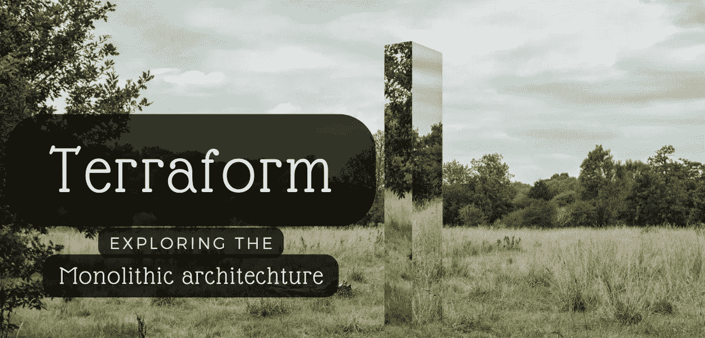
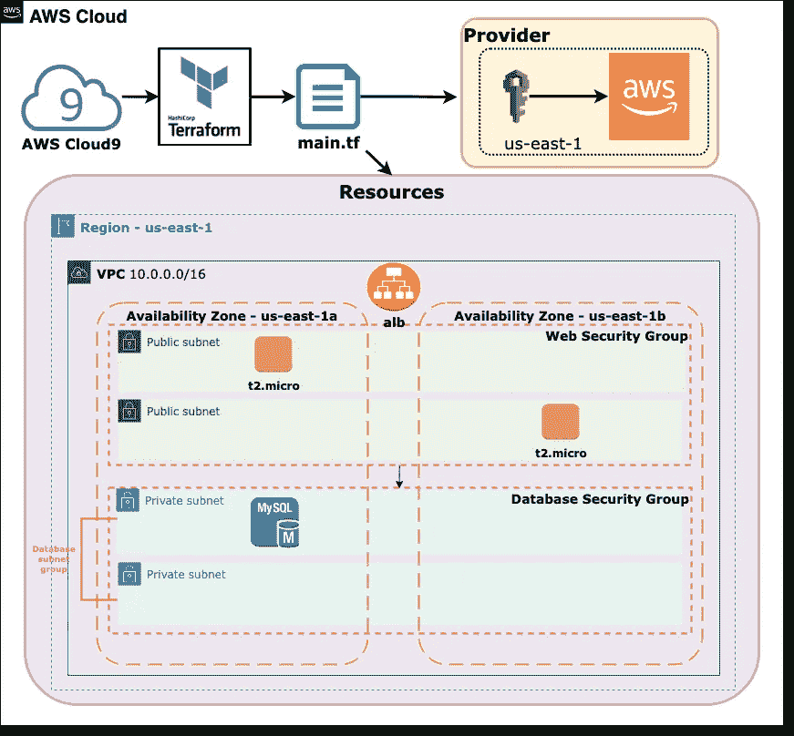
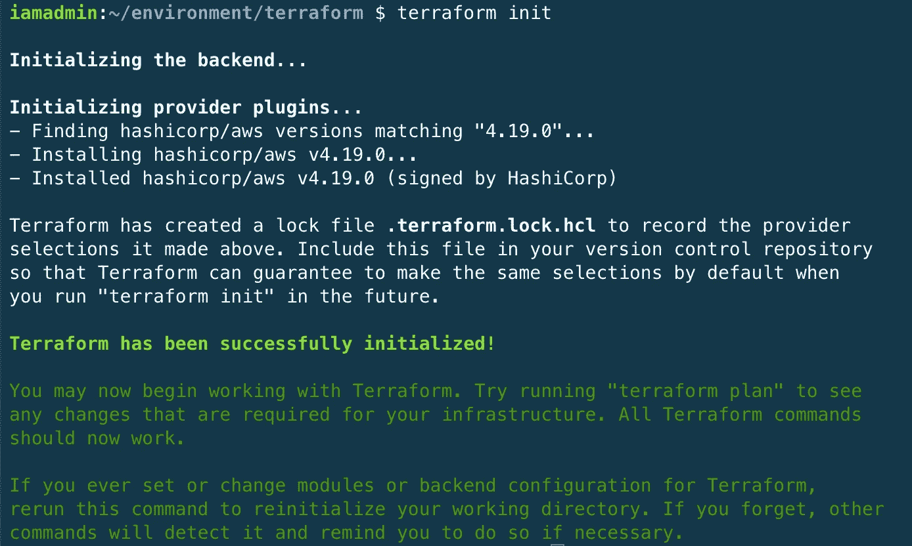
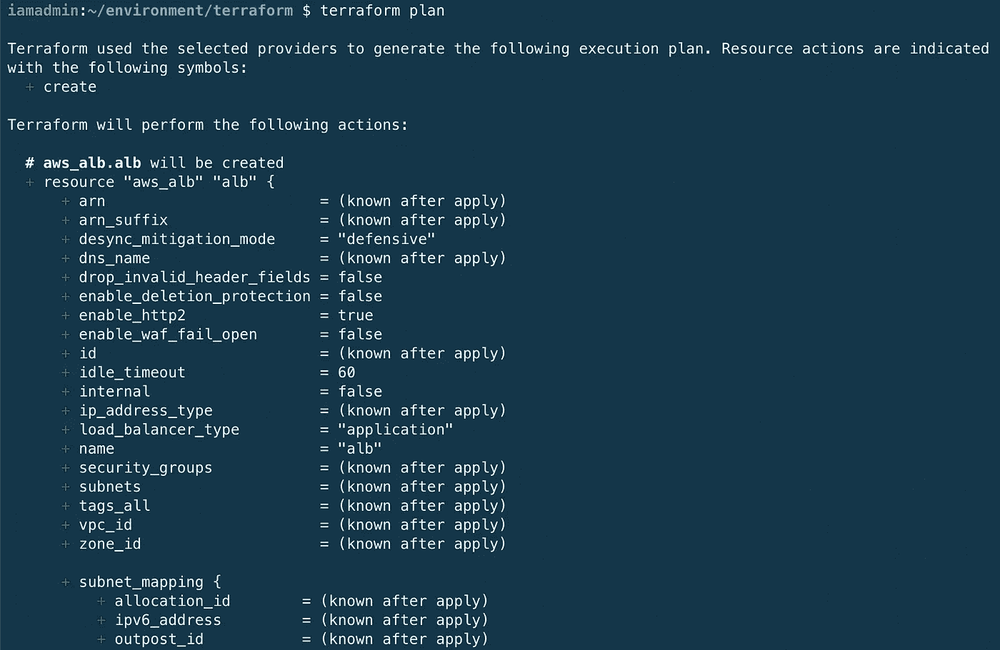
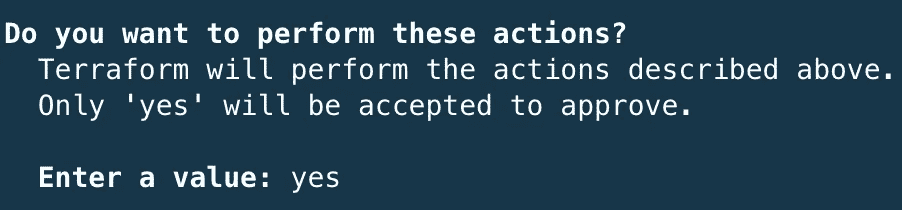
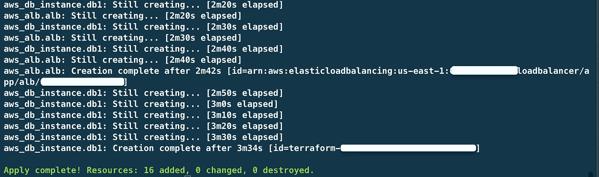

# 所有人都欢呼这个庞然大物——庆祝地形上统一建筑的冗长

> 原文：<https://betterprogramming.pub/all-hail-the-monolith-celebrating-the-verbosity-of-the-unified-architecture-in-terraform-81b53e3a03ae>

## 探索整体架构

使用 [Unsplash](https://unsplash.com/) 和 [Canva](https://www.canva.com/) 创建的图像

你可能知道，我对技术领域的整体架构很有感觉。

一方面，所有东西都整齐地打包在一个文件中，很难不喜欢这种明显的简单性。

然而，捆绑在一起的服务也可能一起失败——正如我在尝试拼凑一个由 RDS MySQL 实例和由应用程序负载平衡器管理的面向 web 实例的前端组成的简单后端时所学到的那样。很简单，对吧？

# 目标

一个简单的 Terraform monolith，利用 EC2、应用负载平衡器和 MySQL 数据库实例

对于我的第一个 Terraform 项目，我创建了一个整体结构，其中包含一个带有公共和私有子网的 VPC、一个应用程序负载平衡器和一个 RDS MySQL 实例。

我在这种方法中的目标不仅是探索 Terraform 的功能，而且是确定这种类型的统一结构的优势和挑战。作为额外的挑战，我选择不在这个文档中包含输出或设置已知变量。

# 任务

为了实现这一目标，我需要完成以下详细步骤:

1.使用选择的 I.D.E .安装 [Terraform](https://www.terraform.io/) 。

2.利用[官方文档](https://www.terraform.io/docs)编写一个包含以下规范代码的文件:

> — VPC 与 CIDR 10.0.0.0/16
> 
> —两个公共子网，在两个可用性区域中具有 CIDR 10.0.1.0/24 和 10.0.2.0/24
> 
> —两个专用子网，CIDR 为“10.0.3.0/24”和“10.0.4.0/24”，位于两个可用性区域中，其中一个子网中有一个 RDS MySQL 实例(微型)
> 
> —将流量导向公共子网的负载平衡器
> 
> —每个公共子网中有 1 个 EC2 t2.micro 实例

# 环境和规格

*   `Device` — MacBook Pro，14 寸，2021，M1 Pro
*   `AWS`账户和凭证
*   `I.D.E.` —运行在亚马逊 Linux 2，t2.micro 实例(自由层)上的 AWS Cloud9
*   *`Terraform` *v. 1.2.3(预装 Cloud9)**

# *分析整块的主配置文件*

**

*巨石柱。2001 年:来自 Londonist.com 的《太空漫游》(1968)*

*据电影制作人斯坦利·库布里克说，那块巨石代表了集体无意识。自人类出现之前，这种阴森恐怖的建筑包含了一切，并且一直存在，没有改变。虽然这种承诺可能看起来令人欣慰，或者令人不安，这取决于你如何看待它，但它的实用性和实用性使它只不过是一种艺术的展示。*

*我对 Terraform 中唯一的配置文件— `main.tf`也有类似的感觉。这个可能很难处理的文件包含了部署应用程序的所有配置和值。不幸的是，它也带来了潜在的安全漏洞和性能问题。*

## *提供商:AWS*

*主配置文件的第一部分应该包含提供者的声明。提供商允许 Terraform 管理资源或数据源。在下面的例子中，我将 AWS 声明为提供者，硬编码凭证(—说真的，不要这样做！*)和我的工作区域，以便可以创建和管理资源。*

*看到这里有什么不对吗？*

*   ** *敏感值或信息*永远不要*包含在`main.tf`文件中，因为这些信息可能会被用来霸占您的帐户、增加费用或破坏您在数字空间中所知道和喜爱的一切。→ *改为*试试:使用 HashiCorp 建议的[设置变量](https://learn.hashicorp.com/tutorials/terraform/sensitive-variables)来保护敏感数据。*

*在这一步之后，保存文件并运行一个`$ terraform init`来初始化工作目录和后端。*

**

*地形初始化*

## *资料来源:VPC 等人。*

*下面的配置详细说明了与 VPC 及其子网相关的规范。列出我的所有 VPC 资源，包括 VPC 本身、公共和私有子网、路由表、路由表关联*和互联网网关。*

*   **因为我选择了长手方法，所以每个`aws_route_table_association`资源只能有一个子网。这扩展了我需要显式关联的每个子网的代码。→ *尝试改为*:使用资源下的`count = length(var.subnets)`指定所需子网的数量。*

## *应用程序层—资源:EC2、安全组、应用程序负载平衡器*

*这部分代码表示一组运行 Amazon Linux 2 的公共实例，通过 Apache web 服务器安装引导。安全组规则允许从端口`22`进行 ssh 访问，以及通过端口`80`访问互联网。用户数据周围的`EOF`标志允许地形配置中的多行字符串。*

*负载平衡器被指定为默认的“应用程序”类型，它与公共子网相关联，并在该层的实例之间分配 web 流量。*

## *数据库层—资源:数据库子网组、安全组、数据库实例*

*此配置的最后一部分包含组成应用程序数据库层的资源列表。为了实现高可用性，子网组必须至少包含两个私有子网。如果仅列出一个子网，资源将显示错误。*

*安全组类似于应用程序层组，但是必须为 RDS MySQL 数据库客户端指定端口`3306`。此外，只有上一层的安全组可以访问该实例。*

*使用指定的子网组和安全组在 RDS 中创建数据库实例。我本来可以添加一些选项，比如添加日志信息，但是由于这不是一个生产阶段的应用程序，所以我现在对收集日志并不感兴趣。*

*仅此而已！现在要做的就是计划和应用这种配置，看看一切是如何组合在一起的。*

# *关键时刻…*

*我运行命令`$ terraform plan`来运行配置的所有期望规格的列表。许多值在应用后被标记为*，因为资源尚未创建。**

**

*地形图*

*在回顾了计划之后，我继续使用`$ terraform apply` 来制作列出的资源，并希望一切顺利——没有错误。*

*Terraform 最后一次检查，以确保我明白我要做什么..*

**

*如果你坚持的话..*

*几分钟后，所有声明的资源都应该创建好了。我肯定会检查每个资源的 AWS 控制台，将其与我指定的配置进行比较。*

**

## *反射*

*总的来说，使用 Terraform 比使用 AWS 控制台和在各种选项卡和窗口之间来回切换来创建两层结构要高效得多。*

*虽然我发现使用统一结构的好处是简单，而不是需要引用多个文件，但安全风险和实用性——或缺乏安全性——不值得。*

*那么下一步是什么？我使用`$ terraform destroy`清理所有新创建的资源，就像我创建它们一样容易。繁忙的云工程师可以高枕无忧，因为一个命令就可以快速部署和销毁资源，而不会忘记某项资源会继续产生费用。*

*现在我对 Terraform 有了最基本的了解，我将探索 Terraform 的一些更高级的特性— [模块](https://www.terraform.io/language/modules)！敬请关注，地球人。*

**

*照片由[亚当·米勒](https://unsplash.com/@adamthehooligan?utm_source=unsplash&utm_medium=referral&utm_content=creditCopyText)在 [Unsplash](https://unsplash.com/s/photos/astronaut-toy?utm_source=unsplash&utm_medium=referral&utm_content=creditCopyText) 拍摄*