# Swift 中所有保留的关键字

> 原文：<https://betterprogramming.pub/all-the-reserved-keywords-in-swift-17efcfaa3f3e>

## 一个包含所有保留关键字的快速备忘单，有一堆有用的例子

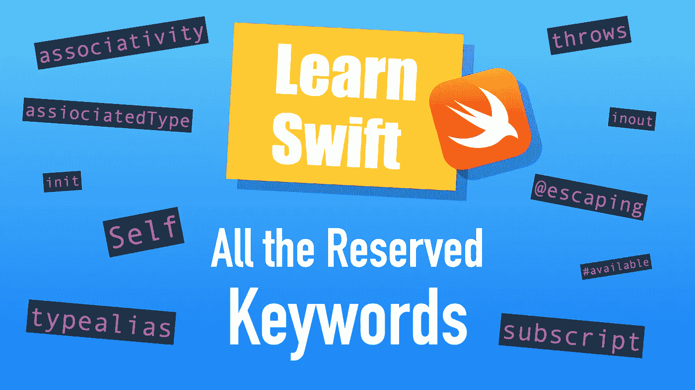

图片来源:作者

以下是 Swift 中所有可能保留的关键字的完整列表。每个关键字都包括一个简单的用法示例。

根据 [Swift 的官方文件](https://docs.swift.org/swift-book/ReferenceManual/LexicalStructure.html#:~:text=the%20following%20keywords%20are%20reserved%20and%20can%E2%80%99t%20be%20used%20as%20identifiers)，有六组关键词:

*   声明中使用的关键字
*   语句中使用的关键字
*   表达式和类型中使用的关键字
*   模式中使用的关键字
*   以数字符号(`#`)开头的关键词
*   特定上下文中保留的关键字

让我们仔细检查每组中的所有关键词。我希望你喜欢它！

# 声明中使用的关键字

## 关联类型

关联类型可用于使协议通用化。使用`associatedtype`关键字指定关联类型。

最好用一个例子来说明这一点:

在上面的代码中，`associatedType`就是`WhateverObject`。它是一个任意的对象，当您创建一个符合该协议的类型时，它会变成它后来变成的任何东西。

在第 14–16 行，您创建了一个符合`Store`协议的新结构`Shop`，您指定在这种情况下的`WhateverObject`是一个`String`。

## 班级

在 Swift 中，`class`是创建对象的蓝图。类别允许:

*   遗产
*   铅字铸造
*   去初始化
*   引用计数

要创建一个类，使用`class`关键字。

例如:

输出:

```
banana
```

## 德尼特

取消初始化是一个类专用的属性，它允许释放一个`class`实例正在使用的资源。这是一个内存管理特性。

Denitializer 是通过`deinit`关键字调用的。

为了演示反初始化，让我们用初始化器和反初始化器创建一个简单的示例类:

输出:

```
The number is now: 150
After the deinitialization, the number is now: 0
```

请注意，在大多数情况下，Swift 会为您负责内存管理，因此您很少需要自己使用反初始化器。

## 列举型别

通过 Swift 中的`enum`关键字创建枚举。这是一种使用一组相关值的类型安全方式。

例如:

```
**enum** Direction {
    **case** north
    **case** east
    **case** south
    **case** west
}
```

现在你的程序中有了一个方向约定。不使用字符串，比如`“north”`，可以使用枚举`Direction.north`。

## 延长

通过编写扩展来扩展类、结构或枚举的行为。您可以使用`extension`关键字创建一个扩展名。

例如:

输出:

```
This fruit is banana
```

## 文件私有

要声明一个将实体的范围限制在源文件的访问控制级别，可以使用关键字`fileprivate`。

例如:

```
**class** Fruit {
    **fileprivate** **var** name = "banana"
}**let** fruit = Fruit()
fruit.name = "Apple" // **Works only in this source file**
```

## 功能

功能是用于执行特定任务的一组给定的指令。函数调用接受在执行任务时可以使用的参数。

你可以使用`func`关键字创建一个函数。

例如，让我们创建一个问候某人的函数:

```
**func** greet(_ someone: String){
    print("Hi, \(someone).")
}greet("Bob")
```

输出:

```
Hi, bob.
```

## 进口

用`import`语句将应用程序或框架作为一个单元暴露给你的程序。

例如，如果您希望能够利用苹果的`UIKit`提供的所有功能，请通过以下方式导入:

```
**import** UIKit
```

## 初始化

通过调用类型定义中的`**init()**`方法，准备一个类、结构或枚举的实例以供使用。

例如:

## inout

如果你想直接改变一个传入函数的值，使用一个`inout`参数。

要声明一个`inout`参数，在类型前面添加关键字`inout`。

例如:

输出:

```
10000
```

## 内部的

`internal` 声明一个内部访问级别，允许从定义实体的模块中访问任何源文件内的实体，但不能访问源文件外的实体。

您可以像这样使用`internal`关键字:

```
**class** Fruit {
    **internal** **var** name = "banana"
}**let** fruit = Fruit()
fruit.name = "Apple" // Valid anywhere in the modules source
```

## 让

使用关键字`let` **在 Swift 中定义一个不可变变量。**

例如，创建一个以后不能更改的数字 100:

```
**let** n = 100
```

## 打开

通过使用开放访问控制修饰符来访问和子类化模块外部的对象。关键字`open`会发生这种情况。

例如:

```
**open** **var** number = 100
```

这种方法在编写框架时很有用。

## 操作员

一种特殊的符号/短语，可用于组合、改变和检查值。Swift 中有很多运算符，例如`+`、`&&`或`*`。

您可以使用`operator`关键字创建一个自定义操作符。

让我们创建一个自定义运算符，用表情符号将两个数字相加:

```
**infix** **operator** ➕**func** ➕(lhs: Int, rhs: Int) -> Int {
    **return** lhs + rhs
}print(3➕6)
```

输出:

```
9
```

## 私人的

例如，创建一个访问控制级别，将使用限制在类的声明中。可以使用关键字`private` **创建私有实体。**

例如:

输出:

```
banana
```

但是如果您尝试运行以下代码，代码将会崩溃，因为属性`name`是`Fruit`类的私有属性:

```
print(fruit1.name)
```

## 草案

协议是编写代码的蓝图。如果一个类型符合一个协议，它必须包含并实现协议中声明的变量和方法。

要声明一个协议，使用关键字`protocol`。

例如:

```
**protocol** Animal {
    **var** name: String { **get** **set** }
    **var** color: String { **get** **set** }
    **func** makeSound()
}
```

现在`Animal`协议可以在为一只猫创建类时使用:

```
**class** Cat: Animal {
    **var** name = "Luna"
    **var** color = "gray"
    **func** makeSound() {
        print("Meow!")
    }
}
```

## 公众的

使用关键字`public`访问任何模块中任何源文件中的实体。

例如:

```
**public** **var** number = 10
```

## 重新抛出

当函数本身不抛出错误，但函数参数闭包抛出错误时，标记函数`rethrows`。

这允许编译器只有在闭包实际抛出错误时才要求使用`try`错误处理关键字。

例如:

输出:

```
Yay
this is a test
```

## 静电

要创建只属于一个类型的属性和方法，需要使用关键字`static` **使它们成为静态的。**

例如，为了能够调用`Person.greet()`而不单独创建`Person`的实例，您需要将`greet`设为静态:

```
**class** Person {
    **static** **func** greet(){ print("Yo!") }
}Person.greet() // Success!
```

## 结构体

结构是代码非常基本的构造块之一。它是一个灵活的代码结构，允许初始化。要创建一个结构，使用关键字`struct`。

例如，通过以下方式创建一个`Fruit`结构:

输出:

```
banana
```

## 下标

下标是访问集合成员元素的快捷方式。若要使用下标来查询类型的实例，请使用方括号。

例如:

```
**let** numbers = [1, 2, 3, 4, 5]print(numbers[2])
```

输出:

```
3
```

您还可以为您的自定义类型创建一个下标，如类。为此，使用`subscript`关键字来定义`subscript()`方法。

例如，让我们像调用数组一样调用带有下标的`banana`实例:

输出:

```
I'm a banana!
```

这个特殊的例子并不有用，但是演示了自定义`subscript`是如何工作的。

## typealias

[类型别名](https://www.codingem.com/2021/05/03/typealias-in-swift/)是现有数据类型的别名。要创建一个，使用`typealias` 关键字。

例如，让我们为整数创建一个类型别名，并将其命名为`WholeNum`:

```
**typealias** WholeNum = Int
```

现在，您可以使用这个整数别名，例如:

```
**let** wholeNum: WholeNum = 3
print(wholeNum) // prints 3
```

## 定义变量

要声明一个可变变量，使用`var`关键字。例如:

```
**var** num = 10num = 20
```

# 语句中使用的关键字

## 破裂

使用`break`结束循环、`if`语句或`switch`语句的执行。

例如:

```
**for** i **in** 0 ... 100 {
    print("Value is \(i)")
    **if** i == 2 {
        **break**
    }
}
```

输出:

```
Value is 0
Value is 1
Value is 2
```

## 情况

使用`case`语句匹配模式。

例如:

```
**let** num = 1**switch** num {
    **case** 0: print("Number 0")
    **case** 1: print("Number 1")

    **default**: print("Not accepted")
}
```

## 继续

使用`continue`跳过当前循环迭代中的剩余语句或`switch`语句。例如:

```
**for** i in 0 ... 4 {
    **if** i % 2 == 0 {
        **continue**
    }
    print("The execution does not make it here with even numbers")
}
```

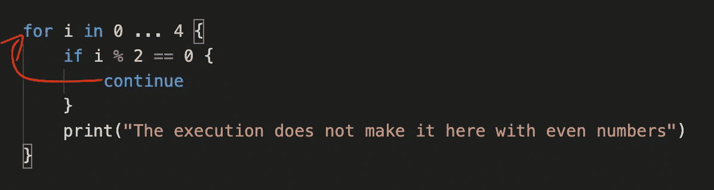

`Continue`语句跳转到下一次迭代的开始

## 系统默认值

在 switch case 语句中使用`default`作为默认情况。

举个例子:

```
**let** num = 10**switch** num {
    **case** 0: print("Number 0")
    **case** 1: print("Number 1")

    **default**: print("Not accepted")
}
```

输出:

```
Not accepted
```

## 推迟

使用`defer`在退出作用域之前运行代码。在函数中，这些是函数调用完成和函数作用域被破坏之前的“最后的话”。

例如:

```
**func** printStuff() {
    **defer** { 
        print("I printed numbers and now I go")
    }
    print("4")
}printStuff()
```

输出:

```
4
I printed numbers and now I go
```

延迟通常在打开和关闭范围内的上下文时使用，例如在访问文件时。

## 做

当处理错误时，您可以尝试在`do`块中运行产生错误的代码。错误处理的一般结构是:

```
**do** {
    **try** throwing_expression
} **catch** error_type {
    handle_error   
}
```

(在本文中可以找到更有用的错误处理示例[。)](https://medium.com/codex/swift-error-handling-made-simple-83662e098a8c#27b0)

## 其他

将`else`语句与`if`语句结合使用。如果不满足`if`(或`else-if`)中的条件，则执行`else`程序块。

例如:

```
**let** num = 1**if** num > 1 {
    print("Num > 1")
} **else** {
    print("Num <= 1")
}
```

## 失败

在 Swift 中，当发现匹配时，switch case 语句停止执行。但是，您可以通过使用`fallthrough`禁用此行为。

例如:

输出:

```
The number is 1
The execution fell through here...
```

`fallthrough`使代码执行贯穿整个案例，即使它通常会在那里停止。

## 为

使用`for`循环迭代一个序列，例如一系列数字。您可以使用`for`关键字实例化一个`for`循环。

例如，让我们使用一个`for`循环打印从 1 到 10 的数字:

```
**for** i **in** 1 ... 10 {
    print(i)
}
```

## 防护装置

根据一定的条件，使用`guard`将程序控制转移到范围之外。

例如:

```
**func** demonstrate() {
    **guard** 1 < 2 **else** {
        print("Condition was not met")
        **return**
    }
    print("Condition was met")
}demonstrate()
```

输出:

```
Condition was met
```

[了解更多](https://www.codingem.com/2021/05/13/the-guard-keyword-in-swift/)关于`guard`。

## 如果

检查是否满足条件，并使用`if`语句运行代码。可以使用`if`关键字创建一个`if`语句。

例如:

```
**if** 1 < 100 {
    print("This is true.")
}
```

输出:

```
This is true
```

## 在

通过组合`for`和`in`语句来循环一个序列:

```
**for** i **in** 1 ... 3 { print ("The number is \(i)") }
```

输出:

```
The number is 1
The number is 2
The number is 3
```

## 重复

使用`repeat`在考虑条件之前总是执行一次代码块。

例如，在`false`条件下，重复块执行一次:

```
**repeat** {
    print("Condition is false")
}
**while** 1 > 2
```

输出:

```
Condition is false
```

## 返回

从上下文中返回值，并使用`return`语句退出该上下文中的控制流。

例如:

```
**func** giveOne() -> Int {
    **return** 1
    print("This print statement is never run")
}giveOne()
```

## 转换

尝试使用 switch case 语句将值与模式匹配。

例如:

```
**let** num = 1**switch** num {
    **case** 0: print("Number 0")
    **case** 1: print("Number 1")

    **default**: print("Not accepted")
}
```

输出:

```
Number 1
```

## 在哪里

`where`语句有很多用例。其中之一是当您想要在模式中提供一个附加条件时。

例如:

```
**for** i **in** 0 ... 6 **where** i % 2 == 0 {
    print(i)
}
```

输出:

```
0
2
4
6
```

`Where`也可用于要求关联类型符合特定协议。

例如:

以上意味着既是`Callable`又是`Equatable`的实体可以调用`handleName()`函数。

## 在…期间

使用`while`循环执行一组语句，直到不满足条件。你可以用关键字`while`实例化一个`while`循环。

例如，打印从 0 到 3 的数字:

```
var i = 0
**while** i <= 3{
    print("\(i)")
    i += 1
}
```

输出:

```
0
1
2
3
```

# 表达式和类型中使用的关键字

## 任何的

您可以使用`Any`来表示任何类型的实例。例如，让我们创建一个可以包含不同类型项目的数组:

```
**var** anyItems: [Any] = []anyItems.append("A String") // You can append anything to this array
anyItems.append(1500.0)
anyItems.append(false)print(anyItems)
```

## 如同

当编译器保证一个值可以转换成另一种类型时，您可以使用`as`将其转换。

例如:

```
**let** doubleNumber = 1.502 **as** Double
```

如果`as`运算符的左右两边不能相互转换，编译器会显示一个错误。在这种情况下，如果要强制施法，可以用`as?`或`as!`代替`as`。切记小心处理可能的`nil`值。

## 捕捉

如果一个错误抛出函数抛出了一个错误，那么`catch` 块会捕捉这个错误(在 do-try-catch 结构中)。

例如:

```
**do** {
    **try** parseName("thisisatoolongnamefortheparser")
} **catch** NameError.tooLong {
    print("The name you entered is too long.")
}
```

在上面的代码中，一个过长的字符串被传递给了`parseName`方法，这将抛出一个错误。catch 块捕获错误，并通过打印错误消息来处理它。

参见本文中的完整示例[。](https://medium.com/codex/swift-error-handling-made-simple-83662e098a8c#27b0)

## 错误的

在 Swift 中，`false`是两个布尔之一。它代表不真实。

例如:

```
**if** false { print("This code is never run") }
```

## 是

使用`is`关键字检查一个对象是否是一个类的实例

## 无

`nil`是 Swift 中的无状态未定义值。Swift 中任何类型都可以是`nil`。

例如:

```
**let** studentID: String? = **nil**
**let** age: Double? = **nil**
**let** grades: [Int]? = **nil**
```

## 极好的

通过`super`关键字访问父类的方法和属性。

例如:

输出:

```
Hi, I'm Charlie
I'm starting at this company today.
```

## 自己

`self`关键词有两个:`self`和`Self` **。**前者与类型(比如类)有关，后者与协议有关。

`self`是一个类型的每个实例都具有的隐式属性。属性总是等同于实例本身。

例如:

```
**class** Person {
    **func** printMe() {
        print("I am a \(self)")
    }
}
**let** person = Person()
person.printMe()
```

输出:

```
I am a Person
```

在协议中，`Self`表示将要符合协议的类型。

例如:

输出:

```
Hi, I am  Person()
```

## 扔

使用`throw`关键字抛出一个错误。

例如，函数`inputInteger`是一个可抛出的函数，它总是抛出一个错误:

输出:

```
An error was caught.
```

## 投

使用`throws`指示函数可能抛出错误。

例如:

```
**enum** BadError: Error {
    **case** notAString
}**func** inputInteger() **throws** { 
    **throw** BadError.notAString 
}
```

## 真实的

在 Swift 中，`true`是两个布尔之一。它代表真实。

例如:

```
**if** true { print("This is always executed") }
```

## 尝试

尝试使用`try`关键字运行一个可能抛出错误的函数。这是 Swift 中错误处理的一部分。使用`try`关键字需要一个 do-try-catch 结构来正确处理错误。

例如:

```
**do** {
    **try** parseName("thisisatoolongnamefortheparser")
} **catch** NameError.tooLong {
    print("The name you entered is too long.")
}
```

在上面的例子中，您试图解析一个太长的名字，这导致了一个错误。参见本文中的完整示例[。](https://medium.com/codex/swift-error-handling-made-simple-83662e098a8c#27b0)

# 模式中使用的关键字

关键字`**_**`用于模式。

一个例子:

```
**for** **_** **in** 1...10 {
    print("Hello, world!")
}
```

在上面的例子中，你将同一个句子打印了十次。循环索引`i`是不相关的，因为它没有被使用。在这种情况下，可以用模式关键字`**_**`替换。

# 以数字符号(#)开头的关键字

## `#available`

使用`#available`条件使代码可用于某些特定的 iOS 版本和更高版本。

举个例子:

```
**if** **#available**(iOS 14, *) {
    print("This runs for iOS >= 14")
} **else** {
    print("This runs for iOS < 14")
}
```

## `#colorLiteral`

使用`#colorLiteral`访问 Swift 的颜色选择器。

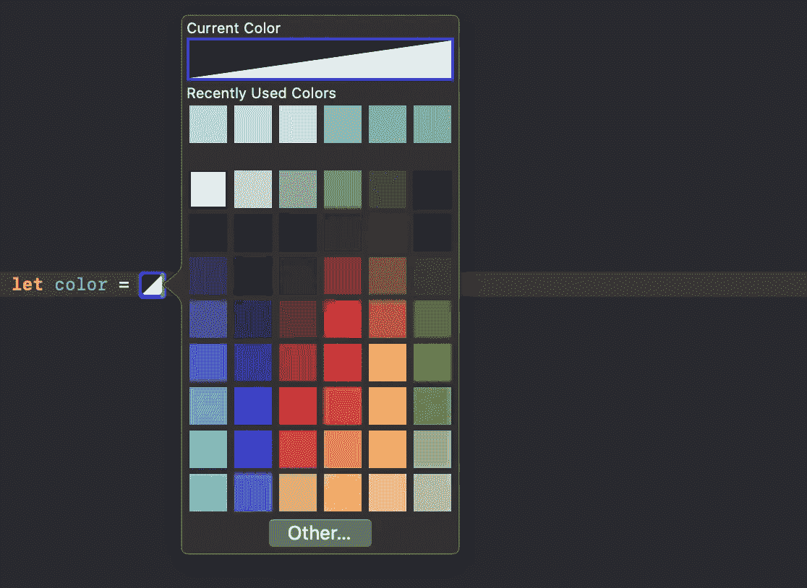

举个例子:

```
**let** color = **#colorLiteral**(red: 0.2196078449, green: 0.007843137719, blue: 0.8549019694, alpha: 1)
```

这段代码应该以这种方式出现在 Xcode 的代码编辑器中:

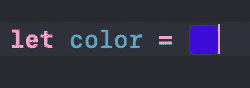

## `#column`

通过使用`#column`字面量，计算到代码行中的特定点为止有多少列。

```
print("Example: \(**#column**)")
```

输出:

```
19
```

下面是它的工作原理:

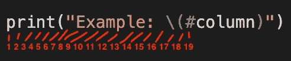

列号一直计数到#号

## `#else`

`#else`是一个条件编译器控制语句。(使用它需要使用一个`#if`语句。)

使用条件编译器控制语句，您可以有条件地编译一些代码，例如在调试时:

```
**#if** DEBUG
    print("Debugging")
**#else**
    print("Not debugging)
**#endif**
```

## `#elseif`

`#elseif`是条件编译器控制语句。使用它需要一个`#if`语句。

使用条件编译器控制语句，您可以有条件地编译代码，例如，在检查编译代码的设备类型时:

```
**#if** os(iOS)
    print("Compiled for iOS device")
**#elseif** os(macOS)
    print("Compiled for mac")
**#else**
    print("Compiled for something else")
**#endif**
```

## `#endif`

`#endif`是一个条件编译器控制语句，标志着条件编译代码的结束。

使用条件编译器控制语句，您可以有条件地编译一些代码，例如在调试时:

```
**#if** DEBUG
    print("Debugging")
**#else**
    print("Not debugging)
**#endif**
```

## `#error`

用`#error`文字创建您自己的红色编译器错误。

例如:

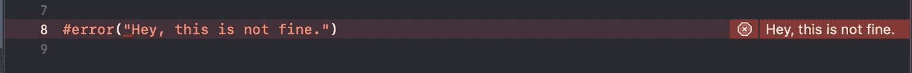

## `#file`

您可以使用`#file`文字访问当前 Swift 文件的路径:

```
print("I live in a file called \(**#file**)")
```

从 Swift 5.3 开始，使用`#filePath`代替`#file`。

## `#fileID`

您可以通过使用`#fileID`文字来访问文件 ID:

```
print("I live in a file with ID: \(**#fileID**)")
```

## `#fileLiteral`

使用`#fileLiteral`为源代码创建一个文件选择器:

```
**let** file = **#fileLiteral**(resourceName: "file.txt")
```

结果:

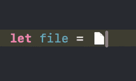

## `#filePath`

从 Swift 5.3 开始，使用`#filePath`文字(而不是`#file`文字)访问文件的路径:

```
print("Path: \(**#filePath**)") // prints Path: FILE_NAME.swift
```

## `#function`

使用`#function`文字来获取函数的名称。

例如:

```
**func** exampleFunction(){
    print("I am the \(**#function**)")
}exampleFunction()
```

输出:

```
I am the exampleFunction()
```

## `#if`

`#if`是一个条件编译器控制语句。

使用条件编译器控制语句，您可以有条件地编译一些代码，例如在调试时:

```
**#if** DEBUG
    print("Debugging")
**#else**
    print("Not debugging)
**#endif**
```

## `#imageLiteral`

使用`#imageLiteral`为源代码创建一个简单的图像图标/图像拾取器，例如:

```
**let** image = **#imageLiteral**(resourceName: "image.png")
```

结果:

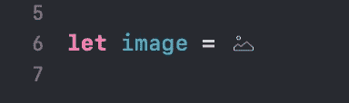

## `#line`

使用`#line`文字返回一个特定的行号。例如:

```
print("This is the line number \(**#line**)")
```

## `#selector`

`#selector`可以用来构造一个`Selector`,它引用一个函数而不调用它。

有许多相关的基于 ObjC 的 API 使用选择器，例如计时器或目标/动作模式。

举个抽象的例子:

```
btn.addTarget(object, action: **#selector**(MyClass.handleTap),
              for: .touchUpInside)
```

## `#sourceLocation`

使用`#sourceLocation`指定行号和文件名(也可以不同于源代码的行号和文件名)。

例如:

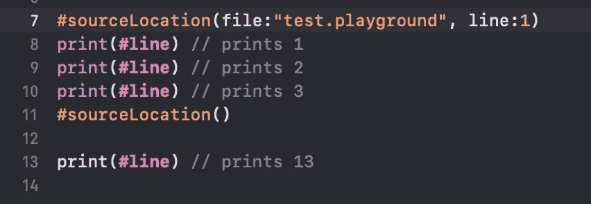

在创建生成 Swift 源代码的工具时，该功能非常有用。在这种情况下，您希望使用它来定位生成错误的原始代码。

## `#warning`

用`#warning`创建自己的黄色编译器警告。例如:

```
**#warning**("This is a warning!")
```

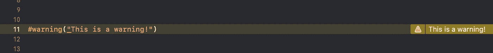

# 特定上下文中保留的关键字

## 结合性

定义当缺少括号时，一系列优先级相等的运算符如何组合在一起。

关联性类型包括

*   `left`
*   `right`
*   `none`

例如，让我们创建一个自定义的数字除法表情符。为了正确工作，需要 **:** 的`associativity` `left`的优先组是

输出:

```
0.166
```

## 便利

使用`[convenience init](https://www.codingem.com/swift-multiple-init-methods/)`创建一个替代初始化器，最终将初始化委托给主初始化器。

例如:

输出:

```
No type
Banana
```

## 动态的

使用`dynamic`修饰符让 Objective-C 代码可以访问你的属性/方法。

```
**class** Fruit {
    **dynamic** **var** type:String?
}
```

## 迪塞特

属性观察者可以对属性进行观察。当发生变化时，属性观察器被触发。

`didSet`是一个可以分配给任何可变属性的属性观察器的例子:

例如:

```
**var** nums = [10,20,30] {
    **didSet** {
        print("Numbers changed")
    }
}nums.append(40)
```

输出:

```
Numbers Changed
```

## 最后的

通过标记类`**final**` **禁止继承。**

举个例子:

```
**final** **class** Fruit {}**class** Dinner : Fruit {} // Triggers a compiler error
```

## 得到

计算属性通过`get`方法按需计算值。计算属性不存储值。

例如，让我们创建一个`Weight`类，它只在被访问时计算重量(磅)。

输出:

```
220.5
142.85715
```

## 中缀

使用`infix` 关键字指定在两个目标之间使用运算符。

例如，让我们创建一个自定义运算符(带有+-符号表情符号),它像常规的+运算符一样将两个数字相加:

```
**infix** **operator** ➕**func** ➕(lhs: Int, rhs: Int) -> Int {
    **return** lhs + rhs
}print(3➕ 6)
```

## 间接的

使用`indirect`关键字指示枚举事例是递归的。

例如:

在`Combination`案例中的`Direction`参数指的是枚举本身。这很好，但是您需要使用`indirect`关键字才能做到这一点。

## 懒惰的

创建一个属性，其值仅在第一次使用`lazy`关键字时计算。

例如:

## 左边的

将运算符的结合性指定为从左到右。换句话说，当不使用括号时，运算的分组在数学上仍然是正确的。

这是使该计算产生正确结果的原因:

```
5+2-4+3
```

下面是一个实现自定义操作符并定义`associativity` `left`的例子:

## 变化

默认情况下，禁止更改结构的属性。为了允许改变一个结构的属性，标记方法`mutating`。

例如:

输出:

```
Banana
```

## 没有人

指定运算符没有任何应用的结合性。在代码中，你可以通过写`associativity: none`来做到这一点。

这意味着不能将具有相同优先级的运算符放在一起使用。

例如:

```
let x = 1.0print(0 < x < 10) // won't compile
```

让我们通过创建一个自定义的零合并运算符来进一步演示这一点:

输出:

```
1.223
```

因为结合性是 none，所以不能将这些操作符链接在一起。尝试运行此代码片段会导致程序崩溃:

```
print(**nil** ?? **nil** ?? 1.223)
```

## 不变的

通过标记它`nonmutating`来表明一个方法不会改变实例。

例如:

输出:

```
I'm not going to change.
Apple
```

## 可选择的

您可以通过标记`optional`在`@objc` [协议](https://medium.com/codex/swift-how-protocols-work-5d0d43a961e7)中创建可选属性。这意味着当符合协议时，不需要实现这些属性。

举个例子:

## 推翻

使用`override`关键字更改子类中的实现。

例如:

输出:

```
Wassup?
Hello, how is it going?
```

## 后缀

表示操作符跟随它所操作的目标。在阶乘中，比如`5!`，运算符`!`是一个[后缀运算符](https://medium.com/codex/swift-create-your-own-custom-operator-a6fe4d71f606)。

例如，让我们创建一个自定义后缀运算符来计算阶乘:

输出:

```
120.0
```

## 前缀

使用`prefix`关键字表示一个操作符在它所操作的目标的前面。

例如，让我们创建一个自定义表情符，它接受一个数字的平方根:

```
**prefix** **operator** ✔️**prefix** **func** ✔️(num: Double) -> Double {
    **return** sqrt(num)
}print(✔️25.0)
```

输出:

```
5.0
```

## 草案

`Protocol`(大写 P 的关键字)是 Objective-C 运行时中定义的类。它代表一个 Objective-C 协议。

`Protocol`是一个[元类型关键字](https://swiftrocks.com/whats-type-and-self-swift-metatypes)。

## 需要

通过标记初始化器`required`，确保每个子类都实现了初始化器。

例如:

## 正确

将运算符的结合性指定为从右向左。这意味着当不使用括号时，操作的分组仍然是正确的。

例如，让我们创建一个使用双表情符号问号执行零合并的自定义运算符:

输出:

```
1.223
```

## 设置

使用`set`为成员设置新值。这通常与[计算属性](https://medium.com/codex/getters-and-setters-in-swift-79a46e9401a0)一起使用。计算属性是在被调用时计算的属性。

举个例子:

输出:

```
220.5
142.85715
```

## 类型

`Type`关键字(带有一个大的 *T* )是一个类型的类型。这是 Swift 中元类型的一个例子。

## 无主的

在引用周期中，一个实例可以引用另一个实例，而不必在另一个实例存在更长时间或同样长的时间时保持对它的强烈控制。

例如:

在上面的例子中，如果没有人做，就没有工作。

[阅读更多关于使用`unowned` **的**](https://krakendev.io/blog/weak-and-unowned-references-in-swift)。

## 无力的

在引用周期中，一个实例可以引用另一个实例，如果另一个实例存在的时间更短，则不需要牢牢地控制它。

例如:

输出:

```
nil
```

阅读更多关于使用`weak`的。

## 威尔塞特

[属性观察器](https://medium.com/codex/didset-and-willset-in-swift-f0ffe43a2fed)，`willSet`在被观察的属性改变之前被调用。

例如:

```
**class** Person {
    **var** name: String? {
        **willSet**(name) { 
            print("I'm about to be renamed to \(name!)!")
        }
    }
}**let** person = Person()
person.name = "Charlie"
```

输出:

```
I'm about to be renamed to Charlie
```

# 额外收获:以`@`开头的常见“关键词”

我知道这些不是技术上的关键词，但它们是你期望在这类文章中找到的，所以让我们开始吧:

## @autoclosure

使用`@autoclosure`自动将函数参数包装在闭包内。使用自动结束的全部意义在于你可以省略花括号。

例如:

```
**func** I_will(_ perform_action: **@autoclosure** () -> Void) {
    perform_action()
}I_will(print("Hello, world"))
```

输出:

```
Hello, world
```

请随意查看[这篇文章](https://medium.com/codex/swift-demystifying-autoclosures-dc106e4bc04a)做进一步参考。

## @可用

使用`@available`检查某个方法或类是否可用于编译代码的特定 iOS 版本。例如:

```
**@available**(iOS 13, *)
**func** iOS13Works() {
    print("Running this works for >= iOS 13")
}
```

这类似于使用`#available`条件。主要区别在于，通过使用`@available`，你可以检查更大的代码块，例如类或方法，而使用`#available`，你可以检查小块代码的可用性。

## @discardableResult

通过标记函数`@discardableResult`，安全地丢弃函数的返回值。

例如，如果您没有使用函数的返回值，编译器会警告您:

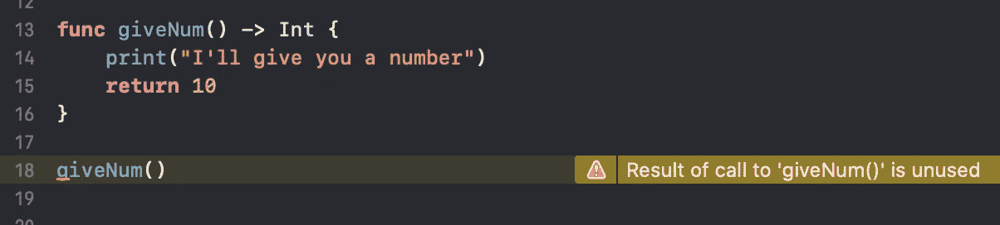

如果你不需要返回值，你可以通过使用`@discardableResult`丢弃它来让编译器高兴:

```
**@discardableResult** **func** giveNum() -> Int {
    print("I'll give you a number")
    **return** 10
}giveNum()
```

现在编译器警告消失了。

## @dynamicCallable

这是将类型标记为可直接调用的语法规则。将`@dynamicCallable`与这些方法中的一种或两种结合使用:

```
**func** dynamicallyCall(withArguments args: [Int]) -> Double**func** dynamicallyCall(withKeywordArguments args: KeyValuePairs<String, Int>) -> Double
```

例如，让我们创建一个结构`Adder`，您可以动态地调用它，就好像它是一个函数，可以接受任意数量的参数并将它们相加:

输出:

```
2.35
17.45
```

## @ dynamicMemberLookup

使用`@dynamicMemberLookup`和`subscript(dynamicMember:)`方法为不存在的类型指定一个属性。

例如:

您现在可以调用 fruit 的`type`或`color`，就好像它们是它的真实属性一样:

```
**let** fruit1 = Fruit()print(fruit1.type)
print(fruit1.color)
print(fruit1.somethingElse)
```

输出:

```
Banana
Yellow
N/A
```

## @逃避

为了在调用闭包的函数完成后保持闭包的活力，用关键字`@escaping`标记它的转义。

例如，让一个消息`responseHandler`闭包比`howAreYou()`调用活得长，以监听稍后到达的响应:

现在，在上面的例子中，即使在`howAreYou()`调用结束后，这个块仍然保持活动状态:

```
{ friendResponse **in**
    print(friendResponse)
}
```

这样，您可以使用它来处理稍后到达的响应。

如果你想更深入地了解 Swift 中的转义闭包，以及上面例子的更多细节，请查看这篇文章。

## @objc

使用`@objc`标记 Objective-C 代码中可访问的方法和属性。

```
**@objc** **public** **class** ExampleClass {} // Accessible in Objective-C
```

## @objcMembers

使用`@objcMembers`快捷键标记 Objective-C 代码可用的类的所有方法和属性。例如:

```
**@objcMembers** **class** ExampleClass {
    **func** doSomethingCool() {} // Accessible in Objective-C
}
```

例如，如果您想在 Objective-C 中访问单个方法或属性，您可以使用`@objc`来代替。

## @未知

向`switch`语句添加编译器警告，提醒自己彻底检查所有情况。这是通过在`default`案例前添加`@unknown`实现的。

对于常规的`switch`语句，没有关于`Pineapple`丢失`case`的警告:

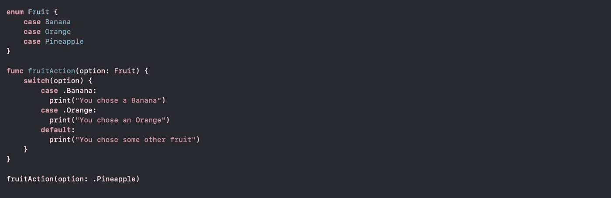

但是，通过标记`default`案例`@unknown`，您可以看到一条关于未处理所有可能案例的警告:

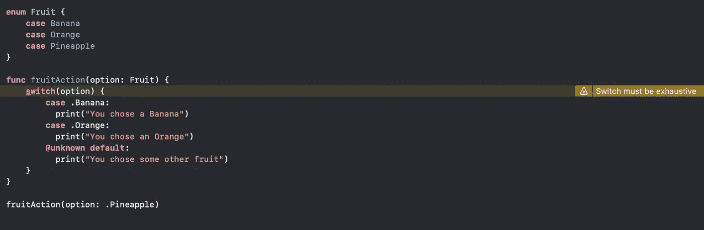

如果您向枚举中添加了新的事例，但忘记了处理它们，这将非常有用。

# 结论

如果单子上少了什么，请告诉我。我会相应地更新它。

感谢阅读。编码快乐！

# 资源

 [## Swift.org

### 您可以将此页面上的资源用作 Swift 语言的文档。苹果公司拥有额外的资源…

swift.org](https://swift.org/documentation/) 

# 你也是皮托尼斯塔吗？

如果你感兴趣，这里是 Python 中所有[保留关键字的完整列表。](https://www.codingem.com/reserved-keywords-in-python/)