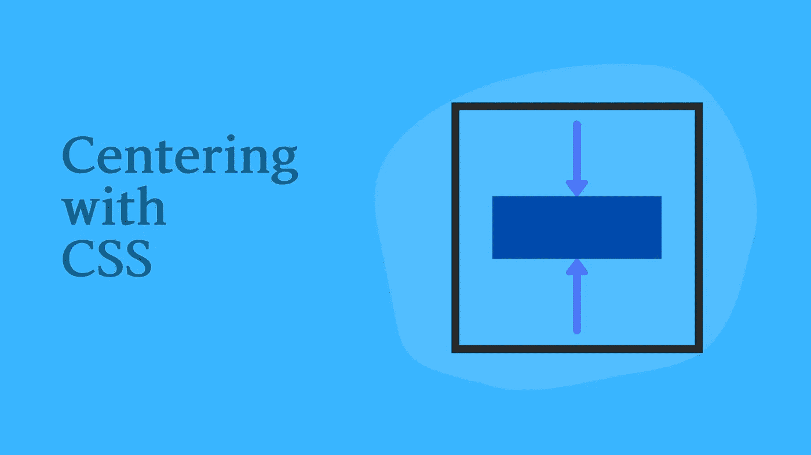

# CSS 中内容垂直居中的所有方式

> 原文：<https://betterprogramming.pub/all-the-ways-you-can-vertically-center-content-in-css-7190650dd9dc>

## 告别网页垂直居中的问题



图片由作者提供。

对于理论上如此简单的事情，在 CSS 中垂直居中元素并不是最容易完成的任务。在浏览器开始支持像 flex 和 grid 这样的 CSS 新功能之前，这种说法尤其正确。

在本文中，我们将讨论一些更古老的技巧和更现代的方法，开发人员用它们来垂直居中 CSS 中的内容。由于每种解决方案都有其局限性，所以了解这些方法中的每一种，以便在不同的场景中找到正确的解决方案，并没有什么坏处。

我们开始吧！

# **如果你知道高度**

CSS 的一个老技巧是借助`position`属性将元素垂直居中。这里，我们给元素一个绝对位置，并以将元素推到中心的方式设置边距。

## **带边距自动功能**

我们可以为元素的`top`和`bottom`位置提供相等的值，并将`margin`设置为`auto`。这将自动使元素沿 y 轴居中，并有适当的边距。在本例中，我们将`top`和`bottom`位置设置为`0`。但是，我们必须特别设置元素的高度，以防止它跨越整个高度。

## **负边距**

在这种方法中，我们将`top`放置在垂直方向的中点(50%)。然后，我们使用负边距将元素的上半部分移动到中点上方。

这里，我们也必须显式设置元素高度，以获得正确的`margin-top`值。但是在大多数情况下，我们不想为元素设置一个明确的高度，因为高度应该考虑到宽度变化、文本调整等。

因此，这两种方法在大多数情况下对于垂直居中并不理想。

# **平移时不需要高度**

我们可以调整最后一个居中方法，以得出一个用显式高度逃避问题的解决方案。这里，将元素的`top`定位在中心后，我们使用`translateY`将其沿 y 轴向上移动 50%。

```
.item {
    position: absolute;
    top: 50%;
    transform: translateY(-50%);
}
```

# **表格和垂直对齐**

CSS 支持放置在表格单元格内的内容的`vertical-align`属性。我们可以利用这一点，将元素声明为一个表格单元格(将其父元素声明为表格),以使其内容居中。如果您使用的是 div，将其显示设置为`table-cell`。或者您可以使用实际的表元素，但是这种解决方案在语义上是不正确的。

与最后一种居中方法类似，在使用表格时，不必为元素设置明确的高度。但是如果你想在单元格内放置一个非居中的元素，这种方法并不理想。

# **使用 Flex 进行垂直对中**

毫不夸张地说，flex 的引入解决了 web 开发人员面临的许多设计难题，包括垂直居中。有了 CSS 的这一新功能，我们可以轻松地生成简单、响应迅速、直观的垂直居中解决方案。

这些基于 flex 的解决方案的唯一缺点是早期版本的 Internet Explorer(低于 IE9)不支持它们。而且你还得用 webkit，moz，或者 ms prefix 来支持一些[其他更老的浏览器版本](https://caniuse.com/flexbox)。

尽管如此，flex 为管理页面布局和元素定位增加了难以置信的灵活性。在这里，我们将探索几种使用 flex 将内容居中的方法。

## **带柔性容器和对齐项目**

我们可以使用`align-items`和`justify-content`属性来指定父 flexbox 中项目的对齐方式。当我们将`align-items`设置为`center`时，如果 flex-direction 等于 row(默认)，它会将 flexbox 内的所有项目垂直居中。

```
.container {
    display: flex;
    align-items: center;
}
```

如果您正在寻找一个解决方案来垂直居中单个元素，下一个方法将更适合您。

## **带伸缩项目和自对齐**

这种解决方案使您可以自由地在 flexbox 内仅垂直居中一个元素。它利用`align-self`属性将元素放置在中心。

## **带柔性容器和自动边距**

将 flex 容器中的单个元素居中的另一种方法是将其`margin`设置为`auto`。然后，浏览器自动计算适当的边距，使其在两个方向居中。

## **柔性容器内有虚拟物品**

使用 ghost 元素并不是使内容居中的最佳方式，但是它可以完成任务。反过来，它在垂直方向上给你灵活的间距。您可以在 flexbox 中堆叠多个项目，并使用 ghost 元素将它们推到中心。

# **使用 CSS 网格垂直居中**

Grid 是近年来 CSS 最强大的补充之一。因为它允许我们控制沿 x 轴和 y 轴的布局，用 CSS grid 垂直居中是非常简单的。它为我们提供了完成这项任务的多种方法。

与 flexbox 类似，grid 不完全被包括 Internet Explorer、Chrome 和 Firefox 在内的旧版本现代浏览器支持。一些旧版本提供了启用网格支持的选项，尽管默认情况下它不可用。

使用 grid 进行垂直居中的最初几种方式与我们使用 flexbox 的方式类似。让我们来看一些它们如何工作的例子。

## **用网格容器和对齐项**

我们可以通过将`align-items`属性设置为`center`来垂直居中网格中的所有项目。

```
.container {
    display: grid;
    align-items:center;
}
```

如果要将父元素中的多个项目垂直居中，请确保将网格分成列，将它们放在同一行中。

## **带网格项目并自对齐**

如果你只想让一个项目在网格中居中，使用`align-self: center`来设置这个项目的样式。

## **带网格容器和自动边距**

类似于我们对 flexbox 所做的，我们可以通过将单个项目的`margin`设置为`auto`来在网格中垂直居中。

## **网格上有幽灵元素**

我们可以将 flexbox 中的 ghost 元素调整到 CSS 网格中。为此，我们需要创建一个包含三行的网格。然后，我们添加的 ghost 元素占用第一行和最后一行的空间，将我们的元素推到中间一行。

## **具有精确的元素放置**

Grid 允许我们在几个项目属性的帮助下声明元素的确切位置。我们可以使用这个特性将元素准确地放置在一个三行网格的中心，使我们的生活更加轻松。

# **包装**

今天，我们讨论了如何解决 web 开发人员生活中经常遇到的头痛问题之一:内容垂直居中。我们讨论了完成这项任务的几种不同方法。我希望这就足够了。如果你有更多关于垂直居中内容的技巧和提示，不要忘记在评论中与我们分享。

如果你想学习如何轻松识别布局问题，看看这个指南，让一个简单的 CSS 技巧在你的网站上突出显示布局。