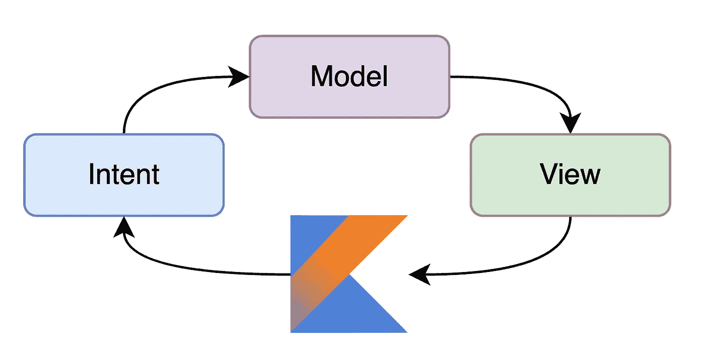

# 你为 MVI 需要的只是柯特林。没有减速器如何减速？

> 原文：<https://betterprogramming.pub/all-you-need-for-mvi-is-kotlin-how-to-reduce-without-reducer-5e986856610f>

## 在本文中，我描述了基于 [Kotlin Flow](https://kotlinlang.org/docs/flow.html) 实现一个简单的状态缩减器的尝试。



# 动机与语境

像任何关注最新趋势的安卓开发者一样，我喜欢 MVI 架构和单向数据流的概念。它解决了许多现成的问题，使我们的代码更加无懈可击。

在本文中，我不会详细讨论 MVI 是什么，但是你可以找到很多关于它的优秀文章。比如:

*   [MVI 设计模式的现代安卓架构](https://amsterdamstandard.com/en/post/modern-android-architecture-with-mvi-design-pattern)
*   [MVI 超越状态减速器](https://medium.com/bumble-tech/a-modern-kotlin-based-mvi-architecture-9924e08efab1)。

摆弄像 [MVICore](https://github.com/badoo/MVICore) 、 [Mobius](https://github.com/spotify/mobius) 或[轨道](https://github.com/orbit-mvi/orbit-mvi)这样的库激发了我进行实验，并试图实现一个可以执行状态约简的流程。

这就是[state reduce flow](https://github.com/linean/StateReducerFlow/blob/main/app/src/main/java/com/example/statereducerflow/StateReducerFlow.kt)的诞生。让我解释一下我是如何构建它的，它是如何工作的，以及您如何使用它。

# 思维过程

*请注意，以下示例是简化的。*

让我们从一个简单的计数器开始。它有一个状态，可以通过两个事件来改变:减量和增量。

使用上述方法，我们可以用以下方式构建我们的逻辑:

```
Event -> ViewModel -> State
```

然而，一个问题是`handleEvent`可以从任何线程调用。拥有非结构化的状态更新可能会导致棘手的错误和竞争情况。幸运的是，`[state.update()](https://kotlin.github.io/kotlinx.coroutines/kotlinx-coroutines-core/kotlinx.coroutines.flow/update.html)`已经是线程安全的了，但是，任何其他逻辑都可能受到影响。

为了解决这个问题，我们可以引入一个通道，允许我们按顺序处理事件，不管它们来自哪个线程。

好多了。现在我们按顺序处理所有事件，但是在`updateState`方法之外，状态更新仍然是可能的。
理想情况下，状态更新只允许在事件处理过程中进行。

为了实现这一点，我们可以使用`[runningFold](https://kotlinlang.org/api/latest/jvm/stdlib/kotlin.collections/running-fold.html)`实现一个简单的缩减器。

现在只有`reduceState`方法可以执行状态转换。

当您查看这个示例视图模型时，您可能会注意到只有`reduceState`方法包含重要的逻辑。其他一切都只是样板文件，需要为每个新的视图模型重复。

由于我们都喜欢保持[干燥](https://en.wikipedia.org/wiki/Don%27t_repeat_yourself)，我需要找到一种方法从视图模型中提取通用逻辑。

[StateReducerFlow](https://github.com/linean/StateReducerFlow/blob/main/app/src/main/java/com/example/statereducerflow/StateReducerFlow.kt) 就是这样诞生的。

# statecreducerflow

我希望 [StateReducerFlow](https://github.com/linean/StateReducerFlow/blob/main/app/src/main/java/com/example/statereducerflow/StateReducerFlow.kt) 成为能够处理一般事件的 [StateFlow](https://kotlin.github.io/kotlinx.coroutines/kotlinx-coroutines-core/kotlinx.coroutines.flow/-state-flow) 。我从这个定义开始:

接下来，我将 ViewModel 逻辑提取到新的流实现中:

如您所见，唯一的新东西是来自 [StateFlow](https://kotlin.github.io/kotlinx.coroutines/kotlinx-coroutines-core/kotlinx.coroutines.flow/-state-flow) 的一些覆盖。
为了构造流，你需要提供初始状态，可以减少它的函数，以及可以共享状态的协程范围。

最后缺少的部分是一个工厂函数，它可以创建我们的新流。我决定使用`ViewModel`扩展来访问[视图模型范围](https://developer.android.com/topic/libraries/architecture/coroutines#viewmodelscope)。

现在我们可以将我们的视图模型迁移到新的 [StateReducerFlow](https://github.com/linean/StateReducerFlow/blob/main/app/src/main/java/com/example/statereducerflow/StateReducerFlow.kt) 。

瞧啊。样板文件不见了。

现在任何有权访问`[StateReducerFlow](https://github.com/linean/StateReducerFlow/blob/main/app/src/main/java/com/example/statereducerflow/StateReducerFlow.kt)`的人都可以向其发送事件，例如

就是这样！你感兴趣的是它在真实的应用程序中是如何工作的，或者它是如何被测试的？查看我的示例项目:

[https://github.com/linean/StateReducerFlow](https://github.com/linean/StateReducerFlow/tree/main/app/src)

保持灵感！