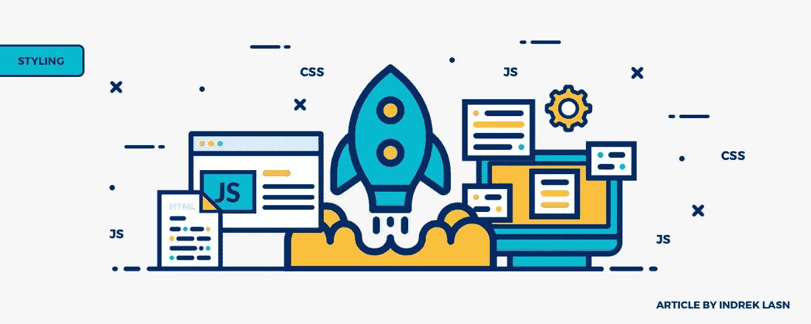
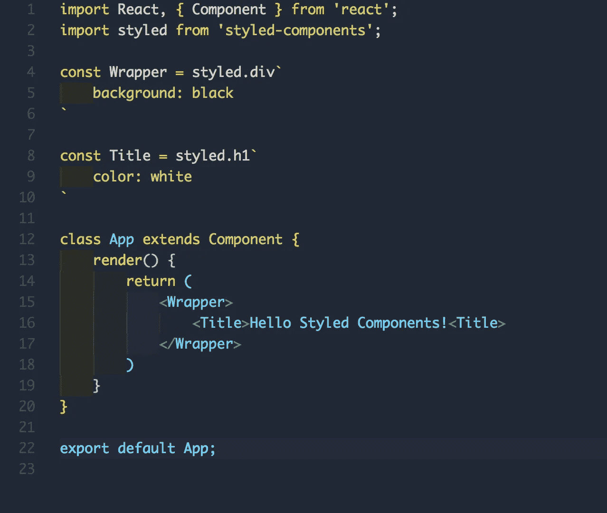
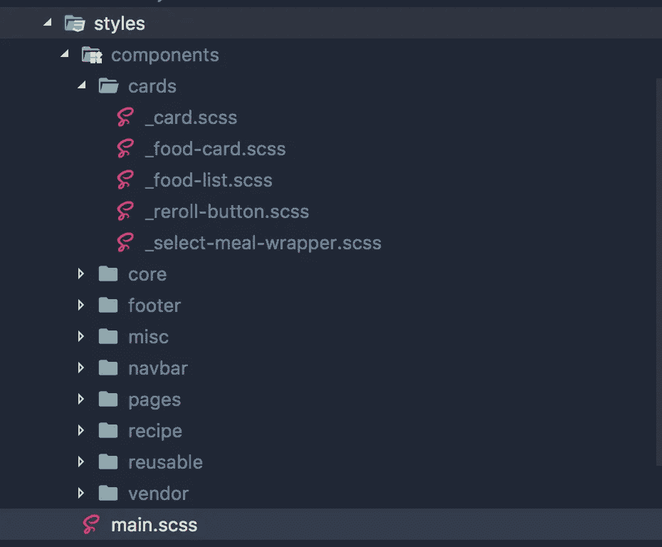
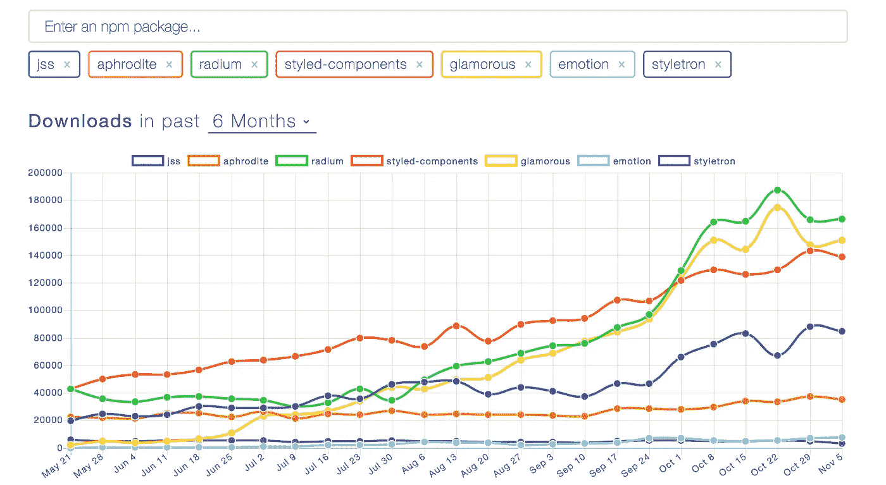
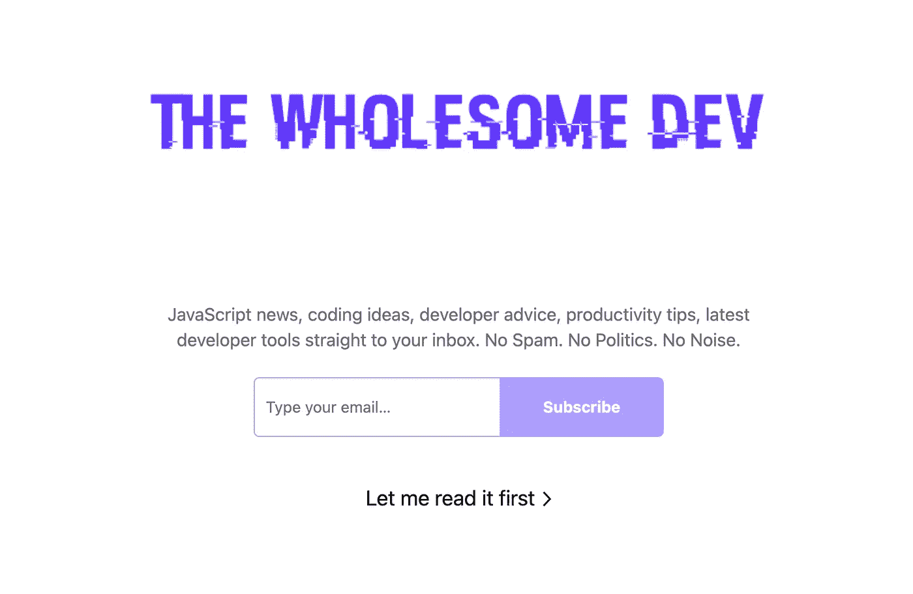

# 关于 CSS-in-JS 你需要知道的

> 原文：<https://betterprogramming.pub/all-you-need-to-know-about-css-in-js-984a72d48ebc>

## TL；DR: 在组件中思考 **—** 你不再需要维护一堆样式表。

由[设计**安娜**设计](http://bit.ly/anna-dadej)

CSS-in-JS 将 CSS 模型抽象到组件级别，而不是文档级别(模块化)。

# 样式化的 React 组件示例

你可能听说过像 [CSS-in-JS](http://cssinjs.org/?v=v9.1.0) 、[style Components](https://www.styled-components.com)、 [Radium](https://github.com/FormidableLabs/radium) 和 [Aphrodite](https://github.com/Khan/aphrodite) 、这样的术语，你可能会想，“这和我有什么关系？我对 CSS-in-CSS (CSS in)非常满意。css)。

**我在这里解释一下为什么这是相关的，希望我们至少能理解这个概念，并且理解为什么它是相关的。尽管如此，请放心使用 CSS-in-CSS。您没有义务使用 CSS-in-JS。只要对你最有效，让你开心，那就是最好的解决方案，永远都是！**

**JS 中的 CSS 是一个微妙而有争议的话题。我提倡思想开放，考虑这对你是否有意义。问问你自己，“它会改善我的工作流程吗？”最后，唯一重要的是使用让你更快乐、更有效率的工具。**

**我总是觉得维护一个巨大的样式表文件夹很尴尬。我想尝试不同的方法。我看到很多人问有没有新的造型创意。到目前为止，CSS-in-JS 是最好的概念。**

**让我们试试 CSS-in-JS。**

****

**中小型项目 CSS**

# **什么是 CSS-in-JS？**

> **相对于 CSS，JSS 是一个更强大的抽象。它使用 JavaScript 作为一种语言，以声明性和可维护的方式描述样式。它是一个高性能的 JS 到 CSS 编译器，可以在运行时和服务器端工作。这个核心库是低级的，与框架无关。它大约 6KB (minified 和 gzipped ),可以通过[插件](http://cssinjs.org/plugins) API 扩展。— [来源](http://cssinjs.org/)**

**记住[内联样式](https://developer.mozilla.org/en-US/docs/Web/API/HTMLElement/style)和 CSS-in-JS 是不一样的！它们是不同的，如下面的演示所示。**

# **差异**

**并不是所有的 CSS 特性都可以用 JavaScript 事件处理程序作为别名。许多伪选择器(如`:disabled`、`:before`、`:nth-child`)是不可能的，样式化的`html`和`body`标签不被支持，等等。**

**有了 CSS-in-JS，您就可以轻松掌握 CSS 的所有功能。因为生成了实际的 CSS，所以您可以使用您能想到的所有媒体查询和伪选择器。一些库(比如`jss`、`styled-components`)甚至增加了对简洁的非 CSS 原生特性的支持，比如嵌套！**

**为什么我们不直接使用 CSS-in-CSS 就完事了呢？**

**虽然这种情况已经持续了很长时间，但挑战在于现代 web 是用组件编写的，而不是页面。**

**CSS 实际上从来不是为基于组件的方法而设计的。CSS-in-JS 正好解决了这个问题。大声疾呼 [Vue](https://vuejs.org/) 漂亮地解决了这个问题，尽管 Vue 的样式无法访问组件状态。**

# **使用 CSS-in-JS 有什么好处？**

*   **用组件思考。你不再需要维护一堆样式表。CSS-in-JS 将 CSS 模型抽象到组件级别，而不是文档级别(模块化)。**
*   **CSS-in-JS 利用 JavaScript 生态系统的全部力量来增强 CSS。**
*   **真正的规则隔离。作用域选择器是不够的。CSS 具有从父元素自动继承的属性，如果没有明确定义的话。感谢 [jss-isolate](http://cssinjs.org/jss-isolate) 插件，jss 规则不会继承属性。**
*   **作用域选择器。CSS 只有一个全局名称空间。在重要的应用程序中，避免选择器冲突是不可能的。命名约定，如 BEM，可能在一个项目中有所帮助，但在集成第三方代码时没有帮助。默认情况下，JSS 在将 JSON 表示编译成 CSS 时会生成唯一的类名。**
*   **供应商前缀。CSS 规则是自动以供应商为前缀的，所以您不必考虑它。**
*   **代码共享。在 JS 和 CSS 之间轻松共享常量和函数。**
*   **只有当前在你的屏幕上使用的样式在 DOM 中( [react-jss](https://github.com/cssinjs/react-jss) )。**
*   **[死码消除](https://en.wikipedia.org/wiki/Dead_code_elimination)。**
*   **CSS 的单元测试。**

# **使用 CSS-in-JS 有什么弊端？**

*   **学习曲线。**
*   **新的依赖关系。**
*   **新队友更难适应代码库。初来乍到前端的人，要多学点东西。**
*   **挑战现状(不一定是骗局)。**

**利远大于弊——让我们试试 CSS-in-JS 吧！**

# **最流行的 CSS-in-JS 库**

**所有流行的 CSS-in-JS 库的快速“Hello World”示例。根据语法选择你最喜欢的一个。**

****

**[**NPM 趋势**](http://www.npmtrends.com/jss-vs-aphrodite-vs-radium-vs-styled-components-vs-glamorous-vs-emotion-vs-styletron)**

**所有的库都包含了很多功能，例如主题化、动态道具、服务器端渲染等等。**

## **与我的时事通讯保持同步**

**转发给朋友，让他们知道他们可以在这里订阅。**

****

**[https://thewholesome.dev/](https://thewholesome.dev/)**

# **结论和资源**

**我认为 CSS-in-JS 应该得到一个机会。希望这篇文章对你有帮助，感谢你的阅读！**

**如果你想让你的 JavaScript 能力更上一层楼，我推荐阅读“ [*你不知道的 JS*](https://amzn.to/2LSDpG6?source=post_page---------------------------) ”系列丛书。**