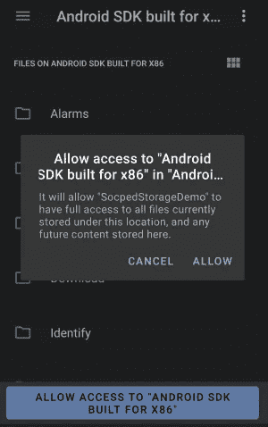
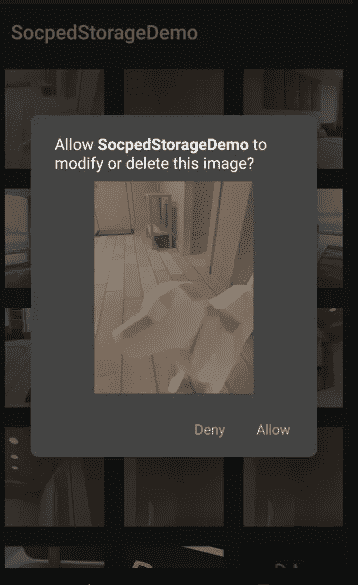

# 关于 Android 10 中的作用域存储，你只需要知道

> 原文：<https://betterprogramming.pub/all-you-need-to-know-about-scoped-storage-in-android-10-e621f40bc8b9>

## Android 设备上应用内存储的未来就在这里

[来源](https://www.solutionanalysts.com/wp-content/uploads/2020/03/04.png)

作用域存储是 Android 新推出的存储系统。但是在深入研究作用域存储之前，让我们先讨论一下什么是[共享存储](https://developer.android.com/training/data-storage/shared)以及它在 Android 中的需求。

# 当前情景

*   所有应用程序在内部存储中都有自己的私有目录，即 Android/data/your package name，对其他应用程序不可见。
*   目前大多数应用程序需要广泛的存储权限来执行简单的功能。例如，下载图像或作为图像拾取器等。在卸载应用程序时，大多数情况下，文件不会被删除。这导致存储不足。

Android 10 提出了一个解决方案:作用域存储。

# 什么是作用域存储？

*   这是一个存储文件、图像等的概念。分别称为*集合*，限制整个存储器的常规访问。
*   更好的归属:这意味着系统知道哪个应用程序创建了哪个文件。卸载 app 的时候很有用，所以和 app 相关的所有数据也都卸载了。
*   保护应用程序数据:内部应用程序目录和外部应用程序目录是私有的。
*   保护用户数据:下载的图像不能被其他应用程序使用。

# 关键特征

1.  对其个人应用存储(内部/外部)的无限制访问:无需许可。
2.  无限制访问媒体文件和下载收藏:例如，未经许可保存图像文件。
3.  只有媒体集合可以用存储权限读取。
4.  图像位置的位置元数据`ACCESS_MEDIA_LOCATION`。
5.  对于 pdf、文本等文件。使用[系统拾取器](https://developer.android.com/guide/topics/providers/document-provider)。
6.  在集合之外读写需要“系统选择器”。

# 我们如何实现它？

*   使用`[ACTION_OPEN_DOCUMENT](https://developer.android.com/reference/android/content/Intent.html#ACTION_OPEN_DOCUMENT)`选择一个文件。

CreateDocActivity.kt

*   使用`[ACTION_OPEN_DOCUMENT_TREE](https://developer.android.com/reference/android/content/Intent.html#ACTION_OPEN_DOCUMENT_TREE)`选择一个文件夹:这将在 Android 10 中请求权限，以获得对该文件夹的完全访问权限。

动作 _ 打开 _ 文档 _ 树演示

OpenFolderActivity.kt

*   使用原始文件路径的内容访问。
*   使用 [MediaStore](https://developer.android.com/reference/android/provider/MediaStore) API 保存图像文件。

## **在 MediaStore** 中使用 IS_PENDING 标志的目的

MediaStoreDemo.kt

当您插入标记为待定意向(值 1)的项目时，默认情况下，该项目将对设备上的其他应用程序隐藏。

当您使用长时间运行的下载(如从 URL 下载视频)时，可以使用此功能。下载完成后，将待定意向设置为 0，以便向设备的其他应用程序显示。

*   在上面的例子中，我们没有设置/指定存储映像的路径，所以操作系统会根据文件类型自动选择路径。这里，我们取了 image/JPEG，所以默认情况下它会将图像存储到 pictures 文件夹中。
*   也可以用`[Media.RELATIVE_PATH](https://developer.android.com/reference/android/provider/MediaStore.MediaColumns.html#RELATIVE_PATH).`选择文件路径
*   储存在主存储器中。使用`MediaStore.getExternalVolumeNames(context)`获取手机上可用的存储列表。

RelativePathDemo.kt

*   一旦得到 URI 归还的文件，我们就可以使用它。`[[ContentResolver.takePersistableUriPermission](https://developer.android.com/reference/android/content/ContentResolver#takePersistableUriPermission(android.net.Uri,%20int))]`跨重启保持许可。
*   如果您的应用程序使用作用域存储，则原始文件路径访问仅限于外部存储中应用程序特定的目录，即使您的应用程序已被授予`[READ_EXTERNAL_STORAGE](https://developer.android.com/reference/android/Manifest.permission#READ_EXTERNAL_STORAGE)` 权限。如果您的应用程序试图使用原始路径打开不在应用程序特定目录中的外部存储中的文件，则会发生`FileNotFoundException`****。**例如，应用特定目录外的文件路径为`/sdcard/DCIM/ABC.JPG`。相反，你的应用应该使用 MediaStore API 中的方法。**
*   **在 Android Q 和更高版本中，不能直接修改或删除 MediaStore 中的项目，通常必须获得明确的许可才能这样做。它的工作方式是 OS 会抛出一个`RecoverableSecurityException`，我们可以在这里捕捉到。在内部，有一个`IntentSender`,活动可以使用它来提示用户授予对该项目的权限，以便可以更新或删除该项。**

****

**作用域存储删除映像演示**

**DeleteImageFile.kt**

## **RequestLegacyAccess 标记**

**在`Manifest`文件中，我们仍然可以添加，我们希望使用比 Android 10 更低版本中的权限访问。但是只有 2%的 Android 应用程序使用它，而且它也将在 Android 的下一个版本中被弃用。**

**针对 Android 9(及更低版本)的应用，此`Manifest`标志默认值为“`true`”。**

**AndroidManifest.xml**

## **访问媒体位置权限**

**AndroidManifest.xml**

*   **就是[运行时权限](https://developer.android.com/training/data-storage/shared/media#media-location-permission)(设置中看不到)。**
*   **即使您拥有`READ_EXTERNAL_STORAGE`权限，也不能保证您将一直拥有此权限。**

**LocationAcess.kt**

*   **要获得文件的精确字节数，使用`MediaStore.setReqiuedOriginal()`，如果不成功，就会出现异常。**

# **修改和删除媒体资源**

*   **编辑或删除媒体资源时需要用户关注的问题。**
*   **即使是文件路径访问也需要同意。**
*   **在同一个对话框中批量编辑/删除(下一个 Android 版本)。**

# **须知**

1.  **不要使用静态路径。锁定文件路径访问。**
2.  **使用 [MediaStore](https://developer.android.com/training/data-storage/shared/media) (推荐)。**
3.  **MediaStore 要使用得当，比如不要把你的音乐文件放在图片目录里。**
4.  **非媒体文件应该在下载目录中(推荐)。**

# **特殊应用程序访问**

*   **只有谷歌授权的应用程序才能完全访问存储空间。**
*   **将申报表提交到 Google Play。**
*   **被谷歌列入白名单的应用。**

# **下一版本变更**

*   **对权限 UI 的更新:用户将看到基于更新的不同权限 UI，以及他们是否使用了作用域存储。即，在此之前，10 个应用将看到板对存储的访问，而在此之后，10 个媒体集合将访问存储。**
*   **为读取媒体启用文件路径和本地库。**
*   **更新媒体文件和修改 API。**
*   **保护外部应用程序目录。**
*   **强制针对 SDK。**
*   **读取不是由您的应用程序创建的文件需要`READ_EXTERNAL_STORAGE`权限。**
*   **要编辑和删除不是你的应用程序贡献的文件，你需要明确的用户关注。**
*   **`WRITE_EXTERNAL_STORAGE`将在下一个 Android 版本中被弃用，仅在使用时提供读取权限。**

## ****非媒体文件**访问**

**要通过其他应用程序访问非媒体文件，请将[系统选择器](https://developer.android.com/guide/topics/providers/document-provider)与 SAF(存储访问框架)配合使用。需要运行时权限才能完全访问该应用程序。**

# **要记住的事情**

**如果 Android 10 在您的应用范围内，请使用 MediaStore 和系统选择器进行文件和文档访问。**

**编码快乐！**

**看一下作用域存储的例子:**

** [## pg598595/SocpedStorageDemo

### 在 GitHub 上创建一个帐户，为 pg598595/SocpedStorageDemo 开发做出贡献。

github.com](https://github.com/pg598595/SocpedStorageDemo)** 

# **参考**

** [## 数据和文件存储概述| Android 开发人员

### Android 使用的文件系统类似于其他平台上基于磁盘的文件系统。该系统提供了几种…

developer.android.co](https://developer.android.com/training/data-storage)**