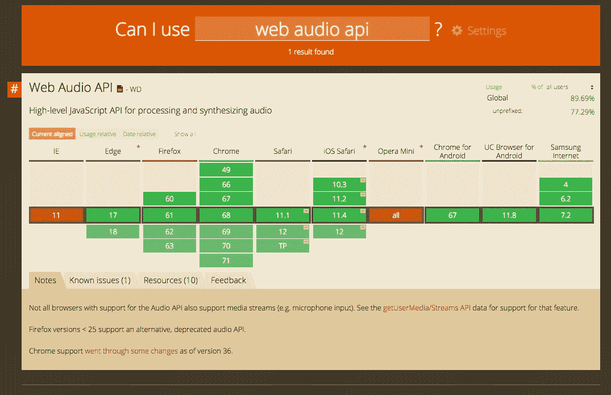
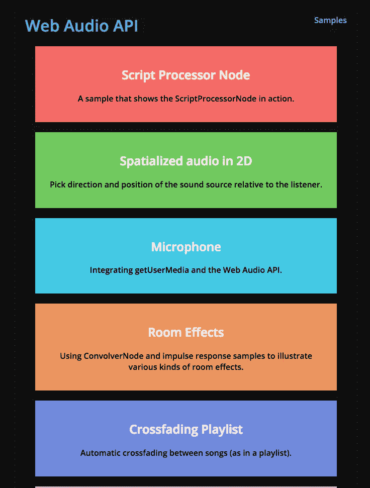
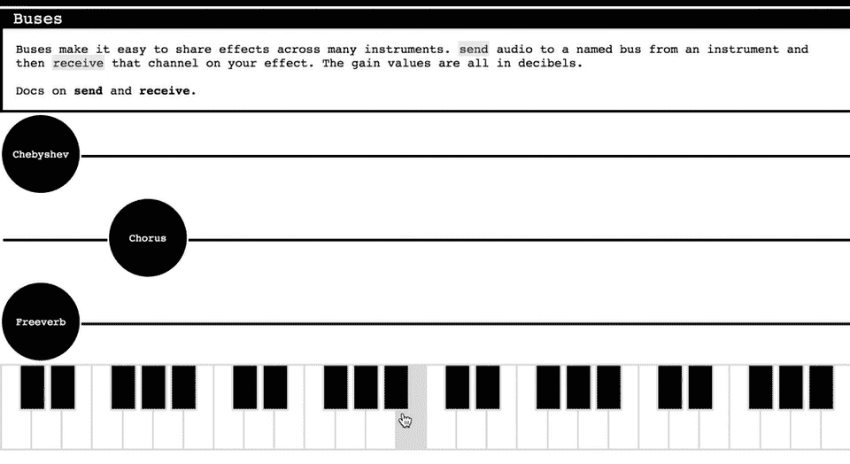
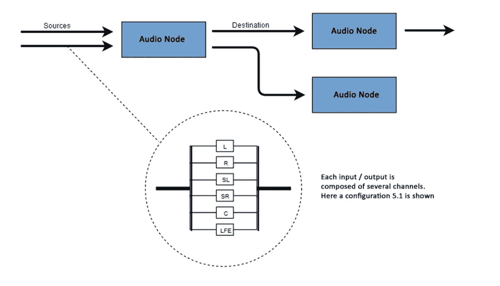
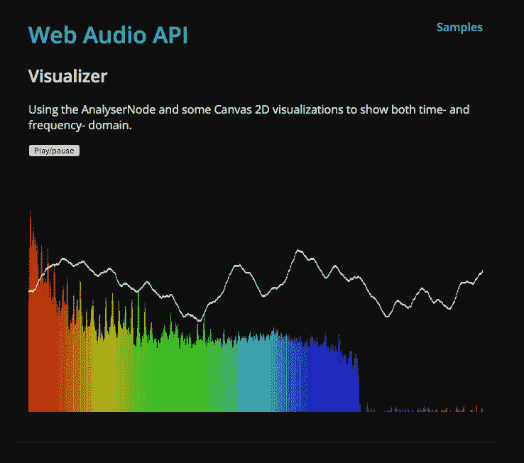
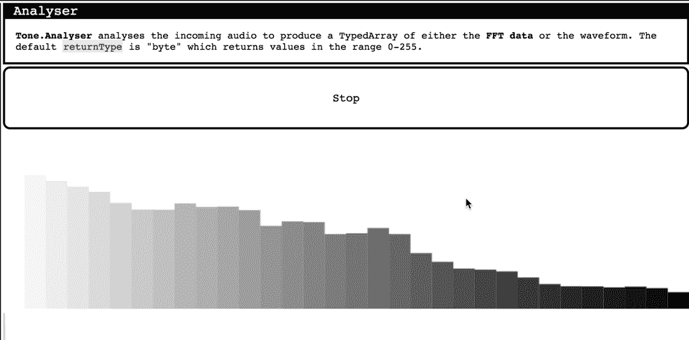
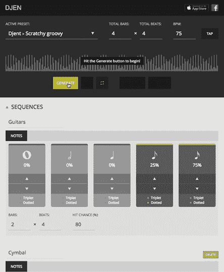
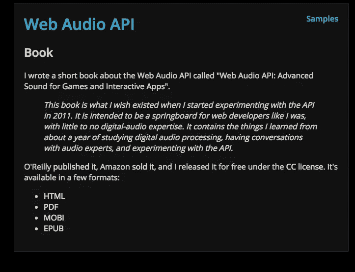
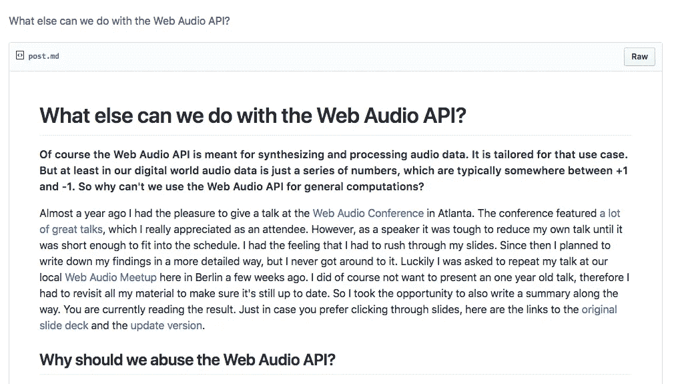

# 关于网络音频 API 你需要知道的

> 原文：<https://betterprogramming.pub/all-you-need-to-know-about-the-web-audio-api-3df170559378>

照片由 [Unsplash](https://unsplash.com?utm_source=medium&utm_medium=referral) 的[雅各布·欧文斯](https://unsplash.com/@jakobowens1?utm_source=medium&utm_medium=referral)拍摄

您知道 JavaScript 有一个不断发展的高级 API 来处理和合成音频吗？多酷啊！

audio API 的目标是复制桌面音频制作应用程序中的功能。一些最突出的特征是混合、处理、过滤等。

网络音频 API 有很大的潜力，它可以做一些很棒的事情。但是首先，API 是否得到了全面的支持？

全线绿色

酷，值得深究！

# 网络音频 API 能做什么？

好问题！这里有几个例子展示了 Web Audio API 的功能。确保你开着音响。

涵盖了大多数基本用例:【https://webaudioapi.com/samples/ 

复杂的合成器例子:[https://tonejs.github.io/examples/#buses](https://tonejs.github.io/examples/#buses)

web 音频 API 通过音频上下文处理音频操作。一切从音频上下文开始。使用音频上下文，您可以连接不同的音频节点。

音频节点通过它们的输入和输出连接在一起。通过一个节点的输入和输出链创建了一个目的地。目的地是我们用耳朵拾取的音频**频率**。

音频上下文模式

如果你是那种想知道所有微小细节的人，这里有一个[甜蜜链接](https://developer.mozilla.org/en-US/docs/Web/API/Web_Audio_API/Basic_concepts_behind_Web_Audio_API)让你开始。

如果你对视觉学习更感兴趣，这里有一个关于网络音频的很好的介绍——看看吧！

史蒂夫金内:在 JSConf US 2015 上用网络音频 API 制作乐器

Web Audio API 最有趣的特性之一是能够从音频源中提取频率、波形和其他数据。这可以用来创建可视化。

[https://webaudioapi.com/samples/visualizer/](https://webaudioapi.com/samples/visualizer/)

[https://tonejs.github.io/examples/#analysis](https://tonejs.github.io/examples/#analysis)

[https://tonejs.github.io/examples/#meter](https://tonejs.github.io/examples/#meter)

[展示 HN](https://news.ycombinator.com/item?id=12014663) :使用网络音频 API 和 React 随机生成金属即兴重复片段

[本文](https://developer.mozilla.org/en-US/docs/Web/API/Web_Audio_API/Visualizations_with_Web_Audio_API)解释了如何实现，并提供了几个基本用例。如果你热衷于深入学习音频 API，这里有一个很棒的系列。

Web 音频 API | 01:音频环境介绍

这里有一本[免费的关于网络音频 API 的书](https://webaudioapi.com/book/Web_Audio_API_Boris_Smus.pdf)，作者是 [Boris Smus](https://twitter.com/borismus) ，他是谷歌的一名交互工程师。

[https://webaudioapi.com/book/Web_Audio_API_Boris_Smus.pdf](https://webaudioapi.com/book/Web_Audio_API_Boris_Smus.pdf)

# API 一瞥

网络音频 API 理解起来相对直观。这里有一个如何使用 API 的抽象例子。

[https://gist . github . com/wesharehoudies/608 e5b 99 fa 2 f 46 a5ed 3710 C5 FFE 6 e 360](https://gist.github.com/wesharehoodies/608e5b99fa2f46a5ed3710c5ffe6e360)

步骤分解:

*   我们通过用关键字`new`调用它来创建一个新的`AudioContext`对象。
*   我们将振荡器和音量控制器绑定到音频环境。
*   我们将振荡器和音量控制器连接到音响系统。
*   设置我们的频率类型和值(调谐)
*   启动我们的振荡器——`[OscillatorNode](https://developer.mozilla.org/en-US/docs/Web/API/OscillatorNode)`接口的`**start**`方法指定了开始播放音调的准确时间。

 [## 使用网络音频 API

### 网络音频 API 提供了一个简单而强大的机制来实现和操作网络中的音频内容…

developer.mozilla.org](https://developer.mozilla.org/en-US/docs/Web/API/Web_Audio_API/Using_Web_Audio_API) 

# 潜力大，成长空间大

当然，和所有伟大的事情一样，总有成长和提高的空间。这里有一些来自比我聪明得多的人的健康反馈。

 [## 不知道 Web 音频 API 是为谁设计的|黑客新闻

### 此外，由于每次都要重新解码，而且这是异步的，所以我现在引入了一个奇怪的错误…

news.ycombinator.com](https://news.ycombinator.com/item?id=15240762)  [## 不知道网络音频 API 是为谁设计的

### 总的来说，WebGL 是一个相当不错的 API。这不是一个伟大的 API，但那只是因为 OpenGL 也不是…

blog.mecheye.net](http://blog.mecheye.net/2017/09/i-dont-know-who-the-web-audio-api-is-designed-for/) 

# 用浏览器制作音乐

[杰克·阿尔博](https://twitter.com/jake_albaugh?lang=en),[tone . js](http://tonejs.github.io)的创作者，展示如何用浏览器创作音乐

# 包裹

如果你不确定这种 API 的使用案例，想想所有的音乐创作软件都是桌面版的。将这些桌面应用转换成网络应用将是一个非常可行的商业想法。

为什么 web 在这种情况下更好？首先，您可以保存并关闭您的工作区，然后从另一个工作区继续。音乐家经常旅行，所以这种方法会让艺术家受益匪浅。

另一个例子是用声音增强我们的用户体验。(注意不要过度这样做！)

它将为使用屏幕阅读器的视障人士提供新的解决方案和更好的体验，从而提高网站的可访问性。

[我们还能用网络音频 API 做些什么？克里斯托夫·古坦丁](https://gist.github.com/chrisguttandin/e49764f9c29376780f2eb1f7d22b54e4)

如果你有兴趣了解最新动态，那么[网络音频会议](https://webaudioconf.com/)是一个非常值得参加的活动。

[https://webaudioconf.com/](https://webaudioconf.com/)

 [## aleman GUI/网络音频资源

### web-audio-resources-:musical _ keyboard:一个精选的 web 音频资源列表

github.com](https://github.com/alemangui/web-audio-resources) 

感谢阅读，保持敬畏！

 [## 增强 Node.js 的调试体验

### 你看到这个，你会怎么做？

medium.com](https://medium.com/@wesharehoodies/supercharge-your-debugging-experience-for-node-js-3f0ddfaffbb2)