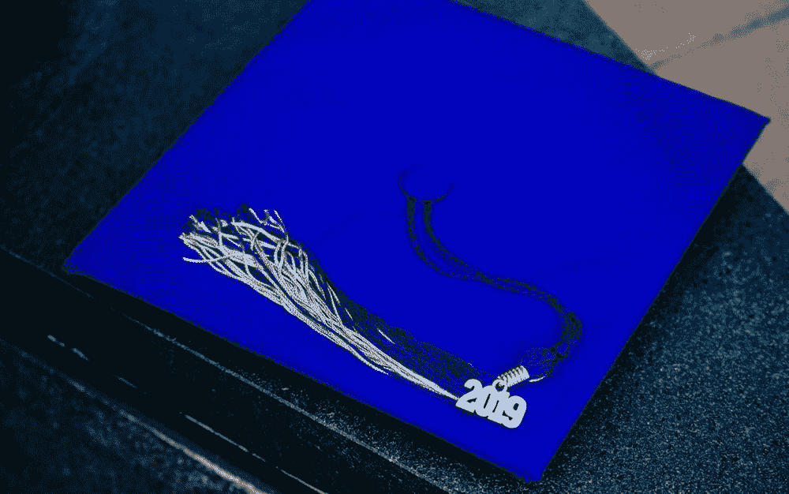

# 我够好吗？

> 原文：<https://betterprogramming.pub/am-i-good-enough-bf911f04c8fa>

## 回顾我作为一名软件开发人员的历程

图片来自:[https://unsplash.com/photos/9b5dvrjb05g](https://unsplash.com/photos/9b5dvrjb05g)

这是人们经常问自己的一个普遍问题，不管他们是孩子、青少年还是成年人。或者他们是学生还是老师。

不管你从事什么职业，你都会经常问自己这个问题。

我不认为我们问自己这个问题是件坏事。

人们努力提升自己，因为他们知道自己还有提升的空间。问自己这个问题不仅让我们谦卑，也有助于更好地了解我们自己。它帮助我们寻找可以改进的地方。

然而，与此同时，不断地问自己这可能有点自谦。

对于成为一名开发人员来说，这是非常普遍的。

图片来自:【https://unsplash.com/photos/IV90P2k-2-0 

我先总结一下我的情况:

我上了一所相当有名的 SUNY，决定学习两个专业:一个是为了追求梦想，另一个是作为后备，因为它也让我有些兴趣。

我为梦想选择的专业，结果和我的预期相差很大，我最终把它降到了辅修。我的后备专业也不太对劲，但是因为我已经学了一半，而且没有辅修，所以我决定完成这个学位。我选择了另一个我认为比我放弃的专业更适合我的梦想的专业。

不同于从学前班到高中相对直截了当、一帆风顺的旅程，大学相当坎坷。与其说是为了追求最终的职业生涯而学习，倒不如说是我在走过场。我上课，通过，然后回家。我参加了学校的活动(嗯，有些……我过去很内向，现在仍然很内向)，并加入了一个执行委员会。我甚至找到了一份兼职工作。

但是，总的来说，我觉得我在生活中缺少了一些东西。目标感和成就感。

不要误解我的意思，我在大学期间选择的专业很有趣(除了那些不太有趣的核心课程)。我喜欢这些任务，也从他们那里得到了一些好的反馈。

我甚至能够从我的备份专业和辅修专业中发展一些技能。我遇到了不同的人(对于一个发现社交有时有些困难的内向者来说，这是一个壮举)，并听到了他们所有不同的梦想。

但是，就我个人而言，我感到很失落。

我毕业的时候感觉还是一样。

【https://unsplash.com/photos/u4K_JOZmhCM 

随即，我开始找工作。我对自己能提供什么技能没有信心。它们似乎永远都不够相关。当然，我面临着一次又一次的拒绝。最终，我得到了一份无薪实习工作，但这与我在大学里学到的东西并不相关。但是我决定我可以利用这段经历，无论如何我都接受了。

当然，这意味着更多的学习，这样我才能胜任这份工作，但我并不太介意。重新有了目标，学习了一些新的东西，这令人耳目一新。但是当我开始训练时，我又一次感觉到，“这不适合我。”

[https://unsplash.com/photos/gzhyKEo_cbU](https://unsplash.com/photos/gzhyKEo_cbU)

不知何故，我找到了编码的方法。刚开始有点害怕，也有点犹豫。

我以前在大学的时候见过一些主修计算机科学的同学，但是，老实说，这对我来说太陌生了，我都懒得再看一眼。

【https://unsplash.com/photos/2JDDn7iSGH8 号

然而这一次，我克服了恐惧，最终开始一点一点地吸收新材料。有许多实验室问题，我不得不非常努力地找出每个问题的解决方案。

我感受到一种从未有过的成就感，这让我有动力继续下去。我想了解更多。

最终，我到了面试进入训练营的时候了，我正在学习训练营的预备课程。第一个是关于我的目标和计划的简短讨论(尽管它们很随意，但我总是很紧张)。第二个是技术考试，用的是我目前为止从预备课程中学到的东西。很明显，我对这个特别紧张。我想在这个过程中，我的大脑可能已经空白了一段时间。

最终，我没能完成这个技术挑战，觉得自己失败了。就在我以为我可能最终找到了可以全身心地投入的东西时，我似乎也命中注定无法如愿。

即使在考试结束后，这个挑战仍然困扰着我。我绞尽脑汁想解决，甚至四处打听。不到一小时，我就找到了解决办法。就在那时，我意识到这是多么明显，我在测试中不知何故限制了我的思维过程。之后我马上把我的解决方案分享给了考官。

几天后，我发现我真的通过了！我很震惊。很明显，我没有完成挑战(甚至连开始部分都没通过)。

但是我通过了！

【https://unsplash.com/photos/_6HzPU9Hyfg 

我激动不已，立即开始了前期工作的轨道。事实证明，我将会学习一种新的编码语言，而不是我从 prep track 中学到的那种。但这并没有阻止我。我学得比他们教的第一语言还要快。

我第一次开始真正享受学习的过程。嗯，阅读仍然是一种痛苦，但通过将我在实验室学到的东西付诸实践并解决它们，我获得了一种从未有过的成就感。

当我终于开始训练营的时候，我觉得我终于成功了。

当然，这只是开始。

随着我开始了解更多，我开始觉得这太多了。

我仍然真的很喜欢学习这一切，但感觉他们这么快就教了这么多(我猜这就是 15 周训练营的意思)。我不确定我能按时到达。然后我想到了世界上所有其他比我经验丰富得多的开发人员，开始感到有点不知所措。

[https://unsplash.com/photos/BXOXnQ26B7o](https://unsplash.com/photos/BXOXnQ26B7o)

时间…

感觉这就是我所缺少的一切。我开始反思我大学期间的选择，感到非常后悔。如果我当时决定学习编码，我会有充足的时间来学习一切。

但过去是无法改变的。我不得不继续向前推进。

训练营分为三个为期三周的模块，要通过每一个模块，你必须要么通过代码挑战，要么对该模块的项目给出一个好的解释。

不知何故，我设法通过了所有的代码挑战。

我肯定不会说这很容易，但随着我在每个模块中的进展，这肯定会变得容易得多。

在开始的时候，我觉得我快要淹死了，当我向前移动的时候，我开始觉得我可以开始游泳了(嗯，更像狗刨，但至少我可以把头露出水面)。

每一次，我都学到新的东西，每一次，我都怀疑自己是否足够优秀。

> 我学得对吗？
> 
> 这周学了这么多，我会忘记上周学的东西吗？
> 
> 当我毕业时，我能和其他更有经验的开发人员竞争吗？

许多问题不断涌入我的脑海。

他们说，“千里之行始于足下。”

我现在正走在这条路上，并且一步一步地前进。

但在内心深处，我总是担心自己是否会随时崩溃。

最终的目的地还很遥远。

https://unsplash.com/photos/Kuu5mmxkwW4

目前，我正在进行毕业前的最后一个项目。只剩下两周了。当然，我担心我的项目是否足够大，足够好，对潜在的未来雇主来说是否足够像样。

我担心我是否学得太浅了。

> 我是否充分利用了这段时间？
> 
> 我可以…我应该做得更好吗？

当然，我仍然像开始训练营之前一样紧张和焦虑。

但还是有区别的。

[https://unsplash.com/photos/z_DGQ9sKEFY](https://unsplash.com/photos/z_DGQ9sKEFY)

我不再一无所知。

我可以自信地说，我知道如何用 Ruby 和 JavaScript 编码。(谢谢谷歌！)

我可以自信地说，我已经学到了足够的东西，我可以更容易地独自继续学习。

最大的变化是:我不再感到失落。

我觉得自己好像找到了一个社区——在这个社区里，人们和我一样，有时也会感到失落，担心自己是否足够优秀。

虽然我总是怀疑自己是否足够优秀，但我知道只要我坚持不懈，我就能完成很多事情。

紧迫感仍然存在，但我相信我现在可以期待迎接新的机会。

然而，在我的内心深处，仍然存在着一个永恒的问题:

> 我够好吗？

这是一个我会一直问自己的问题。