# 惊人的开发工具，你可能没有使用

> 原文：<https://betterprogramming.pub/amazing-developer-tools-that-you-might-not-be-using-1ec7f57d17d5>

## 帮助您更聪明地工作而不是更努力地工作的工具

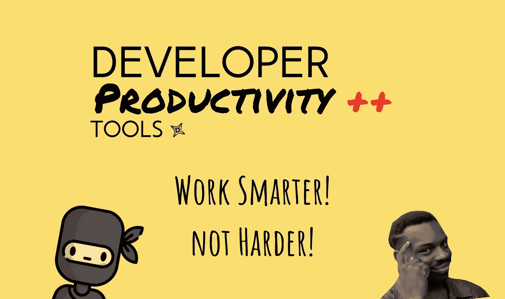

图片来源:作者

这里有一些开发人员喜欢的工具。它们并不针对任何特定的开发人员，所以我相信其中一些会对您有所帮助。

*有时，我们都扮演着设计师、前端开发人员和后端开发人员的角色，这些工具将有助于提高每个角色的工作效率。或者，您可能与团队中扮演这些角色的不同人员一起工作，在这种情况下，您可以与他们分享这些角色，从而提高整个团队的工作效率！*

我们开始吧！

# 1.Cloudcraft

[*Cloudcraft*](https://bit.ly/2WuwIha) *是面向后端开发者的。*

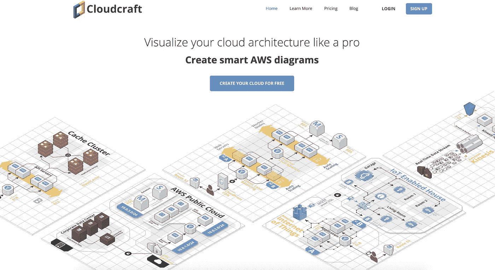

所有后端开发人员似乎都在计划他们的后端——尤其是当它是 AWS 并且有这么多不同的服务在起作用的时候。但是，他们可以使用云工艺，而不是在单调乏味的绘图工具上完成它们。

Cloud Craft 为您集成各种 AWS 服务提供了一个真正直观的点击-拖放界面。这不仅有利于计划，也有利于预算。

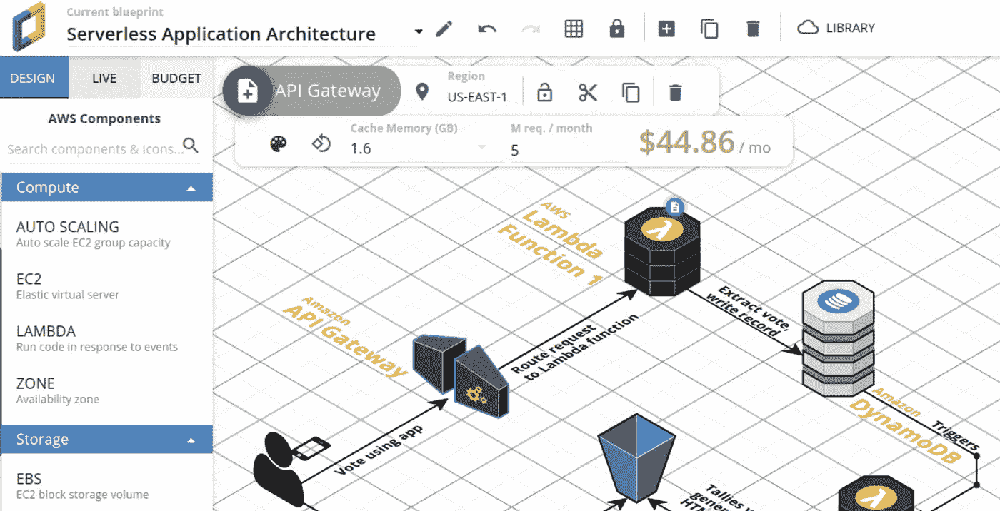

对于开发人员来说，浏览每个服务的定价页面并了解它们的定价可能是一件非常痛苦的事情——即使只是找到一个大概的成本也是一件非常困难的事情。Cloudcraft 为您提供了整个架构的估计分解，为您节省了大量时间。

遗憾的是，目前它只适用于 AWS，但 GCP 和 Azure 的价格非常相似，所以你仍然可以通过 Cloudcraft 获得大致的预算。

# 2.捆绑恐惧症

[*bundle phobia*](https://bit.ly/2ZEuvSa)*是针对前端开发者的。*

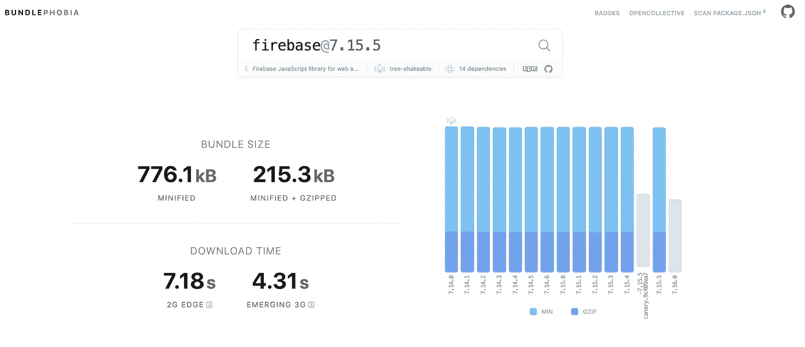

BundlePhobia 帮助您“找到将 npm 包添加到您的捆绑包的成本”。这意味着您可以了解添加一个 npm 包会对您的包大小增加多少。当我们在前端框架上工作时，我们总是试图保持我们的包大小最小，以便为我们的用户优化初始页面加载。

您甚至可以上传 package.json 文件来分析您正在使用的包。这是所有专业开发人员必须使用的。

# 3.菲格玛

[*Figma*](https://bit.ly/2ZEcvaH) *是给设计师看的。*

Figma 是一个伟大的工具，让设计师为你的应用创建模型和设计。如果你已经在使用 Adobe Illustrator，只有当 Figma 为你提供十倍的价值时，它才有意义。的确如此。

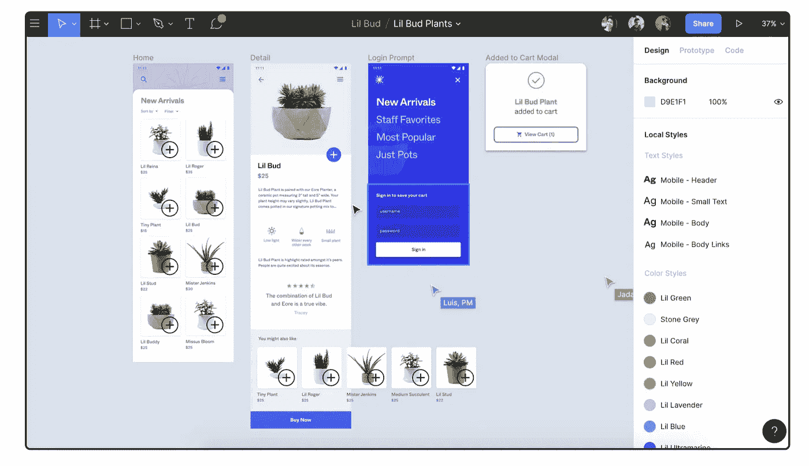

*   Figma 为您提供跨平台的应用程序，使您可以从任何地方访问您的设计，并且您不必在功能强大的计算机上访问它。你不需要安装任何东西来开始使用它。
*   它使用网络组装，提供了很好的性能和效率，使您比在 Illustrator 上更有效率。
*   这是一个经过深思熟虑和精心设计的应用程序，它甚至可以免费满足你的大部分设计需求。
*   你可以为 web、Android 和 iOS 创建原型，它甚至为你提供一些默认行为，同样，所有这些都来自一个 Web 应用程序。

当你开始使用 Figma 时，你马上就会知道，这些家伙值得的不仅仅是你的 0 美元/月！

# 4.失眠

**失眠是针对后端开发者的。**

*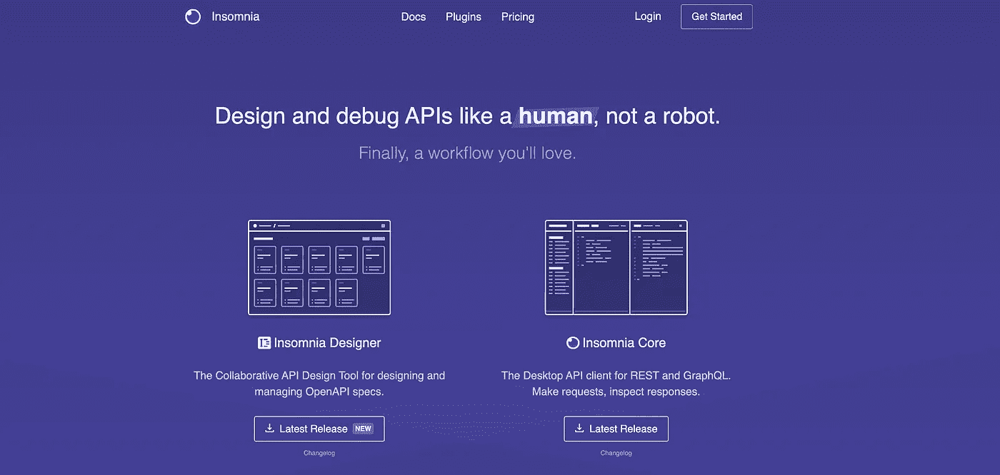*

*失眠症是后端开发人员喜欢使用的一种工具，可以更好地协作创建和管理他们的 API 文档。*

*无论你是在构建一个 REST 还是一个 GraphQL API，失眠都已经覆盖了你。它会让你的整个工作流程，甚至作为一个团队，有条不紊。*

*它有一个布局良好的 UI，可以用来创建端点结构，而不必编写冗长的 HTTP 请求。*

*它还为您正在使用的任何 API 提供了一个出色的智能感知编辑器，帮助您更快地编写查询。如果你用的是 GraphQL API，有了失眠，你的生活会变得好十倍！*

# *5.FontFlipper*

*[*Fontflipper*](https://bit.ly/2WxMAzv) *是给设计师用的。**

*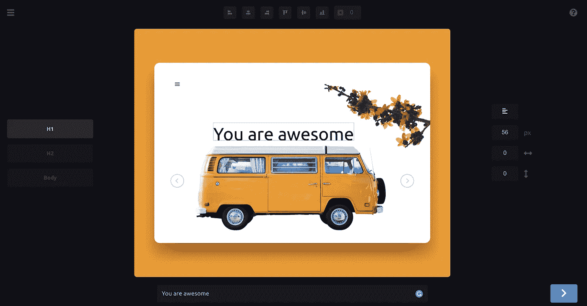*

*这是一个很好的工具，可以帮助你在应用程序的屏幕上尝试不同的字体。它有成千上万的字体，你可以尝试模拟你的应用程序的外观，然后下载，都是免费的。*

*它还提供了一个简单、漂亮、不会让人分心的 UI。*

# *6.VisBug Chrome 扩展*

*用于前端开发的 VisBug Chrome 扩展。 [*链接*](https://bit.ly/3fEgklR) *。**

*有很多网站建设者为您提供拖放功能。chrome 的这一扩展使得定制前端开发离这一目标更近了一步。*

*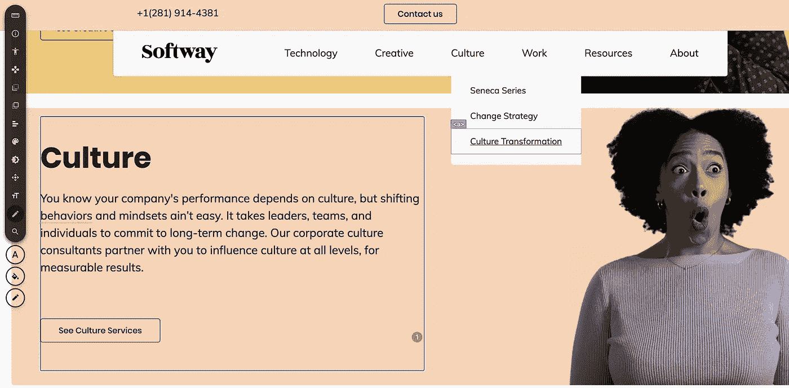*

*您可以访问 web 应用程序中的每一个 DOM 元素。*

*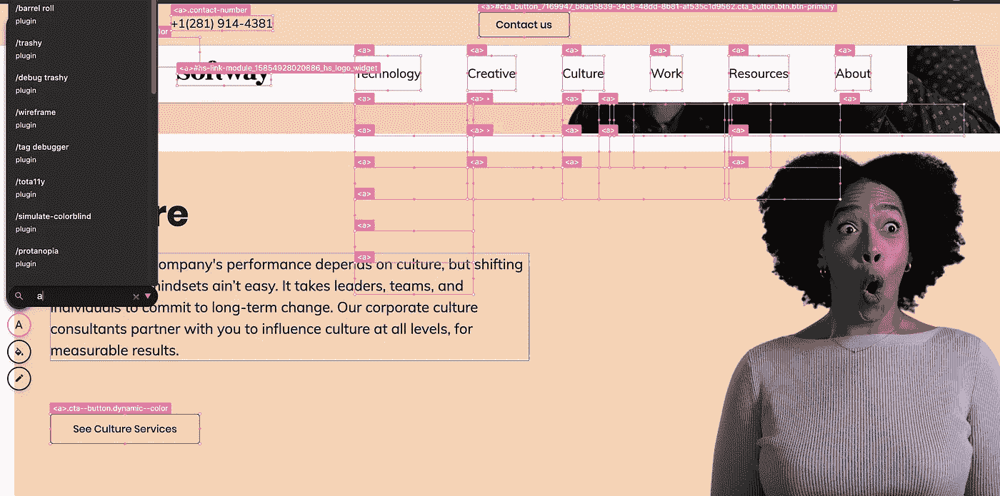*

*你可以测量元素，移动东西，改变他们的风格，甚至从其他网站学习他们是如何实现他们的外观的。*

*你可以在你的浏览器中完成所有这些，而不需要编写任何 CSS 代码。这非常强大，可以让你更快地设计出你想要的 UI。这将节省你大量的时间来实现你的 HTML CSS 代码的设计，甚至当事情不像你期望的那样进行调试和检查。*

*这个插件有一点学习曲线，但是把它看作是对更有生产力的未来的投资！*

# *7.撕开*

*[*Rive*](https://rive.app/) *是面向设计师和开发者的。**

*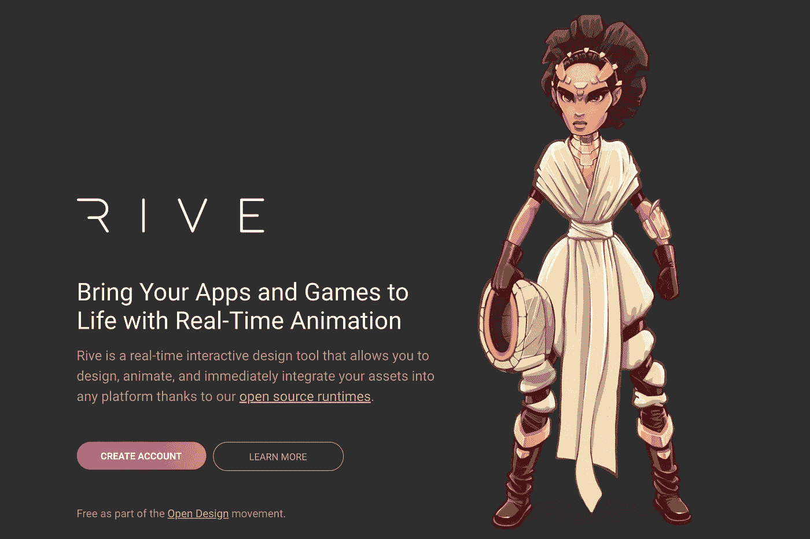*

*正如 Figma 帮助你创建美丽的设计一样，Flare 将帮助你创建令人惊叹的动画——就像你有时在运球/Muzli 设计中看到的那些你不知道如何从头开始编码的动画。*

*RIVE 帮助您创建强大的交互式动画，然后您可以轻松地将其集成到您的原生应用程序代码中。*

*这是开放设计运动的一部分，所以你可以访问、查看、学习和使用其他设计师创作的所有动画。*

*此外，它与 Flutter 集成得非常好，极大地改善了 Flutter 开发人员的体验。*

# *8.弥洛松*

*[*米罗*](https://bit.ly/3h8aw4f) *是代表队伍。**

*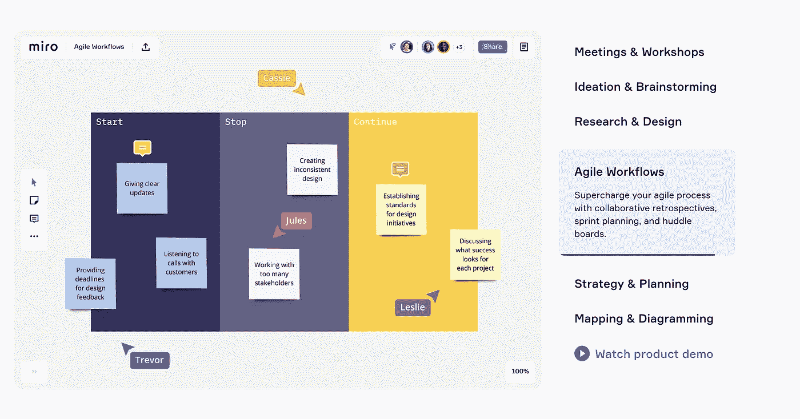*

*Miro 无疑是团队工作和协作的最有用的工具，甚至是远程的。*

*它为你的所有团队成员提供了一个广阔的开放空间，让他们加入进来，并放下他们的想法和想法。你可以讨论和头脑风暴任何事情，感觉就像你们一起在会议室的白板上做一样。*

*它还提供了广泛的工具来改善体验。对于项目管理和文档，您不需要任何其他工具。它甚至提供远程通话。它如此强大，以至于在与团队合作时，您不必切换标签。*

*它提供了一个慷慨的免费首发计划，对于大多数球队来说已经足够了。我鼓励我的团队使用 MIRO 并与之合作，几乎每个人都喜欢它。*

**这就对了！我希望这些工具对您有所帮助，帮助您提高工作效率，让开发人员的生活更加轻松！**

**此外，请分享任何让你的生活变得更简单的工具，你也希望其他人使用这些工具。**

**感谢阅读！**