# 令人惊叹的 Linux 外壳复古游戏

> 原文：<https://betterprogramming.pub/amazing-retro-games-for-linux-shell-f678690972c9>

## 如果你喜欢 80 后，你会喜欢这个列表

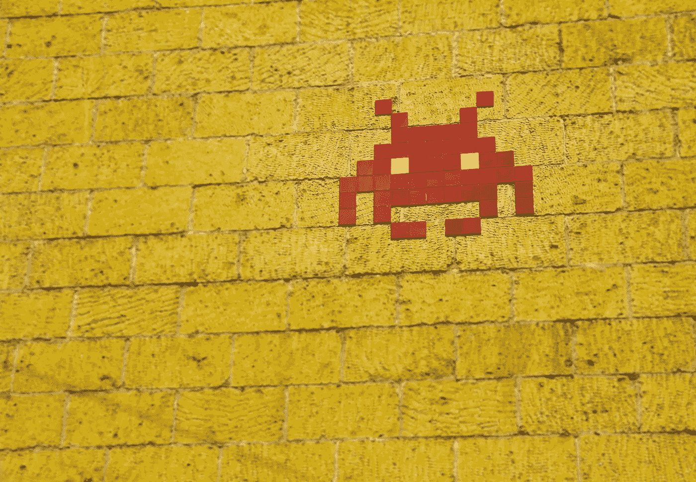

本文列出了一些在 Linux 命令行上运行的游戏。如果你生活在 80 年代，或者想知道早期游戏的样子，我鼓励你去看看。

现在的游戏都是以图形为主，但是在 80 年代都是简单的，色彩很少。但是，对我来说，他们有着我从未感受过的魔力。

我希望你喜欢它们，如果你没有生活在那个时代，你会有和我第一次玩它们时一样的感觉，如果你已经玩过它们，你可以重温那些时刻。

开始吧！

# Ascii 巡逻

Ascii 巡逻队是一个 ASCII 游戏。它的灵感主要来自于 1982 年由 Irem 开发并发布的街机游戏“月亮巡逻”。这个游戏很简单，但是很容易上瘾。

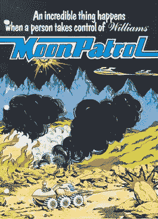

要安装并播放它，请在命令行中运行以下命令:

```
$ sudo apt update
$ sudo apt install snapd
$ sudo snap install ascii-patrol
$ ascii-patrol
```

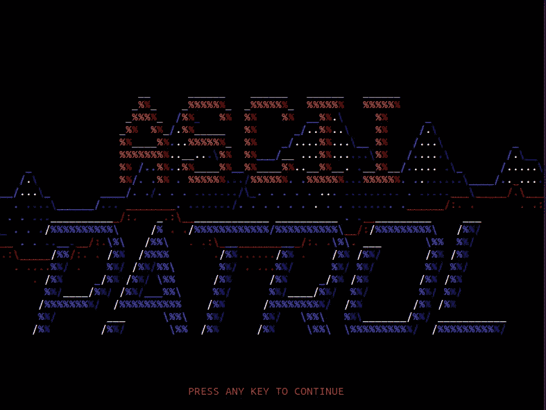

Ascii 巡逻截图

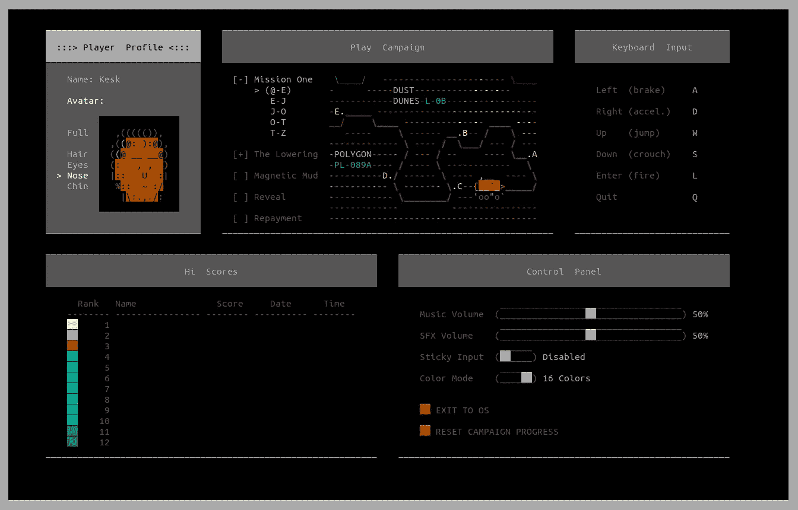

屏幕上显示程序运行的图片

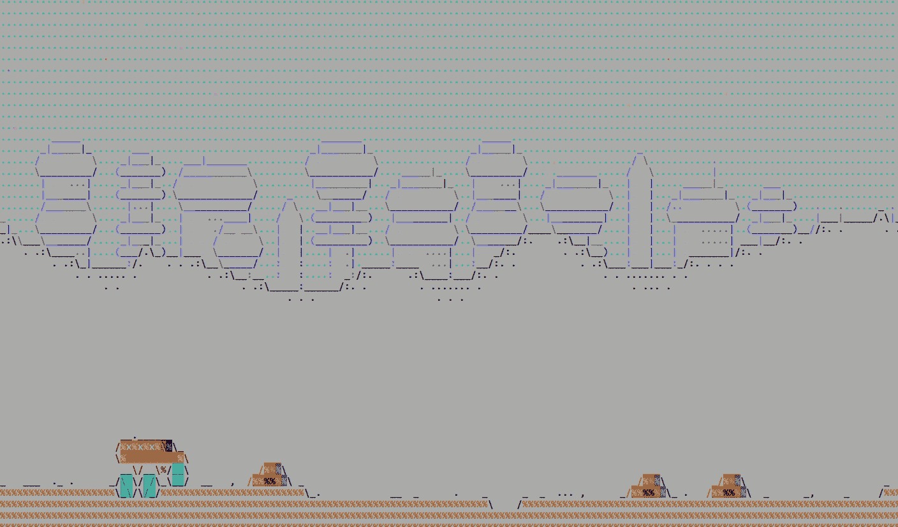

屏幕上显示程序运行的图片

网址:【http://ascii-patrol.com/ 

# nInvaders

nInvaders 是 80 年代游戏的一个明显例子。这是我最喜欢的游戏之一，它是基于 ASCII 的。游戏机制很简单:在入侵者接近你之前杀死他们。看似很简单，但却是一个很有挑战性的游戏。

要安装并播放它，请在命令行中运行以下命令:

```
$ sudo apt install ninvaders
$ ninvaders
```

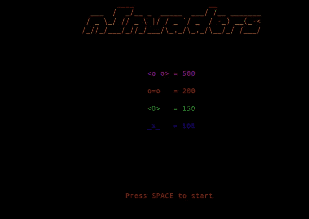

nInvaders 截图

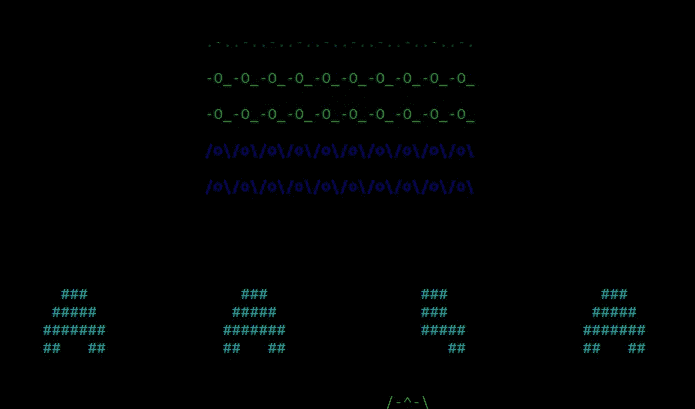

nInvaders 截图

# 月球车

月球车是 Jochen Voss 基于 Ascii 的另一款经典游戏。这个游戏也是根据《月球巡逻》(1982)改编的。

这个版本没有上一个版本那么雄心勃勃，但也非常有趣。

要安装并播放它，请在命令行中运行以下命令:

```
$ sudo snap install moon-buggy
$ moon-buggy
```

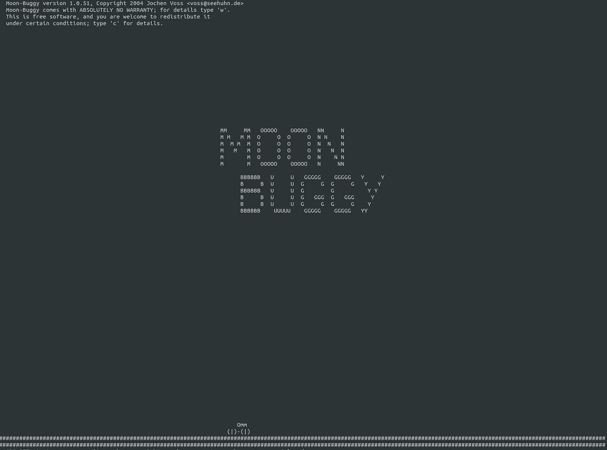

月球车截图

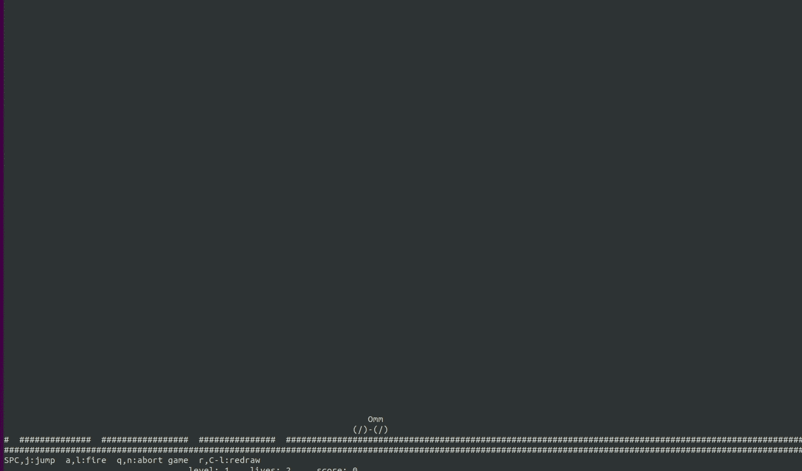

月球车截图

# 金字塔建造者

金字塔建造者是一个 ASCII 游戏的梦幻游戏。在里面，你必须通过帮助建造金字塔来提高你的文明程度。

你必须指挥工人耕种，卸货，移动巨大的石头来建造最好的金字塔。

下面的 URL 中有安装说明。在这种情况下，您必须下载一个 ZIP 文件。

网址:【https://standardcombo.itch.io/pyramid-builder 

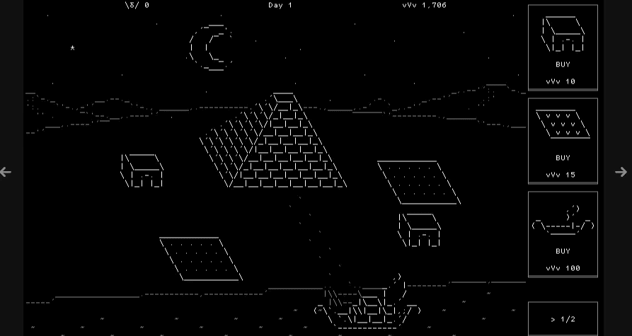

金字塔建造者截图

# 网络黑客

NetHack 是一款经典的单人 RPG-地牢探索游戏。它具有美丽和多样的图形和文本界面。

在这个 URL 中有安装说明。你必须下载压缩文件，解压并运行它。

[](https://www.nethack.org/) [## NetHack 3.6.6: NetHack 主页

### 恭喜冒险家！你的任务结束了，因为你已经到达了黑客之家。在里面，巫师…

www.nethack.org](https://www.nethack.org/) 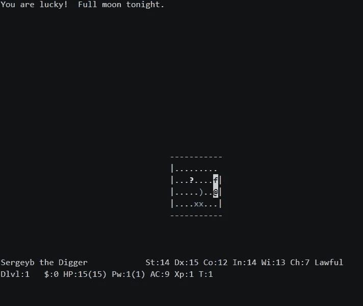

NetHack 截图

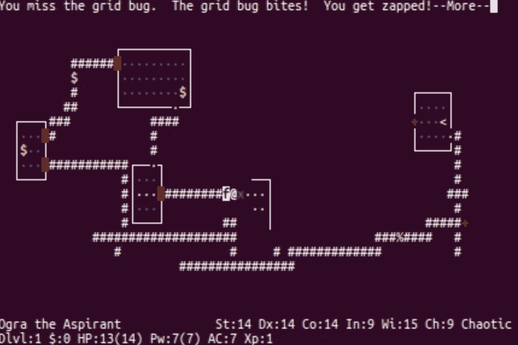

NetHack 截图

# 秘密冒险——dunnet

最“复古”的复古 8 位游戏是基于文本的冒险，Dunnet 就是一个很好的例子。这款游戏是罗恩·施内尔(Ron Schnell)写的一款赛博朋克文字冒险，基于他在 1982 年写的一款游戏。

游戏开始时，玩家站在一条土路的尽头。然而，当玩家意识到他们正在 Unix 系统中走动，并在阿帕网周围传送自己时，这变得超现实。

这个冒险游戏在 Emacs 文本编辑器中运行，所以你必须预先安装它。

要从命令行播放它，您必须执行以下命令:

```
$ sudo snap install emacs --classic
$ emacs -batch -l dunnet
```

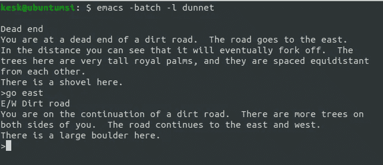

dunnet 截图

# ASCII 跳转

在这个简单的游戏中，你必须用箭头键向左或向右移动来控制滑雪者的速度。然后，在合适的时候按回车键跳转。最后，你可以在跳跃结束时看到你的分数。

要安装并播放它，请在命令行中运行以下命令:

```
$ sudo apt-get install asciijump
$ asciijump
```

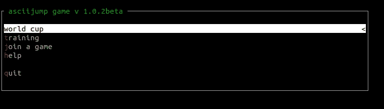

ASCII 跳转截图

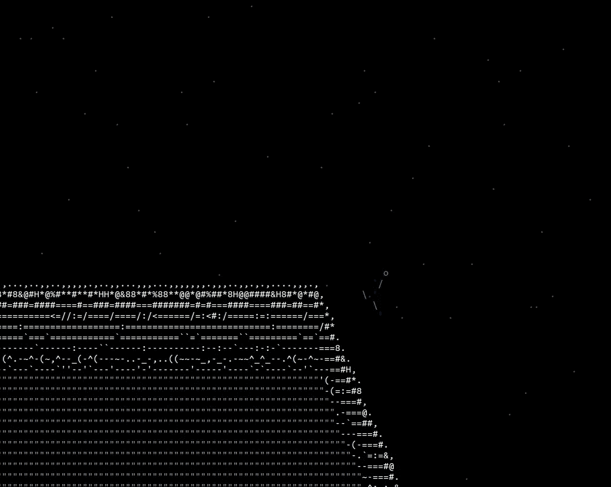

ASCII 跳转截图

# Ascii 扇区

Ascii 部门是一个空间探索游戏，你可以在你的终端上玩。是的，在你的终端上。这个游戏包含了一个好的太空探索游戏的成分，像贸易，与其他船只战斗，升级你的船，执行任务。事实是，演奏它给了我美妙的感觉。

简直美不胜收。


Ascii 扇区截图

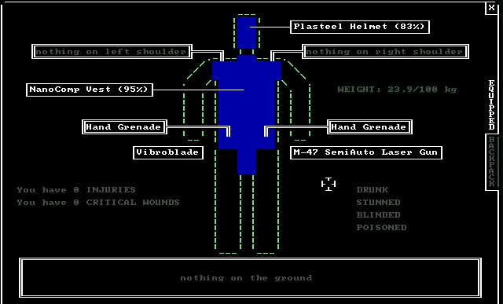

Ascii 扇区截图

您可以从以下网址下载:

[http://laserbrainstudios.com/ascii-sector/](http://laserbrainstudios.com/ascii-sector/)

# 巴斯泰托女神

巴斯泰托女神是 Linux 命令行的俄罗斯方块克隆版。简单又容易上瘾。

要安装它，请在命令行中运行以下命令:

```
$ sudo apt install bastet
```

要玩这个游戏，在终端中运行以下命令:

```
$ bastet
```

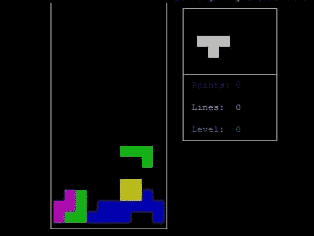

巴斯泰托女神截图

# 投弹手

在这个游戏中，你将驾驶一架“直升机”,它将在每个循环中降低高度。你的目标是避免撞上摩天大楼，为了做到这一点，你将不得不去投掷炸弹。

破坏东西的时候注意游戏消息:p。

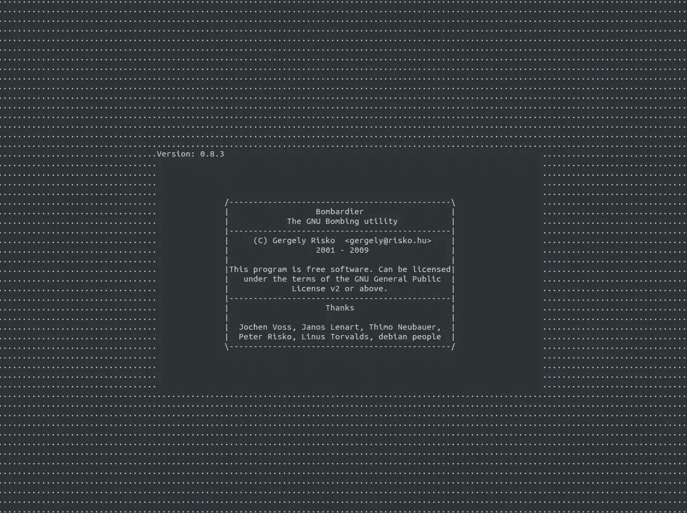

庞巴迪截图

Bombardier 可在官方存储库中获得，因此在终端中键入以下命令来安装和播放它:

```
$ sudo apt install bombardier  
$ bombardier
```

要开始播放和拍摄，请按空格键:

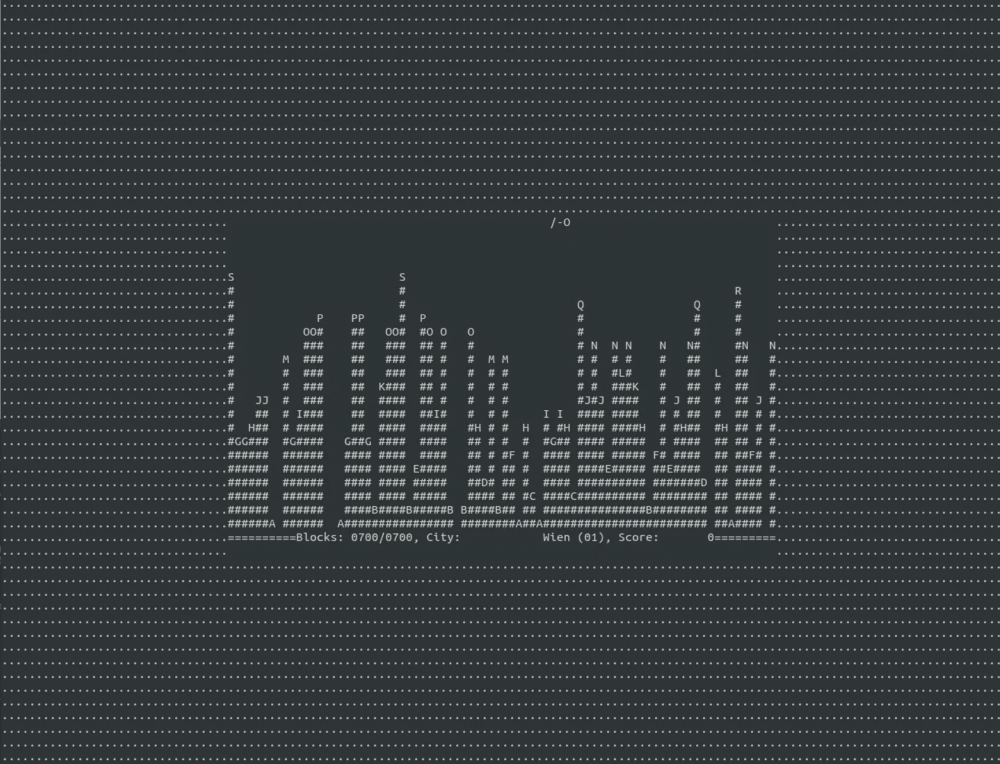

庞巴迪截图

## 还有一个多人游戏:

# SSHTron

SSHTron 是一款基于 Tron 电影的令人惊叹的多人游戏。然而，这个游戏的一个缺点是很难找到人来玩。

它与你记得的几年前手机上的另一款经典游戏“贪吃蛇”非常相似，但它要复杂得多，因为还有其他玩家，很容易越过他们的界限。

要移动，你必须使用 WASD 键。不要使用箭头键。

要播放，请在命令行中执行以下命令:

```
ssh sshtron.zachlatta.com
```

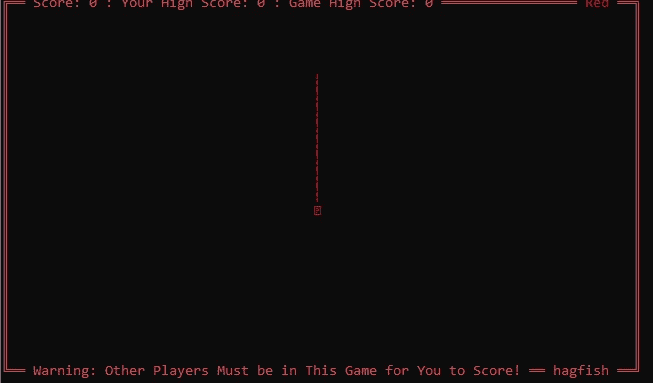

SSHTron 截图

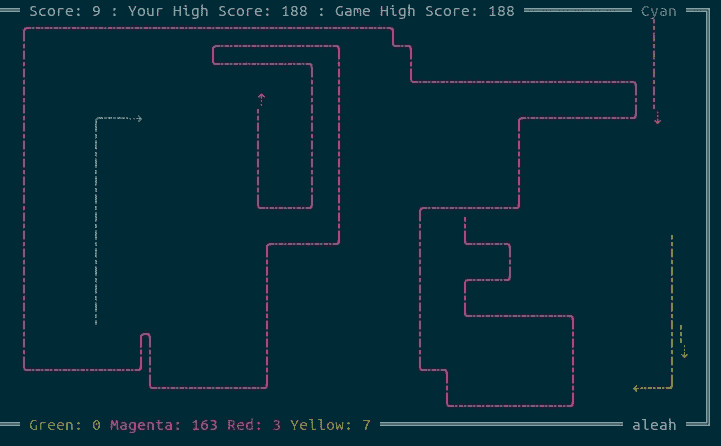

SSHTron 截图

在下面的 URL 中，您有关于它的所有信息:

[](http://sshtron.zachlatta.com/) [## SSHTron

### 你的终端中的多人游戏。只需运行下面的命令，您就可以在几秒钟内开始游戏。$嘘…

sshtron.zachlatta.com](http://sshtron.zachlatta.com/) 

谢谢大家！