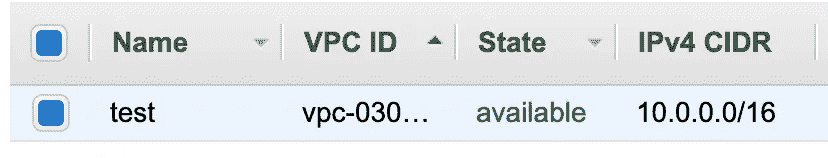
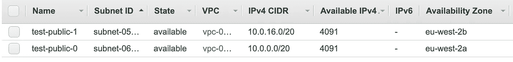
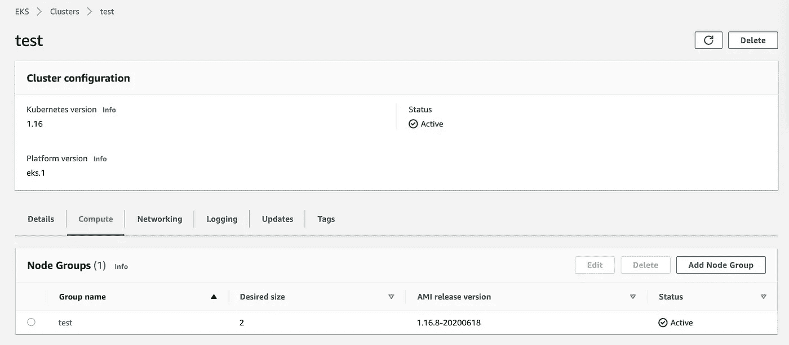
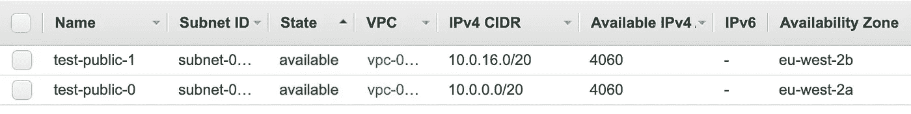
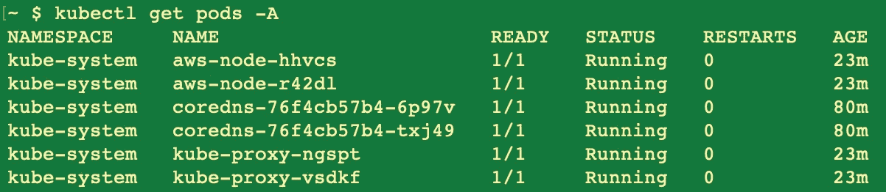
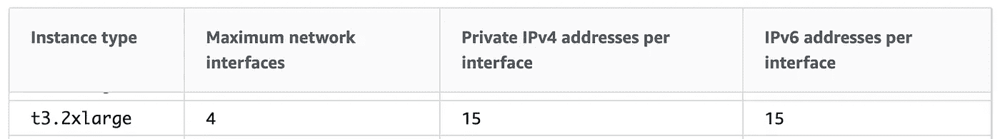
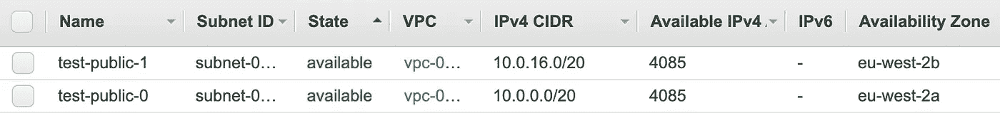

# 亚马逊 EKS 在吃我的知识产权！

> 原文：<https://betterprogramming.pub/amazon-eks-is-eating-my-ips-e18ea057e045>

## 了解 AWS EKS 如何管理 IP 地址，以及您可以为此做些什么


[晨酿](https://unsplash.com/@morningbrew?utm_source=medium&utm_medium=referral)在 [Unsplash](https://unsplash.com?utm_source=medium&utm_medium=referral) 拍摄的照片。

在本文中，我想说明 AWS Elastic Kubernetes 服务如何为集群分配 IP，以便您可以更好地管理您的平台！

我们将创建一个新的 EKS 集群，并执行一些其他操作。在每一步，我们都将试图了解在 IP 分配方面发生了什么。

# VPC



我们有一个 IPv4 范围为 65，536 个 IP(2 个⁶).)的 VPC

# 子网



我在 VPC 中创建了两个公共子网，将用于集群。2 = 4，096，但是请注意每个集群有 4，091 个可用 IP。在 AWS 中，每块 5 个 IP[不可用](https://docs.aws.amazon.com/vpc/latest/userguide/VPC_Subnets.html)(前四个和最后一个)。

*注意:对于一个* [*EKS 子网结构*](https://docs.aws.amazon.com/eks/latest/userguide/create-public-private-vpc.html) *，完全不建议这样做。节点应该始终位于私有子网中。但是对于演示来说已经足够了。我还将一个 IGW 与 VPC 相关联，并将两个子网与一个路由表相关联，该路由表将 VPC 范围之外的任何流量路由到 IGW。*

# EKS

我创建了一个 EKS 集群，其`t3.2xlarge`节点组的大小为 2。这将创建一个自动伸缩组(ASG ),并为集群工作线程启动 EC2 实例。在 EKS，AWS 管理你看不到的控制平面。



# IP 分配发生了什么变化？



有意思！一个空的双节点集群已经用完了 62 个 IP 地址。让我们找出原因！

## 访问配置

建立我们的 EKS 集群 [kubeconfig](https://docs.aws.amazon.com/eks/latest/userguide/create-kubeconfig.html) 以便我们可以使用`kubectl`进行调查。我已经配置了[AWS CLI](https://docs.aws.amazon.com/cli/latest/userguide/cli-configure-files.html)。

```
aws eks --region eu-west-2 update-kubeconfig --name test
```

## 部署了什么？

这两个节点将从集群中获取两个 IP。

那么在集群内部部署了什么呢？

```
kubectl get pods -A
```



有六个吊舱在运行。这些是守护程序集和部署，是用于使群集正常运行的 EKS 附加组件。

好吧，酷。因此，我们认为总共应该使用八个 IP。其他 54 个呢？我们在集群中没有任何其他工作负载。没有负载平衡器占用空间。没有像 EC2、数据库、VPC 端点等集群外资源。这是什么样的 AWS 魔法？

答案在于 EKS 如何管理网络。

# Pod 网络—集装箱网络接口

根据[的文档](https://docs.aws.amazon.com/eks/latest/userguide/pod-networking.html)，亚马逊 VPC CNI 负责“到 Kubernetes 节点的 VPC IP 地址，并为每个节点上的 pod 配置必要的网络”

[](https://docs.aws.amazon.com/eks/latest/userguide/pod-networking.html) [## Pod 网络(CNI)

### 亚马逊 EKS 通过针对 Kubernetes 的亚马逊 VPC 容器网络接口(CNI)插件支持 VPC 本地网络

docs.aws.amazon.com](https://docs.aws.amazon.com/eks/latest/userguide/pod-networking.html) 

> “L-IPAM 守护程序负责将弹性网络接口连接到实例，将辅助 IP 地址分配给弹性网络接口，并在每个节点上维护一个 IP 地址“热池”,以便在计划时分配给 Kubernetes pods。”— [AWS 文档](https://docs.aws.amazon.com/eks/latest/userguide/pod-networking.html)

既然我们理解了这一点，我们就可以拼凑出这些 IP 是如何分配的了。Eni 连接到节点，为集群中的每个 pod 提供了一种连接 IPs 的方式。并且一些多余的 IP 被保留来维持这个*热池*，以便吊舱可以更快地获得 IP，从而更快地旋转。

是什么决定了暖池的大小？

## 1.ENI 容量

每种 EC2 实例类型都有不同的 ENI 容量。

[](https://docs.aws.amazon.com/AWSEC2/latest/UserGuide/using-eni.html) [## 弹性网络接口

### 弹性网络接口是代表虚拟网卡的 VPC 中的逻辑网络组件。

docs.aws.amazon.com](https://docs.aws.amazon.com/AWSEC2/latest/UserGuide/using-eni.html) 

我们选择了`t3.2xlarge`，它的 ENI 上限是 4 个，每个 ENI 可以拥有 15 个 IP。

## 2.AWS VPC CNI 配置

 [## CNI 配置变量

### Type - Boolean 指定您的 pod 可以在与您的控制平面相同的 VPC 内使用子网和安全组…

docs.aws.amazon.com](https://docs.aws.amazon.com/eks/latest/userguide/cni-env-vars.html) 

这个组件可以被配置来选择 IP 如何保持温暖，有很多设置你可以查看。默认为`WARM_ENI_TARGET=1`设置。这意味着 EKS 将尝试在节点上保留一个完整的 ENI 备盘。因此，如果一个节点连接了一个 ENI，并且使用了其中的任何一个 IP，那么它将连接另一个 ENI，因此会遵守此默认设置。

# 事情现在加起来了！

*   2 个节点= 2 个 IP。
*   每个节点都连接了一个 ENI:2x 15 = 30 个 IP。
*   每个节点上都安排了 pod，因此它遵循上面的设置，并为每个节点连接一个备用 ENI:2x 15 = 30 个 IP。
*   总数:2 + 30 + 30 = 62

嘣！

# 配置 CNI

```
kubectl -n kube-system set env daemonset aws-node WARM_IP_TARGET=2
```


通过这样做，我改变了 EKS 管理游泳池的方式。与默认设置不同，EKS 只会尝试为每个节点保留两个额外的空闲 IP。



我们现在可以看到该群集消耗了 12 个 IP！正如预期的那样，每个节点一个，每个 pod 一个，每个节点两个。

# 外卖食品

*   我们现在明白了 EKS 是如何管理知识产权的，以及我们如何控制这种局面。
*   当你进入更复杂的架构时，EKS 和 AWS 通常会使用大量的 IP。不要让这成为你自己的问题，确保你的人际网络有很大的发展空间！

# 资源

*   [https://docs . AWS . Amazon . com/VPC/latest/user guide/VPC _ 子网. html](https://docs.aws.amazon.com/vpc/latest/userguide/VPC_Subnets.html)
*   [https://docs . AWS . Amazon . com/eks/latest/user guide/create-public-private-VPC . html](https://docs.aws.amazon.com/eks/latest/userguide/create-public-private-vpc.html)
*   [https://docs . AWS . Amazon . com/eks/latest/user guide/create-kube config . html](https://docs.aws.amazon.com/eks/latest/userguide/create-kubeconfig.html)
*   [https://docs . AWS . Amazon . com/CLI/latest/user guide/CLI-configure-files . html](https://docs.aws.amazon.com/cli/latest/userguide/cli-configure-files.html)