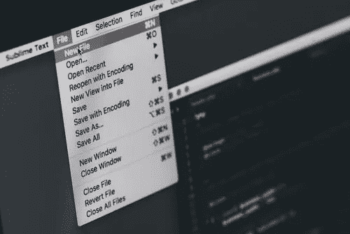
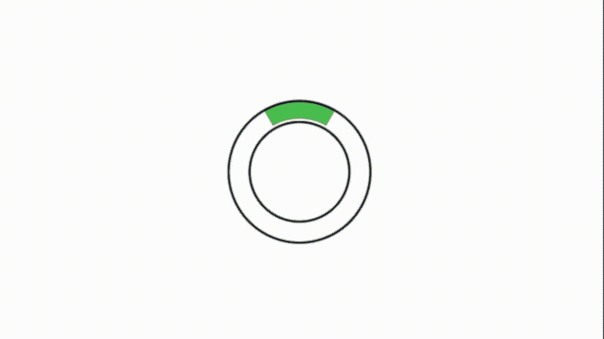

# iOS 活动指标全面指南

> 原文：<https://betterprogramming.pub/an-a-to-z-guide-to-ios-activity-indicators-43c8a3da39c2>

## 看看 iOS 13 和 14 中的不同选项



伊利亚·巴甫洛夫在 [Unsplash](https://unsplash.com/s/photos/computer-menu?utm_source=unsplash&utm_medium=referral&utm_content=creditCopyText) 拍摄的照片

顶部有一个工具条，不同应用程序有相同的菜单选项的标准界面的想法可以追溯到几十年前。事实上，我还记得买了一台苹果麦金塔电脑，并在上面运行画图应用。它使用的酒吧(那是在 1984 年)看起来几乎和今天出现的酒吧一模一样。是的，差不多 35 年了，读者们——难以置信。

这是一个非常好的想法，它经得起时间的考验，不会错过任何一个节拍。当然，今天苹果发布了大量的文档，这些文档被称为*人机界面指南(HIG)。*苹果称之为*指导方针，*尽管实际上有些是要求——因为如果你不遵守，苹果保留拒绝你的应用的权利。

我想着重谈谈这些指导方针的一个实际方面。我们都在应用中使用的一个方面是活动指示器。以下是苹果公司的 HIG 对活动指标的简要总结:

*   清楚地表明什么时候有东西在加载(也就是使用一个活动指示器)
*   尽快显示内容(确保使用 GCD 实用程序/后台线程来实际加载数据)
*   教育和娱乐用户你为什么这么做(吸引眼球是好的)
*   如果你有时间做得更好，就不要使用标准指标

这都是很好的建议，尽管最后一点需要更多的解释。我认为，苹果在这里说的是，无论你提出什么样的解决方案，都要考虑到环境。所以如果加载需要两秒钟，用苹果指示器也是可以的。但是，如果它需要 10 秒钟来加载，那么你最好想出更好的东西…否则。

好了，代码:让我们在 SwiftUI 1.0 (Xcode 11.7)项目中使用一个 UIKit `ActivityIndicator`。一个非常基本、无聊的问题——只是从温和的角度开始。

SwiftUI 1.0 活动指示器


标准 iOS 活动指示器，带基本定制

这很好——但是等等——深入研究苹果文档，他们说你应该更喜欢进度条而不是活动指示器。你至少应该给用户一个提示，告诉他们要等多久。我们也来一个吧。

SwiftUI 1.0 进度条

这段代码将生成一个填充栏，就像这样:


iOS 中的基本进度条

太好了，我们进展顺利。但是等一下——停止新闻报道——刚刚有消息！iOS 14 对进度条有原生支持。看起来像这样:

很明显，它看起来和 iOS13 版本完全一样，所以这次我就不展示动画 GIF 了。

至此，我们已经完成了所有的模板代码。那么第四点呢？我的负载需要超过 10 秒钟。一些自定义活动/百分比指标呢？让我们试着编写一些代码。

我们有两种类型:一种*不确定型*用于未知长度的延迟，另一种*确定型*用于当你知道有多少负载时。就像标准的苹果指标一样，使用圆形对这两种情况都很有效——但希望能更巧妙一些。

这是一个自定义确定负载指示器的基本代码。

当这段代码运行时，看起来像这样:


现在，要使这成为一个不确定的类型，你只需要改变这一行中的一个参数，当然，删除文本标签。

```
piePath.addArc(center: CGPoint(x: rect.width/2, y:rect.height/2), radius: 64, startAngle: .degrees(0), endAngle: .degrees(pieSlice+60), clockwise: false)
```

这些变化将使您的指示器看起来像这样。显然，你会想让这个运行快一点，让它看起来更快一点。



不过，在我走之前，让我们再做一次。让我们做一个使用图像和一些形状的指示器。这真是赏心悦目。

这是马克·希格登画的纽约的卡通形象。我添加了一个背景和一个动画月亮——以及底部的一个加载栏来显示进度。


纽约的马克·希格登。他的网址:【markhigden.com 

这让我想到了这篇文章的结尾。我希望你喜欢读它，就像我喜欢写它一样。

保持冷静，继续编码。